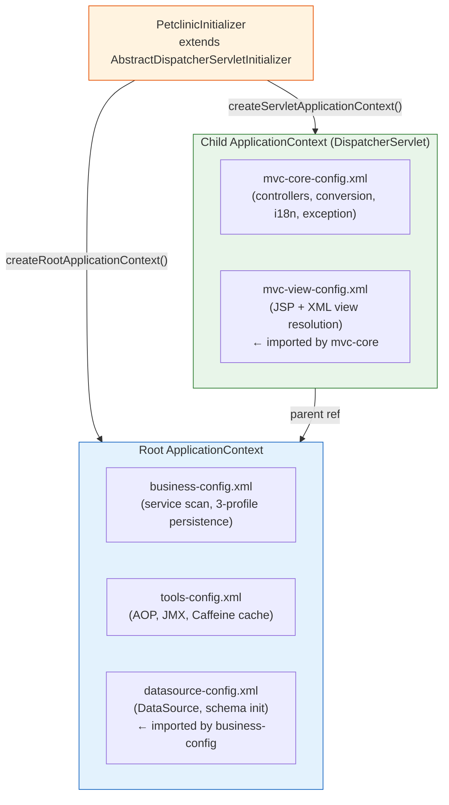

# AECF_01 — Document Legacy: Spring XML Configuration
## TOPIC: spring_xml_config

---

## METADATA

| Field | Value |
|-------|-------|
| Timestamp (UTC) | 2026-04-17T00:00:00Z |
| Executed By | lvillara |
| Executed By ID | lvillara |
| Execution Identity Source | git config user |
| Repository | spring-framework-petclinic |
| Branch | appmod/java-upgrade-20260417115818 |
| Root Prompt | `@aecf run skill=aecf_document_legacy TOPIC=spring_xml_config` |
| Skill Executed | aecf_document_legacy |
| Sequence Position | 1 of 1 |
| Total Prompts Executed | 1 |
| Phase | AECF_DOCUMENT_LEGACY |

---

## 1. Purpose and Scope

This document covers the five XML application context configuration files in `src/main/resources/spring/`. Together they constitute the **entire Spring wiring layer** of the petclinic application: persistence profile selection, DataSource provisioning, MVC routing, view resolution, and cross-cutting concerns (AOP, JMX, caching).

All five files reside in `src/main/resources/spring/` by design:

> Evidence: [src/main/webapp/WEB-INF/no-spring-config-files-there.txt](src/main/webapp/WEB-INF/no-spring-config-files-there.txt)
> "All Spring config files are grouped into one single place … simpler to reference them from inside JUnit tests"

**In scope:**
- `business-config.xml` — service + repository wiring, 3-profile persistence
- `mvc-core-config.xml` — DispatcherServlet child context, MVC routing
- `mvc-view-config.xml` — view resolution (JSP + XML content negotiation)
- `datasource-config.xml` — DataSource provisioning + schema initialization
- `tools-config.xml` — AOP monitoring, JMX export, Caffeine caching

**Out of scope:** `data-access.properties` (environment values), test-only `mvc-test-config.xml` (mock stub replacements for `mvc-view-config.xml`).

---

## 2. Entry Points

The configuration tree has a single root entry point in Java code:

| Entry Point | File | Line | Role |
|-------------|------|------|------|
| `createRootApplicationContext()` | [PetclinicInitializer.java#L55-L59](src/main/java/org/springframework/samples/petclinic/PetclinicInitializer.java#L55-L59) | 55-59 | Loads `business-config.xml` + `tools-config.xml` as **root** context |
| `createServletApplicationContext()` | [PetclinicInitializer.java#L63-L66](src/main/java/org/springframework/samples/petclinic/PetclinicInitializer.java#L63-L66) | 63-66 | Loads `mvc-core-config.xml` as **child** DispatcherServlet context |

```java
// PetclinicInitializer.java:57
rootAppContext.setConfigLocations(
    "classpath:spring/business-config.xml",
    "classpath:spring/tools-config.xml");

// PetclinicInitializer.java:65
webAppContext.setConfigLocation("classpath:spring/mvc-core-config.xml");
```

Default Spring profile (line 58): `"jpa"` — overridable via `-Dspring.profiles.active=`.

---

## 3. High-Level Flow



Key constraint: beans defined in ROOT are visible to CHILD, but CHILD beans are invisible to ROOT.

---

## 4. Technical Flow (Detailed)

### 4.1 Servlet Container Bootstrap

`PetclinicInitializer` implements `AbstractDispatcherServletInitializer` (Servlet 3.0+ SPI — no `web.xml`). On container start:

1. `createRootApplicationContext()` → `XmlWebApplicationContext` with `business-config.xml` + `tools-config.xml`; default profile `"jpa"` set. — `PetclinicInitializer.java:56-59`
2. `createServletApplicationContext()` → `XmlWebApplicationContext` with `mvc-core-config.xml`. — `PetclinicInitializer.java:64-65`
3. `getServletMappings()` → `"/"` — all requests route through `DispatcherServlet`. — `PetclinicInitializer.java:71`
4. `getServletFilters()` → `CharacterEncodingFilter("UTF-8", true)` — UTF-8 for owner forms. — `PetclinicInitializer.java:76`

### 4.2 datasource-config.xml

Evidence: [src/main/resources/spring/datasource-config.xml](src/main/resources/spring/datasource-config.xml)

| Bean id | Class | Purpose |
|---------|-------|---------|
| `dataSource` (default) | `org.apache.tomcat.jdbc.pool.DataSource` | Connection pool using `${jdbc.*}` props |
| `dataSource` (profile `javaee`) | JNDI lookup `java:comp/env/jdbc/petclinic` | JEE container-managed DataSource override |

**Schema initialization**: `<jdbc:initialize-database>` runs `${jdbc.initLocation}` (schema.sql) then `${jdbc.dataLocation}` (data.sql) on every application start. — `datasource-config.xml:34-37`

**Property binding**: `<context:property-placeholder location="classpath:spring/data-access.properties"/>` resolves `${jdbc.*}`, `${jpa.*}`, `${db.script}`. — `datasource-config.xml:23`

**Profiles activated**: `javaee` (JNDI override). No profile = Tomcat JDBC pool (H2 by default via `data-access.properties`).

**Spring Boot equivalent**: `spring.datasource.*` properties + `spring.sql.init.*` for schema/data initialization. JNDI equivalent: `spring.datasource.jndi-name`.

### 4.3 business-config.xml

Evidence: [src/main/resources/spring/business-config.xml](src/main/resources/spring/business-config.xml)

Always-active beans (no profile guard):
- `<import resource="datasource-config.xml"/>` — DataSource available to all profiles. — line 16
- `<context:component-scan base-package="...petclinic.service"/>` — registers `ClinicServiceImpl` as `@Service`. — line 18-19
- `<context:property-placeholder location="classpath:spring/data-access.properties"/>` — resolves `${jpa.*}` for EntityManagerFactory. — line 23
- `<tx:annotation-driven/>` — activates `@Transactional` AOP proxy weaving. — line 26

Profile-guarded beans:

| Profile | Beans Registered |
|---------|-----------------|
| `jpa,spring-data-jpa` | `entityManagerFactory` (LocalContainerEntityManagerFactoryBean + HibernateJpaVendorAdapter, persistenceUnit=petclinic), `transactionManager` (JpaTransactionManager), `PersistenceExceptionTranslationPostProcessor` |
| `jdbc` | `transactionManager` (DataSourceTransactionManager), `jdbcClient` (JdbcClient), `namedParameterJdbcTemplate` (NamedParameterJdbcTemplate), scan `...repository.jdbc` |
| `jpa` | scan `...repository.jpa` (picks up `JpaOwnerRepositoryImpl` etc.) |
| `spring-data-jpa` | `<jpa:repositories base-package="...repository.springdatajpa"/>` — activates Spring Data proxy generation |

Evidence for EntityManagerFactory: [business-config.xml#L37-L51](src/main/resources/spring/business-config.xml#L37-L51)

**Spring Boot equivalent**:
- `@EnableTransactionManagement` (auto-applied by `spring-boot-starter-data-jpa`)
- `spring.jpa.*` properties for vendor adapter config
- `@EnableJpaRepositories` (auto-applied by Spring Data JPA autoconfiguration)
- Persistence profiles replaced by `spring.profiles.active` + conditional `@Configuration` classes

### 4.4 tools-config.xml

Evidence: [src/main/resources/spring/tools-config.xml](src/main/resources/spring/tools-config.xml)

| Bean id | Class | Purpose |
|---------|-------|---------|
| `callMonitor` | `CallMonitoringAspect` | `@Aspect @ManagedResource` — counts invocations + measures time on all `@Repository` beans via `@Around("within(@...Repository *)")` |
| — | `<context:mbean-export/>` | Exports `callMonitor` to JMX (`petclinic:type=CallMonitor`) via `@ManagedAttribute`/`@ManagedOperation` annotations |
| `cacheManager` | `CaffeineCacheManager` | Named caches: `"default"` and `"vets"` |
| `<cache:annotation-driven/>` | — | Activates `@Cacheable` proxy weaving |

`<aop:aspectj-autoproxy>` is scoped to `<aop:include name="callMonitor"/>` — only the named aspect is auto-proxied, preventing accidental aspect application to other AspectJ-annotated beans. — `tools-config.xml:24-26`

`ClinicServiceImpl.findVets()` (line 122) uses `@Cacheable(value = "vets")` — requires `cacheManager` from `tools-config.xml`.

Evidence: [CallMonitoringAspect.java#L77-L78](src/main/java/org/springframework/samples/petclinic/util/CallMonitoringAspect.java#L77-L78) — pointcut `within(@...Repository *)` instruments every `@Repository` method.

**Spring Boot equivalent**:
- `@EnableCaching` + `spring.cache.type=caffeine` + `spring.cache.caffeine.spec=...`
- JMX: `spring.jmx.enabled=true` (disabled by default in Boot 2+)
- AspectJ AOP: `@EnableAspectJAutoProxy` (auto-applied by `spring-boot-starter-aop`)

### 4.5 mvc-core-config.xml

Evidence: [src/main/resources/spring/mvc-core-config.xml](src/main/resources/spring/mvc-core-config.xml)

This is the **DispatcherServlet child context**. Beans defined here can see all ROOT beans but ROOT cannot see these beans.

| Bean / Directive | Purpose |
|-----------------|---------|
| `<import resource="mvc-view-config.xml"/>` | Pulls view resolution into the child context. — line 17 |
| `<context:component-scan ...petclinic.web/>` | Registers all `@Controller` beans (OwnerController, PetController, VisitController, VetController, CrashController). — line 22-23 |
| `<mvc:annotation-driven conversion-service="conversionService"/>` | Activates `@RequestMapping`, `@PathVariable`, `@ModelAttribute`, plus wires the custom `conversionService`. — line 25 |
| `<mvc:resources mapping="/resources/**" .../>` | Serves static assets from `src/main/webapp/resources/`. — line 29 |
| `<mvc:resources mapping="/webjars/**" .../>` | Serves Bootstrap, Font Awesome from Maven WebJar dependencies. — line 32 |
| `<mvc:view-controller path="/" view-name="welcome"/>` | Maps `GET /` directly to `welcome.jsp` without a controller. — line 35 |
| `<mvc:default-servlet-handler/>` | Fallback for any static resource not matched by other mappings. — line 39 |
| `conversionService` | `FormattingConversionServiceFactoryBean` containing `PetTypeFormatter` (String ↔ PetType bidirectional conversion). — line 41-47 |
| `messageSource` | `ResourceBundleMessageSource` loading `src/main/resources/messages/messages*.properties`. — line 53-54 |
| `SimpleMappingExceptionResolver` | Maps all unhandled exceptions to `exception.jsp` view (`defaultErrorView="exception"`). — line 60-64 |

**Spring Boot equivalent**:
- `@EnableWebMvc` (or `WebMvcConfigurer`) replaces the entire file
- `spring.mvc.static-path-pattern`, `spring.web.resources.static-locations`
- `@ControllerAdvice @ExceptionHandler` replaces `SimpleMappingExceptionResolver`
- `MessageSource` bean or `spring.messages.basename`

### 4.6 mvc-view-config.xml

Evidence: [src/main/resources/spring/mvc-view-config.xml](src/main/resources/spring/mvc-view-config.xml)

| Bean / Directive | Purpose |
|-----------------|---------|
| `<mvc:view-resolvers>` with `<mvc:content-negotiation>` | `ContentNegotiatingViewResolver` delegates to the resolver chain based on requested media type |
| `<mvc:bean-name/>` | `BeanNameViewResolver` — resolves view name `vets/vetList.xml` to the bean with that id |
| `<mvc:jsp prefix="/WEB-INF/jsp/" suffix=".jsp"/>` | `InternalResourceViewResolver` — resolves logical names like `owners/ownerDetails` → `/WEB-INF/jsp/owners/ownerDetails.jsp` |
| `vets/vetList.xml` | `MarshallingView` using `marshaller` — renders Vets list as XML when `Accept: application/xml` or `.xml` extension |
| `marshaller` | `Jaxb2Marshaller` with `Vets` class bound — JAXB annotation-driven marshalling |

Content negotiation logic:
1. Client requests `GET /vets.xml` or `Accept: application/xml`
2. `ContentNegotiatingViewResolver` inspects media type → delegates to `BeanNameViewResolver`
3. `BeanNameViewResolver` finds bean id `vets/vetList.xml` → `MarshallingView`
4. `MarshallingView` marshals `Vets` model attribute using `Jaxb2Marshaller`

For all other requests: `InternalResourceViewResolver` resolves `viewName` → `/WEB-INF/jsp/{viewName}.jsp`.

**Spring Boot equivalent**:
- Thymeleaf or Freemarker starter auto-configures `TemplateViewResolver`
- `spring.mvc.view.prefix/suffix` for JSP (not recommended in Boot)
- JSON/XML content negotiation: `spring-boot-starter-web` + `jackson-dataformat-xml` or `spring-boot-starter-data-rest`

---

## 5. Dependency Map

### Import chain

```
PetclinicInitializer
├── createRootApplicationContext()
│   ├── business-config.xml
│   │   └── <import> datasource-config.xml
│   └── tools-config.xml
└── createServletApplicationContext()
    └── mvc-core-config.xml
        └── <import> mvc-view-config.xml
```

Evidence: [PetclinicInitializer.java#L57](src/main/java/org/springframework/samples/petclinic/PetclinicInitializer.java#L57), [business-config.xml#L16](src/main/resources/spring/business-config.xml#L16), [mvc-core-config.xml#L17](src/main/resources/spring/mvc-core-config.xml#L17)

### Bean dependency graph (key connections)

| Consumer | Dependency | Provided By |
|----------|-----------|------------|
| `entityManagerFactory` | `dataSource` | `datasource-config.xml` |
| `transactionManager` (jpa) | `entityManagerFactory` | `business-config.xml` (jpa profile) |
| `transactionManager` (jdbc) | `dataSource` | `datasource-config.xml` |
| `jdbcClient` | `dataSource` | `datasource-config.xml` |
| `ClinicServiceImpl` | `@Autowired OwnerRepository` etc. | `business-config.xml` (profile-specific scan) |
| `ClinicServiceImpl.findVets()` | `cacheManager` (vets cache) | `tools-config.xml` |
| `callMonitor` | targets `@Repository` beans | `tools-config.xml` (AOP) |
| `OwnerController`, etc. | `ClinicService` | ROOT → visible to child |
| `conversionService` | `PetTypeFormatter` → `ClinicService` | mvc-core-config.xml + ROOT |

### External libraries

| Library | Used In | Import Location |
|---------|---------|-----------------|
| `org.apache.tomcat.jdbc.pool.DataSource` | `datasource-config.xml:28` | Tomcat JDBC pool dependency |
| Hibernate (HibernateJpaVendorAdapter) | `business-config.xml:41` | `spring-orm` + `hibernate-core` |
| JAXB2 (Jaxb2Marshaller) | `mvc-view-config.xml:35` | `spring-oxm` |
| Caffeine | `tools-config.xml:40` | `caffeine` |
| AspectJ | `tools-config.xml:24` | `aspectjweaver` |

---

## 6. Configuration & Environment

| Property | Default Source | Used By |
|----------|---------------|---------|
| `jdbc.driverClassName` | `data-access.properties` → system override | `datasource-config.xml` |
| `jdbc.url` | `data-access.properties` → system override | `datasource-config.xml` |
| `jdbc.username` | `data-access.properties` → system override | `datasource-config.xml` |
| `jdbc.password` | `data-access.properties` → system override | `datasource-config.xml` |
| `jdbc.initLocation` | `classpath:db/${db.script}/schema.sql` | `datasource-config.xml:34` |
| `jdbc.dataLocation` | `classpath:db/${db.script}/data.sql` | `datasource-config.xml:35` |
| `jpa.database` | resolves to `HSQL` by default | `business-config.xml:41` |
| `jpa.showSql` | `true` (hardcoded in properties) | `business-config.xml:41` |
| `spring.profiles.active` | default `"jpa"` (line 52) | `PetclinicInitializer.java:52-58` |

**`system-properties-mode="OVERRIDE"`** on both property placeholders means any `-D` JVM argument overrides the properties file value.

---

## 7. I/O and Side Effects

| Side Effect | Trigger | Location |
|-------------|---------|---------|
| Schema + data SQL executed on every start | `<jdbc:initialize-database>` always runs | `datasource-config.xml:34-37` |
| JMX MBean registered as `petclinic:type=CallMonitor` | Context refresh, `<context:mbean-export/>` | `tools-config.xml:35` |
| Caffeine caches `"default"` and `"vets"` created in-memory | Context refresh | `tools-config.xml:40-47` |
| JDBC connection pool opened (Tomcat JDBC) | DataSource bean init | `datasource-config.xml:28-30` |
| `vets` cache populated on first `ClinicServiceImpl.findVets()` call | `@Cacheable(value="vets")` | `ClinicServiceImpl.java:122` |
| Repository call metrics accumulated | `CallMonitoringAspect.invoke()` on every `@Repository` method | `CallMonitoringAspect.java:78-95` |
| UTF-8 character encoding enforced on all requests | `CharacterEncodingFilter` registered | `PetclinicInitializer.java:76-77` |

---

## 8. Error Handling and Resilience

| Mechanism | File | Behavior |
|-----------|------|---------|
| `SimpleMappingExceptionResolver` | `mvc-core-config.xml:60-65` | All unhandled MVC exceptions → `exception.jsp`; logs at WARN |
| `PersistenceExceptionTranslationPostProcessor` | `business-config.xml:62` | JPA `PersistenceException` → Spring `DataAccessException` hierarchy |
| `<jdbc:initialize-database>` fail-fast | `datasource-config.xml:34` | If schema or data SQL fails, application context refresh fails → app won't start |
| No transaction rollback config | — | Relies on Spring default: rollback on `RuntimeException`/`Error`; no explicit `rollback-rules` |

---

## 9. Operational Safety / Idempotence

| Concern | Assessment |
|---------|-----------|
| Schema re-execution on restart | **Not idempotent** — `<jdbc:initialize-database>` runs schema.sql + data.sql on EVERY start. For H2 (default) this is safe because `schema.sql` uses `CREATE TABLE` (drops/recreates on embedded). For a persistent DB, this would fail on second start unless script uses `IF NOT EXISTS`. |
| Connection pool sizing | No max pool size configured on `DataSource` — uses Tomcat JDBC defaults. |
| Cache warm-up | No pre-loading; `vets` cache populated lazily on first request. |
| JMX exposure | `CallMonitoringAspect` exposed globally via JMX with no auth. Acceptable for development/demo; not production-safe. |

---

## 10. Observability and Diagnostics

| Mechanism | Configuration | MBean |
|-----------|--------------|-------|
| JMX call monitoring | `tools-config.xml:35` | `petclinic:type=CallMonitor` — attributes: `enabled`, `callCount`, `callTime`; operation: `reset()` |
| SQL logging | `jpa.showSql=true` in `data-access.properties` | Logs every Hibernate SQL statement to stdout |
| Exception logging | `SimpleMappingExceptionResolver` with `warnLogCategory="warn"` | `mvc-core-config.xml:63` — all web exceptions logged at WARN |

To monitor via jConsole: connect to running process → `petclinic:type=CallMonitor` → read `callCount` + `callTime` attributes.

---

## 11. Legacy Code Quality Findings

| ID | Finding | File | Impact | Recommendation |
|----|---------|------|--------|----------------|
| L-01 | `jpa.showSql=true` is hardcoded in `data-access.properties` — SQL logged in all environments | `data-access.properties:11` | Performance degradation in production; sensitive query data in logs | Move to profile-specific properties or externalize to system property |
| L-02 | `<jdbc:initialize-database>` always runs — not idempotent for persistent DBs | `datasource-config.xml:34-37` | Data loss / startup failure on non-embedded DBs | Use `spring.sql.init.mode=always/never/embedded` equivalent; consider Flyway/Liquibase |
| L-03 | `CallMonitoringAspect` JMX exposure has no authentication | `tools-config.xml:35` | JMX MBean accessible without credentials in default JVM config | Restrict via JVM `-Dcom.sun.jmx.remote.authenticate=true` or remove JMX in prod |
| L-04 | `spring-data-jpa` profile: no explicit `packagesToScan` on `<jpa:repositories>` — relies on base-package scan; no `EntityScan` equivalent. Coexists with `persistenceUnitName="petclinic"` and `packagesToScan` on EntityManagerFactory — comment in XML warns these are not compatible | `business-config.xml:48-50` | Potential confusion; `persistenceUnitName` wins per the comment | Remove one of the two strategies; prefer `packagesToScan` without `persistenceUnitName` |
| L-05 | `mvc-core-config.xml` comment references `/WEB-INF/mvc-core-config.xml` (stale path); actual location is `classpath:spring/` | referenced in `CrashController.java:27`, `PetTypeFormatter.java:34` | Developer confusion — stale doc links | Update comments to `classpath:spring/mvc-core-config.xml` |
| L-06 | `ContentNegotiatingViewResolver` uses path extension strategy (deprecated in Spring 5.3+) — `use-not-acceptable="true"` | `mvc-view-config.xml:17-23` | Extension-based content negotiation (`/vets.xml`) deprecated; may produce warnings on Spring 7 | Migrate to Accept-header negotiation |
| L-07 | No `@Profile` annotation equivalent on `tools-config.xml` — AOP + JMX active in ALL profiles including test | `tools-config.xml` (loaded unconditionally) | `CallMonitoringAspect` instruments `@Repository` methods even in test contexts | Consider profile-guarding `callMonitor` or excluding from test configurations |

---

## 12. Tests to Add

| Test | Why | Suggested Location |
|------|-----|--------------------|
| Verify schema init idempotence | `<jdbc:initialize-database>` re-runs on every context reload in integration tests; if tests modify DB state, schema re-init silently resets it | `AbstractClinicServiceTests` or dedicated `SchemaInitializationTests` |
| Verify JMX MBean is registered | `callMonitor` MBean should be inspectable after context startup | New `ToolsConfigIntegrationTests` |
| Verify content negotiation for XML endpoint | `GET /vets.xml` should return `Content-Type: application/xml` with JAXB-marshalled body | `VetControllerTests` — add `testShowVetListXml()` |
| Verify `PetTypeFormatter` round-trip | String → PetType → String via `conversionService` | Add to `PetControllerTests` or dedicated `PetTypeFormatterTests` |
| Verify `vets` cache behavior | Second call to `findVets()` should NOT hit DB | `ClinicServiceSpringDataJpaTests` or dedicated cache test |

---

## 13. Prioritized Risks

| Priority | Risk | Location | Impact |
|----------|------|---------|--------|
| 🔴 HIGH | Schema SQL runs on every start — unsafe on persistent DBs | `datasource-config.xml:34-37` | Data loss if deployed against non-embedded DB without scripts using `IF NOT EXISTS` |
| 🔴 HIGH | `jpa.showSql=true` globally — SQL in production logs | `data-access.properties:11` | Performance degradation; potential sensitive data exposure |
| 🟡 MEDIUM | Deprecated path-extension content negotiation in Spring 7 | `mvc-view-config.xml:17-23` | May be removed in a future Spring version; XML endpoint would break |
| 🟡 MEDIUM | JMX MBean unauthenticated | `tools-config.xml:35` | Not prod-safe if JMX port is exposed |
| 🟡 MEDIUM | `tools-config.xml` active in test profile — AOP overhead in tests | `PetclinicInitializer.java:57` | Slower tests; potential interference with `@Repository` method interception |
| 🟢 LOW | Stale path comments in `CrashController` + `PetTypeFormatter` | source code comments | Developer confusion only |
| 🟢 LOW | `persistenceUnitName` + `packagesToScan` coexistence warning | `business-config.xml:48-50` | Comment-documented; no runtime issue currently |

---

## 14. Por qué mvc-core-config.xml y mvc-view-config.xml están separados

Esta es la separación más importante de diseño en la capa MVC:

### mvc-core-config.xml — Infraestructura MVC (routing, format, i18n)
- Registra controladores (`@Controller` scan), `conversionService`, `messageSource`, mappings de recursos estáticos, gestión de excepciones.
- Es el "cómo se procesan las peticiones".

### mvc-view-config.xml — Estrategia de renderizado (view resolution)
- Define ÚNICAMENTE cómo se resuelven nombres de vista a templates o serializers: JSP resolver, `BeanNameViewResolver` para XML, `ContentNegotiatingViewResolver`.
- Es el "cómo se renderizan las respuestas".

### Razón funcional: testabilidad

Evidence: [VisitControllerTests.java#L24](src/test/java/org/springframework/samples/petclinic/web/VisitControllerTests.java#L24)

```java
@SpringJUnitWebConfig(locations = {
    "classpath:spring/mvc-test-config.xml",
    "classpath:spring/mvc-core-config.xml"   // ← mvc-view-config.xml NOT loaded
})
```

**Todos los tests de controladores** cargan `mvc-core-config.xml` + `mvc-test-config.xml` (que contiene mocks de `ClinicService`). **Ninguno carga `mvc-view-config.xml`**. Esto es posible precisamente porque la resolución de vistas está encapsulada en un archivo separado — MockMvc no necesita un motor JSP ni un marshaller JAXB para verificar resultados de controladores.

Si ambos archivos fueran uno solo, los tests deberían o bien cargar todo (incluido el motor JSP) o excluir manualmente los beans de vista, lo que rompería el contrato de configuración.

### Razón de diseño: principio de responsabilidad única a nivel de configuración

| Dimensión | mvc-core-config.xml | mvc-view-config.xml |
|-----------|---------------------|---------------------|
| ¿Qué cambia si cambiamos el motor de plantillas? | Nada | Todo (se reemplaza el resolver) |
| ¿Qué cambia si añadimos un nuevo controlador? | Component scan (automático) | Nada |
| ¿Qué cambia si añadimos soporte JSON? | `<mvc:annotation-driven>` (ya habilitado) | Añadir `MappingJackson2JsonView` o `HttpMessageConverter` |
| Cargado en tests de controladores | ✅ Siempre | ❌ Nunca (sustituido por mvc-test-config.xml) |

**Equivalente en Spring Boot**: Esta separación se resuelve automáticamente. Spring Boot auto-configura `DispatcherServlet` (equivalente a mvc-core) y el motor de plantillas (equivalente a mvc-view) por separado via `WebMvcAutoConfiguration` + `ThymeleafAutoConfiguration` (u otro). Para tests, `@WebMvcTest` carga solo la capa MVC sin la capa de vista completa — el mismo principio, pero implementado con anotaciones.

---

## 15. Recommended Next Skills (AECF chain)

| Skill | Trigger | Expected Artifact | Invocation |
|-------|---------|------------------|-----------|
| `aecf_refactor` TOPIC=`xml_to_java_config` | Los 5 archivos XML son candidatos directos a migración a `@Configuration` classes en Java. Motivación: Spring Boot 3.x / Spring 7 soporta pero no favorece XML config; la migración es incremental archivo por archivo. | Plan de migración por archivo + implementación gradual | `@aecf run skill=aecf_refactor TOPIC=xml_to_java_config prompt="Migrar business-config.xml a @Configuration Java, manteniendo los 3 perfiles de persistencia"` |
| `aecf_tech_debt_assessment` TOPIC=`spring_xml_config` | L-01 (`showSql=true`), L-02 (schema init), L-06 (deprecated content negotiation) son deuda técnica concreta. | Scoring deuda + priorización con effort/impact | `@aecf run skill=aecf_tech_debt_assessment TOPIC=spring_xml_config` |
| `aecf_refactor` TOPIC=`schema_migration_flyway` | `<jdbc:initialize-database>` es un riesgo alto (Risk L-02 / Priority 🔴). Flyway o Liquibase dan control de versiones de esquema, idempotencia y auditoría. | Plan de migración SQL → Flyway migrations | `@aecf run skill=aecf_refactor TOPIC=schema_migration_flyway prompt="Reemplazar jdbc:initialize-database con Flyway para control de versiones del esquema"` |
| `aecf_security_review` TOPIC=`spring_xml_config` | JMX sin autenticación (L-03) + `showSql=true` (L-01) son hallazgos de seguridad verificados. | Security findings report con severidad CVSS | `@aecf run skill=aecf_security_review TOPIC=spring_xml_config` |
