# AECF — AI Engineering Compliance Framework

## Metodología Independiente del Componente

LAST_REVIEW: 2026-04-09
OWNER SEACHAD
VERSION: 1.0.0

---

> **Autor de la metodología:** Fernando García Varela (youngluke)
> **Framework:** AECF (AI Engineering Compliance Framework)
> Este documento describe la metodología AECF de forma independiente a cualquier herramienta o componente que la implemente. AECF puede aplicarse manualmente, con hojas de cálculo, documentos o mediante software especializado.

---

## 1. Qué es AECF

**AECF (AI Engineering Compliance Framework)** es un marco de gobernanza para la generación de código asistida por IA que impone un flujo de trabajo estructurado y auditable donde cada fase valida la anterior antes de avanzar.

### 1.1 Principios Fundamentales

| Principio | Descripción |
|---|---|
| **Fricción intencional** | Introduce puntos de control deliberados que previenen errores antes de que lleguen a producción |
| **Calidad auditable** | Cada decisión queda documentada y es trazable |
| **Seguridad por diseño** | La seguridad no es un añadido posterior, es un requisito estructural |
| **Determinismo** | Las mismas entradas producen las mismas evaluaciones |
| **Independencia de herramienta** | La metodología es agnóstica respecto al LLM, IDE o herramienta utilizada |

### 1.2 Para qué sirve AECF

AECF está diseñado para **código de producción** que debe ser:
- Mantenible a largo plazo
- Auditable por reguladores o clientes
- Seguro por defecto
- Desarrollado con trazabilidad completa

### 1.3 Para qué NO sirve AECF

- Prototipos rápidos o pruebas de concepto
- Scripts desechables
- Código exploratorio sin requisitos de calidad

### 1.4 Impacto esperado

| Métrica | Impacto |
|---|---|
| Tiempo de desarrollo | +20-40% (inversión inicial) |
| Bugs en producción | -40% |
| Retrabajo | -60% |
| Incidentes en producción | -35% |

---

## 2. Arquitectura de la Metodología

### 2.0 Superficies de ejecución de AECF

AECF es una metodología primero y puede ejecutarse en varias superficies sin cambiar sus gates, scoring ni reglas de gobernanza.

| Superficie | Punto de entrada | Contexto operativo | Cuándo conviene |
|---|---|---|---|
| **Manual** | Documentos, hojas de cálculo, plantillas | Sin automatización | Adopción inicial, workshops, evaluación conceptual |
| **Prompt-only** (`aecf_prompts`) | Bundle de prompts, instrucciones y MCP opcional | Claude, GPT u otros hosts con acceso al repo | Auditorías, documentación, análisis, equipos sin componente VS Code |
| **Componente automatizado** (`aecf_test_participant`) | Extensión de VS Code + engine | Editor, git, tests y runtime integrados | Implementación gobernada, testing ejecutado y trazabilidad a escala |

La implicación práctica es importante: la metodología no cambia, pero sí cambia cómo se resuelve el contexto, cómo se ejecutan pruebas y cuánto puede automatizarse cada fase.

### 2.1 Flujo Principal MARK (Individual)

AECF define un flujo secuencial de fases con puertas de calidad (gates) entre ellas:

```
PLAN → AUDIT_PLAN → [FIX_PLAN si NO-GO] → TEST_STRATEGY → IMPLEMENT → AUDIT_CODE → [FIX_CODE si NO-GO] → VERSION
```

### 2.2 Diagrama de flujo

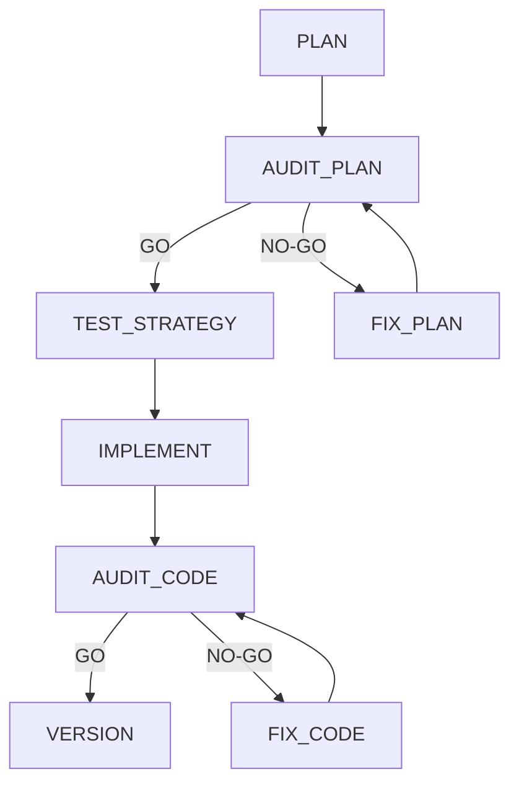

### 2.3 Descripción de cada fase

| Fase | Rol | Propósito | Entregable |
|---|---|---|---|
| **PLAN** | Arquitecto de Software Senior | Diseñar la solución sin escribir código | Documento de plan técnico |
| **AUDIT_PLAN** | Auditor Independiente | Evaluar calidad, viabilidad y completitud del plan | Informe de auditoría con veredicto GO/NO-GO |
| **FIX_PLAN** | Arquitecto (corrección) | Corregir solo los hallazgos de la auditoría | Plan corregido |
| **TEST_STRATEGY** | Ingeniero de Testing | Diseñar estrategia de pruebas sin código | Documento de estrategia de testing |
| **IMPLEMENT** | Desarrollador Senior | Implementar el código según el plan aprobado | Código + documentación |
| **AUDIT_CODE** | Auditor Independiente | Revisar código contra plan, estándares y seguridad | Informe de auditoría con veredicto GO/NO-GO |
| **FIX_CODE** | Desarrollador (corrección) | Corregir solo los hallazgos de la auditoría de código | Código corregido |
| **VERSION** | Release Manager | Gestionar versión, changelog y artefactos de release | CHANGELOG actualizado + metadatos de versión |

---

## 3. Sistema de Gates (Puertas de Calidad)

### 3.1 Veredictos posibles

| Veredicto | Significado | Acción |
|---|---|---|
| **GO** | La fase cumple todos los criterios de calidad | Avanzar a la siguiente fase |
| **NO-GO** | Hay hallazgos que deben corregirse | Entrar en bucle de corrección (FIX) |
| **UNKNOWN** | No se puede determinar el veredicto | Bloquea incondicionalmente (equivale a NO-GO) |

### 3.2 Reglas de evaluación

1. Si la evaluación contiene **NO-GO** → veredicto es **NO-GO** (prioridad máxima)
2. Si la evaluación contiene **GO** sin NO-GO → veredicto es **GO**
3. Si no se puede determinar → **UNKNOWN** (bloquea)

### 3.3 Excepción de evidencia de tests

En la auditoría de código (`AUDIT_CODE`), aunque el evaluador diga GO, si **no existe evidencia de tests ejecutados** (sección `## Tests Executed`), el sistema fuerza **NO-GO**. Esto garantiza que nunca se aprueba código sin validación de pruebas.

### 3.4 Bucles de corrección (FIX loops)

Cuando un gate devuelve NO-GO:
1. Se activa una fase de corrección (FIX_PLAN o FIX_CODE)
2. La corrección solo puede abordar los hallazgos de la auditoría — **nunca expandir alcance**
3. Tras la corrección, se re-ejecuta la auditoría
4. El bucle continúa hasta obtener GO o agotar los ciclos máximos

---

## 4. Sistema de Scoring (Puntuación)

### 4.1 Estructura de puntuación

AECF utiliza un sistema de puntuación cuantitativo con categorías ponderadas:

```
Puntuación = Σ (puntos_categoría × peso_categoría) / Σ (máximo_categoría × peso_categoría) × 100
```

### 4.2 Ejemplo de cálculo

| Categoría | Peso | Ítems | Puntuación |
|---|---|---|---|
| Claridad | 3 | 4 | 7/8 |
| Seguridad | 4 | 5 | 9/10 |
| Testing | 2 | 3 | 4/6 |

```
Raw = (7×3) + (9×4) + (4×2) = 65
Max = (8×3) + (10×4) + (6×2) = 76
Normalizado = (65/76) × 100 = 85.5%
```

### 4.3 Umbrales por tipo de skill

| Tipo | Umbral GO | Justificación |
|---|---|---|
| Features (funcionalidades) | ≥ 75/100 | Equilibrio entre velocidad y calidad |
| Hotfix (correcciones urgentes) | ≥ 70/100 | Relajado por urgencia operativa |
| Security (seguridad) | ≥ 90/100 | Estricto por impacto potencial |

### 4.4 Niveles de madurez

| Nivel | Rango | Significado |
|---|---|---|
| **Optimized** | 90-100 | Excelencia en la práctica |
| **Managed** | 75-89 | Proceso maduro y fiable |
| **Defined** | 50-74 | Proceso definido pero mejorable |
| **Initial** | 25-49 | Proceso básico, alto riesgo |
| **Ad-hoc** | 0-24 | Sin proceso formal |

---

## 5. Sistema de Skills (Competencias)

### 5.1 Qué es un Skill

Un **skill** es una plantilla de ejecución que define:
- Qué fases ejecutar y en qué orden
- Qué gates aplicar entre fases
- Qué entregables producir
- Qué nivel de rigor requiere

### 5.2 Taxonomía de Skills

| Tier | Complejidad | Fases | Ejemplos |
|---|---|---|---|
| **TIER 1** | Baja | 1 fase (EXECUTE) | Auditoría de estándares, revisión de seguridad |
| **TIER 2** | Media | 2-4 fases | Documentación de legacy, explicación de comportamiento |
| **TIER 3** | Alta | 5+ fases con gates | Nueva funcionalidad, refactoring, hotfix |

### 5.3 Catálogo de Skills disponibles

#### Categoría: Desarrollo de código
| Skill | Tier | Descripción |
|---|---|---|
| `new_feature` | T3 | Desarrollo completo de nueva funcionalidad |
| `refactor` | T3 | Reestructuración de código existente |
| `hotfix` | T3 | Corrección urgente en producción |

#### Categoría: Auditoría y cumplimiento
| Skill | Tier | Descripción |
|---|---|---|
| `code_standards_audit` | T1 | Auditoría de estándares de código |
| `security_review` | T1 | Revisión de seguridad (OWASP Top 10, CVSS) |
| `data_governance_audit` | T1 | Auditoría de gobernanza de datos |

#### Categoría: Documentación
| Skill | Tier | Descripción |
|---|---|---|
| `document_legacy` | T2 | Documentación de código legacy |
| `explain_behavior` | T2 | Explicación de comportamiento de código |
| `executive_summary` | T1 | Resumen ejecutivo de proyecto |

#### Categoría: Contexto de proyecto
| Skill | Tier | Descripción |
|---|---|---|
| `project_context_generator` | T1 | Generación automática de contexto de proyecto |
| `project_context_generator_map` | T1 | Generación de mapa de contexto |

#### Categoría: Estrategia y gobernanza
| Skill | Tier | Descripción |
|---|---|---|
| `ai_risk_assessment` | T1 | Evaluación de riesgos de IA |
| `data_strategy` | T2 | Estrategia de datos |
| `maturity_assessment` | T1 | Evaluación de madurez organizacional |
| `tech_debt_assessment` | T1 | Evaluación de deuda técnica |
| `dependency_audit` | T1 | Auditoría de dependencias |
| `release_readiness` | T1 | Evaluación de preparación para release |

### 5.4 Estados de release de un Skill

| Estado | Significado |
|---|---|
| **released** | Disponible y validado para uso en producción |
| **beta** | En pruebas, puede tener limitaciones |
| **hidden** | En desarrollo, no accesible |
| **deprecated** | Retirado; no aparece en listados ni puede invocarse |
| **blocked** | Bloqueado por defecto para nuevos skills |

---

## 6. Sistema de Contexto de Proyecto

### 6.1 Arquitectura de tres archivos

AECF mantiene el contexto del proyecto en tres capas:

| Archivo | Tipo | Propósito |
|---|---|---|
| `AECF_PROJECT_CONTEXT_AUTO.json` | Automático | Inferido por análisis del repositorio (lenguajes, frameworks, estructura) |
| `AECF_PROJECT_CONTEXT_HUMAN.yaml` | Manual | Curado por el equipo/consultor (criticidad de negocio, tolerancia al riesgo, dominio) |
| `AECF_PROJECT_CONTEXT_RESOLVED.json` | Combinado | Fusión donde lo humano sobrescribe lo automático — fuente de verdad |

### 6.2 Información de contexto mínima

Todo proyecto bajo AECF debe definir al menos:

1. **Stack tecnológico**: lenguajes, frameworks, versiones
2. **Arquitectura**: patrón (monolito, microservicios, etc.), capas
3. **Niveles de criticidad**: criticidad de negocio (low/medium/high/critical)
4. **Tolerancia al riesgo**: nivel de riesgo aceptable
5. **Dominio funcional**: sector o dominio del proyecto
6. **Estándares de código**: convenciones, linting, formateo
7. **Estrategia de testing**: tipos de test requeridos, cobertura mínima

### 6.3 Modelo de `surface` y `surfaces`

Cuando un repositorio es grande, multi-dominio o multi-equipo, AECF puede resolver el alcance operativo mediante `surface` o `surfaces` explícitas.

| Concepto | Propósito | Implicación operativa |
|---|---|---|
| `primary_surface` | Delimita el dominio principal del trabajo | Evita que un skill reabra todo el repo sin necesidad |
| `active_surfaces` | Lista ordenada de superficies activas | Permite trabajo transversal controlado y trazable |
| `AECF_SURFACES_INDEX.*` | Índice canónico de superficies disponibles | Evita inventar o renombrar superficies en cada ejecución |
| `AECF_RUN_CONTEXT.json` | Congela la selección efectiva de contexto | Reduce redescubrimiento y deriva entre fases |

Reglas metodológicas:

1. Las `surfaces` no sustituyen al contexto global del proyecto; lo refinan.
2. No debe ampliarse el alcance en silencio añadiendo `surfaces` nuevas sin justificación.
3. Si existe una selección congelada en `AECF_RUN_CONTEXT.json`, esa selección debe prevalecer sobre reinterpretaciones posteriores.
4. Si un skill depende de `surfaces`, debe cargar el índice de superficies y los archivos `AECF_SURFACE_<surface_id>.md` correspondientes.
5. Si no se puede resolver el alcance con seguridad, el flujo correcto es pedir confirmación breve o regenerar contexto, no improvisar.

---

## 7. Artefactos y Documentación Generada

### 7.1 Estructura de documentación por feature

Cada funcionalidad o tarea genera la siguiente estructura de documentación:

```
documentation/
├── <user_id>/
│   ├── AECF_CHANGELOG.md
│   ├── AECF_RUN_CONTEXT.json
│   ├── AECF_TOPICS_INVENTORY.json
│   ├── AECF_TOPICS_INVENTORY.md
│   ├── AECF_SURFACES_INDEX.md
│   ├── AECF_SURFACES_INDEX.json
│   └── <TOPIC>/
│       ├── 01_<skill_name>_PLAN.md          # Plan técnico
│       ├── 02_<skill_name>_AUDIT_PLAN.md    # Auditoría del plan (GO/NO-GO)
│       ├── 03_<skill_name>_FIX_PLAN.md      # Corrección del plan (si NO-GO)
│       ├── 04_<skill_name>_IMPLEMENT.md     # Implementación
│       ├── 05_<skill_name>_AUDIT_CODE.md    # Auditoría del código (GO/NO-GO)
│       ├── 06_<skill_name>_FIX_CODE.md      # Corrección del código (si NO-GO)
│       ├── 07_<skill_name>_VERSION.md       # Gestión de versión
│       ├── 08_<skill_name>_TEST_STRATEGY.md # Estrategia de testing
        └── diagrams/                        # Diagramas Mermaid
            └── *.mmd
```

Reglas operativas del modo prompt-only:

1. `aecf_prompts` debe permanecer como una única carpeta compartida por proyecto.
2. La atribución correcta de ejecuciones requiere resolver, en este orden, `AECF_PROMPTS_USER_ID`, `AECF_PROMPTS_MODEL_ID` o `MODEL_ID`, y finalmente `AECF_PROMPTS_AGENT_ID` o `AGENT_ID`.
3. Si el repositorio usa `surfaces`, el contexto mínimo debe incluir `AECF_SURFACES_INDEX.*`, `AECF_RUN_CONTEXT.json` y los archivos de superficie activos.
4. En modo prompt-only, la resolución de `surface` debe quedar congelada antes de entrar en fases gobernadas siempre que sea posible.
5. El componente automatizado mantiene su propio comportamiento; este contrato aplica solo a `aecf_prompts`.

### 7.2 Metadatos de trazabilidad

Cada documento generado debe incluir estos metadatos:

```markdown
## METADATA
- Skill: <nombre del skill>
- Phase: <fase actual>
- Topic: <funcionalidad>
- Date: <fecha de generación>
- Author: <persona o agente>
- Verdict: <GO/NO-GO/PENDING> (en fases de auditoría)
- Score: <puntuación numérica> (si aplica)
```

### 7.3 Metadatos a nivel de código

Para funciones implementadas bajo AECF, se recomienda incluir:

```python
# AECF_META: skill=aecf_new_feature | topic=user-authentication | generated_at=2026-03-14T10:00:00Z | generated_by=<Executed By ID> | last_modified_skill=aecf_new_feature | last_modified_at=2026-03-14T10:00:00Z | last_modified_by=<Executed By ID>
def authenticate_user(credentials):
    ...
```

`generated_by` y `last_modified_by` deben usar siempre el `Executed By ID` efectivo del flujo,
nunca valores genéricos como `aecf`, `copilot` o el nombre del skill.

---

## 8. Gobernanza

### 8.1 Contexto del sistema

Todo proyecto bajo AECF debe mantener un documento `AECF_SYSTEM_CONTEXT.md` que define:

- Políticas globales de la organización
- Restricciones regulatorias aplicables
- Estándares de la industria a cumplir
- Roles y responsabilidades

### 8.2 Gobernanza de datos

Para proyectos que manejan datos sensibles, AECF incluye:

- **Clasificación de datos**: PUBLIC, INTERNAL, CONFIDENTIAL, RESTRICTED
- **Lineage**: trazabilidad del flujo de datos
- **Controles de acceso**: matriz de permisos por clasificación
- **Cumplimiento regulatorio**: GDPR, HIPAA, SOX según aplique

### 8.3 Registro de riesgos de IA

AECF requiere un `AI_RISK_REGISTER.md` que documenta:

- Riesgos identificados del uso de IA en el proyecto
- Probabilidad e impacto de cada riesgo
- Mitigaciones implementadas
- Estado de cada riesgo (abierto/mitigado/aceptado)

---

## 9. Roles en AECF

### 9.1 Roles del flujo

| Rol | Responsabilidades | Fases donde actúa |
|---|---|---|
| **Arquitecto de Software Senior** | Diseñar soluciones, definir planes técnicos | PLAN, FIX_PLAN |
| **Auditor Independiente** | Evaluar entregables contra criterios de calidad | AUDIT_PLAN, AUDIT_CODE |
| **Ingeniero de Testing** | Diseñar estrategias de pruebas | TEST_STRATEGY |
| **Desarrollador Senior** | Implementar código según especificaciones | IMPLEMENT, FIX_CODE |
| **Release Manager** | Gestionar versiones y changelog | VERSION |

### 9.2 Roles organizacionales

| Rol | Responsabilidades |
|---|---|
| **AECF Champion** | Impulsor de la adopción en la organización |
| **Quality Gate Owner** | Responsable de definir umbrales y criterios |
| **Consultor AECF** | Guía la implantación y rellena templates iniciales |
| **Project Lead** | Responsable de mantener el contexto del proyecto actualizado |

---

## 10. Implantación de AECF en una organización

### 10.1 Fases de implantación

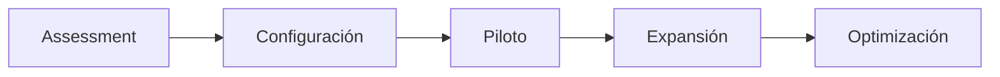

| Fase | Duración estimada | Actividades |
|---|---|---|
| **Assessment** | 1-2 semanas | Evaluar madurez actual, identificar proyectos piloto, definir objetivos |
| **Configuración** | 1-2 semanas | Crear contexto de proyecto, definir umbrales, configurar templates |
| **Piloto** | 4-6 semanas | Ejecutar AECF en 1-2 proyectos con acompañamiento de consultoría |
| **Expansión** | 4-8 semanas | Extender a más proyectos, formar al equipo, ajustar umbrales |
| **Optimización** | Continuo | Analizar métricas, refinar procesos, calibrar puntuaciones |

### 10.2 Criterios de selección de proyecto piloto

- Proyecto de complejidad media (no trivial, no crítico)
- Equipo receptivo a nuevos procesos
- Entregables medibles en 4-6 semanas
- Visibilidad suficiente para demostrar valor

### 10.3 Métricas de adopción

| Métrica | Cómo medir | Objetivo |
|---|---|---|
| Adherencia al proceso | % de features que completan todas las fases | > 80% |
| Tasa de GO en primer intento | % de auditorías que pasan en la primera evaluación | > 60% |
| Tiempo medio por fase | Horas desde inicio hasta completar cada fase | Decreciente mes a mes |
| Reducción de bugs | Bugs en producción vs. período anterior | -30% en 3 meses |
| Satisfacción del equipo | Encuesta trimestral | > 7/10 |

---

## 11. Relación con el componente AECF

### 11.1 La metodología vs. el componente

| Aspecto | Metodología AECF | Componente AECF |
|---|---|---|
| **Qué es** | Marco conceptual y procedimental | Implementación software del marco |
| **Dependencia** | Independiente de herramientas | Requiere VS Code + extensión |
| **Automatización** | Manual o semi-automatizado | Totalmente automatizado |
| **Gates** | Evaluación humana o por IA | Evaluación automática por LLM |
| **Fases** | Documentadas en plantillas | Orquestadas por el engine |
| **Scoring** | Calculado manualmente | Calculado automáticamente |
| **FIX loops** | Gestionados manualmente | Gestionados por el orchestrator |
| **Contexto** | Documentos manuales | Sistema de 3 archivos automático |

### 11.2 Cuándo usar cada opción

| Escenario | Recomendación |
|---|---|
| Organización quiere adoptar AECF sin herramientas | **Metodología** (este documento) + aecf_prompts |
| Equipo con VS Code y Copilot | **Componente** (aecf_test_participant) |
| Fase inicial de evaluación | **Metodología** con aecf_prompts |
| Producción a escala | **Componente** automatizado |
| Formación y capacitación | **Metodología** como referencia conceptual |

Implicaciones por superficie:

1. `aecf_prompts` reduce coste de entrada y sirve bien para auditorías, documentación, análisis de comportamiento y adopción guiada.
2. El modo prompt-only exige más disciplina explícita en contexto, selección de `surfaces` y validación manual de evidencias ejecutadas.
3. El componente automatizado es preferible cuando el flujo debe ejecutar tests reales, mutar código y mantener trazabilidad integrada con editor, runtime y git.

---

## 12. Glosario

| Término | Definición |
|---|---|
| **AECF** | AI Engineering Compliance Framework |
| **MARK** | Core framework individual de AECF |
| **OSK** | Framework multi-agente de AECF |
| **Gate** | Punto de control entre fases que evalúa GO/NO-GO |
| **Skill** | Plantilla de ejecución con fases, gates y entregables definidos |
| **Phase** | Etapa individual del flujo de trabajo (PLAN, IMPLEMENT, etc.) |
| **FIX loop** | Ciclo de corrección activado por un veredicto NO-GO |
| **Topic** | Nombre que identifica una funcionalidad o tarea dentro de AECF |
| **Scoring** | Sistema de puntuación cuantitativo con pesos y umbrales |
| **Context** | Información del proyecto inyectada en cada fase |
| **Tier** | Nivel de complejidad de un skill (T1, T2, T3) |
| **Determinism** | Modo que fuerza reproducibilidad exacta de resultados |

---

## 13. Flujos de Ejecución Detallados por Skill

Tras haber explicado la filosofía, componentes, gates, scoring y taxonomía de AECF, esta sección presenta el **flujo de ejecución completo** de cada skill con su diagrama Mermaid, incluyendo las fases de contexto previas, la descripción de cada fase y el comportamiento de gates.

> **Nota:** Todos los skills de TIER 2 y TIER 3 comienzan con la carga obligatoria de **Contexto Estático** (configuración humana del proyecto) y **Contexto Dinámico** (análisis automático del repositorio) antes de entrar en su flujo específico. Los skills de TIER 1 realizan la carga de contexto de forma implícita dentro de su fase EXECUTE.

---

### 13.1 `aecf_new_feature` — Nueva Funcionalidad (TIER 3)

Desarrollo completo de una nueva funcionalidad, desde la planificación hasta el versionado, con auditorías de calidad y seguridad en cada punto de control.

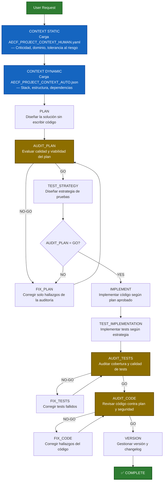

| Fase | Rol | Propósito | Gate |
|---|---|---|---|
| **CONTEXT STATIC** | Sistema | Cargar configuración humana del proyecto (criticidad, dominio, tolerancia al riesgo) | — |
| **CONTEXT DYNAMIC** | Sistema | Cargar análisis automático del repositorio (stack, estructura, dependencias) | — |
| **PLAN** | Arquitecto Senior | Diseñar la solución completa sin escribir código | — |
| **AUDIT_PLAN** | Auditor Independiente | Evaluar calidad, viabilidad y completitud del plan | GO requerido (≥ 75) |
| **FIX_PLAN** | Arquitecto (corrección) | Corregir solo los hallazgos de la auditoría del plan | loop → AUDIT_PLAN |
| **TEST_STRATEGY** | Ingeniero de Testing | Diseñar estrategia de pruebas sin implementar código | — |
| **IMPLEMENT** | Desarrollador Senior | Implementar código según el plan aprobado con GO | Requiere AUDIT_PLAN=GO |
| **TEST_IMPLEMENTATION** | Desarrollador Senior | Implementar tests según la estrategia definida | — |
| **AUDIT_TESTS** | Auditor Independiente | Auditar cobertura y calidad de los tests implementados | GO requerido |
| **AUDIT_CODE** | Auditor Independiente | Revisar código contra plan, estándares y seguridad | GO requerido (≥ 75) |
| **FIX_CODE** | Desarrollador (corrección) | Corregir solo los hallazgos de la auditoría de código | loop → AUDIT_CODE |
| **VERSION** | Release Manager | Gestionar versión, changelog y artefactos de release | — |

---

### 13.2 `aecf_hotfix` — Corrección Urgente en Producción (TIER 3)

Flujo acelerado para correcciones urgentes en producción con umbrales relajados (70/100) pero trazabilidad completa. Se omite TEST_STRATEGY — los tests se incluyen directamente en IMPLEMENT.

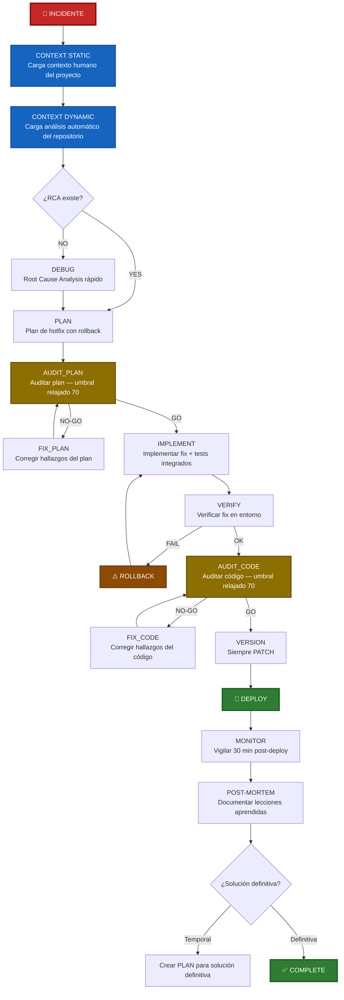

| Fase | Rol | Propósito | Gate |
|---|---|---|---|
| **CONTEXT STATIC** | Sistema | Cargar configuración humana del proyecto | — |
| **CONTEXT DYNAMIC** | Sistema | Cargar análisis automático del repositorio | — |
| **DEBUG** | Ingeniero on-call | Root Cause Analysis rápido (si no existe) | — |
| **PLAN** | Arquitecto Senior | Plan de hotfix con causa raíz y plan de rollback | — |
| **AUDIT_PLAN** | Auditor Independiente | Auditar plan con umbral relajado | GO requerido (≥ 70) |
| **FIX_PLAN** | Arquitecto (corrección) | Corregir hallazgos del plan | loop → AUDIT_PLAN |
| **IMPLEMENT** | Desarrollador Senior | Implementar fix con tests integrados (sin TEST_STRATEGY separada) | Requiere AUDIT_PLAN=GO |
| **VERIFY** | Ingeniero QA | Verificar corrección en entorno de staging/producción | PASS/FAIL |
| **AUDIT_CODE** | Auditor Independiente | Auditar código con umbral relajado | GO requerido (≥ 70) |
| **FIX_CODE** | Desarrollador (corrección) | Corregir hallazgos del código | loop → AUDIT_CODE |
| **VERSION** | Release Manager | Gestionar versión — siempre PATCH | — |
| **MONITOR** | Ingeniero on-call | Vigilar métricas 30 min post-deploy | — |
| **POST-MORTEM** | Equipo | Documentar lecciones aprendidas y acción futura | — |

---

### 13.3 `aecf_refactor` — Reestructuración de Código (TIER 3)

Reestructuración de código existente manteniendo el comportamiento funcional. Incluye documentación del estado actual, verificación pre/post refactoring y comparación de métricas.

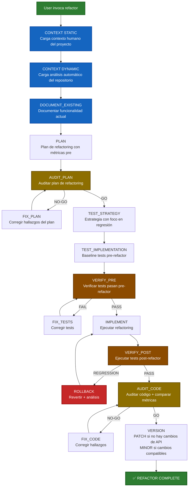

| Fase | Rol | Propósito | Gate |
|---|---|---|---|
| **CONTEXT STATIC** | Sistema | Cargar configuración humana del proyecto | — |
| **CONTEXT DYNAMIC** | Sistema | Cargar análisis automático del repositorio | — |
| **DOCUMENT_EXISTING** | Arquitecto Senior | Documentar la funcionalidad actual antes de modificar | — |
| **PLAN** | Arquitecto Senior | Plan de refactoring con métricas actuales (complejidad, duplicación, cobertura) | — |
| **AUDIT_PLAN** | Auditor Independiente | Evaluar viabilidad del plan de refactoring | GO requerido (≥ 75) |
| **FIX_PLAN** | Arquitecto (corrección) | Corregir hallazgos del plan | loop → AUDIT_PLAN |
| **TEST_STRATEGY** | Ingeniero de Testing | Diseñar estrategia con foco en regresión y non-regression | — |
| **TEST_IMPLEMENTATION** | Desarrollador Senior | Implementar baseline de tests pre-refactor | — |
| **VERIFY_PRE** | Sistema | Verificar que los tests pasan con el código actual | PASS/FAIL |
| **IMPLEMENT** | Desarrollador Senior | Ejecutar el refactoring manteniendo comportamiento funcional | Requiere VERIFY_PRE=PASS |
| **VERIFY_POST** | Sistema | Ejecutar tests post-refactor — los tests existentes DEBEN seguir pasando | PASS/REGRESSION |
| **AUDIT_CODE** | Auditor Independiente | Auditar código y comparar métricas antes/después | GO requerido (≥ 75) |
| **FIX_CODE** | Desarrollador (corrección) | Corregir hallazgos de la auditoría de código | loop → AUDIT_CODE |
| **VERSION** | Release Manager | PATCH si no hay cambios de API, MINOR si hay cambios compatibles | — |

---

### 13.4 `aecf_code_standards_audit` — Auditoría de Estándares de Código (TIER 1)

Auditoría de estándares de código en un módulo o proyecto. Genera informe con hallazgos clasificados por severidad y plan de remediación priorizado.

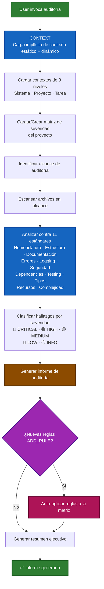

| Fase | Rol | Propósito | Gate |
|---|---|---|---|
| **CONTEXT** | Sistema | Carga implícita del contexto estático y dinámico del proyecto | — |
| **LOAD** | Sistema | Cargar los 3 niveles de contexto: sistema, proyecto y tarea | — |
| **MATRIX** | Sistema | Cargar o crear la matriz de severidad del proyecto | — |
| **SCAN** | Auditor | Escanear todos los archivos dentro del alcance definido | — |
| **ANALYZE** | Auditor Senior | Analizar código contra los 11 estándares definidos | — |
| **CLASSIFY** | Auditor Senior | Clasificar cada hallazgo por severidad (CRITICAL → INFO) | — |
| **REPORT** | Auditor Senior | Generar informe con hallazgos, remediaciones y resumen por categoría | — |
| **AUTO_APPLY** | Sistema | Auto-aplicar nuevas reglas descubiertas a la matriz de severidad | — |

---

### 13.5 `aecf_security_review` — Revisión de Seguridad (TIER 1)

Revisión de seguridad de un módulo o proyecto contra OWASP Top 10 con clasificación CVSS. Umbral estricto: ≥ 90/100.

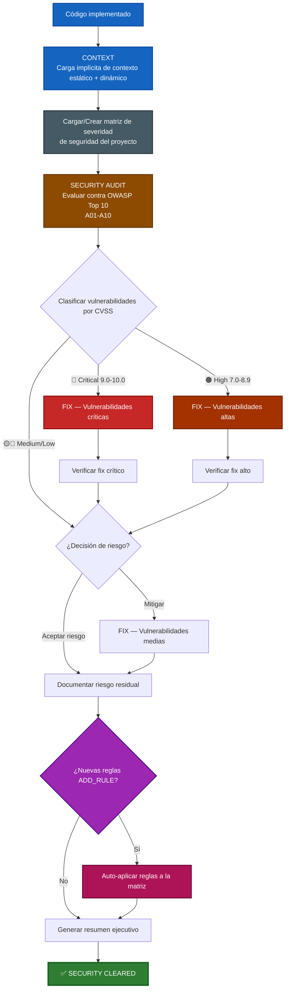

| Fase | Rol | Propósito | Gate |
|---|---|---|---|
| **CONTEXT** | Sistema | Carga implícita del contexto estático y dinámico del proyecto | — |
| **MATRIX** | Sistema | Cargar o crear la matriz de severidad de seguridad del proyecto | — |
| **SECURITY AUDIT** | Ingeniero de Seguridad Senior | Evaluar código contra OWASP Top 10 (A01-A10, credenciales, dependencias, regulación) | — |
| **CLASSIFY** | Ingeniero de Seguridad Senior | Clasificar vulnerabilidades por CVSS (Critical, High, Medium, Low) | — |
| **FIX (por severidad)** | Desarrollador Senior | Corregir vulnerabilidades — las críticas y altas son obligatorias | — |
| **VERIFY** | Ingeniero QA | Verificar que los fixes resuelven las vulnerabilidades | — |
| **DOC_RISK** | Ingeniero de Seguridad | Documentar riesgo residual para vulnerabilidades no mitigadas | — |
| **AUTO_APPLY** | Sistema | Auto-aplicar nuevas reglas descubiertas a la matriz de seguridad | — |

---

### 13.6 `aecf_document_legacy` — Documentación de Código Legacy (TIER 2)

Documentación de código legacy existente. Genera documentación técnica completa con flujos Mermaid, dependencias y puntos de riesgo.

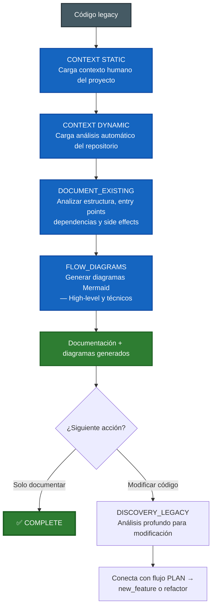

| Fase | Rol | Propósito | Gate |
|---|---|---|---|
| **CONTEXT STATIC** | Sistema | Cargar configuración humana del proyecto | — |
| **CONTEXT DYNAMIC** | Sistema | Cargar análisis automático del repositorio | — |
| **DOCUMENT_EXISTING** | Arquitecto Senior | Analizar estructura del código: archivos, clases, funciones, entry points, dependencias, side effects | — |
| **FLOW_DIAGRAMS** | Arquitecto Senior | Generar diagramas Mermaid: flujo high-level y flujo técnico detallado | — |
| **DISCOVERY_LEGACY** | Arquitecto Senior | (Opcional) Análisis profundo antes de modificaciones — conecta con PLAN de otro skill | — |

---

### 13.7 `aecf_explain_behavior` — Explicación de Comportamiento (TIER 1)

Explicación detallada del comportamiento de un fragmento de código, función, módulo o flujo. Analiza qué hace, cómo lo hace, y evalúa calidad, riesgos y determinismo.

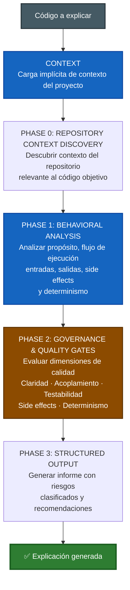

| Fase | Rol | Propósito | Gate |
|---|---|---|---|
| **CONTEXT** | Sistema | Carga implícita del contexto del proyecto | — |
| **REPOSITORY CONTEXT DISCOVERY** | Sistema | Descubrir contexto del repositorio relevante al código objetivo | mandatory_context |
| **BEHAVIORAL ANALYSIS** | Ingeniero Senior | Analizar propósito, flujo de ejecución paso a paso, entradas/salidas y side effects | — |
| **GOVERNANCE & QUALITY GATES** | Auditor | Evaluar 5 dimensiones de calidad (1-5) y clasificar riesgos (CRITICAL/WARNING/WISH) | quality_validation |
| **STRUCTURED OUTPUT** | Ingeniero Senior | Generar informe estructurado con recomendaciones y skills AECF sugeridos | final_validation |

---

### 13.8 `aecf_executive_summary` — Resumen Ejecutivo (TIER 1)

Resumen ejecutivo del estado de un proyecto o funcionalidad. Sintetiza métricas, riesgos, progreso y recomendaciones para stakeholders no técnicos.

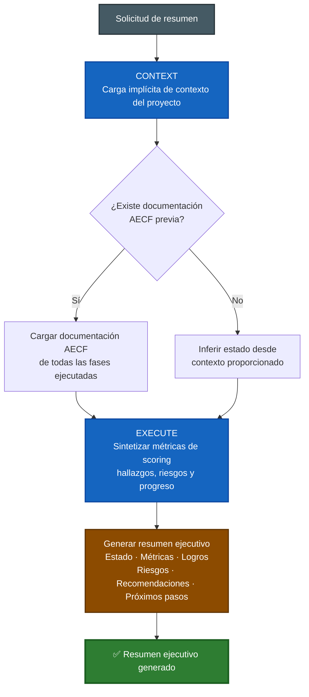

| Fase | Rol | Propósito | Gate |
|---|---|---|---|
| **CONTEXT** | Sistema | Carga implícita del contexto del proyecto | — |
| **EXECUTE** | Consultor Ejecutivo | Sintetizar métricas de scoring, hallazgos y riesgos de todas las fases ejecutadas | — |
| **REPORT** | Consultor Ejecutivo | Generar resumen con: estado general (calidad/seguridad/testing/deuda técnica), métricas clave, logros, riesgos activos, recomendaciones y próximos pasos | — |

---

### 13.9 `aecf_new_test_set` — Nuevo Set de Tests (TIER 3)

Descubrimiento de gaps en la cobertura de tests, diseño de un set de tests, y opcionalmente implementación y ejecución con informe de evidencia. Requiere aprobación del usuario antes de implementar, salvo cuando el run se invoca con `execute=True`.

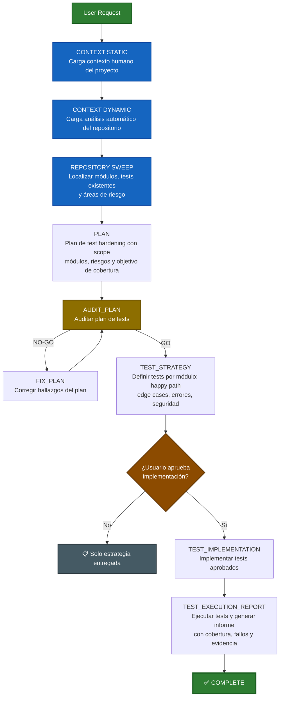

| Fase | Rol | Propósito | Gate |
|---|---|---|---|
| **CONTEXT STATIC** | Sistema | Cargar configuración humana del proyecto | — |
| **CONTEXT DYNAMIC** | Sistema | Cargar análisis automático del repositorio | — |
| **REPOSITORY SWEEP** | Sistema | Localizar módulos, tests existentes, coverage tooling y áreas de riesgo | — |
| **PLAN** | Ingeniero de Testing | Plan de test hardening con scope, módulos, riesgos y objetivo de cobertura | — |
| **AUDIT_PLAN** | Auditor Independiente | Auditar plan de tests | GO requerido |
| **FIX_PLAN** | Ingeniero de Testing | Corregir hallazgos del plan | loop → AUDIT_PLAN |
| **TEST_STRATEGY** | Ingeniero de Testing | Definir tests por módulo: happy path, edge cases, error forcing, seguridad, SQL injection, permisos | — |
| **TEST_IMPLEMENTATION** | Desarrollador Senior | Implementar tests aprobados | Requiere aprobación del usuario o `execute=True` |
| **TEST_EXECUTION_REPORT** | Sistema | Ejecutar tests y generar informe extenso con cobertura, fallos y recomendaciones | — |

---

### 13.10 `aecf_new_feature_ma` — Nueva Funcionalidad Multi-Agente (TIER 3)

Implementación de nueva funcionalidad usando un flujo multi-agente por roles (planner, implementer, reviewer, auditor) con gates de consenso para reducir drift y mejorar estabilidad.

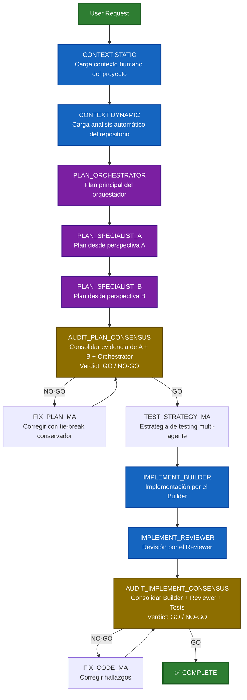

| Fase | Rol | Propósito | Gate |
|---|---|---|---|
| **CONTEXT STATIC** | Sistema | Cargar configuración humana del proyecto | — |
| **CONTEXT DYNAMIC** | Sistema | Cargar análisis automático del repositorio | — |
| **PLAN_ORCHESTRATOR** | Orquestador | Generar plan principal consolidado | — |
| **PLAN_SPECIALIST_A** | Especialista A | Plan desde una perspectiva complementaria | — |
| **PLAN_SPECIALIST_B** | Especialista B | Plan desde otra perspectiva complementaria | — |
| **AUDIT_PLAN_CONSENSUS** | Comité | Consolidar evidencia de los 3 planes con tie-break conservador (NO-GO > GO incierto) | GO requerido |
| **FIX_PLAN_MA** | Comité | Corregir hallazgos del consenso | loop → AUDIT_PLAN_CONSENSUS |
| **TEST_STRATEGY_MA** | Ingeniero de Testing | Diseñar estrategia de pruebas multi-agente | — |
| **IMPLEMENT_BUILDER** | Desarrollador Builder | Implementar código según plan aprobado por consenso | Requiere AUDIT_PLAN_CONSENSUS=GO |
| **IMPLEMENT_REVIEWER** | Desarrollador Reviewer | Revisar y validar la implementación del Builder | — |
| **AUDIT_IMPLEMENT_CONSENSUS** | Comité | Consolidar Builder + Reviewer + tests con severidades normalizadas | GO requerido |
| **FIX_CODE_MA** | Desarrollador | Corregir hallazgos del consenso de implementación | loop → AUDIT_IMPLEMENT_CONSENSUS |

---

### 13.11 `aecf_new_project` — Nuevo Proyecto (TIER 3)

Bootstrap de un proyecto completo y listo para producción. Valida parámetros contra un catálogo cerrado antes de generar estructura.

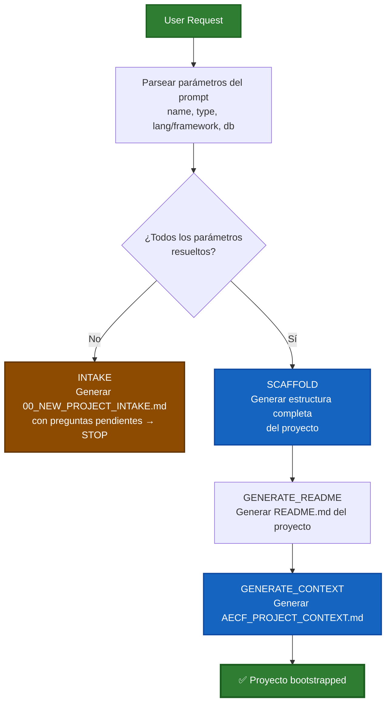

| Fase | Rol | Propósito | Gate |
|---|---|---|---|
| **PARSE** | Sistema | Parsear parámetros del prompt: project_name, project_type, language_framework, database | — |
| **VALIDATE** | Sistema | Validar contra catálogo soportado — BLOQUEA si falta o es ambiguo | Todos los parámetros requeridos |
| **INTAKE** | Sistema | (Si falta info) Generar documento con preguntas pendientes y STOP | — |
| **SCAFFOLD** | Generador | Crear estructura completa: carpetas, config, source stubs, tests, CI/CD | Requiere INTAKE completo |
| **GENERATE_README** | Generador | Generar README.md adaptado al tipo de proyecto | — |
| **GENERATE_CONTEXT** | Generador | Generar AECF_PROJECT_CONTEXT.md para el nuevo proyecto | — |

---

### 13.12 `aecf_system_replayability_adaptive` — Replayabilidad de Sistema (TIER 3)

Diseño e implementación de una capa de replayabilidad adaptativa al proyecto, detectando la arquitectura y seleccionando la estrategia mínimamente invasiva.

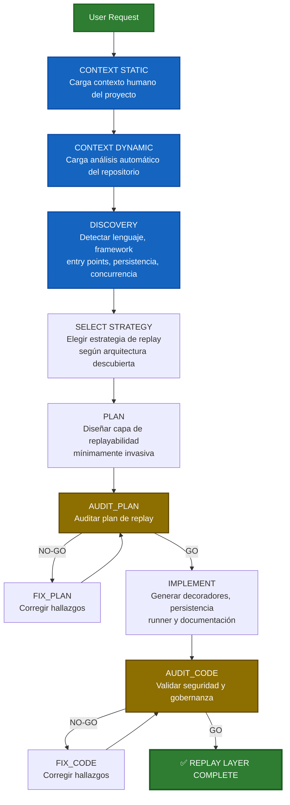

| Fase | Rol | Propósito | Gate |
|---|---|---|---|
| **CONTEXT STATIC** | Sistema | Cargar configuración humana del proyecto | — |
| **CONTEXT DYNAMIC** | Sistema | Cargar análisis automático del repositorio | — |
| **DISCOVERY** | Sistema | Detectar arquitectura: lenguaje, framework, entry points, persistencia, modelo de concurrencia | — |
| **SELECT STRATEGY** | Arquitecto Senior | Elegir estrategia de replay adaptada a la arquitectura descubierta | — |
| **PLAN** | Arquitecto Senior | Diseñar capa de replayabilidad con principios de clean architecture, sin mutar lógica de negocio | — |
| **AUDIT_PLAN** | Auditor Independiente | Auditar plan de replay | GO requerido |
| **FIX_PLAN** | Arquitecto (corrección) | Corregir hallazgos | loop → AUDIT_PLAN |
| **IMPLEMENT** | Desarrollador Senior | Generar decoradores, persistencia, runner y documentación de replay | Requiere AUDIT_PLAN=GO |
| **AUDIT_CODE** | Auditor Independiente | Validar que no muta lógica de negocio, no rompe transacciones, no introduce dependencias circulares | GO requerido |
| **FIX_CODE** | Desarrollador (corrección) | Corregir hallazgos | loop → AUDIT_CODE |

---

### 13.13 `aecf_release_readiness` — Evaluación de Preparación para Release (TIER 1)

Validación pre-release comprehensiva que verifica fases completas, auditorías aprobadas, versionado correcto y readiness operacional. Produce un veredicto GO/CONDITIONAL/NO-GO.

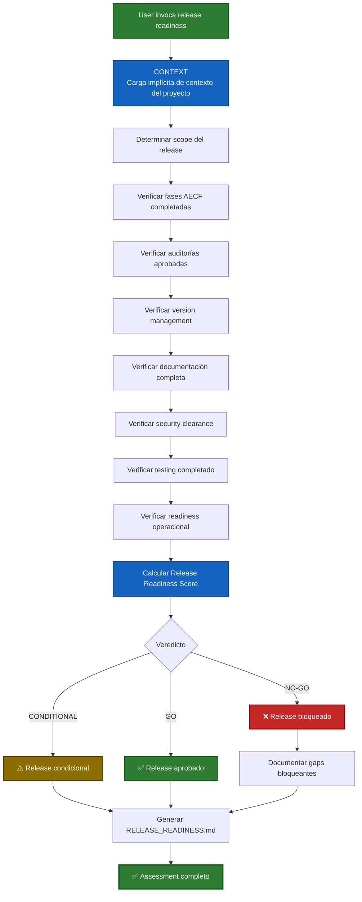

| Fase | Rol | Propósito | Gate |
|---|---|---|---|
| **CONTEXT** | Sistema | Carga implícita del contexto del proyecto | — |
| **SCOPE** | Release Manager | Determinar qué features/fixes están incluidos en el release | — |
| **PHASE_CHECK** | Sistema | Verificar que todas las fases AECF están completadas para el scope | — |
| **AUDIT_CHECK** | Sistema | Verificar que todas las auditorías pasaron (GO o GO CONDICIONAL con aprobación) | — |
| **VERSION_CHECK** | Sistema | Verificar gestión de versión y changelog correctos | — |
| **DOC_CHECK** | Sistema | Verificar completitud de documentación | — |
| **SECURITY_CHECK** | Sistema | Verificar security clearance | — |
| **TEST_CHECK** | Sistema | Verificar testing completado con evidencia | — |
| **OPS_CHECK** | Sistema | Verificar readiness operacional (deployment, monitoring, rollback) | — |
| **SCORE** | Sistema | Calcular Release Readiness Score ponderado | — |
| **VERDICT** | Release Manager | Emitir veredicto GO / CONDITIONAL / NO-GO | GO/CONDITIONAL/NO-GO |

---

### 13.14 `aecf_maturity_assessment` — Evaluación de Madurez (TIER 1)

Evaluación de madurez organizacional contra 10 dimensiones de gobernanza con scoring basado en evidencia y roadmap de mejora.

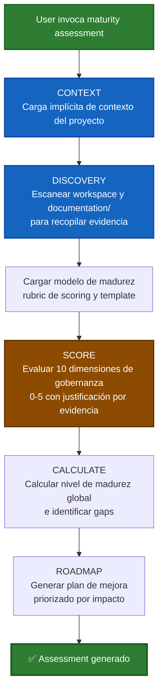

| Fase | Rol | Propósito | Gate |
|---|---|---|---|
| **CONTEXT** | Sistema | Carga implícita del contexto del proyecto | — |
| **DISCOVERY** | Sistema | Escanear workspace y documentación para recopilar evidencia por dimensión | — |
| **LOAD** | Sistema | Cargar modelo de madurez, rubric de scoring y template de assessment | — |
| **SCORE** | Auditor Senior | Evaluar 10 dimensiones de gobernanza (0-5) con justificación basada en evidencia | — |
| **CALCULATE** | Sistema | Calcular nivel de madurez global e identificar gaps prioritarios | — |
| **ROADMAP** | Consultor | Generar plan de mejora priorizado por impacto con skills AECF recomendados | — |

---

### 13.15 `aecf_ai_risk_assessment` — Evaluación de Riesgos de IA (TIER 1)

Evaluación estructurada de riesgos de IA en múltiples dimensiones (operaciones, seguridad, compliance, fiabilidad) con priorización y plan de mitigación.

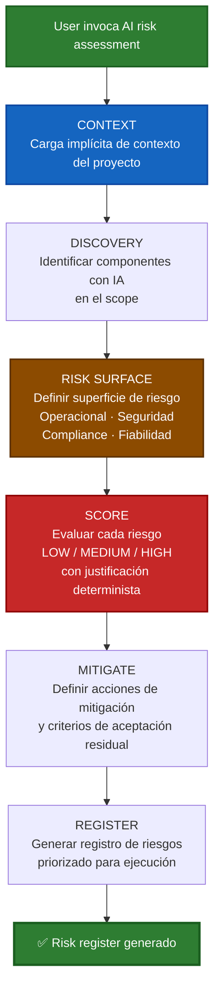

| Fase | Rol | Propósito | Gate |
|---|---|---|---|
| **CONTEXT** | Sistema | Carga implícita del contexto del proyecto | — |
| **DISCOVERY** | Sistema | Identificar componentes con IA en el scope (prompting, inferencia, modelos, APIs) | — |
| **RISK SURFACE** | Auditor de Riesgos | Definir superficie de riesgo en 4 dimensiones: operacional, seguridad, compliance, fiabilidad | — |
| **SCORE** | Auditor de Riesgos | Evaluar cada riesgo con metodología determinista LOW/MEDIUM/HIGH con rationale | — |
| **MITIGATE** | Auditor de Riesgos | Definir acciones de mitigación y criterios de aceptación de riesgo residual | — |
| **REGISTER** | Auditor de Riesgos | Generar registro de riesgos priorizado y actionable | — |

---

### 13.16 `aecf_model_governance_audit` — Auditoría de Gobernanza de Modelos (TIER 1)

Auditoría de gobernanza sobre cambios que afectan el comportamiento de modelos de IA: prompting, features, umbrales, routing, reentrenamiento.

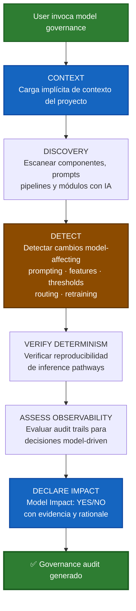

| Fase | Rol | Propósito | Gate |
|---|---|---|---|
| **CONTEXT** | Sistema | Carga implícita del contexto del proyecto | — |
| **DISCOVERY** | Sistema | Escanear componentes, prompts, pipelines y módulos con comportamiento de IA | — |
| **DETECT** | Auditor de Modelos | Detectar cambios que afectan comportamiento del modelo (prompting, features, umbrales, routing, reentrenamiento) | — |
| **VERIFY DETERMINISM** | Auditor de Modelos | Verificar requisitos de reproducibilidad y determinismo en inference pathways | — |
| **ASSESS OBSERVABILITY** | Auditor de Modelos | Evaluar audit trails y observabilidad para decisiones model-driven | — |
| **DECLARE IMPACT** | Auditor de Modelos | Declarar Model Impact YES/NO con evidencia y rationale | — |

---

### 13.17 `aecf_data_governance_audit` — Auditoría de Gobernanza de Datos (TIER 1)

Auditoría de gobernanza de datos: lineage, clasificación, retención y controles de manejo.

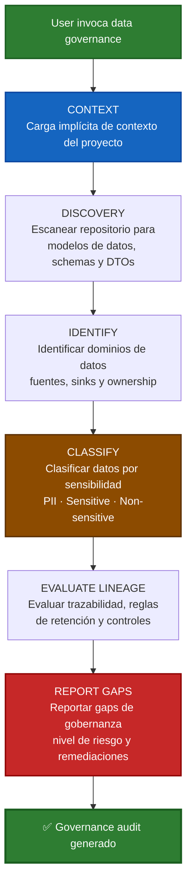

| Fase | Rol | Propósito | Gate |
|---|---|---|---|
| **CONTEXT** | Sistema | Carga implícita del contexto del proyecto | — |
| **DISCOVERY** | Sistema | Escanear repositorio para modelos de datos, schemas, migraciones y DTOs | — |
| **IDENTIFY** | Auditor de Datos | Identificar dominios de datos, fuentes, sinks y límites de ownership | — |
| **CLASSIFY** | Auditor de Datos | Clasificar datos por sensibilidad (PII/sensitive/non-sensitive) según taxonomía del proyecto | — |
| **EVALUATE LINEAGE** | Auditor de Datos | Evaluar trazabilidad del lineage, reglas de retención y controles de manejo | — |
| **REPORT GAPS** | Auditor de Datos | Reportar gaps de gobernanza, nivel de riesgo y acciones de remediación requeridas | — |

---

### 13.18 `aecf_data_classification` — Clasificación de Datos (TIER 1)

Clasificación exploratoria y determinista de todos los elementos de datos del proyecto con propuesta de gobernanza en formato YAML.

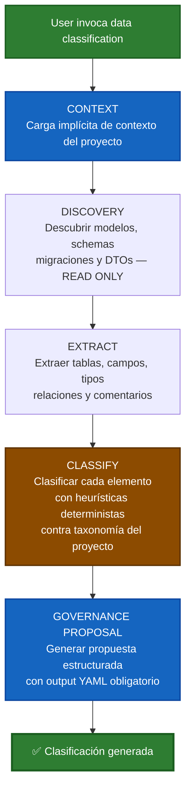

| Fase | Rol | Propósito | Gate |
|---|---|---|---|
| **CONTEXT** | Sistema | Carga implícita del contexto del proyecto | — |
| **DISCOVERY** | Sistema | Descubrir modelos de datos, schemas, migraciones y DTOs en scope (READ-ONLY) | — |
| **EXTRACT** | Sistema | Extraer tablas, campos, tipos, relaciones y comentarios de forma determinista | — |
| **CLASSIFY** | Auditor de Datos | Clasificar cada elemento con heurísticas deterministas contra la taxonomía del proyecto | — |
| **GOVERNANCE PROPOSAL** | Auditor de Datos | Generar propuesta de gobernanza estructurada con output YAML obligatorio | — |

---

### 13.19 `aecf_data_strategy` — Estrategia de Datos (TIER 2)

Diseño de la estrategia óptima de ingestión, almacenamiento y gestión de datos para fuentes de alto volumen. Analiza trade-offs y produce un documento handoff-ready.

```mermaid
flowchart TD
    START[User invoca data strategy] --> CTX_S[CONTEXT STATIC<br/>Carga contexto humano del proyecto]
    CTX_S --> CTX_D[CONTEXT DYNAMIC<br/>Carga análisis automático del repositorio]
    CTX_D --> CHARACTERIZE[CHARACTERIZE<br/>Analizar fuente de datos<br/>Volumen · Velocidad · Variedad · Veracidad]
    CHARACTERIZE --> INGESTION[ANALYZE INGESTION<br/>Evaluar estrategias de ingestión<br/>Incremental vs Full-load<br/>Dedup pre/post ingestión]
    INGESTION --> STORAGE[EVALUATE STORAGE<br/>Evaluar arquitectura de almacenamiento<br/>Schema · Partitioning · Normalization]
    STORAGE --> MATRIX[DECISION MATRIX<br/>Scoring cuantitativo de cada<br/>estrategia con trade-offs]
    MATRIX --> RECOMMEND[RECOMMEND<br/>Recomendar estrategia óptima<br/>con justificación cuantitativa]
    RECOMMEND --> DONE[✅ Data strategy generado]

    style START fill:#2e7d32,stroke:#1b5e20,stroke-width:2px,color:#fff
    style DONE fill:#2e7d32,stroke:#1b5e20,stroke-width:3px,color:#fff
    style CTX_S fill:#1565c0,stroke:#0d47a1,stroke-width:2px,color:#fff
    style CTX_D fill:#1565c0,stroke:#0d47a1,stroke-width:2px,color:#fff
    style MATRIX fill:#8c4b00,stroke:#5d3200,stroke-width:2px,color:#fff
    style RECOMMEND fill:#1565c0,stroke:#0d47a1,stroke-width:2px,color:#fff
```

| Fase | Rol | Propósito | Gate |
|---|---|---|---|
| **CONTEXT STATIC** | Sistema | Cargar configuración humana del proyecto | — |
| **CONTEXT DYNAMIC** | Sistema | Cargar análisis automático del repositorio | — |
| **CHARACTERIZE** | Arquitecto de Datos | Analizar la fuente de datos en 4V: volumen, velocidad, variedad, veracidad | — |
| **ANALYZE INGESTION** | Arquitecto de Datos | Evaluar estrategias de ingestión con trade-offs (incremental vs full-load, dedup pre/post) | — |
| **EVALUATE STORAGE** | Arquitecto de Datos | Evaluar arquitectura de almacenamiento (schema, partitioning, normalization) | — |
| **DECISION MATRIX** | Arquitecto de Datos | Scoring cuantitativo de cada estrategia usando matriz de decisión | — |
| **RECOMMEND** | Arquitecto de Datos | Recomendar estrategia óptima con justificación cuantificada de coste, rendimiento y complejidad | — |

---

### 13.20 `aecf_dependency_audit` — Auditoría de Dependencias (TIER 1)

Auditoría de seguridad de la cadena de suministro: vulnerabilidades, licencias y salud de dependencias con plan de remediación.

```mermaid
flowchart TD
    START[User invoca dependency audit] --> CTX[CONTEXT<br/>Carga implícita de contexto del proyecto]
    CTX --> MATRIX[Cargar/Crear matriz de severidad<br/>de dependencias del proyecto]
    MATRIX --> DISCOVERY[DISCOVERY<br/>Identificar todas las dependencias<br/>desde manifiestos del proyecto]
    DISCOVERY --> ANALYZE[ANALYZE<br/>Analizar vulnerabilidades<br/>licencias y salud de cada dependencia]
    ANALYZE --> CLASSIFY[CLASSIFY<br/>Clasificar hallazgos por severidad<br/>usando calibración de la matriz]
    CLASSIFY --> REMEDIATE[REMEDIATE<br/>Generar plan de remediación<br/>con rutas de actualización]
    REMEDIATE --> DONE[✅ Dependency audit generado]

    style START fill:#2e7d32,stroke:#1b5e20,stroke-width:2px,color:#fff
    style DONE fill:#2e7d32,stroke:#1b5e20,stroke-width:3px,color:#fff
    style CTX fill:#1565c0,stroke:#0d47a1,stroke-width:2px,color:#fff
    style MATRIX fill:#455a64,stroke:#263238,stroke-width:2px,color:#fff
    style ANALYZE fill:#8c4b00,stroke:#5d3200,stroke-width:2px,color:#fff
    style CLASSIFY fill:#c62828,stroke:#8e0000,stroke-width:2px,color:#fff
```

| Fase | Rol | Propósito | Gate |
|---|---|---|---|
| **CONTEXT** | Sistema | Carga implícita del contexto del proyecto | — |
| **MATRIX** | Sistema | Cargar o crear la matriz de severidad de dependencias del proyecto | — |
| **DISCOVERY** | Sistema | Identificar todas las dependencias directas y transitivas desde manifiestos | — |
| **ANALYZE** | Ingeniero de Seguridad | Analizar cada dependencia para vulnerabilidades, licencias y salud | — |
| **CLASSIFY** | Ingeniero de Seguridad | Clasificar hallazgos por severidad usando calibración de la matriz del proyecto | — |
| **REMEDIATE** | Ingeniero de Seguridad | Generar plan de remediación con rutas de actualización | — |

---

### 13.21 `aecf_tech_debt_assessment` — Evaluación de Deuda Técnica (TIER 1)

Escaneo exhaustivo de indicadores de deuda técnica con clasificación, cuantificación y priorización por impacto de negocio.

```mermaid
flowchart TD
    START[User invoca tech debt] --> CTX[CONTEXT<br/>Carga implícita de contexto del proyecto]
    CTX --> MATRIX[Cargar/Crear matriz de severidad<br/>de deuda técnica del proyecto]
    MATRIX --> DISCOVERY[DISCOVERY<br/>Escanear codebase para<br/>indicadores de deuda técnica]
    DISCOVERY --> CLASSIFY[CLASSIFY<br/>Clasificar deuda por tipo y severidad<br/>usando calibración de la matriz]
    CLASSIFY --> QUANTIFY[QUANTIFY<br/>Cuantificar esfuerzo de remediación<br/>con calibración de la matriz]
    QUANTIFY --> PRIORITIZE[PRIORITIZE<br/>Priorizar por riesgo × esfuerzo<br/>× impacto de negocio]
    PRIORITIZE --> DONE[✅ Tech debt assessment generado]

    style START fill:#2e7d32,stroke:#1b5e20,stroke-width:2px,color:#fff
    style DONE fill:#2e7d32,stroke:#1b5e20,stroke-width:3px,color:#fff
    style CTX fill:#1565c0,stroke:#0d47a1,stroke-width:2px,color:#fff
    style MATRIX fill:#455a64,stroke:#263238,stroke-width:2px,color:#fff
    style CLASSIFY fill:#8c4b00,stroke:#5d3200,stroke-width:2px,color:#fff
    style PRIORITIZE fill:#c62828,stroke:#8e0000,stroke-width:2px,color:#fff
```

| Fase | Rol | Propósito | Gate |
|---|---|---|---|
| **CONTEXT** | Sistema | Carga implícita del contexto del proyecto | — |
| **MATRIX** | Sistema | Cargar o crear la matriz de severidad de deuda técnica del proyecto | — |
| **DISCOVERY** | Sistema | Escanear codebase exhaustivamente para indicadores de deuda técnica | — |
| **CLASSIFY** | Auditor Senior | Clasificar deuda por tipo, severidad (usando calibración de la matriz) e impacto de negocio | — |
| **QUANTIFY** | Auditor Senior | Cuantificar esfuerzo de remediación estimado usando calibración de la matriz | — |
| **PRIORITIZE** | Auditor Senior | Priorizar usando matriz riesgo × esfuerzo × impacto de negocio | — |

---

### 13.22 `aecf_define_impact_metrics` — Definición de Métricas de Impacto (TIER 2)

Definición de métricas técnicas y operacionales con baseline, targets y método de medición para governance readiness.

```mermaid
flowchart TD
    START[User invoca impact metrics] --> CTX_S[CONTEXT STATIC<br/>Carga contexto humano del proyecto]
    CTX_S --> CTX_D[CONTEXT DYNAMIC<br/>Carga análisis automático del repositorio]
    CTX_D --> OUTCOME[OUTCOME DEFINITION<br/>Definir resultados medibles<br/>alineados al scope del cambio]
    OUTCOME --> BASELINE[BASELINE<br/>Establecer valores baseline<br/>y targets post-cambio]
    BASELINE --> VALIDATE_METRIC[VALIDATE<br/>Validar ownership, método<br/>de medición y cadencia]
    VALIDATE_METRIC --> SPEC[SPECIFICATION<br/>Producir especificación de métricas<br/>governance-ready]
    SPEC --> DONE[✅ Impact metrics definidos]

    style START fill:#2e7d32,stroke:#1b5e20,stroke-width:2px,color:#fff
    style DONE fill:#2e7d32,stroke:#1b5e20,stroke-width:3px,color:#fff
    style CTX_S fill:#1565c0,stroke:#0d47a1,stroke-width:2px,color:#fff
    style CTX_D fill:#1565c0,stroke:#0d47a1,stroke-width:2px,color:#fff
    style OUTCOME fill:#1565c0,stroke:#0d47a1,stroke-width:2px,color:#fff
    style VALIDATE_METRIC fill:#8c4b00,stroke:#5d3200,stroke-width:2px,color:#fff
```

| Fase | Rol | Propósito | Gate |
|---|---|---|---|
| **CONTEXT STATIC** | Sistema | Cargar configuración humana del proyecto | — |
| **CONTEXT DYNAMIC** | Sistema | Cargar análisis automático del repositorio | — |
| **OUTCOME DEFINITION** | Consultor de Métricas | Definir métricas técnicas y operacionales medibles alineadas al scope del cambio | — |
| **BASELINE** | Consultor de Métricas | Establecer valores baseline actuales y targets esperados post-cambio | — |
| **VALIDATE** | Consultor de Métricas | Validar ownership de la métrica, método de medición y cadencia | — |
| **SPECIFICATION** | Consultor de Métricas | Producir especificación de métricas governance-ready con SLO/SLA si aplica | — |

---

### 13.23 `aecf_document_context_ingestion` — Ingestión de Contexto Documental (TIER 2)

Ingestión de contexto desde fuentes documentales (PDF, Markdown, URLs) con extracción determinista, normalización y mapeo trazable a fuentes.

```mermaid
flowchart TD
    START[User invoca context ingestion] --> CTX_S[CONTEXT STATIC<br/>Carga contexto humano del proyecto]
    CTX_S --> CTX_D[CONTEXT DYNAMIC<br/>Carga análisis automático del repositorio]
    CTX_D --> DISCOVER_DOCS[DISCOVER SOURCES<br/>Descubrir fuentes documentales<br/>PDF · Markdown · Text · URLs]
    DISCOVER_DOCS --> EXTRACT[EXTRACT<br/>Extraer evidencia determinista<br/>título, owner, fecha, secciones<br/>constraints clave]
    EXTRACT --> NORMALIZE[NORMALIZE<br/>Normalizar conocimiento extraído<br/>en modelo de contexto unificado]
    NORMALIZE --> FLAG[FLAG CONFIDENCE<br/>Marcar confianza y ambigüedades<br/>sin resolver por fragmento]
    FLAG --> REPORT[CONSOLIDATE<br/>Generar informe de ingestión<br/>con mapeo trazable a fuentes]
    REPORT --> DONE[✅ Context ingestion generado]

    style START fill:#2e7d32,stroke:#1b5e20,stroke-width:2px,color:#fff
    style DONE fill:#2e7d32,stroke:#1b5e20,stroke-width:3px,color:#fff
    style CTX_S fill:#1565c0,stroke:#0d47a1,stroke-width:2px,color:#fff
    style CTX_D fill:#1565c0,stroke:#0d47a1,stroke-width:2px,color:#fff
    style EXTRACT fill:#1565c0,stroke:#0d47a1,stroke-width:2px,color:#fff
    style FLAG fill:#8c4b00,stroke:#5d3200,stroke-width:2px,color:#fff
```

| Fase | Rol | Propósito | Gate |
|---|---|---|---|
| **CONTEXT STATIC** | Sistema | Cargar configuración humana del proyecto | — |
| **CONTEXT DYNAMIC** | Sistema | Cargar análisis automático del repositorio | — |
| **DISCOVER SOURCES** | Sistema | Descubrir fuentes documentales dentro y fuera del workspace (PDF, Markdown, texto, URLs) | — |
| **EXTRACT** | Sistema | Extraer evidencia determinista: título, owner, fecha, secciones, constraints clave | — |
| **NORMALIZE** | Sistema | Normalizar conocimiento extraído en modelo de contexto unificado para downstream skills | — |
| **FLAG CONFIDENCE** | Sistema | Marcar confianza (0.0-1.0) y ambigüedades sin resolver por fragmento de fuente | — |
| **CONSOLIDATE** | Sistema | Generar informe de ingestión consolidado con mapeo trazable a fuentes originales | — |

---

### 13.24 `aecf_project_context_generator` — Generador de Contexto de Proyecto (TIER 2)

Análisis completo del workspace para generar `AECF_PROJECT_CONTEXT_AUTO.json` con inferencia de arquitectura, stack, convenciones y confidence scores.

```mermaid
flowchart TD
    START[User invoca project context] --> DISCOVERY[DISCOVERY<br/>Escanear workspace completo<br/>estructura, tecnologías, patrones]
    DISCOVERY --> ANALYZE[ANALYZE<br/>Analizar config, source code<br/>documentación e infraestructura]
    ANALYZE --> INFER[INFER<br/>Inferir arquitectura, stack<br/>deployment, convenciones]
    INFER --> CONFIDENCE[ASSIGN CONFIDENCE<br/>Asignar score 0.0-1.0<br/>por sección basado en evidencia]
    CONFIDENCE --> GENERATE[GENERATE<br/>Crear AECF_PROJECT_CONTEXT_AUTO.json<br/>en .aecf/runtime/context/]
    GENERATE --> RESOLVE[TRIGGER RESOLVE<br/>Engine fusiona AUTO + HUMAN<br/>→ RESOLVED]
    RESOLVE --> PRESENT[PRESENT<br/>Presentar resumen al usuario<br/>para revisión y refinamiento]
    PRESENT --> DONE[✅ Contexto generado]

    style START fill:#2e7d32,stroke:#1b5e20,stroke-width:2px,color:#fff
    style DONE fill:#2e7d32,stroke:#1b5e20,stroke-width:3px,color:#fff
    style DISCOVERY fill:#1565c0,stroke:#0d47a1,stroke-width:2px,color:#fff
    style GENERATE fill:#1565c0,stroke:#0d47a1,stroke-width:2px,color:#fff
    style RESOLVE fill:#8c4b00,stroke:#5d3200,stroke-width:2px,color:#fff
```

| Fase | Rol | Propósito | Gate |
|---|---|---|---|
| **DISCOVERY** | Sistema | Escanear workspace completo: estructura de archivos, tecnologías, patrones y convenciones | — |
| **ANALYZE** | Sistema | Analizar configuración, source code, documentación e infraestructura | — |
| **INFER** | Sistema | Inferir arquitectura, stack técnico, modelo de deployment, convenciones y patrones críticos | — |
| **ASSIGN CONFIDENCE** | Sistema | Asignar score de confianza (0.0-1.0) por sección basado en calidad de evidencia | — |
| **GENERATE** | Sistema | Crear `AECF_PROJECT_CONTEXT_AUTO.json` en formato JSON estructurado | — |
| **TRIGGER RESOLVE** | Engine | Fusionar AUTO + HUMAN → RESOLVED como fuente de verdad | — |
| **PRESENT** | Sistema | Presentar resumen al usuario para revisión y refinamiento iterativo | — |

---

### 13.25 `aecf_project_context_generator_map` — Generador de Contexto Dinámico (TIER 2)

Generación o enriquecimiento del contexto dinámico del proyecto a partir de artefactos estructurados del engine (JSON). No modifica el contexto estático.

```mermaid
flowchart TD
    START[Engine ejecuta scripts<br/>deterministas] --> ARTIFACTS[Artefactos JSON generados<br/>STACK · STRUCTURE · ENTRYPOINTS<br/>MODULES · DEPENDENCIES · SENSITIVE]
    ARTIFACTS --> CHECK{¿Existe<br/>AECF_DYNAMIC_PROJECT_CONTEXT.md?}
    CHECK -->|No| CREATE[CREATE<br/>Crear archivo con estructura<br/>de secciones requerida]
    CHECK -->|Sí| ENRICH[ENRICH<br/>Enriquecer secciones existentes<br/>sin destruir contenido previo]
    CREATE --> OUTPUT[OUTPUT<br/>Stack · Structure · Entrypoints<br/>Domain Modules · Dependencies<br/>Sensitive Areas]
    ENRICH --> OUTPUT
    OUTPUT --> DONE[✅ Contexto dinámico generado]

    style START fill:#455a64,stroke:#263238,stroke-width:2px,color:#fff
    style DONE fill:#2e7d32,stroke:#1b5e20,stroke-width:3px,color:#fff
    style ARTIFACTS fill:#1565c0,stroke:#0d47a1,stroke-width:2px,color:#fff
    style OUTPUT fill:#1565c0,stroke:#0d47a1,stroke-width:2px,color:#fff
```

| Fase | Rol | Propósito | Gate |
|---|---|---|---|
| **ARTIFACTS** | Engine | Ejecutar scripts deterministas que generan JSONs estructurados del repositorio | — |
| **CHECK** | Sistema | Verificar si ya existe el archivo de contexto dinámico | — |
| **CREATE/ENRICH** | Sistema | Crear o enriquecer secciones sin destruir contenido existente ni sobrescribir contenido humano | — |
| **OUTPUT** | Sistema | Generar: Stack, Structure, Entrypoints, Domain Modules, Dependencies, Sensitive Areas | — |

> ⚠️ **Regla STATIC CONTEXT**: Este skill NUNCA modifica `AECF_STATIC_PROJECT_CONTEXT.md` — el contexto estático es mantenido por humanos y permanece intocable.

---

### 13.26 `aecf_generate_runtime_context` — Generador de Contexto Runtime (TIER 2)

Generación de un contexto de runtime enfocado y token-efficient para la tarea actual, seleccionando ~30 archivos relevantes y extrayendo solo sus firmas de código.

```mermaid
flowchart TD
    START[Tarea activa] --> INPUTS[INPUTS<br/>task_description +<br/>primary_modules + secondary_modules<br/>+ MODULE_INDEX + DEPENDENCY_GRAPH]
    INPUTS --> SELECT[SELECT FILES<br/>Algoritmo determinista:<br/>1. Primary modules<br/>2. +1 nivel de dependencia<br/>3. Secondary modules<br/>4. Tests relacionados<br/>5. Entrypoints importadores<br/>6. Clamp a ~30 archivos]
    SELECT --> EXTRACT[EXTRACT SIGNATURES<br/>Extraer: class names<br/>function signatures<br/>first-line docstrings<br/>NO source code completo]
    EXTRACT --> OUTPUT[GENERATE<br/>AECF_RUNTIME_CONTEXT.md<br/>Task · Modules · Files<br/>Dependencies · Signatures]
    OUTPUT --> DONE[✅ Runtime context generado]

    style START fill:#455a64,stroke:#263238,stroke-width:2px,color:#fff
    style DONE fill:#2e7d32,stroke:#1b5e20,stroke-width:3px,color:#fff
    style SELECT fill:#1565c0,stroke:#0d47a1,stroke-width:2px,color:#fff
    style EXTRACT fill:#8c4b00,stroke:#5d3200,stroke-width:2px,color:#fff
    style OUTPUT fill:#1565c0,stroke:#0d47a1,stroke-width:2px,color:#fff
```

| Fase | Rol | Propósito | Gate |
|---|---|---|---|
| **INPUTS** | Sistema | Recibir task_description, primary/secondary modules y artefactos JSON del engine | — |
| **SELECT FILES** | Engine (determinista) | Algoritmo de selección: primary → +1 dependencia → secondary → tests → entrypoints → clamp ~30 | — |
| **EXTRACT SIGNATURES** | Engine (determinista) | Extraer class names, function signatures y first-line docstrings — NO source code completo | — |
| **GENERATE** | Sistema | Generar `AECF_RUNTIME_CONTEXT.md` con Task, Relevant Modules, Files, Dependencies, Signatures | — |

---

### 13.27 `aecf_content_project_generation_map` — Generador de Mapa de Contenido del Proyecto (TIER 2)

Generación o enriquecimiento de `AECF_DYNAMIC_PROJECT_CONTEXT.md` a partir de artefactos estructurados del engine. Funcionalmente similar a `project_context_generator_map` pero registrado como skill independiente con output en `.aecf/runtime/`.

```mermaid
flowchart TD
    START[Engine ejecuta scripts<br/>deterministas] --> ARTIFACTS[Artefactos JSON generados<br/>STACK · STRUCTURE · ENTRYPOINTS<br/>MODULES · DEPENDENCIES · SENSITIVE]
    ARTIFACTS --> CHECK{¿Existe<br/>AECF_DYNAMIC_PROJECT_CONTEXT.md<br/>en .aecf/runtime/?}
    CHECK -->|No| CREATE[CREATE<br/>Crear archivo con estructura<br/>de secciones requerida]
    CHECK -->|Sí| ENRICH[ENRICH<br/>Enriquecer secciones existentes<br/>sin destruir contenido previo]
    CREATE --> OUTPUT[OUTPUT<br/>Stack · Structure · Entrypoints<br/>Domain Modules · Dependencies<br/>Sensitive Areas]
    ENRICH --> OUTPUT
    OUTPUT --> DONE[✅ Contexto dinámico generado]

    style START fill:#455a64,stroke:#263238,stroke-width:2px,color:#fff
    style DONE fill:#2e7d32,stroke:#1b5e20,stroke-width:3px,color:#fff
    style ARTIFACTS fill:#1565c0,stroke:#0d47a1,stroke-width:2px,color:#fff
    style OUTPUT fill:#1565c0,stroke:#0d47a1,stroke-width:2px,color:#fff
```

| Fase | Rol | Propósito | Gate |
|---|---|---|---|
| **ARTIFACTS** | Engine | Ejecutar scripts deterministas que generan JSONs estructurados del repositorio | — |
| **CHECK** | Sistema | Verificar si ya existe el archivo de contexto dinámico en `.aecf/runtime/` | — |
| **CREATE/ENRICH** | Sistema | Crear o enriquecer secciones sin destruir contenido existente ni sobrescribir contenido humano | — |
| **OUTPUT** | Sistema | Generar: Stack, Structure, Entrypoints, Domain Modules, Dependencies, Sensitive Areas | — |

> 📝 **Nota**: `aecf_generate_static_project_context` comparte el mismo SKILL_ID que `aecf_project_context_generator_map` (§13.25) y se considera una versión anterior del mismo skill.

---

### 13.28 Leyenda de colores de los diagramas

| Color | Significado |
|---|---|
| 🟢 Verde | Inicio del flujo / Completado con éxito |
| 🔵 Azul oscuro | Fases de CONTEXTO (STATIC / DYNAMIC) |
| 🔵 Azul medio | Fases de análisis o documentación |
| 🟡 Amarillo | Gates de auditoría (GO / NO-GO) |
| 🟠 Naranja | Fases de verificación o generación de informes |
| 🔴 Rojo | Incidentes, rollbacks o vulnerabilidades críticas |
| 🟣 Púrpura | Decisiones sobre reglas de la matriz de severidad |
| 🩷 Rosa | Auto-aplicación de reglas a matrices |

---

> **Nota legal:** La metodología AECF es propiedad intelectual de Fernando García Varela (youngluke). Este documento es una referencia independiente de implementación. Consulte `AUTHORSHIP_AND_OWNERSHIP.md` para detalles de autoría y propiedad.

