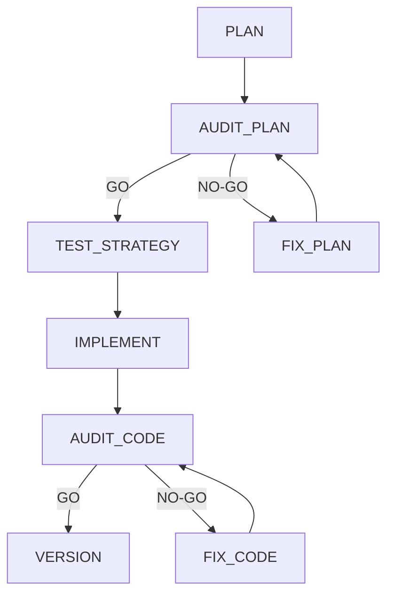

# AECF — AI Engineering Compliance Framework

## Component-Independent Methodology

LAST_REVIEW: 2026-04-09
OWNER SEACHAD
VERSION: 1.0.0

---

> **Methodology author:** Fernando Garcia Varela (youngluke)
> **Framework:** AECF (AI Engineering Compliance Framework)
> This document describes the AECF methodology independently of any specific tool or runtime component. AECF can be applied manually, with documents and spreadsheets, with prompt-only bundles, or through specialized software.

---

## 1. What AECF Is

**AECF (AI Engineering Compliance Framework)** is a governance framework for AI-assisted software engineering. It imposes a structured and auditable workflow where each phase validates the previous one before the flow can continue.

### 1.1 Core Principles

| Principle | Description |
|---|---|
| **Intentional friction** | Adds deliberate control points that prevent weak outputs from moving forward unchecked. |
| **Auditable quality** | Every relevant decision remains documented and traceable. |
| **Security by design** | Security is structural, not an afterthought. |
| **Determinism** | Equivalent inputs should produce equivalent judgments. |
| **Tool independence** | The methodology is not tied to a specific LLM, IDE, or vendor runtime. |

### 1.2 What AECF Is For

AECF is intended for **production-grade work** that must be:

- maintainable over time,
- auditable by clients, regulators, or internal governance,
- secure by default,
- developed with explicit traceability.

### 1.3 What AECF Is Not For

- disposable prototypes,
- throwaway scripts,
- exploratory code with no quality expectations.

### 1.4 Expected Impact

| Metric | Expected impact |
|---|---|
| Development time | +20-40% initial investment |
| Production bugs | -40% |
| Rework | -60% |
| Production incidents | -35% |

---

## 2. Methodology Architecture

### 2.0 AECF Execution Surfaces

AECF is methodology-first and can be executed through different surfaces without changing its gates, scoring rules, or governance model.

| Surface | Entry point | Operational context | Best fit |
|---|---|---|---|
| **Manual** | Documents, templates, spreadsheets | No automation | Early adoption, workshops, conceptual assessment |
| **Prompt-only** (`aecf_prompts`) | Prompt bundle, instruction surfaces, optional MCP | Claude, GPT, or similar hosts with repository access | Audits, documentation, behavioral analysis, teams without the VS Code component |
| **Automated component** (`aecf_test_participant`) | VS Code extension plus engine | Editor, git, runtime and tests integrated | Governed implementation, executed testing, operational traceability at scale |

The practical implication is simple: the methodology remains the same, but context resolution, test execution, and runtime automation differ by surface.

### 2.1 Main MARK Flow

AECF defines a sequential flow of phases separated by quality gates:

```
PLAN → AUDIT_PLAN → [FIX_PLAN if NO-GO] → TEST_STRATEGY → IMPLEMENT → AUDIT_CODE → [FIX_CODE if NO-GO] → VERSION
```

### 2.2 Flow Diagram



### 2.3 Phase Roles

| Phase | Role | Purpose | Deliverable |
|---|---|---|---|
| **PLAN** | Senior Software Architect | Design the solution without writing code | Technical plan |
| **AUDIT_PLAN** | Independent Auditor | Evaluate quality, feasibility, and completeness of the plan | Audit report with GO/NO-GO verdict |
| **FIX_PLAN** | Architect (correction) | Correct only the audit findings | Corrected plan |
| **TEST_STRATEGY** | Testing Engineer | Design the test strategy without implementing tests yet | Test strategy document |
| **IMPLEMENT** | Senior Developer | Implement according to the approved plan | Code plus documentation |
| **AUDIT_CODE** | Independent Auditor | Review code against plan, standards, and security | Audit report with GO/NO-GO verdict |
| **FIX_CODE** | Developer (correction) | Correct only the code audit findings | Corrected code |
| **VERSION** | Release Manager | Manage version, changelog, and release artifacts | Updated changelog plus version metadata |

---

## 3. Gate System

### 3.1 Allowed Verdicts

| Verdict | Meaning | Action |
|---|---|---|
| **GO** | The phase meets all required quality criteria | Move to the next phase |
| **NO-GO** | Findings must be corrected | Enter the corresponding FIX loop |
| **UNKNOWN** | A safe verdict cannot be established | Block progression |

### 3.2 Evaluation Rules

1. If the evaluation contains **NO-GO**, the verdict is **NO-GO**.
2. If the evaluation contains **GO** and no **NO-GO**, the verdict is **GO**.
3. If the verdict cannot be determined safely, the result is **UNKNOWN** and the flow blocks.

### 3.3 Test-Evidence Exception

For `AUDIT_CODE`, a nominal GO is still forced to **NO-GO** if no executed test evidence exists. In AECF, code cannot be approved without test validation.

### 3.4 FIX Loops

When a gate returns NO-GO:

1. a correction phase is activated,
2. the correction must address only the audit findings,
3. the audit is rerun,
4. the loop continues until GO or the maximum allowed cycles are exhausted.

---

## 4. Scoring Model

### 4.1 Weighted Scoring

AECF uses weighted categories:

```
Score = Σ (category_points × category_weight) / Σ (category_max × category_weight) × 100
```

### 4.2 Example

| Category | Weight | Items | Score |
|---|---|---|---|
| Clarity | 3 | 4 | 7/8 |
| Security | 4 | 5 | 9/10 |
| Testing | 2 | 3 | 4/6 |

### 4.3 Thresholds by Skill Type

| Skill type | GO threshold | Rationale |
|---|---|---|
| Features | ≥ 75/100 | Balance between speed and rigor |
| Hotfixes | ≥ 70/100 | Slightly relaxed because of urgency |
| Security | ≥ 90/100 | High-impact threshold |

### 4.4 Maturity Levels

| Level | Range | Meaning |
|---|---|---|
| **Optimized** | 90-100 | Excellent operational maturity |
| **Managed** | 75-89 | Stable and reliable process |
| **Defined** | 50-74 | Formal process exists but remains improvable |
| **Initial** | 25-49 | Weak and high-risk process |
| **Ad-hoc** | 0-24 | No real governance process |

---

## 5. Skills System

### 5.1 What a Skill Is

A **skill** is an execution template defining:

- which phases run,
- in which order,
- which gates apply,
- which deliverables are expected,
- and which rigor level is required.

### 5.2 Skill Taxonomy

| Tier | Complexity | Typical phases | Examples |
|---|---|---|---|
| **TIER 1** | Low | Single execution phase | Standards audit, security review |
| **TIER 2** | Medium | Two to four phases | Legacy documentation, behavior explanation |
| **TIER 3** | High | Five or more gated phases | New feature, refactor, hotfix |

### 5.3 Available Skill Families

| Family | Representative skills |
|---|---|
| Code development | `new_feature`, `refactor`, `hotfix` |
| Audit and compliance | `code_standards_audit`, `security_review`, `data_governance_audit` |
| Documentation | `document_legacy`, `explain_behavior`, `executive_summary` |
| Project context | `project_context_generator`, `project_context_generator_map` |
| Strategy and governance | `ai_risk_assessment`, `maturity_assessment`, `tech_debt_assessment`, `release_readiness` |

Execution implication by surface:

1. Read-only and assessment-oriented skills fit well in the prompt-only surface.
2. Code-mutating skills are safer in the automated component because they can run tests and preserve runtime traceability.

### 5.4 Skill Release States

| State | Meaning |
|---|---|
| **released** | Available and validated for production usage |
| **beta** | Visible but still under controlled validation |
| **hidden** | Not available to end users |
| **deprecated** | Retired and not expected to be used |
| **blocked** | Blocked by default for new skills |

---

## 6. Project Context System

### 6.1 Three-File Architecture

AECF keeps project context across three layers:

| File | Type | Purpose |
|---|---|---|
| `AECF_PROJECT_CONTEXT_AUTO.json` | Automatic | Repository-inferred technical context |
| `AECF_PROJECT_CONTEXT_HUMAN.yaml` | Manual | Curated business and governance overrides |
| `AECF_PROJECT_CONTEXT_RESOLVED.json` | Combined | Human-over-auto merged source of truth |

### 6.2 Minimum Required Context

Every project under AECF should define at least:

1. technology stack,
2. architecture,
3. criticality levels,
4. risk tolerance,
5. business or functional domain,
6. code standards,
7. testing strategy.

### 6.3 `surface` and `surfaces` Model

When a repository is large, multi-domain, or multi-team, AECF can refine operational scope through explicit `surface` or `surfaces` selection.

| Concept | Purpose | Operational implication |
|---|---|---|
| `primary_surface` | Defines the main domain in scope | Prevents a skill from reopening the entire repository unnecessarily |
| `active_surfaces` | Ordered list of active surfaces | Allows controlled cross-surface execution |
| `AECF_SURFACES_INDEX.*` | Canonical list of known surfaces | Prevents silent reinvention or renaming of scope |
| `AECF_RUN_CONTEXT.json` | Frozen execution context | Reduces rediscovery and cross-phase drift |

Methodology rules:

1. surfaces refine global context rather than replacing it,
2. active scope must not expand silently,
3. frozen run-context surface decisions should prevail,
4. surface-aware skills must load the index and the selected surface files,
5. if scope cannot be resolved safely, the flow must ask for clarification or regenerate context rather than improvise.

---

## 7. Artifacts and Generated Documentation

### 7.1 Typical Documentation Layout

```text
documentation/
├── <user_id>/
│   ├── AECF_CHANGELOG.md
│   ├── AECF_RUN_CONTEXT.json
│   ├── AECF_TOPICS_INVENTORY.json
│   ├── AECF_TOPICS_INVENTORY.md
│   ├── AECF_SURFACES_INDEX.md
│   ├── AECF_SURFACES_INDEX.json
│   └── <TOPIC>/
│       ├── 01_<skill_name>_PLAN.md
│       ├── 02_<skill_name>_AUDIT_PLAN.md
│       ├── 03_<skill_name>_FIX_PLAN.md
│       ├── 04_<skill_name>_IMPLEMENT.md
│       ├── 05_<skill_name>_AUDIT_CODE.md
│       ├── 06_<skill_name>_FIX_CODE.md
│       ├── 07_<skill_name>_VERSION.md
│       ├── 08_<skill_name>_TEST_STRATEGY.md
│       └── diagrams/
```

Prompt-only operational rules:

1. `aecf_prompts` remains a single shared folder per project.
2. execution attribution resolves through: `AECF_PROMPTS_USER_ID`, then `AECF_PROMPTS_MODEL_ID` or `MODEL_ID`, then `AECF_PROMPTS_AGENT_ID` or `AGENT_ID`, then `bootstrap_prompt_only_bundle.exe --diagnose-env` if available; if no source resolves, generate a random 8-character alphanumeric identifier prefixed with `user_` (e.g. `user_k7m2p9xa`). Never silently fall back to OS username or hostname.
3. if the repository uses surfaces, minimum context should include `AECF_SURFACES_INDEX.*`, `AECF_RUN_CONTEXT.json`, and the active surface files.
4. surface selection should be frozen before governed phases whenever possible.
5. the automated component keeps its own runtime behavior; these rules apply specifically to prompt-only usage.

### 7.2 Traceability Metadata

Generated documents should include metadata such as:

- skill,
- phase,
- topic,
- generation date,
- effective author or agent,
- verdict when relevant,
- score when relevant.

### 7.3 Code-Level Metadata

When code is implemented under AECF, lightweight provenance metadata can be added, and the effective execution identity should be used rather than a generic label like `aecf`.

---

## 8. Governance

### 8.1 System Context

Projects under AECF should maintain an `AECF_SYSTEM_CONTEXT.md` defining:

- global policies,
- applicable regulatory restrictions,
- industry standards,
- roles and responsibilities.

### 8.2 Data Governance

For sensitive-data projects, AECF includes:

- data classification,
- lineage traceability,
- access-control mapping,
- regulatory compliance expectations.

### 8.3 AI Risk Register

AECF expects an `AI_RISK_REGISTER.md` documenting:

- identified AI-related risks,
- likelihood and impact,
- mitigations,
- and current status.

---

## 9. Roles in AECF

### 9.1 Flow Roles

| Role | Responsibilities | Typical phases |
|---|---|---|
| **Senior Software Architect** | Plans and solution design | PLAN, FIX_PLAN |
| **Independent Auditor** | Quality evaluation and gate decisions | AUDIT_PLAN, AUDIT_CODE |
| **Testing Engineer** | Test strategy design | TEST_STRATEGY |
| **Senior Developer** | Implementation and corrections | IMPLEMENT, FIX_CODE |
| **Release Manager** | Version and release artifacts | VERSION |

### 9.2 Organizational Roles

| Role | Responsibility |
|---|---|
| **AECF Champion** | Drives adoption |
| **Quality Gate Owner** | Defines thresholds and criteria |
| **AECF Consultant** | Guides rollout and fills initial templates |
| **Project Lead** | Keeps project context current |

---

## 10. Rolling Out AECF in an Organization

### 10.1 Rollout Phases

| Phase | Typical duration | Activities |
|---|---|---|
| **Assessment** | 1-2 weeks | Current-state review and pilot selection |
| **Configuration** | 1-2 weeks | Context setup, thresholds, templates |
| **Pilot** | 4-6 weeks | Controlled execution on one or two projects |
| **Expansion** | 4-8 weeks | Broader adoption and team training |
| **Optimization** | Ongoing | Metrics review and calibration |

### 10.2 Pilot Selection Criteria

- medium complexity,
- receptive team,
- measurable outcomes in a few weeks,
- enough visibility to demonstrate value.

### 10.3 Adoption Metrics

| Metric | Measurement | Target |
|---|---|---|
| Process adherence | Percentage of flows completing all phases | > 80% |
| First-pass GO rate | Percentage of audits passing first try | > 60% |
| Average phase time | Hours per phase | Downward trend |
| Bug reduction | Production bugs vs. prior period | -30% in 3 months |
| Team satisfaction | Quarterly survey | > 7/10 |

---

## 11. Relationship Between the Methodology and the Component

### 11.1 Methodology vs. Component

| Aspect | AECF Methodology | AECF Component |
|---|---|---|
| What it is | Conceptual and procedural framework | Software implementation |
| Tooling dependency | Independent | Requires runtime tooling |
| Automation level | Manual or semi-automated | Operationally automated |
| Gates | Human or AI evaluation | Runtime-enforced gates |
| Context | Document-driven | Runtime-managed |

### 11.2 When to Use Each Surface

| Scenario | Recommended surface |
|---|---|
| Adopting AECF without tooling | Methodology plus `aecf_prompts` |
| Working in VS Code with governed automation | Automated component |
| Early assessment or training | Methodology plus prompt-only |
| Production implementation at scale | Automated component |
| Audits, documentation, behavioral analysis | Prompt-only surface |

Operational implications:

1. `aecf_prompts` lowers the adoption barrier and works especially well for audits, documentation, and analysis.
2. Prompt-only execution requires more explicit discipline around context, surfaces, and manual validation of executed evidence.
3. The automated component is preferable when tests must run, code must be changed, and runtime traceability must stay integrated with the development environment.

---

## 12. Glossary

| Term | Meaning |
|---|---|
| **AECF** | AI Engineering Compliance Framework |
| **Gate** | Quality checkpoint between phases |
| **Skill** | Execution template with phases, gates, and deliverables |
| **Phase** | Individual step in a governed flow |
| **FIX loop** | Correction cycle triggered by a NO-GO verdict |
| **Topic** | Named unit of work under AECF |
| **Scoring** | Quantitative weighted evaluation system |
| **Context** | Project information loaded into the flow |
| **Surface** | Explicit operational scope inside a larger repository |
| **Determinism** | Reproducible evaluation behavior |

---

## 13. Detailed Skill Execution Flows

The Spanish methodology remains the canonical exhaustive narrative for every detailed skill flow and Mermaid diagram currently published in the bundle.

This English companion keeps the same methodological contract and is intended to make the framework readable to English-speaking teams without changing any runtime behavior.

For detailed operational skill flows, use together:

1. `skills/README_SKILLS.md`,
2. `guides/SKILL_CATALOG.md`,
3. the individual `skill_*.md` files,
4. and the Spanish `AECF_METHODOLOGY.md` when a line-by-line canonical narrative is required.