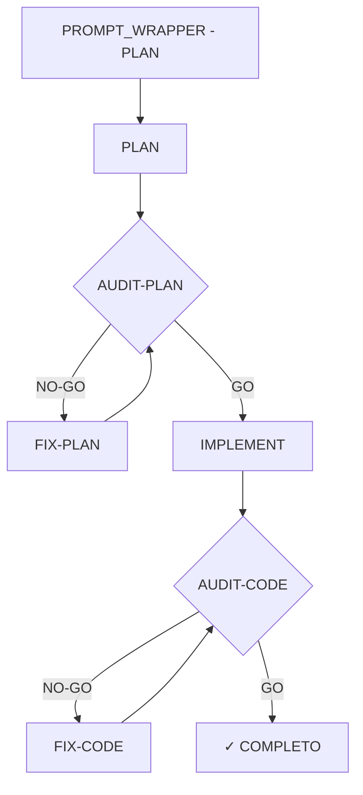
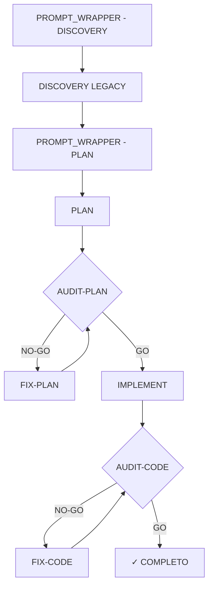
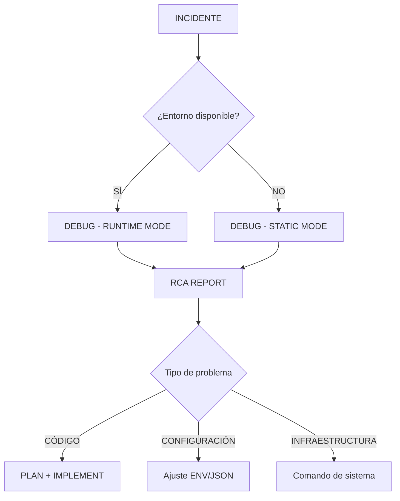

# AECF SYSTEM CONTEXT

------------------------------------------------------------

**This file supersedes fragmented context files.**

All prompts and skills must load this file as primary system context.

------------------------------------------------------------

## MANDATORY GOVERNANCE

This system operates under mandatory governance:

**aecf/_governance/AECF_EXECUTIVE_SUMMARY_GOVERNANCE.md**

All prompts and skills must comply.

## GOVERNANCE_LAYER

This layer is mandatory and must be evaluated in every AECF phase, prompt, and skill execution.

### DATA_GOVERNANCE

- Enforce data lineage traceability for all generated artifacts and code changes.
- Validate data classification impact (PII/sensitive/non-sensitive) and retention implications.
- Ensure data handling decisions are explicitly documented in deliverables.

### MODEL_GOVERNANCE

- Evaluate whether changes affect model behavior, inference paths, or retraining requirements.
- Require model-impact declaration (YES/NO) in skill outputs and executive summaries.
- Preserve deterministic and auditable AI-assisted decision pathways.

### AI_RISK_MANAGEMENT

- Classify implementation risk (LOW/MEDIUM/HIGH) and include rationale.
- Identify operational, security, compliance, and reliability impacts before completion.
- Require explicit mitigation actions for medium/high risk outcomes.

### AI_EXPLAINABILITY

- Ensure every AI-driven feature exposes transparent and interpretable outputs.
- Enforce explainability level declaration (0-4) for AI-assisted behaviors.
- Require a mandatory `AI_EXPLAINABILITY` block in outputs of skills using AI.
- Enforce minimum explainability level 2 for financial, regulatory, or PII-affecting features.
- Ensure explainability evidence is logged for audit and replayability.

EXPLAINABILITY_REQUIRED_IF:
  - AI_USED = TRUE
  - DECISION_AUTOMATION = TRUE
  - DATA_SENSITIVITY >= CONFIDENTIAL

Skill declaration rule:
- Every skill MUST declare `AI_USED = TRUE` or `AI_USED = FALSE`.
- If `AI_USED = TRUE`, `## AI_EXPLAINABILITY_VALIDATION` is mandatory in that skill.
- If `AI_USED = FALSE`, explainability block is not required.

Mandatory block when `AI_USED = TRUE`:

## AI_EXPLAINABILITY_VALIDATION
- Explainability level defined? YES/NO
- User-facing explanation provided? YES/NO
- Model version logged? YES/NO
- Decision trace stored? YES/NO

### AI_EXPLAINABILITY_ENFORCEMENT_RULE

RULE:

If:
  AI_USED = TRUE
Then:
  Skill MUST include:
    - AI_EXPLAINABILITY section
    - AI_EXPLAINABILITY_VALIDATION block
  Executive Summary MUST validate explainability

If missing:
  EXECUTIVE_SUMMARY = FAIL

Validation Logic:
  IF AI_USED == TRUE AND AI_EXPLAINABILITY_VALIDATION not present
    → BLOCK completion
    → Mark as GOVERNANCE_FAIL

Backward compatibility:
  IF AI_USED field is missing
    → Default AI_USED = FALSE
    → No explainability required

### IMPACT_METRICS

- Define measurable technical and operational impact metrics for changes.
- Record expected baseline vs. post-change outcomes when applicable.
- Include governance readiness indicators in executive-level summaries.

## MANDATORY DATA GOVERNANCE CONTEXT

**aecf_prompts/DATA_GOVERNANCE_CONTEXT.md**

When a phase, prompt, or skill touches data ingestion, transformation, storage, retention, or exposure, this context file MUST be loaded and applied.

Its classification, lineage, retention, and quality rules are mandatory for all generated deliverables.

## MANDATORY MODEL GOVERNANCE CONTEXT

**aecf_prompts/MODEL_GOVERNANCE_CONTEXT.md**

When a phase, prompt, or skill touches model selection, inference behavior, evaluation, drift, bias, token usage, or model-related budgeting, this context file MUST be loaded and applied.

Its model registry, evaluation metrics, budget controls, and mandatory validation rules are required for all relevant deliverables.

## MANDATORY AI EXPLAINABILITY CONTEXT

**aecf_prompts/AI_EXPLAINABILITY_CONTEXT.md**

When a phase, prompt, or skill touches AI-assisted decisions, model outputs, summarization, or probabilistic inference, this context file MUST be loaded and applied.

Its explainability levels, mandatory explainability block, logging requirements, and compliance thresholds are required for all relevant deliverables.

## MANDATORY TEMPLATE HEADERS (UNIVERSAL METADATA)

**aecf/templates/TEMPLATE_HEADERS.md**

This file defines the standard `## METADATA` block that ALL AECF-generated documents must include. It is the SINGLE SOURCE OF TRUTH for document metadata structure. All templates reference it via `@METADATA` directives instead of duplicating the metadata block.

When generating ANY document:
1. Load `templates/TEMPLATE_HEADERS.md`
2. Read the `@METADATA` directive from the specific template
3. Insert the `## METADATA` section at the end of the document in compact format
4. Fill Document Type and Phase from the directive; auto-resolve all other fields

## MANDATORY SKILL DISPATCHER

**aecf/SKILL_DISPATCHER.md**

When ANY skill invocation is detected (explicit `skill:` reference, skill filename, or natural language intent matching a skill), the **SKILL_DISPATCHER** MUST be loaded and its execution protocol MUST be followed.

The SKILL_DISPATCHER guarantees:
- Simple, natural prompts trigger full AECF-compliant execution
- All parameters are auto-resolved (TOPIC, scope, numbering)
- Output files are ALWAYS created (chat-only responses are INVALID)
- AECF naming conventions are ALWAYS enforced
- Executive summaries are generated on-demand via `skill_executive_summary`

**Developers should NEVER need verbose prompts to invoke a skill.**

## MANDATORY `_ext` EXTENSION PROTOCOL (ARCHITECTURE-WIDE)

For ANY AECF process document (context, dispatcher, prompt, skill, template, scoring, checklist, governance, flow, or equivalent runtime process file):

- If a sibling file exists in the **same folder** with the **same base name** plus `_ext` and the **same extension**, it MUST be loaded and applied.
- Pattern: `<name>.<ext>` + `<name>_ext.<ext>`
- The `_ext` file is an extension layer that may **expand, modify, and/or cancel** sections from the base file.
- The extension layer is ALWAYS considered when present (non-optional).

Deterministic merge rule:
1. Load base document first.
2. Load `_ext` document immediately after.
3. Resolve conflicts with extension precedence (latest layer wins).

This protocol is mandatory for compatibility: any cloned workspace can extend/customize behavior without editing upstream base files or opening a PR.

------------------------------------------------------------

## MANDATORY SEVERITY MATRIX AUTO-APPLY PROTOCOL

For all **matrix-enabled skills** (`aecf_code_standards_audit`, `aecf_security_review`, `aecf_dependency_audit`, `aecf_tech_debt_assessment`):

When the Classification Decision Protocol produces `ADD_RULE` decisions, the AI MUST **automatically apply them** to the project severity matrix as part of the skill execution — no separate skill, no user confirmation needed.

**Execution sequence** (after report generation, before executive summaries):
1. Filter findings with decision `ADD_RULE`
2. Validate uniqueness of Rule ID, condition text, and severity justification
3. INSERT new rules into the project severity matrix file
4. Bump matrix version (minor: `v1` → `v1.1` → `v1.2`...)
5. Append changelog entry with traceability to the audit report
6. Mark applied rules as `✅ AUTO-APPLIED` in the report

`NO_ADD_RULE` decisions are documented in the report only — no matrix changes.

This protocol ensures severity matrices **evolve automatically** with each audit cycle, maintaining consistent classification without manual governance overhead.

------------------------------------------------------------

## 1. GLOBAL PRINCIPLES

### Context Loading Priority (3-Level Hierarchy)

**CRITICAL**: Cuando se ejecute cualquier fase AECF, los contextos se cargan en este orden jerárquico de 3 niveles:

#### Nivel 1: GLOBAL_CONTEXT (universal - siempre se aplica)
**Archivo**: `aecf_prompts/AECF_SYSTEM_CONTEXT.md` (este archivo)
- Contiene reglas universales de AECF que aplican a TODOS los proyectos
- Nunca se sobreescribe
- Define convenciones básicas y non-negotiable rules

#### Nivel 2: PROJECT_CONTEXT Organizacional (plantilla organizacional)
**Archivo**: `aecf_prompts/AECF_SYSTEM_CONTEXT.md` (deprecated - merged into SYSTEM_CONTEXT)
- Contiene estándares y convenciones organizacionales
- Define arquitecturas, tecnologías y prácticas estándar para la organización
- **Puede ser sobreescrito** por el PROJECT_CONTEXT del workspace (nivel 3)

#### Nivel 3: PROJECT_CONTEXT del Workspace (máxima prioridad)
**Archivo**: `<workspace_root>/AECF_PROJECT_CONTEXT.md`
- Si existe en el directorio raíz del workspace actual, **SOBREESCRIBE** configuraciones organizacionales
- Define contexto específico del proyecto en que se está trabajando
- Permite overrides de reglas organizacionales para necesidades específicas del proyecto
- **Este es el contexto con mayor prioridad**

**Orden de aplicación**:
```
1. Cargar AECF_SYSTEM_CONTEXT (base universal + estándares org)
2. Aplicar capa `_ext` del SYSTEM_CONTEXT si existe
3. SI existe PROJECT_CONTEXT del workspace → Aplicar y SOBREESCRIBIR configuraciones específicas
4. Aplicar capa `_ext` del PROJECT_CONTEXT si existe
```

**Regla de oro**: 
- AECF_SYSTEM_CONTEXT: reglas universales AECF + estándares organizacionales (nivel base)
- PROJECT_CONTEXT del workspace: contexto específico del proyecto (override máxima prioridad)

---

### Non-Negotiable Rules

- Todos los documentos que generes como resultado de la ejecución de una phase en un chat los generes en documentation/<chat_title>/AECF_<num>_<nombre_documento>, de tal manera que chat_title es el titulo del chat que estamos manteniendo y nombre_documento es el nombre del documento que generas como respuesta a la phase de AECF en que estemos. <num> es el numero correlativo de documento
- **CRITICAL: Directory Consistency** - SIEMPRE usa el MISMO directorio `<chat_title>` durante TODA la conversación. Una vez que los documentos empiezan en `documentation/arranque_selectivo_multiinstancia/`, TODOS los documentos AECF posteriores en esa conversación DEBEN ir ahí. NUNCA cambies de directorio a mitad de conversación a menos que el usuario lo indique explícitamente. Cada nuevo chat/tema obtiene su propio subdirectorio bajo `documentation/`
- No global state unless justified
- No magic behavior
- Deterministic outputs
- El marco de auditoría es determinista (contextos, matrices de severidad, protocolos y contratos de salida), pero la detección concreta de hallazgos depende del razonamiento de la LLM y no de un motor estático de reglas línea por línea.
- Es importante que generes documentación interna en el código que escribas que explique qué es lo que hace cada sección o codigo importante

### Important Considerations

- **.md documentation**: la documentación con extensión .md siempre irá al directorio documentation, los documentos generadors por los AECF prompts 
- **commit**: los mensajes de commit deben ser claros y descriptivos, siguiendo las mejores prácticas de git. Incluyelo cuando te lo pida para incluirlo en github cuando haga el commit. La orden será commit_message. si generas un commit_message.md hazlo siempre con un nombre descriptivo despues de commit_message y lo generas en documentation/commit_messages
- **TESTS**: siempre que generes código que pueda ser testeado, tienes que generar también los tests correspondientes en el directorio tests, siguiendo la estructura y convenciones de los tests ya existentes en el proyecto. Los tests deben cubrir tanto casos normales como casos límite para asegurar la robustez del código.
- **OUTPUT_LANGUAGE**: el campo `OUTPUT_LANGUAGE` en `AECF_PROJECT_CONTEXT.md` define el idioma de todos los documentos generados, mensajes, docstrings, comentarios de código y respuestas del AI. Si no se especifica, el **valor por defecto es ENGLISH**. El PROJECT_CONTEXT del workspace puede sobreescribir este valor (ej.: `SPANISH`, `FRENCH`).

### Documents Generated

- Para cada documento que generes haz un resumen ejecutivo que evite la necesidad de leer todo el documento generado. El resto se sigue generando igual pero se usará para el resto de fases de AECF y para consulta si es necesario profundizar.
- Excepción obligatoria: las skills que generan contexto estructurado o artefactos delimitados de máquina, como `aecf_codebase_intelligence`, `aecf_set_stack` y `aecf_project_context_generator_map`, NO deben producir resumen ejecutivo, scoring, hallazgos ni formato de informe; deben obedecer su contrato de salida específico.

---

## 2. POLICY FRAMEWORK

### Policy Objective

Establecer cuándo una respuesta generada por una LLM debe considerarse **INVÁLIDA**, independientemente de su calidad aparente, para garantizar que el flujo **AECF** se respeta de forma estricta, trazable y auditable.

Esta política:
- **NO se aplica mediante prompts**
- **NO debe ser interpretada por la LLM**
- Es una **regla humana y de proceso**

### Principio Fundamental

> **En AECF, el cumplimiento del flujo es más importante que la calidad del resultado.**

Una respuesta técnicamente correcta que viole una fase:
- no es aceptable
- no se reutiliza
- no se corrige
- se descarta

### Definición de "Respuesta Inválida"

Una respuesta se considera **INVÁLIDA** cuando se produce cualquiera de las situaciones descritas en esta política, independientemente de:
- si el código funciona
- si el análisis es correcto
- si el resultado parece razonable

### Causas de Invalidación (Phase Violation)

#### Violación de Fase

La respuesta ejecuta acciones que **no corresponden** a la fase AECF activa.

**Ejemplos:**
- DISCOVERY o PLAN generan o modifican código
- PLAN propone fixes o refactors concretos
- AUDIT-CODE corrige o reescribe código
- FIX-CODE rediseña o amplía funcionalidad
- DEBUG genera código de solución (debe ir a PLAN después del RCA)
- DEBUG modifica código productivo (solo prints/flags temporales permitidos)

**Acción:**
- ❌ Respuesta inválida
- 🔁 Reejecutar la misma fase

#### Ausencia o Alteración de Artefactos Obligatorios

La respuesta:
- omite secciones exigidas por el prompt
- no incluye sentinels obligatorios
- altera el formato contractual

**Acción:**
- ❌ Respuesta inválida
- 🔁 Reejecutar la fase

#### Decisiones Fuera del PLAN Aprobado

La respuesta introduce:
- decisiones técnicas nuevas
- cambios de alcance
- supuestos no documentados

aunque estén bien razonados.

**Acción:**
- ❌ Respuesta inválida
- 🔁 Volver a PLAN o FIX-PLAN según corresponda

#### Implementación sin Auditoría Previa

Se genera o modifica código cuando:
- no existe un PLAN aprobado
- no existe AUDIT-PLAN o AUDIT-CODE previo

**Acción:**
- ❌ Respuesta inválida
- 🔁 Volver a la fase correcta

#### Autojustificación del Modelo

La respuesta:
- se autoaprueba
- minimiza violaciones
- justifica incumplimientos  
  ("aunque pedías X, he hecho Y porque…")

**Acción:**
- ❌ Respuesta inválida inmediata

### Qué NO Invalida una Respuesta

No se considera causa de invalidación:

- Hallazgos CRÍTICOS o WARNING
- Veredicto NO-GO
- Errores menores de estilo
- Código poco elegante pero correcto
- Opiniones técnicas razonables **dentro de la fase**

AECF **prefiere un NO-GO válido a un GO fuera de proceso**.

### Procedimiento ante Respuesta Inválida

Cuando se detecta una respuesta inválida:

1. No se corrige
2. No se reutiliza
3. No se edita
4. Se descarta completamente
5. Se reejecuta la misma fase con el mismo prompt
6. Si la violación se repite:
   - se endurece el prompt
   - se documenta la violación

---

## 3. SYSTEM RULES

### Mandatory Flows

Toda generación de código en este repositorio debe seguir AECF.
PLAN aprobado + AUDIT GO son obligatorios.

### Ciclo Completo para Funcionalidad Nueva



Empieza siempre por PROMPT_WRAPPER - 01 - PLAN, está para ayudar en la secuencia de órdenes y fases

### Ciclo Completo para Funcionalidad Legacy



Empieza siempre por PROMPT_WRAPPER - 00 - DISCOVERY_LEGACY, está para ayudar en la secuencia de órdenes y fases

### Ciclo de Debug



### Regla General

- Para funcionalidad nueva, se inicia el flujo con PROMPT_WRAPPER - PLAN.
- Para funcionalidad existente, se inicia el flujo con PROMPT_WRAPPER - DISCOVERY.
- Para debug de incidentes, se inicia con DEBUG (no requiere PLAN previo).
- El output de DISCOVERY se usa como contexto congelado de entrada al PLAN.
- El output de DEBUG es un RCA REPORT que determina el siguiente paso.
- PLAN es único y soberano para desarrollo.

---

## 4. AI OPERATIONAL RULES

Toda generación de código en este repositorio debe seguir AECF.
PLAN aprobado + AUDIT GO son obligatorios.

**This is the unified operational ruleset for AI execution within the AECF framework.**

All code must go through:
1. PLAN phase
2. AUDIT-PLAN approval
3. IMPLEMENT phase
4. AUDIT-CODE approval

No shortcuts. No exceptions.

---

## MANDATORY CHANGELOG PROTOCOL

**Every chat execution that modifies ANY file in the AECF framework MUST append an entry to `CHANGELOG.md` at the workspace root.**

### Scope

This rule applies to ALL modifications, including but not limited to:
- Architecture changes (SYSTEM_CONTEXT, SKILL_DISPATCHER, etc.)
- Prompt or skill file modifications (add, edit, delete, move)
- Governance file changes (_governance/, governance specs)
- Template changes (SKILL_BASE_TEMPLATE, headers, etc.)
- Documentation changes (courses, guides, presentations, changelogs)
- Configuration changes (DOCUMENTATION_DIR_CONFIG, etc.)
- Cross-reference updates resulting from file moves or renames

### Protocol

1. **BEFORE completing the chat response**, append a new entry to `CHANGELOG.md` following the established format.
2. The `[YYYY-MM-DD]` date in each entry MUST be the **actual current date** at the moment of writing. NEVER use a hardcoded, cached, or assumed date — always resolve the real current date from the system/session context.
3. Each entry MUST include: date, scope, all files modified with descriptions, summary, impact level (BREAKING/NON-BREAKING), and downstream action required (YES/NO).
4. If multiple logical changes are made in a single chat session, create SEPARATE entries for each distinct change.
5. **NEVER skip this step.** The changelog is consumed by external workspaces (e.g., `aecf_agents`) to detect and propagate upstream changes.

### Validation

- [ ] `CHANGELOG.md` exists at workspace root
- [ ] New entry appended for current change
- [ ] Entry follows standard format
- [ ] Impact and downstream action correctly assessed

If not confirmed → STOP and create/update `CHANGELOG.md` before proceeding.

---

## MANDATORY FUNCTION DOCSTRING TRACEABILITY PROTOCOL (AECF notes)

**Whenever a function is created or modified, its docstring MUST include traceability notes starting with `AECF notes`.**

### Required metadata per entry

Each new function-touch event must append one entry including:
- `topic`
- `date`
- `user_id`

### Update behavior (changelog style)

- If `AECF notes` does not exist in the function docstring, create it.
- If it already exists, append a new entry; do not overwrite previous entries.
- This applies to AECF-driven changes and manual function edits executed under AECF flow.

### Minimal recommended structure

```text
AECF notes:
- topic: <topic_name>
  date: <YYYY-MM-DD>
  user_id: <user_id>
  change: <short description>
```

---

## CONTEXT VALIDATION

Confirm:

[ ] AECF_SYSTEM_CONTEXT.md loaded
[ ] Any sibling `_ext` file loaded for each active process document
[ ] Governance rules applied from _governance/AECF_EXECUTIVE_SUMMARY_GOVERNANCE.md
[ ] Project-specific context (workspace root) checked and applied if present
[ ] CHANGELOG.md updated if any AECF file was modified

If not confirmed → STOP execution.

---

**END OF AECF_SYSTEM_CONTEXT.md**
