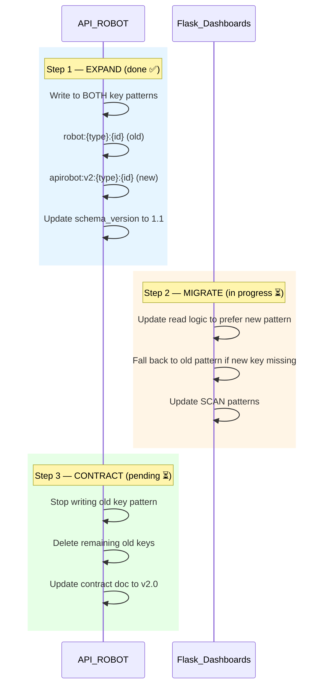

# Cross-Repo Change Plan: REDIS Key Pattern Migration

## METADATA

| Field | Value |
| --- | --- |
| Plan ID | redis_key_migration_2026Q2 |
| Created | 2026-04-17 |
| Author | SEACHAD |
| Federation | seachad-analytics |
| Coordination Type | sequential |
| Status | in_progress |

## 1. Change Summary

Migrate the REDIS key pattern from `robot:{entity_type}:{entity_id}` to `apirobot:v2:{entity_type}:{entity_id}` to support multi-service namespacing. A new service will share the same REDIS instance, and the current `robot:` prefix could collide.

## 2. Affected Repos

| Repo | Role in Change | Current Status |
| --- | --- | --- |
| api_robot | Provider — implements new key pattern | ✅ done (Step 1) |
| flask_dashboards | Consumer — migrates reads to new pattern | ⏳ in_progress (Step 2) |

## 3. Affected Contracts

| Contract ID | Impact |
| --- | --- |
| redis_entity_cache | Key pattern change (Section 5.3 — Requires Coordinated Change) |

## 4. Execution Order

### Step 1: API_ROBOT — Expand (✅ done)

- **Branch**: `feature/redis-v2-dual-write`
- **Changes**:
  - `src/cache/writer.py`: dual-write to old + new key patterns
  - `config/cache_ttl.yaml`: TTL applied to both key patterns
  - `tests/test_cache_writer.py`: tests for dual-write behavior
- **AECF skill used**: `aecf_new_feature` with `surface=data_integration`
- **Contract update**: `schema_version` bumped to `1.1` in value JSON
- **Deployed**: 2026-04-15

### Step 2: Flask_Dashboards — Migrate (⏳ in progress)

- **Branch**: `feature/redis-v2-read`
- **Changes**:
  - `app/services/cache_reader.py`: prefer new key pattern, fall back to old
  - `app/services/entity_scanner.py`: update SCAN patterns
  - `tests/test_cache_reader.py`: tests for both patterns + fallback
- **AECF skill used**: `aecf_new_feature` with `surface=dashboard_rendering`
- **Contract reference**: `AECF_CONTRACT_redis_entity_cache.md` Section 5.3
- **Expected deploy**: 2026-04-20

### Step 3: API_ROBOT — Contract (⏳ pending, blocked by Step 2)

- **Branch**: `feature/redis-v2-cleanup`
- **Changes**:
  - `src/cache/writer.py`: remove old key pattern writes
  - `scripts/cleanup_old_keys.py`: one-time script to delete old keys
  - `AECF_CONTRACT_redis_entity_cache.md`: update key pattern to v2, bump to `2.0`
- **AECF skill used**: `aecf_refactor` with `surface=data_integration`
- **Prerequisite**: Step 2 deployed and verified in production for ≥48h

## 5. Rollback Plan

| Step | Rollback Action |
| --- | --- |
| Step 1 | Revert dual-write, old keys continue working |
| Step 2 | Revert read migration, old keys still being written |
| Step 3 | Cannot easily rollback — only execute after Step 2 is stable |

## 6. Validation Criteria

- [ ] Step 1: Dual-write confirmed in staging and production (monitoring shows both key patterns)
- [ ] Step 2: Flask_Dashboards reads from new pattern in staging, SCAN returns correct results
- [ ] Step 2: Production deploy, 48h monitoring shows no cache-miss spike
- [ ] Step 3: Old keys cleaned up, monitoring confirms only new pattern in use
- [ ] Contract doc updated to v2.0 in both repos

## 7. Notes

- PowerBI is NOT affected — it does not consume REDIS directly.
- parser is NOT affected — it uses REST API, not REDIS.
- If Step 2 is delayed, dual-write overhead is minimal (2x REDIS writes, same data).
