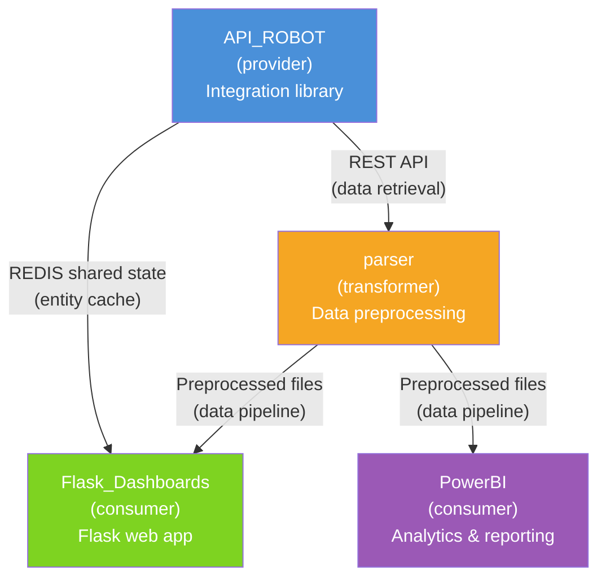

# Multi-Repo Federation — Worked Example

LAST_REVIEW: 2026-04-17
OWNER SEACHAD

---

## About This Example

This folder contains a fully instantiated example of the AECF multi-repo federation model, based on a real analytics ecosystem with four collaborating repositories.

The example demonstrates how to set up federation, define contract boundaries, resolve local paths, and coordinate a cross-repo change — all following the patterns described in [AECF_MULTI_REPO_SURFACES.md](../../guides/AECF_MULTI_REPO_SURFACES.md).

## Ecosystem Overview

| Repo | Role | Description |
| --- | --- | --- |
| **API_ROBOT** | provider | Integration library for fetching and generating processes. Owns the REDIS entity cache and exposes REST APIs. |
| **Flask_Dashboards** | consumer | Flask application for analysis dashboards. Consumes REDIS cache from API_ROBOT and preprocessed data from parser. |
| **parser** | transformer | Monolithic Python repo that preprocesses raw data into formats consumable by Flask_Dashboards and PowerBI. |
| **PowerBI** | consumer | Analytics project. Consumes data brought by API_ROBOT through parser's preprocessing pipeline. |

## Files In This Example

| File | What It Demonstrates |
| --- | --- |
| [AECF_FEDERATION.yaml](AECF_FEDERATION.yaml) | Federation manifest for the ecosystem |
| [AECF_CONTRACT_redis_entity_cache.md](AECF_CONTRACT_redis_entity_cache.md) | Contract boundary: REDIS shared state between API_ROBOT and Flask_Dashboards |
| [AECF_CONTRACT_preprocessed_data.md](AECF_CONTRACT_preprocessed_data.md) | Contract boundary: data pipeline from parser to Flask_Dashboards and PowerBI |
| [federation_paths.yaml](federation_paths.yaml) | Example developer-local path resolver (would be gitignored in practice) |
| [CROSS_REPO_CHANGE_PLAN_redis_migration.md](CROSS_REPO_CHANGE_PLAN_redis_migration.md) | Example cross-repo change plan for migrating REDIS key patterns |

## How To Use This Example

See the **Implementation Playbook** section in the [proposal guide](../../guides/AECF_MULTI_REPO_SURFACES.md#10-implementation-playbook) for step-by-step instructions on how to apply this model to your own multi-repo ecosystem.

Quick summary:

1. Copy `AECF_FEDERATION.yaml` into each participating repo at `.aecf/runtime/federation/`.
2. Create one `AECF_CONTRACT_<id>.md` per shared contract, place in `.aecf/documentation/contracts/`.
3. Each developer creates their own `federation_paths.yaml` at `.aecf/local/` (gitignored).
4. When a cross-repo change is needed, create a `CROSS_REPO_CHANGE_PLAN_<id>.md`.
5. Execute AECF skills in each repo sequentially, following the plan's execution order.
