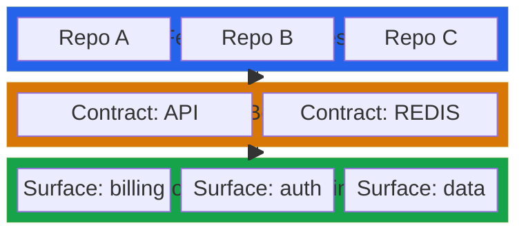
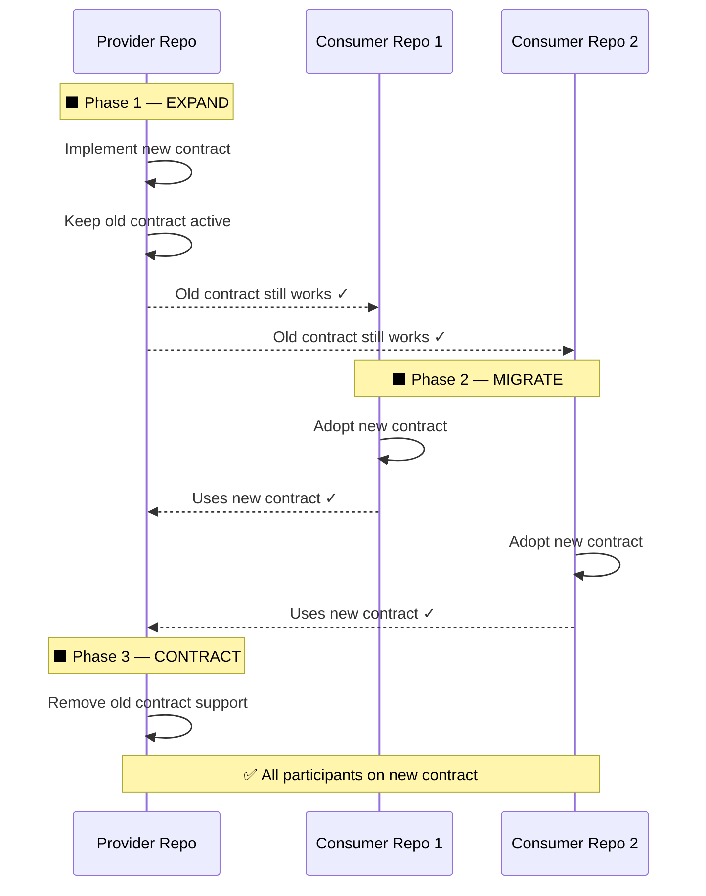
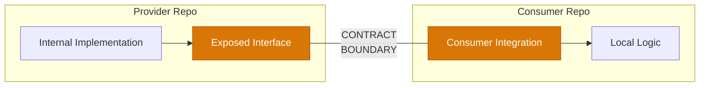
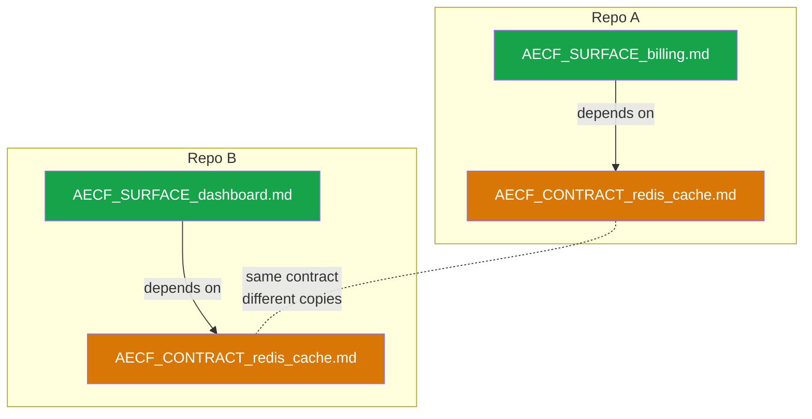
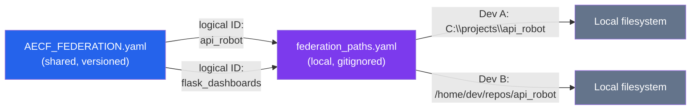
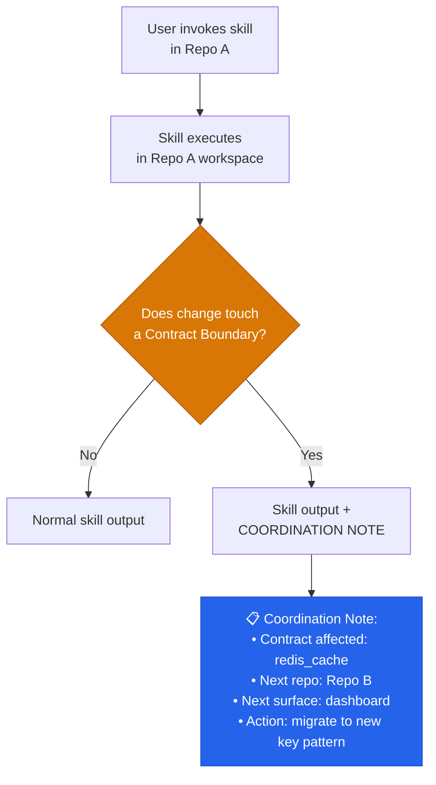
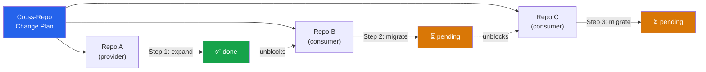
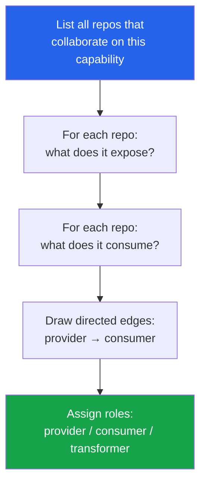
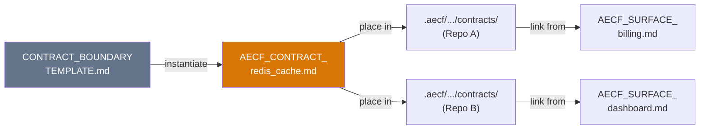
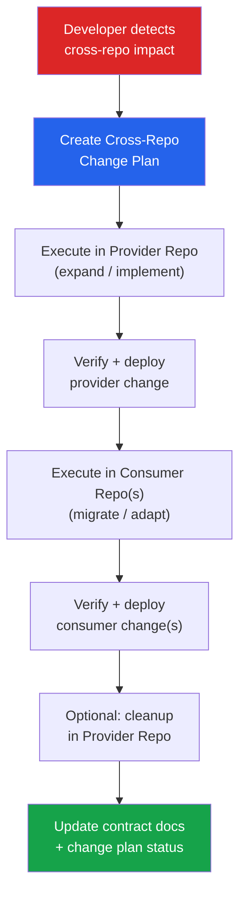

# AECF Multi-Repo Surfaces — Proposal

LAST_REVIEW: 2026-04-17
OWNER SEACHAD
STATUS: proposal

---

## 1. Motivation

The current AECF surface model is scoped to a single repository. All paths in `AECF_SURFACES_INDEX`, `AECF_SURFACE_<id>.md`, and `AECF_RUN_CONTEXT.json` are relative to one `<workspace_root>`.

This is sufficient when a system lives in a monorepo or when cross-repo dependencies are minimal. It is insufficient when:

1. Multiple repositories collaborate to deliver a single business capability.
2. A change in one repository requires coordinated changes in another.
3. Shared contracts (APIs, message schemas, shared state like REDIS, data pipelines) span repository boundaries.
4. Context about the external dependency is needed to make safe decisions in the local repository.

## 2. Scope of this proposal

This document introduces two new concepts on top of the existing single-repo surface model:

| Concept | Purpose | Scope |
| --- | --- | --- |
| **Contract Boundary** | Describes the explicit interface between two repos | One boundary per shared contract |
| **Federation Manifest** | Indexes all repos and their contract boundaries for a multi-repo ecosystem | One manifest per ecosystem |

Neither concept replaces or modifies the existing intra-repo surface model. They add a layer above it.



> The three layers are additive. Existing intra-repo surfaces remain unchanged. Contract Boundaries and Federation Manifests are optional layers for multi-repo ecosystems.

## 3. Core Principle: Plan Together, Execute Sequentially

When a change spans multiple repositories, the recommended AECF strategy is:

1. **Plan jointly**: produce a single Cross-Repo Change Plan that identifies all affected repos, surfaces, and contract boundaries.
2. **Execute per-repo**: run AECF skills in one repo at a time, in dependency order (providers before consumers).
3. **Track coordination**: use the Federation Manifest or a shared artifact to track per-repo status.

Atomic cross-repo changes (editing two repos simultaneously) are NOT recommended because:

- Each repo has its own CI, test suite, and deployment pipeline.
- Independent rollback is safer.
- The expand-contract pattern handles most breaking changes without requiring simultaneous deployment.

### 3.1 Expand-Contract Pattern

For changes that affect a shared contract (e.g., REDIS key schema), the recommended sequence is:

1. **Provider repo (expand)**: implement the new contract while keeping backward compatibility with the old one.
2. **Consumer repo(s) (migrate)**: adopt the new contract.
3. **Provider repo (contract)**: remove support for the old contract.



This ensures zero-downtime and independent repo release cycles.

### 3.2 When Atomic Coordination Is Unavoidable

In rare cases (irreconcilable breaking change, same-cluster simultaneous deploy), the plan must:

1. Mark the change as `coordination: atomic` in the Cross-Repo Change Plan.
2. Define a deployment window.
3. Require human sign-off before execution in each repo.

## 4. Contract Boundary

A **Contract Boundary** is a document that describes the interface between two or more repositories.



It is NOT a surface. It does not describe internal implementation. It describes:

1. What is exposed and what is consumed.
2. The protocol or mechanism (REST API, REDIS shared state, file-based data pipeline, shared library, message queue, etc.).
3. Invariants that both sides must respect.
4. Change policy (backward-compatible required, versioned schema, expand-contract, etc.).
5. Ownership — who is responsible for the contract.

### 4.1 Where Contract Boundaries Live

Each repo that participates in a contract boundary SHOULD have a local copy or reference:

```
.aecf/runtime/documentation/contracts/
  AECF_CONTRACT_<contract_id>.md
```

The contract document is shared by convention — both the provider and consumer repos should have a copy or a reference to the canonical version.

### 4.2 Relationship to Surfaces

A Contract Boundary connects to intra-repo surfaces through the `Dependencies and Integrations` section of `AECF_SURFACE_<id>.md`:



| Dependency | Type | Direction | Notes |
| --- | --- | --- | --- |
| `contract:redis_entity_cache` | external_contract | outbound | See `AECF_CONTRACT_redis_entity_cache.md` |

This way, when a skill loads a surface and sees an external contract dependency, it can optionally load the Contract Boundary document for cross-repo awareness.

### 4.3 Contract Boundary Template

See [CONTRACT_BOUNDARY_TEMPLATE.md](../templates/CONTRACT_BOUNDARY_TEMPLATE.md).

## 5. Federation Manifest

A **Federation Manifest** is a lightweight YAML file that indexes all repositories and contract boundaries in a multi-repo ecosystem.

### 5.1 Purpose

1. Map logical repo identifiers to canonical URLs (never to local paths).
2. List all contract boundaries and their participants.
3. Define roles (provider, consumer, transformer) for each repo.
4. Enable cross-repo change planning.

### 5.2 Where It Lives

The Federation Manifest can live:

- In a dedicated orchestration/meta repository.
- In each participating repo (with a convention to keep copies synchronized).
- In a shared documentation location.

Recommended path:

```
.aecf/runtime/federation/AECF_FEDERATION.yaml
```

### 5.3 Local Path Resolution

Because developers clone repos into different local paths, the manifest MUST NOT contain local filesystem paths.



Instead, each developer maintains a local, gitignored resolution file:

```
.aecf/local/federation_paths.yaml    # gitignored
```

This file maps logical repo identifiers to local absolute paths. AECF resolves cross-repo references through this indirection.

If a repo is not cloned locally, AECF treats it as "context unavailable" and works only with the Contract Boundary documentation.

### 5.4 Federation Manifest Template

See [FEDERATION_MANIFEST_TEMPLATE.yaml](../templates/FEDERATION_MANIFEST_TEMPLATE.yaml).

## 6. Impact on Existing AECF Concepts

### 6.1 Surface Discovery

No change. Surface discovery remains single-repo. It MAY additionally detect outbound contract boundaries by analyzing imports, connection strings, or shared library references.

### 6.2 Project Context Generator

The `external_integrations` section of `AECF_PROJECT_CONTEXT.md` MAY reference known contract boundaries.

### 6.3 RUN_CONTEXT Extension

`AECF_RUN_CONTEXT.json` MAY include an optional field:

```json
{
  "federation_context": {
    "federation_id": "seachad-analytics",
    "relevant_contracts": ["redis_entity_cache", "preprocessed_data"],
    "cross_repo_plan_ref": "path/to/CROSS_REPO_PLAN.md"
  }
}
```

### 6.4 Skill Execution

Skills operate in ONE repo at a time. If a skill detects that a change crosses a contract boundary, it SHOULD:

1. Emit a **coordination note** in its output.
2. Reference the Contract Boundary document.
3. Suggest the next repo and surface to work on.
4. NOT attempt to modify files outside the current workspace.



## 7. Cross-Repo Change Plan

When a change spans multiple repos, the recommended artifact is a **Cross-Repo Change Plan**:

| Section | Content |
| --- | --- |
| Change Summary | What is changing and why |
| Affected Repos | Logical repo IDs from the Federation Manifest |
| Affected Contracts | Which contract boundaries are impacted |
| Execution Order | Ordered list of per-repo steps (provider first, consumers second) |
| Per-Repo Plan Reference | Link to the AECF plan artifact in each repo |
| Coordination Type | `sequential` (default) or `atomic` |
| Status Tracker | Per-repo status: `pending` / `in_progress` / `done` / `blocked` |

This artifact is human-maintained and referenced from each repo's `AECF_RUN_CONTEXT.json`.



## 8. Summary of New Artifacts

| Artifact | Type | Location |
| --- | --- | --- |
| `AECF_CONTRACT_<id>.md` | Contract Boundary document | `.aecf/runtime/documentation/contracts/` |
| `AECF_FEDERATION.yaml` | Federation Manifest | `.aecf/runtime/federation/` |
| `federation_paths.yaml` | Local path resolver (gitignored) | `.aecf/local/` |
| Cross-Repo Change Plan | Coordination artifact | Human-chosen location |

## 9. Open Questions

1. Should the Federation Manifest be auto-discoverable or always manually created?
2. Should AECF enforce contract boundary validation (provider schema vs consumer expectations)?
3. Should there be a dedicated skill for cross-repo change planning, or is it a mode of existing skills like `aecf_new_feature`?
4. How should contract boundary versioning interact with existing surface versioning?

## 10. Implementation Playbook

This section provides a step-by-step guide for applying the multi-repo federation model in a real client scenario.

> **Worked example**: see [examples/multi_repo_federation/](../examples/multi_repo_federation/) for a fully instantiated example based on a real four-repo analytics ecosystem.

### 10.1 Prerequisites

Before starting, ensure:

1. Each participating repo already has (or will create) an `AECF_PROJECT_CONTEXT.md`.
2. You know which repos collaborate and what they share (APIs, caches, data files, libraries).
3. You have write access to each participating repo.

### 10.2 Step 1 — Map the Ecosystem

Draw the dependency graph of your repos. Identify:

- Which repos are **providers** (expose interfaces others depend on).
- Which repos are **consumers** (depend on interfaces from providers).
- Which repos are **transformers** (consume from one side, produce for another).



**Deliverable**: A mental or documented map of repos and their roles. No AECF artifact yet.

### 10.3 Step 2 — Create the Federation Manifest

Use the [FEDERATION_MANIFEST_TEMPLATE.yaml](../templates/FEDERATION_MANIFEST_TEMPLATE.yaml) to create an `AECF_FEDERATION.yaml`.

1. Copy the template to `.aecf/runtime/federation/AECF_FEDERATION.yaml` in one repo (the "coordination repo").
2. Fill in the `federation` name, `repos` section (logical IDs + canonical URLs + roles), and `contracts` section (one entry per shared contract).
3. For each contract, note the `change_policy` — this determines how future changes will be coordinated.
4. Copy the same file to each participating repo, or agree on a single canonical location.

**Deliverable**: `AECF_FEDERATION.yaml` committed in each participating repo.

### 10.4 Step 3 — Document Contract Boundaries

For each contract listed in the Federation Manifest:

1. Copy [CONTRACT_BOUNDARY_TEMPLATE.md](../templates/CONTRACT_BOUNDARY_TEMPLATE.md) to `.aecf/runtime/documentation/contracts/AECF_CONTRACT_<contract_id>.md`.
2. Fill in: participants, protocol/mechanism, exposed interface, consumer expectations, invariants, change rules, and versioning.
3. Place the document in **both** the provider and consumer repos (or agree on a canonical copy and reference).
4. Link the contract from the relevant `AECF_SURFACE_<id>.md` in each repo's `Dependencies and Integrations` section.



**Deliverable**: One `AECF_CONTRACT_<id>.md` per shared contract, committed in relevant repos.

### 10.5 Step 4 — Set Up Local Path Resolution

Each developer on the team:

1. Creates `.aecf/local/federation_paths.yaml` in their local clone.
2. Maps each logical repo ID to their local absolute path.
3. Ensures `.aecf/local/` is in `.gitignore`.

If a developer does not have a repo cloned locally, they simply omit it — AECF will work with contract documentation only for that repo.

**Deliverable**: Each developer has a working `federation_paths.yaml` (gitignored).

### 10.6 Step 5 — Use Federation in Day-to-Day Work

**Normal single-repo work** (no change needed):

- Continue using AECF skills as usual. The federation artifacts are passive context.
- When a surface's `Dependencies and Integrations` references a contract boundary, the developer has extra awareness of cross-repo impact.

**Cross-repo change detected**:

1. Create a `CROSS_REPO_CHANGE_PLAN_<id>.md` (no formal template required — see the [example](../examples/multi_repo_federation/CROSS_REPO_CHANGE_PLAN_redis_migration.md) for recommended structure).
2. List affected repos, contracts, execution order, and coordination type.
3. Execute AECF skills in each repo **sequentially**, in the order defined by the plan.
4. After each repo step, update the status in the change plan.
5. Once all steps are done, update the contract boundary document if the interface changed.



### 10.7 Checklist Summary

| # | Action | When | Artifact |
| --- | --- | --- | --- |
| 1 | Map ecosystem repos and roles | Once per ecosystem | (informal) |
| 2 | Create Federation Manifest | Once per ecosystem | `AECF_FEDERATION.yaml` |
| 3 | Document each contract boundary | Once per shared contract | `AECF_CONTRACT_<id>.md` |
| 4 | Set up local path resolution | Once per developer | `federation_paths.yaml` |
| 5a | Normal work: read contract context | Ongoing | — |
| 5b | Cross-repo change: create change plan | Per cross-repo change | `CROSS_REPO_CHANGE_PLAN_<id>.md` |
| 5c | Execute per-repo, update plan status | Per change step | AECF skill outputs |
| 5d | Update contract docs after interface change | After coordinated change | Updated `AECF_CONTRACT_<id>.md` |

## 11. References

- [AECF_SURFACE_CONTEXT_MODEL.md](AECF_SURFACE_CONTEXT_MODEL.md) — current single-repo surface model
- [AECF_SKILL_SURFACE_CONTRACT.md](AECF_SKILL_SURFACE_CONTRACT.md) — skill consumption contract for surfaces
- [AECF_RUN_CONTEXT_CONTRACT.md](AECF_RUN_CONTEXT_CONTRACT.md) — runtime context contract
- [CONTRACT_BOUNDARY_TEMPLATE.md](../templates/CONTRACT_BOUNDARY_TEMPLATE.md) — template for contract boundaries
- [FEDERATION_MANIFEST_TEMPLATE.yaml](../templates/FEDERATION_MANIFEST_TEMPLATE.yaml) — template for federation manifests
- [FEDERATION_LOCAL_PATHS_TEMPLATE.yaml](../templates/FEDERATION_LOCAL_PATHS_TEMPLATE.yaml) — template for developer-local path resolution
- [examples/multi_repo_federation/](../examples/multi_repo_federation/) — worked example with real four-repo analytics ecosystem
