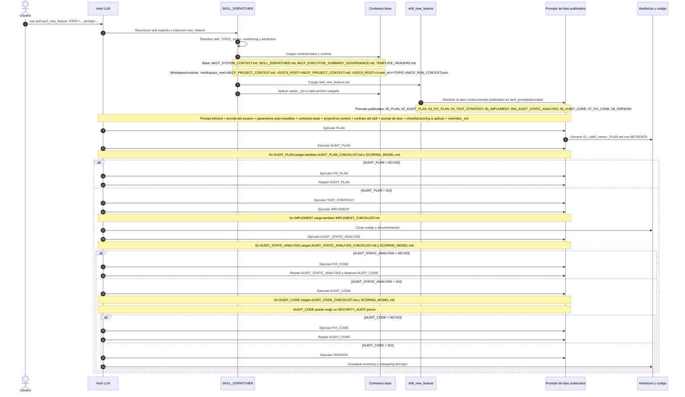

# AECF New Feature Sequence

LAST_REVIEW: 2026-04-15
OWNER SEACHAD

---

## 1. Objetivo

Explicar que ocurre cuando un host LLM ejecuta el skill `aecf_new_feature` desde `aecf_prompts/`, con foco en dos cosas:

1. la secuencia de acciones obligatorias,
2. el orden real de enriquecimiento del prompt antes de cada fase.

Esta guia describe el modo prompt-only tomando como referencia el contrato canonico del dispatcher en `aecf_prompts/SKILL_DISPATCHER.md` y el skill visible en `aecf_prompts/skills/skill_new_feature.md`.

---

## 2. Punto de entrada

La invocacion minima esperada es una de estas formas:

```text
use skill aecf_new_feature TOPIC: report_export prompt: implementar exportacion PDF y CSV
skill: new_feature implementar exportacion PDF y CSV
implementa una nueva feature para exportar reportes
```

El dispatcher reconoce la intencion, normaliza el skill a `aecf_new_feature` y resuelve automaticamente `TOPIC`, alcance, numeracion y atribucion cuando el usuario no lo da todo de forma explicita.

---

## 3. Secuencia Mermaid recalculada



---

## 4. Orden de enriquecimiento del prompt

Antes de ejecutar cada fase, el prompt no se usa "en crudo". Se enriquece en este orden operativo:

| Orden | Capa | Que aporta |
| --- | --- | --- |
| 1 | Prompt del usuario | La necesidad funcional inicial y, si existe, `TOPIC`, `surface`, restricciones o acceptance criteria. |
| 2 | Resolucion automatica del dispatcher | Skill canonico, `TOPIC`, `scope`, numeracion, output root y atribucion activa. |
| 3 | `AECF_SYSTEM_CONTEXT.md` | Reglas globales AECF, contexto obligatorio, governance base, reglas de metadatos y protocolo `_ext`. |
| 4 | `AECF_PROJECT_CONTEXT.md` | Overrides del proyecto, stack, arquitectura, restricciones y puntos calientes del repo. |
| 5 | `AECF_EXECUTIVE_SUMMARY_GOVERNANCE.md` | Reglas de gobernanza que no pueden saltarse durante la ejecucion. |
| 6 | `TEMPLATE_HEADERS.md` | Estructura obligatoria del bloque `## METADATA` para todos los artefactos. |
| 7 | `skill_new_feature.md` | Fases, gates, loops, rutas de salida y expectativas de implementacion. |
| 8 | Prompt de fase publicado | Instruccion concreta de la fase activa en `aecf_prompts/prompts/`. |
| 9 | Checklist y scoring de la fase | Solo en fases de auditoria e implementacion donde el prompt lo exija. |
| 10 | Capas `_ext` hermanas | Overrides locales de cualquiera de los archivos anteriores, aplicados justo despues del archivo base. |

Formula resumida del prompt efectivo de una fase:

```text
prompt_efectivo_fase_n =
  prompt_usuario
  + parametros_resueltos
  + system_context
  + project_context
  + governance
  + metadata_standard
  + contrato_skill
    + prompt_de_fase
    + checklist_y_scoring_si_aplican
  + overrides_ext
```

---

## 5. Cascada real de archivos llamados

### 5.1 Capa base siempre cargada

1. `aecf_prompts/AECF_SYSTEM_CONTEXT.md`
2. `aecf_prompts/SKILL_DISPATCHER.md`
3. `aecf_prompts/_governance/AECF_EXECUTIVE_SUMMARY_GOVERNANCE.md`
4. `aecf_prompts/templates/TEMPLATE_HEADERS.md`
5. `aecf_prompts/skills/skill_new_feature.md`

### 5.2 Contexto y runtime del workspace cliente

1. `<workspace_root>/AECF_PROJECT_CONTEXT.md` si existe en la raiz del proyecto cliente.
2. `<DOCS_ROOT>/AECF_PROJECT_CONTEXT.md` como contexto humano legible consolidado para prompt-only.
3. `<DOCS_ROOT>/<user_id>/<TOPIC>/AECF_RUN_CONTEXT.json` si ya existe para congelar idioma, atribucion y contexto operativo.
4. Los artefactos previos del mismo TOPIC a medida que el flujo avanza.

### 5.3 Prompts de fase realmente publicados hoy en `aecf_prompts/prompts/`

1. `00_PLAN.md`
2. `02_AUDIT_PLAN.md`
3. `03_FIX_PLAN.md`
4. `04_TEST_STRATEGY.md`
5. `05_IMPLEMENT.md`
6. `05A_AUDIT_STATIC_ANALYSIS.md`
7. `06_AUDIT_CODE.md`
8. `07_FIX_CODE.md`
9. `08_VERSION.md`

### 5.4 Checklists y scoring realmente llamados por esos prompts

1. `aecf_prompts/checklists/AUDIT_PLAN_CHECKLIST.md`
2. `aecf_prompts/checklists/IMPLEMENT_CHECKLIST.md`
3. `aecf_prompts/checklists/AUDIT_STATIC_ANALYSIS_CHECKLIST.md`
4. `aecf_prompts/checklists/AUDIT_CODE_CHECKLIST.md`
5. `aecf_prompts/scoring/SCORING_MODEL.md`

### 5.5 Assets complementarios esperados por el flujo

1. `aecf_prompts/code/CODE_FUNCTION_METADATA_STANDARD.md`
2. `package.json`, `pyproject.toml` o equivalente en la raiz del repo cliente para `VERSION`.
3. `CHANGELOG.md` del repo cliente si existe.
4. Un artefacto `SECURITY_AUDIT` previo del mismo TOPIC cuando `AUDIT_CODE` determine que el escalado a `aecf_security_review` es obligatorio.
5. Un external skill local en `<workspace>/.agents/skills/<name>/SKILL.md` solo si el usuario pasa `external_skills=`.

### 5.6 Estado actual de `_ext`

El contrato obliga a cargar overlays `_ext` hermanos cuando existan, pero en el bundle `aecf_prompts` actual no hay archivos `*_ext.md` publicados para esta cadena de `new_feature`.

---

## 6. Secuencia de acciones que realmente gobierna la ejecucion

Hay dos niveles que conviene distinguir:

### 6.1 Contrato determinista

El bloque `PHASE_DEFINITION` del skill es la fuente de verdad para la secuencia controlada:

1. `PLAN`
2. `AUDIT_PLAN`
3. `FIX_PLAN` si hay `NO-GO`
4. `TEST_STRATEGY`
5. `IMPLEMENT`
6. `AUDIT_STATIC_ANALYSIS`
7. `FIX_CODE` si hay `NO-GO`
8. `AUDIT_IMPLEMENT`
9. `FIX_CODE` y re-auditoria si hay `NO-GO`

Las reglas de gate mas importantes son:

1. no hay codigo antes de `AUDIT_PLAN = GO`,
2. `IMPLEMENT` queda bloqueado hasta que el ultimo `AUDIT_PLAN` sea `GO`,
3. el codigo no se considera terminado hasta que `AUDIT_IMPLEMENT` sea `GO`,
4. cada artefacto debe incluir `## METADATA` valido antes de pasar a la siguiente fase.

### 6.2 Traduccion efectiva a prompts publicados

En el bundle prompt-only publicado, ese contrato determinista se materializa hoy con esta equivalencia:

1. `PLAN` -> `aecf_prompts/prompts/00_PLAN.md`
2. `AUDIT_PLAN` -> `aecf_prompts/prompts/02_AUDIT_PLAN.md`
3. `FIX_PLAN` -> `aecf_prompts/prompts/03_FIX_PLAN.md`
4. `TEST_STRATEGY` -> `aecf_prompts/prompts/04_TEST_STRATEGY.md`
5. `IMPLEMENT` -> `aecf_prompts/prompts/05_IMPLEMENT.md`
6. `AUDIT_STATIC_ANALYSIS` -> `aecf_prompts/prompts/05A_AUDIT_STATIC_ANALYSIS.md`
7. `AUDIT_IMPLEMENT` -> `aecf_prompts/prompts/06_AUDIT_CODE.md`
8. `FIX_CODE` -> `aecf_prompts/prompts/07_FIX_CODE.md`
9. cierre de version -> `aecf_prompts/prompts/08_VERSION.md`

### 6.3 Narrativa ampliada del skill prompt-only

El propio archivo `aecf_prompts/skills/skill_new_feature.md` tambien describe una vista mas amplia del flujo manual esperado. Esa narrativa añade pasos visibles para:

1. `TEST_IMPLEMENTATION`,
2. `AUDIT_TESTS`,
3. `VERSION_MANAGEMENT`.

La lectura correcta es esta:

1. el bloque `PHASE_DEFINITION` define el esqueleto determinista que gobierna el flujo,
2. la narrativa ampliada explica artefactos manuales adicionales heredados, pero esos prompts extra no estan publicados hoy como archivos independientes en `aecf_prompts/prompts/`.
3. por tanto, el flujo ejecutable real del bundle prompt-only es el de 9 prompts publicados, no el de 11 pasos narrados en el skill.

---

## 7. Que queda dentro del repo o del workspace cliente

### 7.1 Dentro del repo o bundle `aecf_prompts`

Las dependencias base del skill estan dentro del propio bundle/repo:

1. system context,
2. dispatcher,
3. governance,
4. templates,
5. prompts publicados,
6. checklists,
7. scoring,
8. code metadata standard.

### 7.2 Dentro del workspace cliente por contrato normal

Las dependencias runtime esperadas viven dentro del proyecto cliente donde se usa el bundle:

1. `<workspace_root>/AECF_PROJECT_CONTEXT.md` si existe,
2. `<workspace>/.aecf/runtime/documentation/` cuando no se sobrescribe `DOCS_ROOT`,
3. `<DOCS_ROOT>/AECF_PROJECT_CONTEXT.md`,
4. `<DOCS_ROOT>/<user_id>/<TOPIC>/AECF_RUN_CONTEXT.json`,
5. artefactos del TOPIC bajo `<DOCS_ROOT>/<user_id>/<TOPIC>/`,
6. archivos de version del proyecto como `package.json`, `pyproject.toml` y `CHANGELOG.md` en la raiz del repo cliente.

### 7.3 Casos configurables u opcionales que pueden salir del workspace

1. `DOCS_ROOT` puede apuntar fuera del workspace si el usuario define `AECF_PROMPTS_DOCUMENTATION_PATH` o el alias legado `AECF_PROMPTS_DIRECTORY_PATH` con una ruta externa.
2. `external_skills=` puede hacer que el flujo espere un `SKILL.md` local bajo `<workspace>/.agents/skills/...`, que sigue siendo workspace cliente, no repo AECF base.

### 7.4 Lo que no he encontrado como dependencia obligatoria del skill

1. No hay rutas absolutas obligatorias tipo `C:\...` en la cascada ejecutable de `new_feature`.
2. No hay necesidad obligatoria de leer archivos fuera del repo AECF o fuera del workspace cliente por defecto.
3. No hay overlays `_ext` publicados hoy para esta cadena, aunque el contrato los aceptaria si el cliente los añade localmente.

---

## 8. Incoherencias detectadas al recalcular la cascada

1. `skill_new_feature.md` sigue nombrando prompts no publicados en el bundle prompt-only: `08_TEST_STRATEGY.md`, `09_TEST_IMPLEMENTATION.md`, `10_AUDIT_TESTS.md` y `07_VERSION_MANAGEMENT.md`.
2. El skill mezcla el contrato determinista con una narrativa ampliada de pasos que ya no corresponde uno a uno a los archivos publicados.
3. El skill declara rutas erróneas con doble prefijo `aecf_prompts/aecf_prompts/documentation/...` para inventory y changelog.
4. Parte del system context todavia habla de `CHANGELOG.md` en la raiz del workspace, mientras el contrato prompt-only actual concentra la traza operativa en `AECF_CHANGELOG.md` bajo `<DOCS_ROOT>/<user_id>/`.

---

## 9. Salidas esperadas en modo prompt-only

En el contrato prompt-only actual, el skill espera escribir en esta raiz efectiva:

```text
<DOCS_ROOT>/<user_id>/<TOPIC>/
```

Por defecto, `DOCS_ROOT` cae en:

```text
<workspace>/.aecf/runtime/documentation/
```

A partir de ahi, cada fase genera un markdown del estilo `NN_<skill_name>_<PHASE>.md`, y al finalizar se actualizan ademas:

1. `<DOCS_ROOT>/<user_id>/AECF_TOPICS_INVENTORY.json`,
2. `<DOCS_ROOT>/<user_id>/AECF_TOPICS_INVENTORY.md`,
3. `<DOCS_ROOT>/<user_id>/AECF_CHANGELOG.md`.

---

## 10. Resumen operativo corto

Cuando llamas a `aecf_new_feature` en `aecf_prompts`, no estas lanzando solo un prompt aislado. Estas activando un pipeline con estas propiedades:

1. reconocimiento automatico de skill e intencion,
2. resolucion automatica de parametros operativos,
3. carga jerarquica de contexto y governance,
4. enriquecimiento del prompt de cada fase con contratos y metadata,
5. ejecucion por fases con gates `GO/NO-GO`,
6. generacion obligatoria de artefactos trazables en disco.

---

## 11. Fuentes usadas

1. `aecf_prompts/SKILL_DISPATCHER.md`
2. `aecf_prompts/AECF_SYSTEM_CONTEXT.md`
3. `aecf_prompts/skills/skill_new_feature.md`
4. `aecf_prompts/prompts/00_PLAN.md` a `aecf_prompts/prompts/08_VERSION.md`
