# AECF Skills — Catalog by Use Category


> Quick guide to know **which skill to use** depending on the situation.
> Each skill is classified by its main purpose.

---
LAST_REVIEW: 2026-04-17

---

## Visual Summary

```mermaid
%%{init: {'theme': 'dark'}}%%
flowchart LR

    ROOT((AECF Skills))
    ROOT --> BS[Bootstrap y Setup]
    ROOT --> DD[Daily Development]
    ROOT --> TR[Traceability and Replay]
    ROOT --> AQ[Audit and Quality]
    ROOT --> DC[Documentation and Understanding]
    ROOT --> GR[Governance and Release]
    ROOT --> PR[Productivity]
    ROOT --> EX[Explorators]

    DD --> F1(aecf_new_feature)
    DD --> F26(aecf_new_test_set)
    DD --> F2(aecf_hotfix)
    DD --> F3(aecf_refactor)

    TR --> F5(aecf_system_replayability_adaptive)

    AQ --> F6(aecf_code_standards_audit)
    AQ --> F7(aecf_security_review)
    AQ --> F29(aecf_security_review_gdpr)
    AQ --> F30(aecf_security_review_eu_ai_act)
    AQ --> F31(aecf_security_review_dora)
    AQ --> F8(aecf_dependency_audit)
    AQ --> F9(aecf_tech_debt_assessment)
    AQ --> F32(aecf_coupling_assessment)
    AQ --> F34(aecf_resolve_linting)

    DC --> F10(aecf_document_legacy)
    DC --> F11(aecf_explain_behavior)

    GR --> F12(aecf_maturity_assessment)
    GR --> F13(aecf_release_readiness)
    GR --> F14(aecf_executive_summary)
    GR --> F16(aecf_data_governance_audit)
    GR --> F17(aecf_model_governance_audit)
    GR --> F18(aecf_ai_risk_assessment)
    GR --> F19(aecf_define_impact_metrics)
    GR --> F35(aecf_application_lifecycle)
    PR --> F33(aecf_productivity)

    EX --> F4(aecf_data_strategy)
    EX --> F20(aecf_data_classification)

    BS --> F15(aecf_project_context_generator)
    BS --> F21(aecf_document_context_ingestion)
    BS --> F25(aecf_new_project)
    BS --> F27(aecf_codebase_intelligence)
    BS --> F28(aecf_set_stack)
    BS --> F36(aecf_surface_discovery)    

    style ROOT fill:#5B9BD5,stroke:#3A7CC0,stroke-width:3px,color:#fff
    style DD fill:#70AD47,stroke:#548235,stroke-width:2px,color:#fff
    style TR fill:#4ECDC4,stroke:#36B0A8,stroke-width:2px,color:#fff
    style AQ fill:#ED7D5B,stroke:#D35F3C,stroke-width:2px,color:#fff
    style DC fill:#A78BDB,stroke:#8B6FC0,stroke-width:2px,color:#fff
    style GR fill:#F4C748,stroke:#D4A828,stroke-width:2px,color:#1a1a1a
    style PR fill:#7CB342,stroke:#558B2F,stroke-width:2px,color:#fff
    style BS fill:#00BCD4,stroke:#00838F,stroke-width:2px,color:#fff
    style EX fill:#C45AB3,stroke:#9B3A8A,stroke-width:2px,color:#fff

    style F1 fill:#3B5E2E,stroke:#70AD47,color:#C6EFBE
    style F26 fill:#3B5E2E,stroke:#70AD47,color:#C6EFBE
    style F2 fill:#3B5E2E,stroke:#70AD47,color:#C6EFBE
    style F3 fill:#3B5E2E,stroke:#70AD47,color:#C6EFBE
    style F4 fill:#4A1E47,stroke:#C45AB3,color:#F0C8EC
    style F5 fill:#1E4D49,stroke:#4ECDC4,color:#B2F0EC
    style F6 fill:#5C3225,stroke:#ED7D5B,color:#FACEBE
    style F7 fill:#5C3225,stroke:#ED7D5B,color:#FACEBE
    style F29 fill:#5C3225,stroke:#ED7D5B,color:#FACEBE
    style F30 fill:#5C3225,stroke:#ED7D5B,color:#FACEBE
    style F31 fill:#5C3225,stroke:#ED7D5B,color:#FACEBE
    style F8 fill:#5C3225,stroke:#ED7D5B,color:#FACEBE
    style F9 fill:#5C3225,stroke:#ED7D5B,color:#FACEBE
    style F32 fill:#5C3225,stroke:#ED7D5B,color:#FACEBE
    style F34 fill:#5C3225,stroke:#ED7D5B,color:#FACEBE
    style F10 fill:#3D2D5C,stroke:#A78BDB,color:#D8C8F0
    style F11 fill:#3D2D5C,stroke:#A78BDB,color:#D8C8F0
    style F12 fill:#5C4A15,stroke:#F4C748,color:#FBE9A8
    style F13 fill:#5C4A15,stroke:#F4C748,color:#FBE9A8
    style F14 fill:#5C4A15,stroke:#F4C748,color:#FBE9A8
    style F15 fill:#004D40,stroke:#00BCD4,color:#B2EBF2
    style F16 fill:#5C4A15,stroke:#F4C748,color:#FBE9A8
    style F17 fill:#5C4A15,stroke:#F4C748,color:#FBE9A8
    style F18 fill:#5C4A15,stroke:#F4C748,color:#FBE9A8
    style F19 fill:#5C4A15,stroke:#F4C748,color:#FBE9A8
    style F35 fill:#5C4A15,stroke:#F4C748,color:#FBE9A8
    style F33 fill:#36531F,stroke:#7CB342,color:#E6F4C7
    style F20 fill:#4A1E47,stroke:#C45AB3,color:#F0C8EC
    style F21 fill:#004D40,stroke:#00BCD4,color:#B2EBF2
    style F25 fill:#004D40,stroke:#00BCD4,color:#B2EBF2
    style F27 fill:#004D40,stroke:#00BCD4,color:#B2EBF2
    style F28 fill:#004D40,stroke:#00BCD4,color:#B2EBF2
    style F36 fill:#004D40,stroke:#00BCD4,color:#B2EBF2    

```



| Category | Skills |
|:---------:|:-------|
| 🔧 **Desarrollo Diario** | `aecf_new_feature` · `aecf_new_test_set` · `aecf_hotfix` · `aecf_refactor` |
| 🔄 **Trazabilidad y Replay** | `aecf_system_replayability_adaptive` |
| 🔍 **Audit and Quality** | `aecf_code_standards_audit` · `aecf_security_review` · `aecf_security_review_gdpr` · `aecf_security_review_eu_ai_act` · `aecf_security_review_dora` · `aecf_dependency_audit` · `aecf_tech_debt_assessment` · `aecf_coupling_assessment` · `aecf_resolve_linting` |
| 📚 **Documentation and Understanding** | `aecf_document_legacy` · `aecf_explain_behavior` |
| 🏛️ **Governance and Release** | `aecf_maturity_assessment` · `aecf_release_readiness` · `aecf_executive_summary` · `aecf_data_governance_audit` · `aecf_model_governance_audit` · `aecf_ai_risk_assessment` · `aecf_define_impact_metrics` · `aecf_application_lifecycle` |
| ⚡ **Productivity** | `aecf_productivity` |
| 🚀 **Bootstrap y Setup** | `aecf_project_context_generator` · `aecf_document_context_ingestion` (hidden) · `aecf_new_project` · `aecf_codebase_intelligence` · `aecf_set_stack` · `aecf_surface_discovery` |
| 🔬 **Explorators** | `aecf_data_classification` · `aecf_data_strategy` |

---

## AECF Skill Taxonomy

- **TIER1 — ENTERPRISE_DETERMINISTIC**: formal audits with scoring/severity/decision outputs for compliance and contractual evidence; deterministic pipeline required.
- **TIER2 — STRUCTURED_ANALYSIS**: structured analysis and comparable reporting without contractual scoring requirements; deterministic scoring engine not required.
- **TIER3 — GENERATIVE**: implementation-oriented skills that generate or modify code/artifacts; formal scoring is not required.

### Mandatory Prompt Ingress Taxonomy

AECF MUST not allow a governed skill to underperform a normal chat prompt simply because the skill enters an overly rigid phase too early.

Every skill that accepts or depends on a user prompt MUST declare one canonical ingress mode and MUST be documented in the routing matrix below.

Canonical ingress modes:

- **INTAKE_FIRST**: the first governed step validates required business or project parameters before design or execution.
- **DISCOVERY_FIRST**: the first governed step performs repository exploration and freezes a `WORKING_CONTEXT`-style evidence artifact before the final analysis or synthesis phase.
- **RESOLVE_TO_PLAN**: the first step is a permissive, read-only prompt-resolution pass that interprets the user request with enriched context and emits a short canonical brief that hands off into `PLAN`.
- **RESOLVE_TO_FINAL**: the first step is a permissive, read-only prompt-resolution pass that interprets the user request with enriched context and emits a short canonical brief that hands off into the skill terminal phase.
- **DIRECT_FINAL**: the skill itself is already a governed context/bootstrap/intelligence phase and can enter its skill terminal phase directly.

Mandatory ingress rules:

1. If a skill can generate or modify code, it MUST end its ingress in `PLAN`; it MUST NOT go directly from user prompt to a governed skill terminal phase.
2. If a skill is read-only and depends on understanding the repository, it MUST use `DISCOVERY_FIRST` or `RESOLVE_TO_FINAL`; it MUST NOT synthesize the final artifact from the raw user prompt alone.
3. If a skill requires mandatory business or project parameters before work can be designed, it MUST use `INTAKE_FIRST`.
4. Any permissive ingress step remains inside AECF governance: it is read-only, prompt-sanitized, scope-bounded, and MUST emit a compact canonical handoff artifact.
5. The ingress step MUST NOT complete the skill's final business output. Its only job is to classify intent, resolve scope, freeze evidence when needed, and route deterministically into `PLAN` or the governed skill terminal phase.

### Skill Routing Matrix

| Skill | Tier | Ingress Mode | Canonical Handoff Artifact | Governed Destination | Notes |
|-------|------|--------------|----------------------------|----------------------|-------|
| `aecf_new_feature` | TIER3 | `RESOLVE_TO_PLAN` | `INTENT_BRIEF` | `PLAN` | New code generation must be routed into the full planning flow. |
| `aecf_new_feature_ma` | TIER3 | `RESOLVE_TO_PLAN` | `INTENT_BRIEF` | `PLAN` | Same as `aecf_new_feature`, with multi-agent downstream flow. |
| `aecf_hotfix` | TIER3 | `RESOLVE_TO_PLAN` | `INCIDENT_BRIEF` | `PLAN` | Urgency changes depth, not the need for governed planning. |
| `aecf_refactor` | TIER3 | `DISCOVERY_FIRST` | `REFACTOR_SCOPE` | `PLAN` | Must delimit upstream files/problems before refactor planning. |
| `aecf_new_test_set` | TIER3 | `DISCOVERY_FIRST` | `TEST_SCOPE` | `PLAN` | Test creation needs evidence of modules, tests, and runnable commands before planning; `execute=True` pre-approves the post-strategy implementation/report path. |
| `aecf_system_replayability_adaptive` | TIER3 | `DISCOVERY_FIRST` | `ARCHITECTURE_SCOPE` | `PLAN` | Replayability design depends on architecture discovery first. |
| `aecf_new_project` | TIER3 | `INTAKE_FIRST` | `INTAKE_CONTRACT` | `PLAN` | Mandatory project parameters must be resolved before planning. |
| `aecf_document_legacy` | TIER2 | `RESOLVE_TO_FINAL` (default) / `RESOLVE_TO_PLAN` (`document_code=True`) | `DOCUMENT_SCOPE` | `SKILL_FINAL` (default) / `PLAN` (`document_code=True`) | Default mode stays read-only and lands in `AECF_DOCUMENT_LEGACY`; `document_code=True` routes through governed planning to allow documentation-only edits in code and docs. |
| `aecf_explain_behavior` | TIER1 | `DISCOVERY_FIRST` | `WORKING_CONTEXT` | `SKILL_FINAL` | Behavioral explanation must start from IDE-discovered evidence and land in `AECF_EXPLAIN_BEHAVIOR`, not a legacy generic final phase. |
| `aecf_code_standards_audit` | TIER1 | `DISCOVERY_FIRST` | `WORKING_CONTEXT` | `SKILL_FINAL` | Search-first audit that lands in `AECF_CODE_STANDARDS_AUDIT`. |
| `aecf_security_review` | TIER1 | `DISCOVERY_FIRST` | `WORKING_CONTEXT` | `SKILL_FINAL` | Search-first security audit that lands in `AECF_SECURITY_REVIEW`. |
| `aecf_security_review_gdpr` | TIER1 | `DISCOVERY_FIRST` | `WORKING_CONTEXT` | `SKILL_FINAL` | Search-first regulatory audit that lands in `AECF_SECURITY_REVIEW_GDPR`. |
| `aecf_security_review_eu_ai_act` | TIER1 | `DISCOVERY_FIRST` | `WORKING_CONTEXT` | `SKILL_FINAL` | Search-first regulatory audit that lands in `AECF_SECURITY_REVIEW_EU_AI_ACT`. |
| `aecf_security_review_dora` | TIER1 | `DISCOVERY_FIRST` | `WORKING_CONTEXT` | `SKILL_FINAL` | Search-first regulatory audit that lands in `AECF_SECURITY_REVIEW_DORA`. |
| `aecf_dependency_audit` | TIER1 | `DISCOVERY_FIRST` | `WORKING_CONTEXT` | `SKILL_FINAL` | Needs package/config evidence before the `AECF_DEPENDENCY_AUDIT` terminal phase. |
| `aecf_tech_debt_assessment` | TIER1 | `DISCOVERY_FIRST` | `WORKING_CONTEXT` | `SKILL_FINAL` | Search-first debt assessment that lands in `AECF_TECH_DEBT_ASSESSMENT`. |
| `aecf_coupling_assessment` | TIER1 | `DISCOVERY_FIRST` | `COUPLING_SCOPE` | `SKILL_FINAL` | Search-first coupling audit that lands in `AECF_COUPLING_ASSESSMENT` and routes remediation into `aecf_new_test_set` and `aecf_refactor`. |
| `aecf_resolve_linting` | TIER2 | `RESOLVE_TO_FINAL` | `LINTING_SCOPE` | `SKILL_FINAL` | Resolves the deterministic `static_analysis_profile` and `static_analysis_matrix` into a reusable read-only quality contract before planning or implementation. |
| `aecf_maturity_assessment` | TIER1 | `DISCOVERY_FIRST` | `WORKING_CONTEXT` | `SKILL_FINAL` | Needs repository/process evidence before `AECF_MATURITY_ASSESSMENT`. |
| `aecf_release_readiness` | TIER1 | `DISCOVERY_FIRST` | `WORKING_CONTEXT` | `SKILL_FINAL` | Must inspect release evidence, docs, and artifacts before `AECF_RELEASE_READINESS`. |
| `aecf_executive_summary` | TIER2 | `DISCOVERY_FIRST` | `WORKING_CONTEXT` | `SKILL_FINAL` | Must scan topic artifacts before consolidating into `AECF_EXECUTIVE_SUMMARY`. |
| `aecf_data_governance_audit` | TIER1 | `DISCOVERY_FIRST` | `WORKING_CONTEXT` | `SKILL_FINAL` | Search-first governance audit that lands in `AECF_DATA_GOVERNANCE_AUDIT`. |
| `aecf_document_context_ingestion` | TIER2 | `DISCOVERY_FIRST` | `SOURCE_CONTEXT` | `SKILL_FINAL` | First inventory and normalize external/documentary evidence before `AECF_DOCUMENT_CONTEXT_INGESTION`. |
| `aecf_data_classification` | TIER1 | `DISCOVERY_FIRST` | `DATA_INVENTORY_SCOPE` | `SKILL_FINAL` | Must locate models, schemas, DTOs and stores before `AECF_DATA_CLASSIFICATION`. |
| `aecf_ai_risk_assessment` | TIER1 | `RESOLVE_TO_FINAL` | `RISK_SCOPE` | `SKILL_FINAL` | Prompt resolution can stay permissive, but final assessment lands in `AECF_AI_RISK_ASSESSMENT`. |
| `aecf_model_governance_audit` | TIER1 | `RESOLVE_TO_FINAL` | `MODEL_SCOPE` | `SKILL_FINAL` | Resolve AI-related scope first, then audit in `AECF_MODEL_GOVERNANCE_AUDIT`. |
| `aecf_define_impact_metrics` | TIER2 | `RESOLVE_TO_FINAL` | `METRICS_SCOPE` | `SKILL_FINAL` | Resolve scope and success intent first, then generate the metrics spec in `AECF_DEFINE_IMPACT_METRICS`. |
| `aecf_application_lifecycle` | TIER2 | `INTAKE_FIRST` | `LIFECYCLE_SCOPE` | `SKILL_FINAL` | The methodology identifier is mandatory, so the skill must block in intake until one accepted lifecycle standard is confirmed and then map AECF skills phase by phase. |
| `aecf_productivity` | TIER2 | `DISCOVERY_FIRST` | `PRODUCTIVITY_SCOPE` | `SKILL_FINAL` | Must discover `TOPICS_INVENTORY` and `CHANGELOG` evidence first, then calculate per-person and group productivity KPIs in `AECF_PRODUCTIVITY`. |
| `aecf_data_strategy` | TIER2 | `RESOLVE_TO_FINAL` | `STRATEGY_SCOPE` | `SKILL_FINAL` | Design-only skill; enriched prompt resolution is acceptable before `AECF_DATA_STRATEGY`. |
| `aecf_project_context_generator` | TIER2 | `DIRECT_FINAL` | `(none)` | `SKILL_FINAL` | The skill is itself a governed discovery/bootstrap phase and lands in `AECF_PROJECT_CONTEXT_GENERATOR`. |
| `aecf_codebase_intelligence` | TIER2 | `DIRECT_FINAL` | `(none)` | `SKILL_FINAL` | Phase-0 intelligence generator that lands in `AECF_CODEBASE_INTELLIGENCE`. |
| `aecf_set_stack` | TIER2 | `DIRECT_FINAL` | `(none)` | `SKILL_FINAL` | Same as codebase intelligence, but with explicit stack input and terminal phase `AECF_SET_STACK`. |
| `aecf_surface_discovery` | TIER2 | `DIRECT_FINAL` | `codebase_intelligence_artifacts_present` | `SKILL_FINAL` | Phase-0 surface discovery; requires `aecf_codebase_intelligence` artifacts (NO-GO if missing); produces `AECF_SURFACE_DISCOVERY.md` + `surfaces_draft.md` for human validation; re-run enriches draft without replacing it. |
Rule for new skills:

- No new skill is complete until this matrix is updated with its canonical ingress mode, handoff artifact, and governed destination.

| Skill | Tier | Deterministic |
|-------|------|---------------|
| aecf_ai_risk_assessment | TIER1 | true |
| aecf_application_lifecycle | TIER2 | false |
| aecf_code_standards_audit | TIER1 | true |
| aecf_data_classification | TIER1 | true |
| aecf_data_governance_audit | TIER1 | true |
| aecf_data_strategy | TIER2 | false |
| aecf_define_impact_metrics | TIER2 | false |
| aecf_dependency_audit | TIER1 | true |
| aecf_coupling_assessment | TIER1 | true |
| aecf_document_context_ingestion | TIER2 | false |
| aecf_document_legacy | TIER2 | false |
| aecf_executive_summary | TIER2 | true |
| aecf_explain_behavior | TIER1 | true |
| aecf_hotfix | TIER3 | false |
| aecf_maturity_assessment | TIER1 | true |
| aecf_model_governance_audit | TIER1 | true |
| aecf_new_feature | TIER3 | false |
| aecf_new_test_set | TIER3 | false |
| aecf_productivity | TIER2 | true |
| aecf_resolve_linting | TIER2 | true |
| aecf_project_context_generator | TIER2 | false |
| aecf_refactor | TIER3 | false |
| aecf_release_readiness | TIER1 | true |
| aecf_security_review | TIER1 | true |
| aecf_security_review_gdpr | TIER1 | true |
| aecf_security_review_eu_ai_act | TIER1 | true |
| aecf_security_review_dora | TIER1 | true |
| aecf_new_project | TIER3 | false |
| aecf_codebase_intelligence | TIER2 | true |
| aecf_set_stack | TIER2 | true |
| aecf_system_replayability_adaptive | TIER3 | false |
| aecf_tech_debt_assessment | TIER1 | true |
| aecf_surface_discovery | TIER2 | true |

---

## Deterministic Report Hardening Allowlist

Skills listed here MUST apply deterministic report hardening (repository evidence gates + canonical scoring normalization when enabled):

- `aecf_code_standards_audit`
- `aecf_security_review`
- `aecf_security_review_gdpr`
- `aecf_security_review_eu_ai_act`
- `aecf_security_review_dora`
- `aecf_dependency_audit`
- `aecf_tech_debt_assessment`
- `aecf_coupling_assessment`
- `aecf_data_governance_audit`
- `aecf_model_governance_audit`
- `aecf_ai_risk_assessment`
- `aecf_maturity_assessment`
- `aecf_release_readiness`

---

## 1. 🔧 Daily Development

Skills that are used in the day-to-day work of generating, modifying and implementing code.

| Skill | ID | Description | When to Use It |
|-------|----|-------------|---------------|
| **New Feature** | `aecf_new_feature` | Complete flow to implement new functionality with testing | New feature, endpoint, module or component from scratch |
| **New Test Set** | `aecf_new_test_set` | Discover test gaps, propose missing tests, and optionally pre-approve implementation/execution with `execute=True` for extensive evidence | Existing modules or routines need stronger coverage, security, SQL injection, forced-error, or performance tests |
| **Hotfix** | `aecf_hotfix` | Accelerated response to critical production incidents | Production down (P1), vulnerability exploited, data loss active, core functionality degraded (P2) |
| **Refactor** | `aecf_refactor` | Governed refactoring with prior documentation and regression checking | Post-standards audit, reduce cyclomatic complexity, eliminate duplication, prepare legacy code for new feature |
| **System Replayability** | `aecf_system_replayability_adaptive` | Replay/traceability adaptive to any architecture | Add reproducibility/replay to a project, traceability for compliance, post-document_legacy, post-security_review, pre-release_readiness |

### Typical development flow

```
aecf_new_feature (implementar)
  → aecf_release_readiness (validate before release)
```

### Typical test hardening flow

```
aecf_new_test_set (discover and harden tests)
  → aecf_security_review
  → aecf_release_readiness
```

### Typical flow of improving existing code

```
aecf_document_legacy → aecf_code_standards_audit → aecf_refactor
```

---

## 2. 🔍 Audit and Quality

**read-only** analysis skills that generate reports without modifying code. Ideal for periodic evaluations, pre-release or due diligence.

**Unified group characteristics**:
- 🗂️ **Index of Sections Analyzed**: Before the findings, each report includes an index with direct links to each section analyzed and its remediation
- 🔧 **Remediation by Skills**: Each CRITICAL/WARNING finding recommends the **appropriate AECF skill** (never prompts/internal phases directly, to maintain the cycle of predictability)
- 🔄 **Matrix Auto-Apply Protocol**: `ADD_RULE` decisions are automatically applied to the project severity matrix — without manual intervention, with full traceability to the source report

| Skill | ID | Description | When to Use It |
|-------|----|-------------|---------------|
| **Code Standards Audit** | `aecf_code_standards_audit` | Audits compliance with standards defined in GLOBAL_CONTEXT and PROJECT_CONTEXT | Audit legacy code, verify organizational conventions, pre-refactoring, onboarding new code to the project |
| **Security Review** | `aecf_security_review` | Specialized security audit with CVSS classification | Pre-deployment, code that handles sensitive data, post-security compromise, compliance (PCI-DSS, HIPAA, GDPR) |
| **Security Review GDPR** | `aecf_security_review_gdpr` | GDPR-specific code audit with article-level mapping, staleness warning, and organizational gap detection | Systems processing EU personal data, post-data_classification, legacy GDPR readiness, quarterly compliance check |
| **Security Review EU AI Act** | `aecf_security_review_eu_ai_act` | EU AI Act code audit with risk classification, article-level mapping, staleness warning, and organizational gap detection | AI systems for EU market, post-ai_risk_assessment, high-risk AI conformity, pre-release AI compliance |
| **Security Review DORA** | `aecf_security_review_dora` | DORA ICT resilience code audit with article-level mapping, staleness warning, and organizational gap detection | Financial sector ICT systems, post-security_review ICT depth, third-party ICT risk, periodic resilience audit |
| **Dependency Audit** | `aecf_dependency_audit` | Dependency audit: CVEs, licenses, maintenance health, supply chain | Pre-release, periodic evaluation (monthly/quarterly), Dependabot/Snyk post-alert, project due diligence |
| **Tech Debt Assessment** | `aecf_tech_debt_assessment` | Comprehensive technical debt assessment with quantification and prioritization | Before major refactoring, sprint planning, technical due diligence, pre-migration, justify investment to stakeholders |
| **Coupling Assessment** | `aecf_coupling_assessment` | Focused coupling audit that finds tight seams, cycles, hidden dependency chains, and refactor/test freeze needs | Before `aecf_refactor`, after hotspot discovery, when modularization or safe seam extraction is blocked by coupling |
| **Resolve Linting** | `aecf_resolve_linting` | Read-only resolution of the deterministic static-analysis profile and check matrix to reuse before `PLAN` or `IMPLEMENT` | Before planning a change, before implementation, or when you need to explain why AECF selected a given quality profile |

### Unified output format

All skills in this group generate reports with:

```
📊 Executive Summary
🗂️ Sections Analyzed — Navigation Index ← NEW
(direct links to each section with findings)
📋 Findings by Section
   - Cada CRITICAL/WARNING → 🔧 Skill recomendado: `skill: aecf_xxx`
- NEVER refers to internal prompts/phases
📈 Metrics / Scoring
🎯 Recommendations
```

### Recommended audit chains

```
aecf_code_standards_audit → aecf_tech_debt_assessment → aecf_refactor
aecf_codebase_intelligence → aecf_coupling_assessment → aecf_new_test_set → aecf_refactor
aecf_resolve_linting → aecf_refactor (only if remediation is needed to satisfy the resolved profile)
aecf_security_review → aecf_dependency_audit (drill down into third parties)
aecf_tech_debt_assessment → aecf_maturity_assessment (evaluar estado global)
```

### Suggested frequency

| Audit | Recommended Frequency |
|-----------|----------------------|
| Code Standards Audit | Cada sprint o pre-refactoring |
| Security Review | Pre-release and quarterly |
| Security Review GDPR | Pre-release and quarterly (EU personal data) |
| Security Review EU AI Act | Pre-release (AI systems for EU market) |
| Security Review DORA | Pre-release and quarterly (financial sector) |
| Dependency Audit | Monthly or upon security alerts |
| Tech Debt Assessment | Quarterly or pre-planning |
| Coupling Assessment | Pre-refactor or before modularization work |
| Resolve Linting | Before PLAN/IMPLEMENT handoffs or whenever the static-analysis profile must be explained explicitly |

---

## 3. 📚 Documentation and Understanding

Skills to understand and document existing systems. Essential for onboarding, change preparation and incident analysis.

| Skill | ID | Description | When to Use It |
|-------|----|-------------|---------------|
| **Legacy Document** | `aecf_document_legacy` | Document existing legacy code with flowcharts | Before modifying code without documentation, onboarding new equipment, understanding legacy system, preparing refactoring |
| **Explain Behavior** | `aecf_explain_behavior` | Analyze and explain why the system behaves in a certain way | Understand unexpected outputs, investigate 403 errors/timeouts/incorrect calculations, pre-debugging preparation, analyze critical flows |

### Key differences

| Aspecto | `document_legacy` | `explain_behavior` |
|---------|-------------------|-------------------|
| **Focus** | What the code does (general functionality) | Why it produces a certain output (specific behavior) |
| **Output** | Complete documentation + `.mmd` diagrams | Behavior traceability analysis |
| **Next step** | Refactor, new feature, audit | Debug, fix plan, or nothing if correct |

---

## 4. 🏛️ Governance and Release

Skills to evaluate process maturity and validate preparation for releases. Oriented towards technical leadership and compliance.

| Skill | ID | Description | When to Use It |
|-------|----|-------------|---------------|
| **Maturity Assessment** | `aecf_maturity_assessment` | Evaluates 10 dimensions of AECF governance, calculates level L1–L5, generates roadmap | Initial adoption of AECF (baseline), quarterly review, post-incident, pre-certification/audit, team onboarding |
| **Release Readiness** | `aecf_release_readiness` | Comprehensive pre-release validation with GO/NO-GO verdict | Before each release to production, pre-merge to main, sprint end, compliance checkpoint, before tagging version |
| **Executive Summary** | `aecf_executive_summary` | Generates consolidated executive summary of all documents of a TOPIC | When an overall executive summary is required from `documentation/{{TOPIC}}/`; Mandatory explicit TOPIC |
| **Data Governance Audit** | `aecf_data_governance_audit` | Data classification, lineage, retention and controls audit | Validate data traceability, retention compliance, pre-release and audit preparation |
| **Model Governance Audit** | `aecf_model_governance_audit` | Model impact audit, inference paths and auditability | Changes that alter behavior AI, validation of determinism and change control |
| **AI Risk Assessment** | `aecf_ai_risk_assessment` | AI risk assessment (operational, security, compliance, reliability) | Pre-go-live, post-incident, executive exposure assessment and mitigations |
| **Define Impact Metrics** | `aecf_define_impact_metrics` | Define metrics with baseline, targets and measurement governance | When you need to measure real impact of change with auditable criteria |
| **Application Lifecycle** | `aecf_application_lifecycle` | Define a methodology-specific application lifecycle and map AECF skills to each phase | Before starting delivery, aligning governance with PM standards, or standardizing how AECF participates in the SDLC |

### When to use each

| Situation | Skill |
|-----------|-------|
| "Are we ready to deploy?" | `aecf_release_readiness` |
| "How mature is our process?" | `aecf_maturity_assessment` |
| "What are we missing as a team?" | `aecf_maturity_assessment` |
| "Did all the audits for this feature pass?" | `aecf_release_readiness` |
| "Generate an executive summary of the TOPIC" | `aecf_executive_summary` |
| “Do we have data lineage and retention well controlled?” | `aecf_data_governance_audit` |
| "Does this change affect inference or model behavior?" | `aecf_model_governance_audit` |
| "What is our current AI risk and how to mitigate it?" | `aecf_ai_risk_assessment` |
| "How do we measure impact with baseline and goals?" | `aecf_define_impact_metrics` |
| "Which application lifecycle should we adopt for methodology=PRINCE2 and where does each AECF skill fit?" | `aecf_application_lifecycle` |
| "Which linting and static-analysis profile applies before we plan or implement this change?" | `aecf_resolve_linting` |
| "How productive are Ana and Luis between two dates and on which topics/files?" | `aecf_productivity` |
| "What PII/SENSITIVE fields exist in the project?" | `aecf_data_classification` |
| "Does our code comply with GDPR?" | `aecf_security_review_gdpr` |
| "Does our AI system comply with the EU AI Act?" | `aecf_security_review_eu_ai_act` |
| "Does our financial system comply with DORA?" | `aecf_security_review_dora` |
| "I need a classified data inventory before auditing" | `aecf_data_classification` |

---

## 5. ⚡ Productivity

Skills to analyze delivery throughput and evidence-backed productivity using AECF traceability artifacts instead of raw commit counts or time tracking.

| Skill | ID | Description | When to Use It |
|-------|----|-------------|---------------|
| **Productivity** | `aecf_productivity` | Calculates productivity KPIs per person and per group using `TOPICS_INVENTORY`, `CHANGELOG`, date windows, topics, and touched file evidence | Review one developer, compare several users, or evaluate team throughput by period, topic, or repository area |

### Minimum output expectations

```
Executive Summary
Analysis Scope
Evidence Sources
Individual Productivity KPIs
Group Productivity KPIs
Topic and File Analysis
Coverage Gaps
Recommendations
```

### Recommended usage flow

```
aecf_productivity (measure per person / team)
  → aecf_define_impact_metrics (formalize improvement targets)
  → aecf_release_readiness (validate operational readiness if needed)
```

---

## 6. Explorators

**Knowledge Extraction** skills that generate structured documentation to feed audit, enforcement and fix skills. Explorators are always READ-ONLY on the source code.

**Features**:
- 🔍 **Structured discovery**: Inspect project artifacts without modifying them
- 📄 **Deterministic output**: Generate YAML structured and validated by schema
- 🔒 **Read-only**: NEVER modify code or data models
- 🔗 **Enablers**: Their output is consumed directly by audit, enforcement and fix skills

| Skill | ID | Description | When to Use It |
|-------|----|-------------|---------------|
| **Explorer Data Classification** | `aecf_data_classification` | Discover all the data models, schemas, migrations and DTOs of the project. Apply deterministic classification heuristics (PII/SENSITIVE/CONFIDENTIAL/INTERNAL/PUBLIC) and generate structured governance proposal in YAML | Pre-data audit, before `aecf_data_governance_audit`, project onboarding with data, GDPR/CCPA compliance, pre-release with PII |
| **Data Strategy** | `aecf_data_strategy` | Design of data ingestion, storage and management strategy | Integrate high volume data source, decide ETL/ELT strategy, design deduplication, pre-input for features with massive data |

### Recommended usage flow (Explorators)

```
aecf_data_classification (discover and classify)
  → aecf_data_strategy (define ingestion and storage strategy)
  → aecf_data_governance_audit (auditar gaps usando el inventario)
→ aecf_ai_risk_assessment (assess risk on classified data)
→ aecf_release_readiness (validate before release)
```

---

## 7. Bootstrap y Setup

Skills to initialize and configure the AECF environment in a project. They must be executed **before** any other skill.

| Skill | ID | Description | When to Use It |
|-------|----|-------------|---------------|
| **Project Context Generator** | `aecf_project_context_generator` | Scans the entire workspace and generates `AECF_PROJECT_CONTEXT.md` automatically | When starting to use AECF in a project, when PROJECT_CONTEXT does not exist, legacy project onboarding, update outdated context |
| **Document Context Ingestion** | `aecf_document_context_ingestion` | Ingests PDF/MD/URLs and external documents to build normalized project context evidence | Hidden skill for owner/internal use when relevant context exists in documentation outside code folders, before bootstrap/context generation, or during compliance-heavy onboarding |
| **New Project** | `aecf_new_project` | Bootstraps a full project skeleton from scratch: folder structure, README, config files, source stubs, CI/CD, and AECF_PROJECT_CONTEXT — with mandatory intake gate for project type, language/framework, and database | When starting a brand-new project from scratch with a known type and stack (10 project types supported, concrete language/framework catalog per type) |
| **Codebase Intelligence** | `aecf_codebase_intelligence` | Analyzes the entire workspace and generates 8 structured intelligence artifacts (stack json, architecture graph, symbol index, entry points, module map, code hotspots, context keys, dynamic project context) | Phase 0 — before any PLAN or IMPLEMENT step; when downstream skills need structured architectural context instead of raw code scanning |
| **Set Stack** | `aecf_set_stack` | Same as `aecf_codebase_intelligence` but skips auto-detection and uses the explicit `stack=` argument. Validates that the domain and semantic profiles exist before execution | When the project stack is perfectly known and auto-detection is unnecessary; polyglot repos where you want to force a specific stack focus |
| **Surface Discovery** | `aecf_surface_discovery` | Requires `aecf_codebase_intelligence` artifacts (NO-GO gate if missing). Produces `AECF_SURFACE_DISCOVERY.md` (authoritative manifest) and `surfaces_draft.md` (evidence-based working document for human validation with signals, metrics, dependencies, hotspots, and open questions per surface). Re-run enriches the draft without replacing it, preserving human annotations. The resulting `surface=<id>` values are a documented scoping convention for operators and future runtime integration. | After `aecf_codebase_intelligence` (mandatory); before running audits, features, or refactors on large repos where you want a maintained repository map and a shared scoping convention |
### Recommended AECF adoption flow

```
aecf_document_context_ingestion (optional hidden/internal documentary context)
  → aecf_project_context_generator (PRIMERO — contexto base de código)
  → aecf_maturity_assessment (evaluar estado)
  → aecf_code_standards_audit (auditar)
→ Development skills as needed
```

---

## 8. Quick Decision Guide

### "What skill do I need?"

```
What do you need to do?
│
├─ Get started with AECF in a project
│ ├─ Generate project context → aecf_project_context_generator
│ ├─ **Create new project from scratch** → **aecf_new_project**
│ ├─ Build structured intelligence layer → aecf_codebase_intelligence
│ └─ Define scope guardrails for skills → aecf_surface_discovery
│
├─ Consolidate context from documents (PDF/MD/URLs, hidden/internal)
│ └─ Ingest external documentation context → aecf_document_context_ingestion
│
├─ Write new code
│ ├─ Feature nueva → aecf_new_feature
│ ├─ Crear o ampliar tests para codigo existente → aecf_new_test_set
│ ├─ Urgent production fix → aecf_hotfix
│ ├─ Improve existing code → aecf_refactor
│ └─ Add replay/traceability → aecf_system_replayability_adaptive
│
├─ Evaluate/audit without touching code
│ ├─ Quality and standards → aecf_code_standards_audit
│ ├─ Security → aecf_security_review
│ ├─ GDPR compliance (code) → aecf_security_review_gdpr
│ ├─ EU AI Act compliance (AI systems) → aecf_security_review_eu_ai_act
│ ├─ DORA resilience (financial ICT) → aecf_security_review_dora
│ ├─ Dependencies/third parties → aecf_dependency_audit
│ ├─ Technical Debt → aecf_tech_debt_assessment
│ ├─ Coupling / unstable seams → aecf_coupling_assessment
│ └─ Resolve quality profile before planning/implementation → aecf_resolve_linting
│
├─ Understand/document
│ ├─ Document old code → aecf_document_legacy
│ └─ Explain behavior → aecf_explain_behavior
│
├─ Govern/validate
│ ├─ Ready for release? → aecf_release_readiness
│ ├─ How mature are we? → aecf_maturity_assessment
│ ├─ Do we comply with data governance? → aecf_data_governance_audit
│ ├─ Is there model impact? → aecf_model_governance_audit
│ ├─ What is the AI ​​risk? → aecf_ai_risk_assessment
│ ├─ How do we measure impact? → aecf_define_impact_metrics
│ └─ Who is delivering which topics/files and at what cadence? → aecf_productivity
│
└─ Explore/discover data
  ├─ What PII/SENSITIVE data does the project have? → aecf_data_classification
  └─ Need ingestion/storage strategy for high-volume data? → aecf_data_strategy
```

---

## 9. Complete Skills Matrix

| Skill | Modify Code | Generate Docs | Estimated Time | Mode |
|-------|:-:|:-:|:-:|:-:|
| `aecf_project_context_generator` | ❌ | ✅ | 5 – 15min | Bootstrap |
| `aecf_document_context_ingestion` | ❌ | ✅ | 15min – 2h | Bootstrap |
| `aecf_new_feature` | ✅ | ✅ | 1.5 – 4h | Execution |
| `aecf_new_test_set` | ✅ | ✅ | 1 – 3.5h | Execution |
| `aecf_hotfix` | ✅ | ✅ | 1 – 3h | Execution |
| `aecf_refactor` | ✅ | ✅ | 2 – 6h | Execution |
| `aecf_data_strategy` | ❌ | ✅ | 20min – 3h | Explorator |
| `aecf_system_replayability_adaptive` | ✅ | ✅ | 1.5 – 6h | Execution |
| `aecf_code_standards_audit` | ❌ | ✅ | 30min – 4h | Read-only |
| `aecf_security_review` | ❌ | ✅ | 45min – 6h | Read-only |
| `aecf_security_review_gdpr` | ❌ | ✅ | 45min – 6h | Read-only |
| `aecf_security_review_eu_ai_act` | ❌ | ✅ | 45min – 6h | Read-only |
| `aecf_security_review_dora` | ❌ | ✅ | 45min – 6h | Read-only |
| `aecf_dependency_audit` | ❌ | ✅ | 30min – 2h | Read-only |
| `aecf_tech_debt_assessment` | ❌ | ✅ | 1 – 4h | Read-only |
| `aecf_coupling_assessment` | ❌ | ✅ | 20min – 3h | Read-only |
| `aecf_document_legacy` | ❌ | ✅ | 30min – 2h | Read-only |
| `aecf_explain_behavior` | ❌ | ✅ | 15 – 60min | Read-only |
| `aecf_maturity_assessment` | ❌ | ✅ | 1 – 3h | Read-only |
| `aecf_release_readiness` | ❌ | ✅ | 30min – 2h | Read-only |
| `aecf_data_governance_audit` | ❌ | ✅ | 30min – 3h | Read-only |
| `aecf_model_governance_audit` | ❌ | ✅ | 30min – 3h | Read-only |
| `aecf_ai_risk_assessment` | ❌ | ✅ | 30min – 3h | Read-only |
| `aecf_application_lifecycle` | ❌ | ✅ | 20min – 90min | Read-only |
| `aecf_define_impact_metrics` | ❌ | ✅ | 20min – 2h | Read-only |
| `aecf_productivity` | ❌ | ✅ | 15min – 2h | Read-only |
| `aecf_data_classification` | ❌ | ✅ | 15min – 2h | Explorator |
| `aecf_new_project` | ✅ | ✅ | 15 – 30min | Bootstrap |
| `aecf_codebase_intelligence` | ❌ | ✅ | 1 – 5min | Bootstrap |
| `aecf_set_stack` | ❌ | ✅ | 1 – 5min | Bootstrap |
| `aecf_surface_discovery` | ❌ | ✅ | 2 – 10min | Bootstrap |
---

## 10. Release Gate Status (Beta Enforcement)

> **Single source of truth**: [`SKILL_RELEASE.json`](SKILL_RELEASE.json)
>
> Edit **only** `SKILL_RELEASE.json` to change skill availability.
> The section below is kept for human reference but the JSON file takes precedence at runtime.

Released skills when `AECF_BETA_ENFORCE_RELEASE_GATES=1`:

- ✅ `aecf_codebase_intelligence`
- ✅ `aecf_code_standards_audit`
- ✅ `aecf_document_legacy`
- ✅ `aecf_executive_summary`
- ✅ `aecf_explain_behavior`
- ✅ `aecf_hotfix`
- ✅ `aecf_new_feature`
- ✅ `aecf_new_project`
- ✅ `aecf_new_test_set`
- ✅ `aecf_project_context_generator`
- ✅ `aecf_refactor`
- ✅ `aecf_release_readiness`
- ✅ `aecf_security_review`
- ✅ `aecf_set_stack`
- ✅ `aecf_surface_discovery`

Beta skills (visible in `list skills`, blocked for non-owner):

- 🚧 `aecf_ai_risk_assessment`
- 🚧 `aecf_application_lifecycle`
- 🚧 `aecf_data_classification`
- 🚧 `aecf_data_governance_audit`
- 🚧 `aecf_data_strategy`
- 🚧 `aecf_define_impact_metrics`
- 🚧 `aecf_dependency_audit`
- 🚧 `aecf_coupling_assessment`
- 🚧 `aecf_maturity_assessment`
- 🚧 `aecf_model_governance_audit`
- 🚧 `aecf_productivity`
- 🚧 `aecf_resolve_linting`
- 🚧 `aecf_security_review_gdpr`
- 🚧 `aecf_security_review_eu_ai_act`
- 🚧 `aecf_security_review_dora`
- 🚧 `aecf_system_replayability_adaptive`
- 🚧 `aecf_tech_debt_assessment`

Hidden skills (not visible in `list skills`, blocked for non-owner):

- 🙈 `aecf_document_context_ingestion`

Deprecated skills (superseded, not available):

- ⛔ `aecf_context_project_generation_map`
- ⛔ `aecf_generate_runtime_context`
- ⛔ `aecf_generate_static_project_context`
- ⛔ `aecf_new_feature_ma`
- ⛔ `aecf_project_context_generator_map`

---

## 11. Frequent Compositions

### New project from scratch (greenfield)
```
aecf_new_project → aecf_new_feature → aecf_security_review → aecf_release_readiness
```

### Bootstrap + full AECF adoption
```
aecf_codebase_intelligence → aecf_project_context_generator → aecf_maturity_assessment → aecf_code_standards_audit
```

### Bootstrap + documented surface convention (large repos)
```
aecf_codebase_intelligence → aecf_surface_discovery → (workflows using the documented surface=<id> convention)
```

### Documentation-first bootstrap
```
aecf_document_context_ingestion → aecf_project_context_generator → aecf_maturity_assessment
```

### Complete new feature cycle
```
aecf_new_feature → aecf_security_review → aecf_release_readiness
```

### Test hardening cycle
```
aecf_new_test_set → aecf_security_review → aecf_release_readiness
```

### Complete new feature cycle (MA / low-drift)
```
Use `aecf_new_feature` → aecf_security_review → aecf_release_readiness
```

### Legacy code rescue
```
aecf_document_legacy → aecf_code_standards_audit → aecf_tech_debt_assessment → aecf_refactor
```

### Comprehensive pre-release audit
```
aecf_code_standards_audit → aecf_security_review → aecf_dependency_audit → aecf_release_readiness
```

### Incident response
```
aecf_hotfix → aecf_security_review → aecf_explain_behavior (post-mortem)
```

### Security escalation policy (prompt-only)
```text
aecf_new_feature, aecf_new_test_set, and aecf_hotfix MUST run aecf_security_review before VERSION/release.
Other skills escalate to aecf_security_review when AUDIT_CODE detects auth, secrets, crypto, external-input, outbound-call, privileged-action, or sensitive-data surfaces.
```

### Legacy project evaluation
```
aecf_document_legacy → aecf_tech_debt_assessment → aecf_dependency_audit → aecf_maturity_assessment
```

### Big Data Pipeline
```
aecf_data_strategy → aecf_new_feature → aecf_security_review → aecf_release_readiness
```

### Add traceability/replay to existing project
```
aecf_document_legacy → aecf_system_replayability_adaptive → aecf_security_review → aecf_release_readiness
```

### Comprehensive governance block
```
aecf_data_governance_audit → aecf_model_governance_audit → aecf_ai_risk_assessment → aecf_define_impact_metrics
```

### Complete data exploration and auditing
```
aecf_data_classification → aecf_data_governance_audit → aecf_ai_risk_assessment → aecf_release_readiness
```

### GDPR compliance audit
```
aecf_data_classification → aecf_security_review_gdpr → aecf_release_readiness
```

### Full security + GDPR audit
```
aecf_security_review → aecf_security_review_gdpr → aecf_dependency_audit → aecf_release_readiness
```

### EU AI Act compliance audit
```
aecf_ai_risk_assessment → aecf_security_review_eu_ai_act → aecf_release_readiness
```

### Full AI governance + EU AI Act
```
aecf_ai_risk_assessment → aecf_model_governance_audit → aecf_security_review_eu_ai_act → aecf_release_readiness
```

### DORA compliance audit (financial sector)
```
aecf_security_review → aecf_security_review_dora → aecf_release_readiness
```

### Full financial sector compliance (DORA + GDPR)
```
aecf_security_review → aecf_security_review_gdpr → aecf_security_review_dora → aecf_dependency_audit → aecf_release_readiness
```

---

> **Tip**: All skills are invoked with `skill: <name>` or natural language.
> The SKILL_DISPATCHER auto-resolves parameters, TOPIC and numbering.

## GOVERNANCE VALIDATION BLOCK

- Data lineage impact
- Model impact (YES/NO)
- Risk impact
- Compliance check

