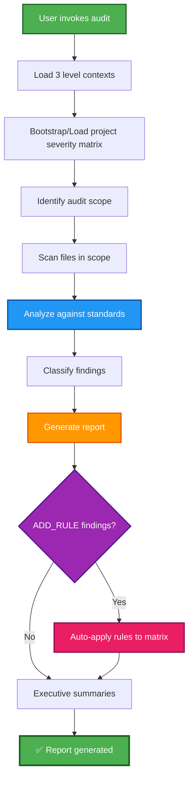

## PHASE_DEFINITION

### AECF_CODE_STANDARDS_AUDIT
output_file: AECF_01_AECF_CODE_STANDARDS_AUDIT.md
gate: none
loop_to: none
requires_plan_go: false

## TAXONOMY

skill_tier: TIER1
requires_determinism: true

# AECF SKILL — CODE STANDARDS AUDIT

------------------------------------------------------------

## MANDATORY CONTEXT LOAD

This skill operates under the following mandatory contexts:

- aecf_prompts/AECF_SYSTEM_CONTEXT.md
- aecf_prompts/SKILL_DISPATCHER.md (execution protocol)
- <workspace_root>/AECF_PROJECT_CONTEXT.md (if present anywhere in the active workspace)

Governance:
- aecf_prompts/_governance/AECF_EXECUTIVE_SUMMARY_GOVERNANCE.md

If any of these contexts exist, they MUST be considered active constraints.

Execution is INVALID if these contexts are not acknowledged.

------------------------------------------------------------

## EXECUTION MANDATE (IMPERATIVE)

When this skill is invoked, the AI MUST:

1. **AUTO-RESOLVE** all parameters (TOPIC, scope, numbering) per SKILL_DISPATCHER
2. **BOOTSTRAP/LOAD PROJECT SEVERITY MATRIX** at `aecf_prompts/<DOCS_ROOT>/AECF_CODE_STANDARDS_AUDIT_SEVERITY_MATRIX.md`
3. **SCAN** all files in scope exhaustively
4. **ANALYZE** against all standards from SYSTEM_CONTEXT and PROJECT_CONTEXT
5. **CREATE FILE** at `aecf_prompts/<DOCS_ROOT>/<user_id>/<RUN_DATE>/{{TOPIC}}/AECF_<NN>_CODE_STANDARDS_AUDIT.md`

**MANDATORY POST-EXECUTION GOVERNANCE (per SKILL_DISPATCHER)**:
- **UPDATE** `aecf_prompts/<DOCS_ROOT>/<user_id>/AECF_TOPICS_INVENTORY.json` for TOPIC lifecycle and **REGENERATE** `aecf_prompts/<DOCS_ROOT>/<user_id>/AECF_TOPICS_INVENTORY.md` (Step 4.1)
- **APPEND** one execution entry to `aecf_prompts/<DOCS_ROOT>/<user_id>/AECF_CHANGELOG.md` (Step 4.2)

**FORBIDDEN**:
- ❌ Responding only in chat without creating a file
- ❌ Asking the user for execution mode, output path, or AECF conventions
- ❌ Requiring verbose prompts — a simple `skill: code_standards_audit` MUST be sufficient
- ❌ Modifying any code (this skill is READ-ONLY, report-only)

**DETECTION BOUNDARY (MANDATORY)**:
- The audit framework is deterministic (contexts, severity matrix, discovery protocol, and output contract), but concrete finding detection depends on LLM reasoning and is not a static line-by-line rule engine.

## MANDATORY REPOSITORY DISCOVERY (SEARCH-FIRST)

This skill requires explicit repository discovery before executing its first audit/analysis step.

Execution rules:
1. Execute an initial repository search pass within scope using IDE capabilities.
2. Build an execution-scoped `WORKING_CONTEXT` before starting the first skill step.
3. If discovery evidence is incomplete, set discovery status to NO-GO and STOP.

Minimum `WORKING_CONTEXT` for search-first execution:
- `TARGET_SCOPE`
- `ENTRY_POINTS_OR_ARTIFACTS`
- `DISCOVERED_PATHS`
- `CONFIG_AND_DEPENDENCIES`
- `UNCERTAINTIES_AND_ASSUMPTIONS`
- `SOURCE_REFERENCES` (concrete file paths and line-level references)

Forbidden:
- Skipping discovery and jumping directly to analysis.
- Assuming repository structure without verification.
- Reusing shared static discovery files across executions.

### MANDATORY COPILOT-AGENT DISCOVERY PROTOCOL

For this skill, discovery MUST be delegated to IDE agent capabilities before the first audit pass.

Required behavior:
1. Start with agent-assisted search (`runSubagent`/IDE plan agent or equivalent) to locate candidate modules, functions, classes, configs, and tests.
2. If the user gives only a basename or symbol (for example `authMiddleware.js`, `processRequest`), resolve it to concrete workspace-relative paths before auditing.
3. If multiple candidates exist, mark the target as ambiguous, list all candidates, and continue the audit only on confirmed targets.
4. Build `WORKING_CONTEXT` from discovered evidence and include concrete `SOURCE_REFERENCES`.
5. Never fabricate paths, symbols, or dependencies not found by repository discovery.

Evidence minimum for each discovered target:
- Resolved file path(s)
- Relevant symbol(s) and location hints
- Why the target is in scope for this audit

## TRACEABILITY METADATA ENFORCEMENT (MANDATORY)

Every document generated by this skill MUST include `## METADATA` following
`aecf_prompts/templates/TEMPLATE_HEADERS.md`.

The metadata block is INVALID unless it includes, at minimum:
- `Timestamp (UTC)`
- `Executed By`
- `Executed By ID`
- `Execution Identity Source`
- `Repository`
- `Branch`
- `Root Prompt`
- `Skill Executed`
- `Sequence Position`
- `Total Prompts Executed`

Missing metadata or missing traceability fields => INVALID SKILL EXECUTION.

------------------------------------------------------------

## Skill ID
`aecf_code_standards_audit`

## Description
Audits existing code to verify strict compliance with standards defined in GLOBAL_CONTEXT and PROJECT_CONTEXT. Generates a detailed report of findings that will serve as input for later corrections.

## When to Use
- Audit legacy or existing code
- Verify compliance with organizational conventions
- Identify technical debt related to standards
- Pre-refactoring: identify what needs correction
- Onboarding of new code to the project

## When NOT to Use
- Audit newly implemented code in an AECF phase (use `05_AUDIT_CODE`)
- Specific security audit (use `17_SECURITY_AUDIT`)
- Audit only tests (use `10_AUDIT_TESTS`)

---

## Purpose

This skill is designed to:
1. ✅ Verify compliance with coding standards
2. ✅ Detect violations of project conventions
3. ✅ Identify nomenclature problems
4. ✅ Verify correct use of logging
5. ✅ Detect concurrency problems (threads/queues)
6. ✅ Verify use of CM_ variables and configuration
7. ✅ Validate code documentation
8. ✅ Verify existence and quality of tests
9. ✅ **ONLY ISSUE REPORT** (do not correct)

### 🎯 Analysis Requirements

**IMPORTANT**: The analysis must be **EXHAUSTIVE** and each finding must:
- ✅ Reference the **full file path** from the project root
- ✅ Include the **exact line number** where the problem occurs
- ✅ Use **clickable Markdown link** format: `[path/file.py:123](path/file.py#L123)` (see Visual Format Specification)
- ✅ Provide **context** about what to look for on that line
- ✅ Allow direct navigation to the code from the report
- ✅ **Use colored severity badges** (HTML) so CRITICAL/WARNING/INFO are visually distinct (see Visual Format Specification)
- ✅ **[CRITICAL/WARNING] Include a copyable `@aecf run skill=...` command** with topic and prompt (see Visual Format Specification)
- ✅ **[CRITICAL/WARNING] DO NOT recommend prompts directly** — always recommend the appropriate **skill**, which internally triggers the correct phases and maintains the cycle of predictability

---

## 🎨 Visual Format Specification (MANDATORY)

All generated reports MUST use the following visual formatting to ensure findings are immediately scannable.

### Severity Badges (HTML in Markdown)

Replace plain-text severity labels with colored HTML badges. Use EXACTLY these snippets:

- **CRITICAL**: `<span style="background:#dc3545;color:#fff;padding:2px 8px;border-radius:4px;font-weight:bold;font-size:0.85em">CRITICAL</span>`
- **HIGH**: `<span style="background:#fd7e14;color:#fff;padding:2px 8px;border-radius:4px;font-weight:bold;font-size:0.85em">HIGH</span>`
- **WARNING**: `<span style="background:#ffc107;color:#000;padding:2px 8px;border-radius:4px;font-weight:bold;font-size:0.85em">WARNING</span>`
- **MEDIUM**: `<span style="background:#0d6efd;color:#fff;padding:2px 8px;border-radius:4px;font-weight:bold;font-size:0.85em">MEDIUM</span>`
- **LOW**: `<span style="background:#198754;color:#fff;padding:2px 8px;border-radius:4px;font-weight:bold;font-size:0.85em">LOW</span>`
- **INFO**: `<span style="background:#adb5bd;color:#000;padding:2px 8px;border-radius:4px;font-size:0.85em">INFO</span>`

Use these badges in:
- Findings tables (Severity column)
- Executive Summary bullet counts
- Prioritized violations lists
- Navigation Index findings counts

### Clickable File Locations (Markdown links)

Every file reference MUST be a clickable Markdown link that navigates to the exact line:

- **Single line**: `[path/to/file.py:45](path/to/file.py#L45)`
- **Line range**: `[path/to/file.py:45-60](path/to/file.py#L45)`
- **File only**: `[path/to/file.py](path/to/file.py)`

**NEVER** use plain text like `path/to/file.py:45` without wrapping it in a Markdown link.

### Copyable `@aecf` Remediation Commands

For each **CRITICAL** or **WARNING** finding, include a ready-to-copy `@aecf` command in a fenced code block:

```text
@aecf run skill=<skill_name> topic={{TOPIC}} prompt="<specific description of the fix with file:line>"
```

**Rules**:
- `skill=` MUST be a valid skill ID (e.g., `aecf_refactor`, `aecf_security_review`, `aecf_new_feature`)
- `topic=` MUST carry the current `{{TOPIC}}` so the output lands in the correct documentation folder
- `prompt=` MUST describe the specific remediation action, referencing the finding location
- The command MUST be inside a fenced code block so the user can copy-paste directly

**Example**:
```text
@aecf run skill=aecf_refactor topic=auth_review prompt="Replace print() with logger.info() in src/utils/helpers.py:89"
```

---

## Input Required

### Mandatory:
- **Scope**: Path or paths of files/directories to audit
- **TOPIC** (optional): Audit identifier (will be inferred from the scope if not provided)

### Optional:
- **Focus areas**: Specific areas to audit (logging, nomenclature, concurrency, etc.)
- **Severity threshold**: Minimum level of severity to report (INFO, WARNING, CRITICAL)

---

## Context Loading

This skill MUST load and apply contexts in hierarchical order:

1. **SYSTEM_CONTEXT**: `aecf_prompts/AECF_SYSTEM_CONTEXT.md`
- AECF unified universal + organizational rules

2. **PROJECT_CONTEXT (workspace)**: `<workspace_root>/AECF_PROJECT_CONTEXT.md`
- If exists, overwrites default SYSTEM_CONTEXT settings

3. **Governance**: `aecf_prompts/_governance/AECF_EXECUTIVE_SUMMARY_GOVERNANCE.md`
- Mandatory compliance and traceability rules

---

## Project Severity Matrix Bootstrap (MANDATORY)

To avoid cross-run severity drift, this skill MUST use a **project-local severity matrix**:

- **Path**: `aecf_prompts/<DOCS_ROOT>/AECF_CODE_STANDARDS_AUDIT_SEVERITY_MATRIX.md`
- **Scope**: Applies only to the current project/workspace

### Bootstrap rule

On the first execution in a project:
1. If the matrix file does NOT exist, CREATE it from template:
   - `aecf_prompts/templates/CODE_STANDARDS_AUDIT_SEVERITY_MATRIX_TEMPLATE.md`
2. Mark it as baseline (`v1`) for the project.
3. Use that matrix to classify severities.

On subsequent executions:
1. LOAD the existing project matrix.
2. Reuse its severities to keep reports consistent.
3. If a new, uncataloged finding appears, classify as `MATRIX-PENDING` (provisional `WARNING` unless runtime/data-loss/exploitable risk), and append a proposed new rule section in the audit report.

### Classification Decision Protocol (ADD vs NO-ADD)

When a finding is `MATRIX-PENDING`, the AI MUST decide if a new matrix rule should be added.

Decision criteria:
1. **Repetibility**: Is the pattern likely to reappear in this project?
2. **Impact class**: Runtime break / data loss / exploitable risk / operational risk.
3. **Distinctiveness**: Is this truly new, or already covered by an existing Rule ID?
4. **Actionability**: Can the rule be written with objective evidence and deterministic threshold?

Decision outcomes:
- `ADD_RULE`: Create a proposed Rule ID and recommendation to update matrix version.
- `NO_ADD_RULE`: Keep mapped to nearest existing rule and document rationale.

Mandatory evidence for decision:
- Finding location (`path/file.py:line`)
- Proposed or mapped Rule ID
- Rationale (1-3 lines, objective)
- Provisional severity used during this run

### Matrix Auto-Apply Protocol (MANDATORY)

When the Classification Decision Protocol produces `ADD_RULE` decisions, the AI MUST **automatically apply them** to the project severity matrix as part of the skill execution — no separate skill, no user confirmation needed.

**Auto-apply steps (executed AFTER report generation, BEFORE executive summaries)**:

1. **Filter**: Collect all findings with decision `ADD_RULE` from the Classification Decision Log.
2. **Validate**: Confirm each proposed rule has:
   - Unique Rule ID (not colliding with existing rules)
   - Clear Condition text (objective, deterministic)
   - Justified Severity (backed by tie-breaker rules or evidence)
3. **Apply**: For each validated `ADD_RULE`:
   - INSERT the new row into the `## Canonical Rules` table of `aecf_prompts/<DOCS_ROOT>/AECF_CODE_STANDARDS_AUDIT_SEVERITY_MATRIX.md`
   - Place it in the correct category group (alphabetical by Rule ID within category)
4. **Version bump**: Increment the matrix version:
   - Minor bump for additions: `v1` → `v1.1`, `v1.1` → `v1.2`
   - Update `Last Updated` date
   - Change `Status` from `baseline` to `active` (if first update)
5. **Changelog**: Append entry with format:
   ```
   - vX.Y: Added RULE-ID (description) from TOPIC audit. Source: documentation/TOPIC/AECF_NN_DOCUMENT.md (YYYY-MM-DD).
   ```
6. **Report cross-reference**: In the audit report's Classification Decision Log, mark applied rules as `✅ AUTO-APPLIED` instead of just `ADD_RULE`.

**Rules for `NO_ADD_RULE`**:
- Document in the audit report only
- Do NOT touch the matrix file
- Do NOT require user action

**Conflict resolution**:
- If a proposed Rule ID already exists (collision), append a numeric suffix: `MATRIX-LOG-03` → `MATRIX-LOG-03b`
- If the matrix file is missing or corrupted, bootstrap from template first (per Bootstrap rule), then apply

**Traceability guarantee**:
- Every matrix change is traceable to a specific audit report via the changelog
- The audit report documents the full rationale for each rule
- Executive summaries report the auto-apply actions for executive visibility

---

## Executive Summary Requirements for Matrix Decisions (MANDATORY)

For `aecf_code_standards_audit`, both executive summaries MUST explicitly report matrix governance:

1. **Classification Decision Log**
   - Total `MATRIX-PENDING`
   - `ADD_RULE` count
   - `NO_ADD_RULE` count

2. **Pending Findings Review List**
   - List each pending finding with:
- `path/file.py:line`
     - provisional severity
     - proposed/mapped Rule ID
     - decision (`ADD_RULE` / `NO_ADD_RULE`)
     - short rationale

3. **Matrix update recommendation**
   - If any `ADD_RULE`, include recommended matrix version bump (`vX.Y`).

### Non-goal

This matrix is **NOT global AECF policy** and MUST NOT be centralized for all projects.
Each project owns and evolves its own matrix at `aecf_prompts/<DOCS_ROOT>/AECF_CODE_STANDARDS_AUDIT_SEVERITY_MATRIX.md`.

---

## Execution Flow



---

## Audit Checklist (Based on GLOBAL_CONTEXT)

### 1. Directory & File Structure
- [ ] Documentation `.md` in `documentation/`
- [ ] Tests in `tests/` with proper structure
- [ ] Mermaid diagrams with `.mmd` extension
- [ ] Commits en `documentation/commit_messages/`

### 2. Coding Standards
- [ ] No global state without explicit justification
- [ ] No magic behavior
- [ ] Outputs deterministas
- [ ] Internal documentation in complex code

### 3. Concurrency (HAProxy/Multi-instance)
- [ ] Variables/functions prepared for multiple instances
- [ ] Lock protection on file writes
- [ ] No race conditions
- [ ] Variables CM_ para toggle thread/queue
- [ ] Threads named with prefix `T_`
- [ ] Queues named with prefix `Q_`

### 4. Configuration Management
- [ ] `CM_*` variables defined in code
- [ ] `CM_*` variables included in `production_env_overrides.json`
- [ ] `CM_*` variables NOT included in `.env` by default

### 5. Logging & Debug
- [ ] No use of `print()` (use logging)
- [ ] Funciones de debug con decorator `@function_not_for_production`
- [ ] Structured and consistent logging

### 6. Naming Conventions
- [ ] Descriptive variables (no single letters except loops)
- [ ] Verbose functions (not cryptic abbreviations)
- [ ] PascalCase classes
- [ ] Functions/variables snake_case
- [ ] Constantes UPPER_SNAKE_CASE
- [ ] Threads prefijo `T_`
- [ ] Queues prefix `Q_`
- [ ] Variables configuration prefix `CM_`

### 7. Testing
- [ ] Tests exist for testable code
- [ ] Tests cover normal cases
- [ ] Tests cover borderline cases
- [ ] Tests follow project structure

### 8. Security & Access Control
- [ ] No secrets hardcoded
- [ ] Input validation presente
- [ ] Access control when applicable
- [ ] No exposure of sensitive data

### 9. Library Imports (Organizational Standards)
- [ ] `apirobot_external_integration` imported ONLY as `import apirobot_libraries.apirobot_external_integration`
- [ ] DO NOT copy the `apirobot_external_integration.py` script locally
- [ ] DO NOT import from local or relative paths
- [ ] `apirobot_libraries` library updated in requirements

### 10. Resource Management
- [ ] Resources (DB, files, connections) explicitly closed
- [ ] Context managers where applicable
- [ ] No resource leaks

### 11. Documentation
- [ ] README updated
- [ ] Docstrings in public functions
- [ ] Type hints presentes
- [ ] Explanatory comments in complex logic

---

## Output Format

**File**: `aecf_prompts/<DOCS_ROOT>/<user_id>/<RUN_DATE>/{{TOPIC}}/AECF_<NN>_CODE_STANDARDS_AUDIT.md`

**Project Matrix (mandatory for this skill)**:
- `aecf_prompts/<DOCS_ROOT>/AECF_CODE_STANDARDS_AUDIT_SEVERITY_MATRIX.md`
- If missing, it MUST be created from template before classifying findings.

Where:
- `<NN>` = next sequential number in `aecf_prompts/<DOCS_ROOT>/<user_id>/<RUN_DATE>/{{TOPIC}}/` (global sequence per SKILL_DISPATCHER)

### 🎯 CRITICAL FORMAT REQUIREMENTS

**ALL code references MUST be clickable Markdown links** (see Visual Format Specification):
- ✅ **Markdown link with line**: `[path/full/from/root/file.py:45](path/full/from/root/file.py#L45)`
- ✅ **Line range**: `[path/full/from/root/file.py:45-60](path/full/from/root/file.py#L45)`
- ✅ **Navigable**: Clicking the link opens the file at the exact line in VS Code / GitHub
- ✅ **Context**: Explain what to look for/correct on that specific line
- ✅ **Severity badges**: Use colored HTML `<span>` badges, not plain text

**CORRECT EXAMPLES**:
- `[src/auth/authentication.py:45](src/auth/authentication.py#L45)` — Click navigates to line 45
- `[tests/unit/test_api.py:123](tests/unit/test_api.py#L123)` — Click navigates to line 123
- `[config/settings.py:67](config/settings.py#L67)` — Click navigates to line 67

**INCORRECT EXAMPLES** ❌:
- `authentication.py` — No full path or line
- `src/auth/authentication.py:45` — Not wrapped in a Markdown link
- `src/auth/` — Directory only, not file

### Structure:

```markdown
# Code Standards Audit Report

**Audit Date**: YYYY-MM-DD  
**Scope**: [Paths audited]  
**Auditor**: AI (AECF Code Standards Audit Skill)

---

## 📊 Executive Summary

**Overall Compliance Score**: X/100

**Breakdown**:
- ✅ PASS: N items
- ⚠️  WARNING: M items
- ❌ CRITICAL: P items

**Recommendation**: [COMPLIANT / NEEDS_FIXES / MAJOR_REFACTOR_NEEDED]

---

## 🗂️ Sections Analyzed — Navigation Index

> The following sections of the code were analyzed. Each link leads directly to the findings and recommended remediation.

| # | Section | Findings | Link |
|---|---------|----------|------|
| 1 | Directory & File Structure | N CRITICAL, M WARNING | [→ Findings and Remediation](#1-directory--file-structure) |
| 2 | Coding Standards Compliance | N CRITICAL, M WARNING | [→ Findings and Remediation](#2-coding-standards-compliance) |
| 3 | Concurrency & Multi-instance | N CRITICAL, M WARNING | [→ Findings and Remediation](#3-concurrency--multi-instance-compliance) |
| 4 | Configuration Management (CM_) | N CRITICAL, M WARNING | [→ Findings and Remediation](#4-configuration-management-cm_-variables) |
| 5 | Logging & Debug Compliance | N CRITICAL, M WARNING | [→ Findings and Remediation](#5-logging--debug-compliance) |
| 6 | Naming Conventions | N CRITICAL, M WARNING | [→ Findings and Remediation](#6-naming-conventions) |
| 7 | Testing Coverage | N CRITICAL, M WARNING | [→ Findings and Remediation](#7-testing-coverage) |
| 8 | Security & Access Control | N CRITICAL, M WARNING | [→ Findings and Remediation](#8-security--access-control) |
| 9 | Library Imports (Organizational Standards) | N CRITICAL, M WARNING | [→ Findings and Remediation](#9-library-imports-organizational-standards) |
| 10 | Resource Management | N CRITICAL, M WARNING | [→ Findings and Remediation](#10-resource-management) |
| 11 | Documentation Quality | N CRITICAL, M WARNING | [→ Findings and Remediation](#11-documentation-quality) |

> ⚠️ **Note**: Replace `N` and `M` with the actual counts. Skip sections without findings if all are PASS.

---

## 1. Directory & File Structure

### ✅ Compliant
- [List compliant items]

### ❌ Violations

**REQUIRED FORMAT**: Use full paths from project root with line number

| Location | Issue | Severity | Standard Violated | Context | Recommended Action |
|----------|-------|----------|-------------------|---------|--------------------|
| [tests/unit/test_auth.py:0](tests/unit/test_auth.py#L1) | Missing test file for auth.py | <span style="background:#ffc107;color:#000;padding:2px 8px;border-radius:4px;font-weight:bold;font-size:0.85em">WARNING</span> | GLOBAL_CONTEXT §2 | Create test file at this path | ```@aecf run skill=aecf_new_feature topic={{TOPIC}} prompt="Generate complete test suite for auth.py at tests/unit/test_auth.py"``` |
| [src/auth/authentication.py:1](src/auth/authentication.py#L1) | Missing corresponding tests | <span style="background:#ffc107;color:#000;padding:2px 8px;border-radius:4px;font-weight:bold;font-size:0.85em">WARNING</span> | GLOBAL_CONTEXT §2 | Module needs test coverage | ```@aecf run skill=aecf_new_feature topic={{TOPIC}} prompt="Generate strategy + test implementation for src/auth/authentication.py"``` |

---

## 2. Coding Standards Compliance

### ✅ Compliant
- [List compliant items]

### ❌ Violations

**REQUIRED FORMAT**: `path/full/file.py:line` - clickable in IDEs/GitHub

| Location | Issue | Severity | Standard | Context | Recommended Action |
|----------|-------|----------|----------|---------|--------------------|
| [src/core/app.py:45](src/core/app.py#L45) | Global state without justification | <span style="background:#dc3545;color:#fff;padding:2px 8px;border-radius:4px;font-weight:bold;font-size:0.85em">CRITICAL</span> | GLOBAL_CONTEXT §1 | Variable `global_cache` defined without doc | ```@aecf run skill=aecf_refactor topic={{TOPIC}} prompt="Encapsulate global_cache in src/core/app.py:45 with justification or remove"``` |
| [src/utils/helpers.py:123](src/utils/helpers.py#L123) | Magic number used without constant | <span style="background:#ffc107;color:#000;padding:2px 8px;border-radius:4px;font-weight:bold;font-size:0.85em">WARNING</span> | GLOBAL_CONTEXT §1 | Value `3600` should be named constant | ```@aecf run skill=aecf_refactor topic={{TOPIC}} prompt="Replace magic number 3600 with named constant in src/utils/helpers.py:123"``` |

---

## 3. Concurrency & Multi-instance Compliance

### ✅ Compliant
- [List compliant items]

### ❌ Violations

**REQUIRED FORMAT**: `[path/full/file.py:line](path/full/file.py#Lline)` — clickable Markdown link

| Location | Issue | Severity | Standard | Context | Recommended Action |
|----------|-------|----------|----------|---------|--------------------|
| [src/workers/worker.py:120](src/workers/worker.py#L120) | File write without lock | <span style="background:#dc3545;color:#fff;padding:2px 8px;border-radius:4px;font-weight:bold;font-size:0.85em">CRITICAL</span> | GLOBAL_CONTEXT §1 | Missing `with file_lock:` before write | ```@aecf run skill=aecf_refactor topic={{TOPIC}} prompt="Add lock protection before file write in src/workers/worker.py:120"``` |
| [src/tasks/queue_tasks.py:67](src/tasks/queue_tasks.py#L67) | Thread not prefixed with T_ | <span style="background:#ffc107;color:#000;padding:2px 8px;border-radius:4px;font-weight:bold;font-size:0.85em">WARNING</span> | GLOBAL_CONTEXT §1 | Thread name should be `T_queue_processor` | ```@aecf run skill=aecf_refactor topic={{TOPIC}} prompt="Rename thread to T_queue_processor in src/tasks/queue_tasks.py:67"``` |
| [src/tasks/queue_tasks.py:89](src/tasks/queue_tasks.py#L89) | Queue not prefixed with Q_ | <span style="background:#ffc107;color:#000;padding:2px 8px;border-radius:4px;font-weight:bold;font-size:0.85em">WARNING</span> | GLOBAL_CONTEXT §1 | Queue name should be `Q_task_queue` | ```@aecf run skill=aecf_refactor topic={{TOPIC}} prompt="Rename queue to Q_task_queue in src/tasks/queue_tasks.py:89"``` |

---

## 4. Configuration Management (CM_ Variables)

### ✅ Compliant
- [List CM_ variables properly configured]

### ❌ Violations

**REQUIRED FORMAT**: `[path/full/file.py:line](path/full/file.py#Lline)` — clickable Markdown link

| Variable | Location | Issue | Severity | Standard | Context | Recommended Action |
|----------|----------|-------|----------|----------|---------|--------------------|
| `CM_USE_QUEUE` | [config/settings.py:45](config/settings.py#L45) | Not in production_env_overrides.json | <span style="background:#dc3545;color:#fff;padding:2px 8px;border-radius:4px;font-weight:bold;font-size:0.85em">CRITICAL</span> | GLOBAL_CONTEXT §2 | Add to config file | ```@aecf run skill=aecf_refactor topic={{TOPIC}} prompt="Add CM_USE_QUEUE to production_env_overrides.json and document in config/settings.py:45"``` |
| `CM_MAX_WORKERS` | [src/workers/pool.py:23](src/workers/pool.py#L23) | Not documented in code | <span style="background:#ffc107;color:#000;padding:2px 8px;border-radius:4px;font-weight:bold;font-size:0.85em">WARNING</span> | GLOBAL_CONTEXT §2 | Add docstring explaining purpose | ```@aecf run skill=aecf_refactor topic={{TOPIC}} prompt="Add documentation for CM_MAX_WORKERS in src/workers/pool.py:23"``` |

---

## 5. Logging & Debug Compliance

### ✅ Compliant
- [List compliant logging]

### ❌ Violations

**REQUIRED FORMAT**: `[path/full/file.py:line](path/full/file.py#Lline)` — clickable Markdown link

| Location | Issue | Severity | Standard | Context | Recommended Action |
|----------|-------|----------|----------|---------|--------------------|
| [src/utils/helpers.py:89](src/utils/helpers.py#L89) | Using print() instead of logger | <span style="background:#ffc107;color:#000;padding:2px 8px;border-radius:4px;font-weight:bold;font-size:0.85em">WARNING</span> | GLOBAL_CONTEXT §1 | Replace with `logger.info()` | ```@aecf run skill=aecf_refactor topic={{TOPIC}} prompt="Replace print() with logger.info() in src/utils/helpers.py:89"``` |
| [src/debug/debug_tools.py:45](src/debug/debug_tools.py#L45) | Missing @function_not_for_production | <span style="background:#dc3545;color:#fff;padding:2px 8px;border-radius:4px;font-weight:bold;font-size:0.85em">CRITICAL</span> | GLOBAL_CONTEXT §1 | Add decorator to `debug_analyze()` | ```@aecf run skill=aecf_refactor topic={{TOPIC}} prompt="Add @function_not_for_production decorator to debug_analyze() in src/debug/debug_tools.py:45"``` |
| [src/api/endpoints.py:234](src/api/endpoints.py#L234) | Using print() for error output | <span style="background:#ffc107;color:#000;padding:2px 8px;border-radius:4px;font-weight:bold;font-size:0.85em">WARNING</span> | GLOBAL_CONTEXT §1 | Replace with `logger.error()` | ```@aecf run skill=aecf_refactor topic={{TOPIC}} prompt="Replace print() with logger.error() in src/api/endpoints.py:234"``` |

---

## 6. Naming Conventions

### ✅ Compliant
- [List compliant names]

### ❌ Violations

**REQUIRED FORMAT**: `[path/full/file.py:line](path/full/file.py#Lline)` — clickable Markdown link

| Location | Item | Current Name | Expected | Severity | Context | Recommended Action |
|----------|------|--------------|----------|----------|---------|--------------------|
| [src/api/routes.py:78](src/api/routes.py#L78) | Function | `procReq` | `process_request` | <span style="background:#ffc107;color:#000;padding:2px 8px;border-radius:4px;font-weight:bold;font-size:0.85em">WARNING</span> | Make function name descriptive | ```@aecf run skill=aecf_refactor topic={{TOPIC}} prompt="Rename function procReq to process_request and update all references in src/api/routes.py:78"``` |
| [src/models/user.py:145](src/models/user.py#L145) | Variable | `x` | `user_count` or similar | <span style="background:#ffc107;color:#000;padding:2px 8px;border-radius:4px;font-weight:bold;font-size:0.85em">WARNING</span> | Single letter not descriptive | ```@aecf run skill=aecf_refactor topic={{TOPIC}} prompt="Rename variable x to descriptive name in src/models/user.py:145"``` |
| [src/tasks/processor.py:56](src/tasks/processor.py#L56) | Thread | `worker_thread` | `T_worker_thread` | <span style="background:#ffc107;color:#000;padding:2px 8px;border-radius:4px;font-weight:bold;font-size:0.85em">WARNING</span> | Add `T_` prefix | ```@aecf run skill=aecf_refactor topic={{TOPIC}} prompt="Add T_ prefix to thread name in src/tasks/processor.py:56"``` |

---

## 7. Testing Coverage

### ✅ Compliant
- [List tested modules]

### ❌ Missing/Incomplete Tests

**REQUIRED FORMAT**: `[path/full/file.py:line](path/full/file.py#Lline)` — clickable Markdown link

| Module Location | Issue | Severity | Context | Recommended Action |
|-----------------|-------|----------|---------|--------------------|
| [src/auth/authentication.py:1](src/auth/authentication.py#L1) | No tests exist | <span style="background:#dc3545;color:#fff;padding:2px 8px;border-radius:4px;font-weight:bold;font-size:0.85em">CRITICAL</span> | Create `tests/unit/test_authentication.py` | ```@aecf run skill=aecf_new_feature topic={{TOPIC}} prompt="Generate strategy and complete tests for src/auth/authentication.py"``` |
| [src/utils/validators.py:67](src/utils/validators.py#L67) | Tests don't cover edge cases | <span style="background:#ffc107;color:#000;padding:2px 8px;border-radius:4px;font-weight:bold;font-size:0.85em">WARNING</span> | Add tests for empty input, special chars | ```@aecf run skill=aecf_new_feature topic={{TOPIC}} prompt="Add edge case tests (empty input, special chars) for src/utils/validators.py:67"``` |
| [src/api/endpoints.py:234](src/api/endpoints.py#L234) | No error handling tests | <span style="background:#ffc107;color:#000;padding:2px 8px;border-radius:4px;font-weight:bold;font-size:0.85em">WARNING</span> | Add tests for 4xx, 5xx responses | ```@aecf run skill=aecf_new_feature topic={{TOPIC}} prompt="Add error handling tests (4xx, 5xx) for src/api/endpoints.py:234"``` |

---

## 8. Security & Access Control

### ✅ Compliant
- [List secure implementations]

### ❌ Violations

**REQUIRED FORMAT**: `[path/full/file.py:line](path/full/file.py#Lline)` — clickable Markdown link

| Location | Issue | Severity | Context | Recommended Action |
|----------|-------|----------|---------|--------------------|
| [config/secrets.py:12](config/secrets.py#L12) | Hardcoded API key | <span style="background:#dc3545;color:#fff;padding:2px 8px;border-radius:4px;font-weight:bold;font-size:0.85em">CRITICAL</span> | Move to environment variable | ```@aecf run skill=aecf_security_review topic={{TOPIC}} prompt="Audit and remediate hardcoded API key in config/secrets.py:12"``` |
| [src/api/routes.py:78](src/api/routes.py#L78) | No input validation | <span style="background:#ffc107;color:#000;padding:2px 8px;border-radius:4px;font-weight:bold;font-size:0.85em">WARNING</span> | Add validation for request params | ```@aecf run skill=aecf_security_review topic={{TOPIC}} prompt="Add input validation for request params in src/api/routes.py:78"``` |
| [src/auth/auth.py:145](src/auth/auth.py#L145) | Password stored in plain text | <span style="background:#dc3545;color:#fff;padding:2px 8px;border-radius:4px;font-weight:bold;font-size:0.85em">CRITICAL</span> | Use bcrypt or similar hashing | ```@aecf run skill=aecf_security_review topic={{TOPIC}} prompt="Implement password hashing (bcrypt) in src/auth/auth.py:145"``` |

---

## 9. Library Imports (Organizational Standards)

### ✅ Compliant
- [List correct imports using apirobot_libraries]

### ❌ Violations

**REQUIRED FORMAT**: `[path/full/file.py:line](path/full/file.py#Lline)` — clickable Markdown link

| Location | Issue | Severity | Context | Recommended Action |
|----------|-------|----------|---------|--------------------|
| [src/integration/api_bridge.py:5](src/integration/api_bridge.py#L5) | Incorrect import of apirobot_external_integration | <span style="background:#dc3545;color:#fff;padding:2px 8px;border-radius:4px;font-weight:bold;font-size:0.85em">CRITICAL</span> | Change to `import apirobot_libraries.apirobot_external_integration` | ```@aecf run skill=aecf_refactor topic={{TOPIC}} prompt="Fix import to organizational standard in src/integration/api_bridge.py:5"``` |
| [utils/apirobot_external_integration.py:1](utils/apirobot_external_integration.py#L1) | Local copy of apirobot_external_integration | <span style="background:#dc3545;color:#fff;padding:2px 8px;border-radius:4px;font-weight:bold;font-size:0.85em">CRITICAL</span> | Remove local copy, use library import | ```@aecf run skill=aecf_refactor topic={{TOPIC}} prompt="Remove local copy of apirobot_external_integration and update all imports"``` |
| [src/tasks/processor.py:12](src/tasks/processor.py#L12) | Importing from local path | <span style="background:#dc3545;color:#fff;padding:2px 8px;border-radius:4px;font-weight:bold;font-size:0.85em">CRITICAL</span> | Replace `from utils.apirobot_external_integration import ...` with library import | ```@aecf run skill=aecf_refactor topic={{TOPIC}} prompt="Replace local import with library import in src/tasks/processor.py:12"``` |

---

## 10. Resource Management

### ✅ Compliant
- [List proper resource management]

### ❌ Violations

**REQUIRED FORMAT**: `[path/full/file.py:line](path/full/file.py#Lline)` — clickable Markdown link

| Location | Issue | Severity | Context | Recommended Action |
|----------|-------|----------|---------|--------------------|
| [src/db/connection.py:156](src/db/connection.py#L156) | Connection not closed | <span style="background:#dc3545;color:#fff;padding:2px 8px;border-radius:4px;font-weight:bold;font-size:0.85em">CRITICAL</span> | Add `conn.close()` or use context manager | ```@aecf run skill=aecf_refactor topic={{TOPIC}} prompt="Add context manager for DB connection in src/db/connection.py:156"``` |
| [src/files/processor.py:89](src/files/processor.py#L89) | File handle not closed | <span style="background:#dc3545;color:#fff;padding:2px 8px;border-radius:4px;font-weight:bold;font-size:0.85em">CRITICAL</span> | Use `with open()` context manager | ```@aecf run skill=aecf_refactor topic={{TOPIC}} prompt="Replace open() with context manager in src/files/processor.py:89"``` |
| [src/api/client.py:234](src/api/client.py#L234) | HTTP session not closed | <span style="background:#ffc107;color:#000;padding:2px 8px;border-radius:4px;font-weight:bold;font-size:0.85em">WARNING</span> | Add `session.close()` in finally block | ```@aecf run skill=aecf_refactor topic={{TOPIC}} prompt="Add HTTP session close in finally block in src/api/client.py:234"``` |

---

## 11. Documentation Quality

### ✅ Compliant
- [List well-documented code]

### ❌ Violations

**REQUIRED FORMAT**: `[path/full/file.py:line](path/full/file.py#Lline)` — clickable Markdown link

| Location | Issue | Severity | Context | Recommended Action |
|----------|-------|----------|---------|--------------------|
| [src/core/engine.py:1](src/core/engine.py#L1) | Missing docstrings in public functions | <span style="background:#ffc107;color:#000;padding:2px 8px;border-radius:4px;font-weight:bold;font-size:0.85em">WARNING</span> | Add docstrings to exported functions | ```@aecf run skill=aecf_document_legacy topic={{TOPIC}} prompt="Document public functions in src/core/engine.py"``` |
| [README.md:45](README.md#L45) | Outdated setup instructions | <span style="background:#ffc107;color:#000;padding:2px 8px;border-radius:4px;font-weight:bold;font-size:0.85em">WARNING</span> | Update Python version requirement | ```@aecf run skill=aecf_document_legacy topic={{TOPIC}} prompt="Update setup instructions and Python version in README.md:45"``` |
| [src/models/user.py:23](src/models/user.py#L23) | Missing type hints | <span style="background:#ffc107;color:#000;padding:2px 8px;border-radius:4px;font-weight:bold;font-size:0.85em">WARNING</span> | Add type hints to function signature | ```@aecf run skill=aecf_refactor topic={{TOPIC}} prompt="Add type hints to function signatures in src/models/user.py:23"``` |

---

## 📋 Complete Violations List (Prioritized)

**FORMAT**: Each line must use `path/full/file.py:line` to allow direct navigation

### <span style="background:#dc3545;color:#fff;padding:2px 8px;border-radius:4px;font-weight:bold;font-size:0.85em">CRITICAL</span> (Must Fix)
1. [src/core/app.py:45](src/core/app.py#L45) - Global state without justification → violates GLOBAL_CONTEXT §1
   - **Context**: Variable `global_cache` defined without documentation
   - 🔧 **Execute**:
     ```
     @aecf run skill=aecf_refactor topic={{TOPIC}} prompt="Wrap global_cache with justification or remove in src/core/app.py:45"
     ```
2. [src/workers/worker.py:120](src/workers/worker.py#L120) - File write without lock → violates GLOBAL_CONTEXT §1
   - **Context**: Missing `with file_lock:` before write operation
   - 🔧 **Execute**:
     ```
     @aecf run skill=aecf_refactor topic={{TOPIC}} prompt="Add lock protection before file write in src/workers/worker.py:120"
     ```
3. [config/secrets.py:12](config/secrets.py#L12) - Hardcoded API key → violates GLOBAL_CONTEXT §3
   - **Context**: API_KEY = "abc123..." should be in .env
   - 🔧 **Execute**:
     ```
     @aecf run skill=aecf_security_review topic={{TOPIC}} prompt="Audit and remediate exposed secret in config/secrets.py:12"
     ```

### <span style="background:#ffc107;color:#000;padding:2px 8px;border-radius:4px;font-weight:bold;font-size:0.85em">WARNING</span> (Should Fix)
1. [src/utils/helpers.py:89](src/utils/helpers.py#L89) - Using print() instead of logger → violates GLOBAL_CONTEXT §1
   - **Context**: Replace `print(f"Processing...")` with `logger.info()`
   - 🔧 **Execute**:
     ```
     @aecf run skill=aecf_refactor topic={{TOPIC}} prompt="Replace print() with logger in src/utils/helpers.py:89"
     ```
2. [src/api/routes.py:78](src/api/routes.py#L78) - Function name not descriptive → violates GLOBAL_CONTEXT §1
   - **Context**: Rename `procReq` to `process_request`
   - 🔧 **Execute**:
     ```
     @aecf run skill=aecf_refactor topic={{TOPIC}} prompt="Rename function procReq to process_request and update references in src/api/routes.py:78"
     ```

### <span style="background:#adb5bd;color:#000;padding:2px 8px;border-radius:4px;font-size:0.85em">INFO</span> (Nice to Have)
1. [README.md:45](README.md#L45) - Outdated setup instructions → recommendation
   - **Context**: Update Python version from 3.8 to 3.11
   - 🔧 **Execute**:
     ```
     @aecf run skill=aecf_document_legacy topic={{TOPIC}} prompt="Update Python version and setup instructions in README.md:45"
     ```

---

## 🎯 Recommendations

### Immediate Actions (CRITICAL)
1. [Action item]
   - 🔧 **Execute**:
     ```
     @aecf run skill=<recommended_skill> topic={{TOPIC}} prompt="<specific description of the finding and remediation with file:line>"
     ```
2. ...

### Short-term Actions (WARNING)
1. [Action item]
   - 🔧 **Execute**:
     ```
     @aecf run skill=<recommended_skill> topic={{TOPIC}} prompt="<specific description of the finding and remediation with file:line>"
     ```
2. ...

### Long-term Improvements (INFO)
1. [Action item]
2. ...

---

## 🔧 Remediation Mapping Reference

### MANDATORY RULE

**For EACH CRITICAL or WARNING finding, the report MUST include**:
1. ✅ The **AECF skill** recommended to solve it
2. ✅ A **concise description** of what the skill should do about the finding
3. ✅ The recommended skill MUST exist in `SKILL_CATALOG.md` (closed allow-list)
4. ❌ **NEVER reference internal prompts/phases directly** — breaks the cycle of predictability

### Allowed Skills for "Recommended Skill" (Closed Catalog)

`Recommended Skill` MUST be one of:
`aecf_new_feature`, `aecf_hotfix`, `aecf_refactor`, `aecf_data_strategy`, `aecf_system_replayability_adaptive`, `aecf_code_standards_audit`, `aecf_security_review`, `aecf_dependency_audit`, `aecf_tech_debt_assessment`, `aecf_document_legacy`, `aecf_explain_behavior`, `aecf_maturity_assessment`, `aecf_release_readiness`, `aecf_executive_summary`, `aecf_data_governance_audit`, `aecf_model_governance_audit`, `aecf_ai_risk_assessment`, `aecf_define_impact_metrics`, `aecf_project_context_generator`, `aecf_document_context_ingestion`, `aecf_data_classification`

Forbidden examples (DO NOT output): `aecf_security_hardening`, `aecf_code_standards_remediate`, `aecf_test_generation`.

If an intended recommendation is outside the allow-list, map it to the nearest valid skill using this fallback order:
1. Security/auth/crypto → `aecf_security_review`
2. CVE/license/dependency → `aecf_dependency_audit`
3. Missing tests/coverage → `aecf_new_feature`
4. Missing docs/docstrings → `aecf_document_legacy`
5. Complex architecture debt → `aecf_tech_debt_assessment` (optionally then `aecf_refactor`)
6. Default fallback → `aecf_refactor`

> **Reason**: The skills internally dispatch the correct phases via SKILL_DISPATCHER.
> Recommend prompts directly (e.g. `06_FIX_CODE`, `17_SECURITY_AUDIT`) allows the user
> skip the governed cycle, breaking traceability and predictability.

### Mapping by Violation Category

| Violation Category | Recommended Skill | Remediation Description |
|------------------------|-------------------|---------------------------|
| **Coding Standards** (global state, magic numbers, determinism) | `aecf_refactor` | Refactor code to meet standards |
| **Concurrency** (locks, race conditions, thread/queue naming) | `aecf_refactor` | Fix concurrency issues |
| **Configuration Management** (CM_ variables missing/undocumented) | `aecf_refactor` | Agregar/documentar variables CM_ |
| **Logging & Debug** (print→logging, missing decorators) | `aecf_refactor` | Fix logging and decorators |
| **Naming Conventions** (non-descriptive names, missing prefixes) | `aecf_refactor` | Rename according to conventions |
| **Testing** (missing tests, insufficient coverage) | `aecf_new_feature` | Generate test strategy and implementation |
| **Security** (hardcoded secrets, no input validation, plain text passwords) | `aecf_security_review` | Auditar y remediar vulnerabilidades |
| **Library Imports** (AVOID import violations) | `aecf_refactor` | Fix imports to AVOID standard |
| **Resource Management** (unclosed connections/files/sessions) | `aecf_refactor` | Agregar context managers / cierre de recursos |
| **Documentation** (missing docstrings, type hints, outdated docs) | `aecf_document_legacy` | Document code and update docs |
| **Directory & File Structure** (missing test files, wrong locations) | `aecf_refactor` | Reorganizar estructura de archivos |

### Remediation Report Format

Each CRITICAL or WARNING finding MUST include the recommendation in this format:

```
🔧 Execute:
@aecf run skill=<skill_name> topic={{TOPIC}} prompt="<specific description of the fix with path:line>"
```

**Real example**:
```
🔧 Execute:
@aecf run skill=aecf_refactor topic=auth_review prompt="Encapsulate global state in src/core/app.py:45 — remove or justify global_cache"
```

### Skill Selection Rules

1. **If the fix requires structural changes** (rename, move, encapsulate, context managers) → `aecf_refactor`
2. **If the fix is ​​code specific** (change print→logger, add decorator, constant) → `aecf_refactor`
3. **If tests are missing** → `aecf_new_feature` (generates strategy + test implementation)
4. **If it is a security problem** → `aecf_security_review`
5. **If documentation is missing** → `aecf_document_legacy`
6. **If there are multiple violations of the same type in the same module** → group into a single skill invocation
7. **If technical debt is complex** (god classes, architecture issues) → `aecf_tech_debt_assessment` → `aecf_refactor`

---

## 📈 Compliance Metrics

| Category | Score | Status |
|----------|-------|--------|
| Directory Structure | X/100 | ✅/⚠️/❌ |
| Coding Standards | X/100 | ✅/⚠️/❌ |
| Concurrency | X/100 | ✅/⚠️/❌ |
| Configuration | X/100 | ✅/⚠️/❌ |
| Logging | X/100 | ✅/⚠️/❌ |
| Naming | X/100 | ✅/⚠️/❌ |
| Testing | X/100 | ✅/⚠️/❌ |
| Security | X/100 | ✅/⚠️/❌ |
| Library Imports | X/100 | ✅/⚠️/❌ |
| Resources | X/100 | ✅/⚠️/❌ |
| Documentation | X/100 | ✅/⚠️/❌ |
| **OVERALL** | **X/100** | **✅/⚠️/❌** |

---

## 🔄 Next Steps

This report should be used as input for:
- **Execute the recommended skills** in the "Recommended Skill" column of each finding
- **`aecf_refactor`**: For code, structure, naming, logging, concurrency and resource corrections
- **`aecf_security_review`**: For security findings
- **`aecf_new_feature`**: Para cobertura de tests faltante
- **`aecf_document_legacy`**: For missing documentation
- **Refactoring Sprint**: For structural improvements
- **Team Review**: To validate justified exceptions

> 💡 **TIP**: Each CRITICAL and WARNING discovery includes the recommended `skill:` that will automatically manage the correct internal phases via SKILL_DISPATCHER.
```

---

## Important Notes

### What This Skill DOES:
✅ **EXHAUSTIVELY** scans existing code
✅ Verifica compliance con GLOBAL_CONTEXT y PROJECT_CONTEXT  
✅ Identifies violations and classifies them by severity
✅ **EXACT References**: every find with `path/full/file.py:line`
✅ **Specific context**: what to look for in each referenced line
✅ **Clickable format**: compatible with IDEs and GitHub for direct navigation
✅ **Finding remediation skill**: each CRITICAL and WARNING includes recommended AECF skill
✅ **DOES NOT expose internal prompts/phases**: maintains predictability cycle
✅ **Index of Analyzed Sections**: quick navigation to findings by section
✅ Generate detailed and actionable report
✅ Provides compliance metrics

### What This Skill DOES NOT DO:
❌ Correct code automatically
❌ Implementar refactorings  
❌ Make changes to files
❌ Run tests
❌ Deploy code

---

## Usage Examples

### Example 1: Full Project Audit
```
User: "Audit compliance with standards throughout the project.
Use skill: aecf_code_standards_audit
Scope: ./"
```

### Example 2: Module-Specific Audit
```
User: "I need standards audit only for the authentication module.
Use skill: aecf_code_standards_audit
Scope: auth/
Focus: concurrency, logging, security"
```

### Example 3: Pre-Refactor Audit
```
User: "Before refactoring the workers module, I want to know what is non-standard.
Use skill: aecf_code_standards_audit
Scope: workers/
TOPIC: workers_refactor_prep"
```

---

## Related Tools

- **06_FIX_CODE.md**: Use the report to correct violations (invoked internally by skills)
- **05_AUDIT_CODE.md**: Audit of newly implemented code
- **17_SECURITY_AUDIT.md**: Specific security audit (invoked internally by `aecf_security_review`)
- **skill_document_legacy.md**: To document legacy code

---

## Estimated Time

- Small scope (1-5 files): 10-20 min
- Medium scope (6-20 files): 30-60 min  
- Large scope (21-50 files): 1-2 hours
- Full project (50+ files): 2-4 hours

---

## Success Criteria

✅ Informe generado en `aecf_prompts/<DOCS_ROOT>/<user_id>/<RUN_DATE>/{{TOPIC}}/AECF_<NN>_CODE_STANDARDS_AUDIT.md`  
✅ Local matrix available in `aecf_prompts/<DOCS_ROOT>/AECF_CODE_STANDARDS_AUDIT_SEVERITY_MATRIX.md` (created or uploaded)
✅ All categories evaluated
✅ Findings classified by severity
✅ Documented `ADD_RULE` / `NO_ADD_RULE` decisions for `MATRIX-PENDING`
✅ Pending findings included in EXECUTIVE_SUMMARY
✅ **Each CRITICAL finding includes recommended AECF remediation skill**
✅ **Each WARNING finding includes recommended AECF remediation skill**
✅ **Internal prompts/phases are NOT referenced directly**
✅ **Index of Analyzed Sections with generated navigation links**
✅Compliance metrics calculated
✅ Actionable recommendations provided
✅ Report is valid entry for 06_FIX_CODE

---

## CONTEXT VALIDATION

Confirm:

[ ] AECF_SYSTEM_CONTEXT.md loaded
[ ] Governance rules applied
[ ] Executive summary is optional on-demand via `skill_executive_summary`
[ ] Document includes `Executed By`


If not confirmed → STOP execution.

## AI_USAGE_DECLARATION

AI_USED = TRUE

## AI_EXPLAINABILITY_VALIDATION

- Explainability level defined? YES/NO
- User-facing explanation provided? YES/NO
- Model version logged? YES/NO
- Decision trace stored? YES/NO

## GOVERNANCE VALIDATION BLOCK

- Data lineage impact
- Model impact (YES/NO)
- Risk impact
- Compliance check


