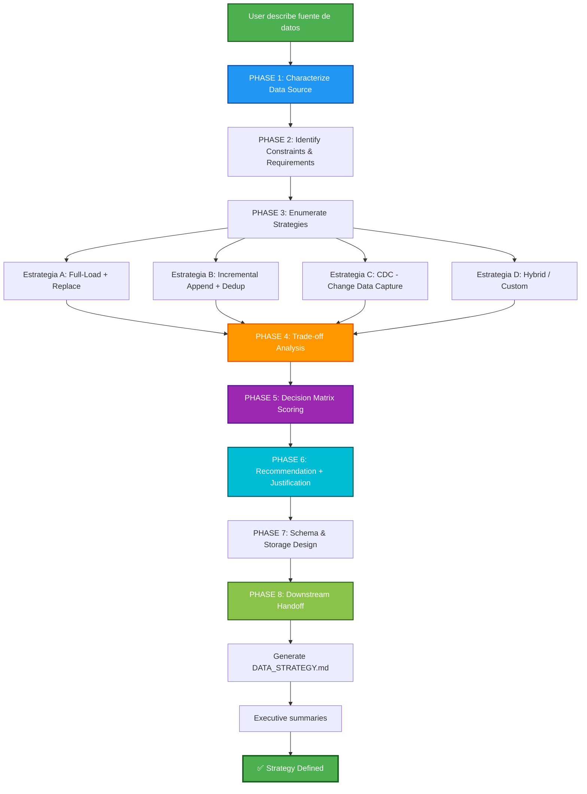

## PHASE_DEFINITION

### AECF_DATA_STRATEGY
output_file: AECF_01_AECF_DATA_STRATEGY.md
gate: none
loop_to: none
requires_plan_go: false

## TAXONOMY

skill_tier: TIER2
requires_determinism: false

# AECF SKILL — DATA STRATEGY (Data Ingestion & Storage Architecture)

------------------------------------------------------------

## MANDATORY CONTEXT LOAD

This skill operates under the following mandatory contexts:

- aecf_prompts/AECF_SYSTEM_CONTEXT.md
- aecf_prompts/SKILL_DISPATCHER.md (execution protocol)
- <workspace_root>/AECF_PROJECT_CONTEXT.md (if present anywhere in the active workspace)

Governance:
- aecf_prompts/_governance/AECF_EXECUTIVE_SUMMARY_GOVERNANCE.md

If any of these contexts exist, they MUST be considered active constraints.

Execution is INVALID if these contexts are not acknowledged.

------------------------------------------------------------

## EXECUTION MANDATE (IMPERATIVE)

When this skill is invoked, the AI MUST:

1. **AUTO-RESOLVE** all parameters (TOPIC, scope, numbering) per SKILL_DISPATCHER
2. **CHARACTERIZE** the data source (volume, velocity, variety, veracity)
3. **ANALYZE** all viable ingestion strategies with trade-offs
4. **EVALUATE** storage architecture alternatives (schema design, partitioning, normalization)
5. **REASON** about deduplication, idempotency, and incremental vs. full-load approaches
6. **SCORE** each strategy using the DATA_STRATEGY decision matrix
7. **RECOMMEND** the optimal strategy with justified reasoning
8. **PRODUCE** a handoff-ready document that feeds downstream skills (discovery, new_feature, plan, etc.)
9. **CREATE FILE** at `<DOCS_ROOT>/<user_id>/{{TOPIC}}/AECF_<NN>_DATA_STRATEGY.md`

**MANDATORY POST-EXECUTION GOVERNANCE (per SKILL_DISPATCHER)**:
- **UPDATE** `<DOCS_ROOT>/<user_id>/AECF_TOPICS_INVENTORY.json` for TOPIC lifecycle and **REGENERATE** `<DOCS_ROOT>/<user_id>/AECF_TOPICS_INVENTORY.md` (Step 4.1)
- **APPEND** one execution entry to `<DOCS_ROOT>/<user_id>/AECF_CHANGELOG.md` (Step 4.2)

**FORBIDDEN**:
- ❌ Responding only in chat without creating a file
- ❌ Asking the user for execution mode, output path, or AECF conventions
- ❌ Requiring verbose prompts — a simple `skill: data_strategy <data_source>` MUST be sufficient
- ❌ Recommending a strategy without quantified reasoning
- ❌ Ignoring cost, performance, or operational complexity trade-offs
- ❌ Generating implementation code (this skill is DESIGN-ONLY)
- ❌ Skipping the decision matrix or trade-off analysis

## TRACEABILITY METADATA ENFORCEMENT (MANDATORY)

Every document generated by this skill MUST include `## METADATA` following
`aecf_prompts/templates/TEMPLATE_HEADERS.md`.

The metadata block is INVALID unless it includes, at minimum:
- `Timestamp (UTC)`
- `Executed By`
- `Executed By ID`
- `Execution Identity Source`
- `Repository`
- `Branch`
- `Root Prompt`
- `Skill Executed`
- `Sequence Position`
- `Total Prompts Executed`

Missing metadata or missing traceability fields => INVALID SKILL EXECUTION.

------------------------------------------------------------

## Skill ID
`aecf_data_strategy`

## Description
Design the optimal data ingestion, storage and management strategy for high-volume data sources (e.g. Azure Cost Connector, APIs with gigabytes of data, data lakes, etc.). Analyzes trade-offs between multiple approaches, reasons the decision and generates a document that serves as direct input for downstream skills (discovery, new_feature, plan, refactor).

## When to Use
- Integrate a high-volume data source (Azure Cost, AWS Cost Explorer, Salesforce, etc.)
- Decide between separate tables vs. monolithic table
- Elegir entre carga incremental (append + dedup) vs. full-load + replace
- Design deduplication strategy (pre-ingestion vs. post-ingestion)
- Evaluate partitioning, indexing and data retention
- Define ETL/ELT strategy for data pipelines
- Pre-input for `aecf_new_feature` when the feature involves bulk data
- Pre-input to `aecf_plan` when the plan requires data decisions

## When NOT to Use
- Data source is trivial (< 10K records) and requires no strategy
- You just need to implement ingestion → use `aecf_new_feature` directly
- You only need to document an existing pipeline → use `aecf_document_legacy`
- Urgent fix in existing pipeline → use `aecf_hotfix`
- The problem is data security → use `aecf_security_review`

---

## Phases Executed



---

## Input Required

### Mandatory:
- **Data Source Description**: Which data source to integrate (ex: "Azure Cost Management Connector — daily cost data export")
- **TOPIC** (optional): Identifier (will be inferred if not provided)

### Optional (will be investigated or inferred if not provided):
- **Volume estimate**: Estimated data volume (GB/day, records/day)
- **Frequency**: Update frequency (real-time, hourly, daily, weekly)
- **Retention policy**: How long the data should be kept
- **Query patterns**: How the data will be consulted (dashboards, reports, analytics)
- **Existing infrastructure**: Current DB, services already in use
- **Budget constraints**: Infrastructure cost constraints
- **SLA requirements**: Data freshness requirements

---

## Execution Steps

### PHASE 1: CHARACTERIZE DATA SOURCE
**Action**: Analyze the data source according to the 4 Vs + operational context

Assess:
- **Volume**: Total size and per period (GB/day, rows/day, growth rate)
- **Velocity**: Data generation/update frequency
- **Variety**: Data structure (fixed schema, semi-structured, nested JSON, etc.)
- **Veracity**: Quality, consistency, possibility of duplicates at source
- **API/Connector Behavior**: API limits, pagination, rate limiting, export formats
- **Data Lifecycle**: Immutable data vs. mutable, retroactive corrections, re-statements

### PHASE 2: IDENTIFY CONSTRAINTS & REQUIREMENTS
**Action**: Map technical and business constraints

Assess:
- Existing infrastructure (DB engines, cloud services)
- Storage and compute budget
- Query latency requirements
- Data freshness requirements (data freshness SLA)
- Access patterns (OLTP, OLAP, mixed)
- Audit and compliance requirements
- Backfill/reprocessing needs
- Read/write concurrency

### PHASE 3: ENUMERATE STRATEGIES
**Action**: Identify all viable strategies (minimum 3, maximum 6)

Standard strategies to ALWAYS consider:

| ID | Strategy | Description |
|----|-----------|-------------|
| A | **Full-Load + Replace** | Download full dataset → truncate table → insert all. Simple but expensive in volume. |
| B | **Incremental Append + Post-Dedup** | Download new data (by date/timestamp) → insert → run post dedup. |
| C | **Incremental Append + Pre-Validation** | Download new data → check if it exists before inserting → insert only new. |
| D | **CDC (Change Data Capture)** | Capture only changes (inserts/updates/deletes) from the source. Requires source support. |
| E | **Partitioned Full-Load** | Full-load but only for the most recent period (e.g. last 30 days). Merge with history. |
| F | **Staging + Merge (ELT)** | Load to staging table → transform → merge with final table. Enterprise pattern. |

For each strategy identify:
- Technical description
- Prerequisitos
- Implementation complexity (1-5)
- Operational complexity (1-5)
- Relative estimated cost
- Risk of data loss
- Risk of duplicates
- Scalability

### PHASE 4: TRADE-OFF ANALYSIS
**Action**: Detailed pros/cons analysis of each strategy in the specific context

For EVERY viable strategy:
```
### Strategy [ID]: [Name]

**Pros**:
- [Pro 1 with justification]
- [Pro 2 with justification]

**Contras**:
- [Against 1 with impact]
- [Against 2 with impact]

**Best usage scenario**:
[When this strategy is ideal]

**Worst case scenario**:
[When this strategy fails]

**Estimated total cost (TCO)**:
- Storage: [low/medium/high]
- Compute: [low/medium/high]
- Development: [estimated hours]
- Maintenance: [low/medium/high]
```

### PHASE 5: DECISION MATRIX SCORING
**Action**: Quantitatively evaluate each strategy

Evaluation dimensions (configurable weight):

| Dimension | Default Weight | Description |
|-----------|-------------|-------------|
| Simplicity of implementation | 15% | Ease of development and integration |
| Operational cost | 20% | Storage + compute + recurring maintenance |
| Data integrity | 20% | Guarantee of not losing data or generating duplicates |
| Scalability | 15% | Ability to handle volume growth |
| Resilience / Recovery | 10% | Ability to recover from failures |
| Data latency | 10% | Time between generated data and queryable data |
| Maintainability | 10% | Ease of operating, monitoring and evolving |

Scoring: 1 (poor) → 5 (excellent) per dimension

**Output**: Table with weighted scores and final ranking

### PHASE 6: RECOMMENDATION + JUSTIFICATION
**Action**: Issue reasoned recommendation

Structure:
1. **Recommended strategy**: [ID + Name]
2. **Score final**: [X.XX / 5.00]
3. **3-point justification**: Why this one and not the others
4. **Residual risks**: What risks does this strategy accept?
5. **Proposed Mitigations**: Addressing Residual Risks
6. **Alternativa recomendada (plan B)**: Si la principal no es viable
7. **Conditions to change strategy**: Triggers that would invalidate the choice

### PHASE 7: SCHEMA & STORAGE DESIGN
**Action**: Design the storage schema and architecture at a high level

Include:
1. **Proposed data model**: Tables, relationships, key fields
- Single table or separate tables? (with justification)
- Normalization vs. denormalization? (with justification)
- Partitioning? (by date, by tenant, etc.)
2. **Estrategia de claves**: Primary keys, natural keys, surrogate keys
3. **Recommended indices**: Based on query patterns
4. **Deduplication strategy**: Specific technique (UPSERT, MERGE, window functions, hash-based, etc.)
5. **Retention policy**: How long, archived, purged
6. **Data flow diagram**: Source → Staging → Transform → Target

### PHASE 8: DOWNSTREAM HANDOFF
**Action**: Generate the handoff section for downstream skills

Produce structured information to:
- **Input for `aecf_discovery`**: What to look for in existing code
- **Input for `aecf_new_feature`**: Feature description pre-assembled with data decisions
- **Input for `aecf_plan`**: Design decisions already made, risks already evaluated
- **Input for `aecf_refactor`**: If there is an existing pipeline to refactor
- **Derived non-functional requirements**: Performance, storage, monitoring

---

## Total Estimated Time

| Scenario | Time |
|----------|------|
| **Simple** (well-known font, few options) | 20 - 45 min |
| **Standard** (complex font, multiple options) | 45 min - 1.5 hours |
| **Complex** (multiple sources, strict requirements) | 1.5 - 3 hours |

---

## Success Criteria

✅ Fully characterized data source (4 Vs)
✅ Minimum 3 strategies evaluated with trade-offs
✅ Decision matrix with quantitative scoring
✅ Clear recommendation with justification of 3+ points
✅ Proposed high-level scheme design
✅ Deduplication strategy defined and justified
✅ Handoff document generado para skills downstream  
✅ Residual risks identified with mitigations
✅ Complete generated documentation

---

## Example Usage

### Scenario: Azure Cost Management Connector

```
User: "I need to integrate Azure Cost Management Connector which can bring gigs
of cost data. I don't know if it is better to separate tables, bring daily information and
validate duplicates, or record everything and clean up later.
Use skill: data_strategy TOPIC: azure_cost_data"

AI (PHASE 1 - CHARACTERIZE):
→ Volume: 2-5 GB/day, ~500K rows/day, growth: linear with subscriptions
→ Velocity: Daily exports (batch), possible hourly for near-real-time
→ Variety: Schema semi-fijo (Cost Management export schema), JSON/CSV
→ Veracity: Frequent re-statements (Azure recalculates costs retroactively)

AI (PHASE 2 - CONSTRAINTS):
→ DB: PostgreSQL 15 / Azure SQL
→ Access patterns: Cost dashboards (OLAP), anomaly alerts
→ Retention: 24 months minimum (compliance)
→ Freshness: Data from the previous day available before 9am

AI (PHASE 3 - ENUMERATE):
→ Strategy A: Daily Full-Load + Replace last 60 days
→ Estrategia B: Incremental append + post-dedup con window functions
→ Estrategia C: Staging table → MERGE pattern → Production table
→ Estrategia E: Partitioned by month + full-load del mes actual

AI (PHASE 4 - TRADE-OFF ANALYSIS):
→ [Detailed analysis pros/cons of each one...]
→ Strategy C stands out for handling Azure re-statements
→ Strategy B fails with retroactive re-statements

AI (PHASE 5 - DECISION MATRIX):
| Dimension | Weight | A | B | C | E |
|------------------|------|------|------|------|------|
| Simplicity | 15% | 4 | 3 | 2 | 3 |
| Operational cost| 20% | 2 | 4 | 3 | 3 |
| Data integrity | 20% | 3 | 2 | 5 | 4 |
| Scalability | 15% | 2 | 4 | 4 | 4 |
| Resilience | 10% | 4 | 3 | 5 | 4 |
| Latency | 10% | 3 | 4 | 3 | 3 |
| Maintainability | 10% | 4 | 3 | 3 | 3 |
| **TOTAL**        |      |**2.95**|**3.25**|**3.65**|**3.45**|

AI (PHASE 6 - RECOMMENDATION):
→ ✅ RECOMMENDED: Strategy C — Staging + Merge (ELT)
→ Justification:
1. Azure re-statements cause pure append to generate incorrect data
   2. MERGE pattern maneja upserts nativamente
3. Staging table allows pre-insert validation
→ Plan B: Strategy E (partitioned + full of the current month)

AI (PHASE 7 - SCHEMA DESIGN):
→ 3 tables: cost_staging (temporary), cost_facts (production), cost_dimensions (lookup)
→ Partitioned by month in cost_facts
→ Dedup via MERGE ON (resource_id, date, meter_id)
→ Retention: 24 months in cost_facts, 7 days in staging

AI (PHASE 8 - HANDOFF):
→ Input para new_feature: "Implementar pipeline ELT con staging+merge para Azure Cost..."
→ Input for discovery: "Search for existing cost ingestion code..."
→ Derived NFRs: Daily process < 30 min, storage < 50 GB/year

📄 File created: documentation/azure_cost_data/AECF_01_DATA_STRATEGY.md
```

### Scenario: Multi-tenant SaaS Metrics

```
User: "We have to decide how to ingest usage metrics from our tenants.
Cada tenant genera ~100K eventos/hora. skill: data_strategy TOPIC: tenant_metrics"
```

### Scenario: Legacy Migration Assessment

```
User: "We are going to migrate a legacy ETL from Oracle to PostgreSQL. I need to evaluate
the best data strategy for the new pipeline. skill: data_strategy"
```

---

## Variations

### Quick Assessment
If the user just needs a quick recommendation:
- PHASE 1-2: Characterize + Constraints (compacto)
- PHASE 5-6: Decision matrix + Recommendation (sin trade-off extenso)
- Skip PHASE 7-8

### Multi-Source Strategy
If there are multiple data sources:
- Run PHASE 1-2 for each source
- PHASE 3-6 comparativa cruzada
- PHASE 7 with unified schema

### Strategy + Implementation (combo)
After data_strategy, automatically invoke:
1. `aecf_new_feature` con el handoff document como input
2. Or `aecf_plan` to plan the deployment

---

## Common Issues & Solutions

### Issue: Data source with re-statements (data that changes retroactively)
**Solution**: Discard pure append-only strategies. Prioritize MERGE/UPSERT or temporary window full-load.

### Issue: Volume grows exponentially
**Solution**: Evaluate partitioning + data lifecycle (hot/warm/cold). Consider specialized DB time-series.

### Issue: The query pattern is not known
**Solution**: Assume OLAP (dashboards/reports) as default. Document as a risk and propose a discovery phase of query patterns.

### Issue: Very limited budget
**Solution**: Prioritize simplicity over optimization. Full-load + replace with temporary window is usually the cheapest to operate.

### Issue: Real-time requirements but source is batch
**Solution**: Design for batch with upgrade option to near-real-time. Not over-engineering.

---

## Related Skills

- `aecf_new_feature` — To implement the designed pipeline
- `aecf_discovery` — To investigate existing ingestion code
- `aecf_document_legacy` — To document existing pipelines before redesign
- `aecf_tech_debt_assessment` — To evaluate technical debt in current pipelines
- `aecf_refactor` — To refactor existing pipelines according to the new strategy
- `aecf_security_review` — To audit security of sensitive data in the pipeline

---

## Outputs Generated

```
<DOCS_ROOT>/<user_id>/{{TOPIC}}/
├── AECF_<NN>_DATA_STRATEGY.md
```

---

## Downstream Skill Integration

The `DATA_STRATEGY.md` document generates specific handoff sections:

```
## DOWNSTREAM HANDOFF

### Para aecf_discovery
- Suggested scope: [directories/modules to investigate]
- Functionality to look for: [description]

### Para aecf_new_feature  
- Feature description: [pre-assembled with decision data]
- Acceptance criteria: [derived from the strategy]
- NFRs: [performance, storage, monitoring]

### Para aecf_plan
- Design decisions already made: [list]
- Risks already evaluated: [list with mitigations]
- Validated assumptions: [list]

### Para aecf_refactor
- Components to refactor: [if there is an existing pipeline]
- Behavior to preserve: [what should not change]
- Expected improvements: [target metrics]
```

---

## Completion Checklist

- [ ] Fully characterized data source
- [ ] Minimum 3 strategies evaluated
- [ ] Decision matrix completa con scoring
- [ ] Recommendation issued with justification
- [ ] Schema design at a high level documented
- [ ] Deduplication strategy defined
- [ ] Retention policies defined
- [ ] Handoff for downstream skills generated
- [ ] Documented residual risks
- [ ] Executive summaries generados

---

## CONTEXT VALIDATION

Confirm:

[ ] AECF_SYSTEM_CONTEXT.md loaded
[ ] Governance rules applied
[ ] Executive summary is optional on-demand via `skill_executive_summary`
[ ] Document includes `Executed By`


If not confirmed → STOP execution.

---

**SKILL READY FOR USE**

## AI_USAGE_DECLARATION

AI_USED = TRUE

## AI_EXPLAINABILITY_VALIDATION

- Explainability level defined? YES/NO
- User-facing explanation provided? YES/NO
- Model version logged? YES/NO
- Decision trace stored? YES/NO

## GOVERNANCE VALIDATION BLOCK

- Data lineage impact
- Model impact (YES/NO)
- Risk impact
- Compliance check


