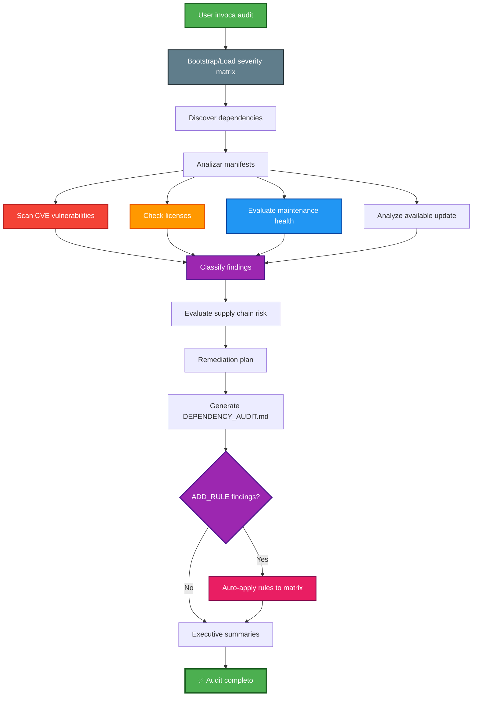

## PHASE_DEFINITION

### AECF_DEPENDENCY_AUDIT
output_file: AECF_01_AECF_DEPENDENCY_AUDIT.md
gate: none
loop_to: none
requires_plan_go: false

## TAXONOMY

skill_tier: TIER1
requires_determinism: true

# AECF SKILL — DEPENDENCY AUDIT (Supply Chain Security & Health)

------------------------------------------------------------

## MANDATORY CONTEXT LOAD

This skill operates under the following mandatory contexts:

- aecf_prompts/AECF_SYSTEM_CONTEXT.md
- aecf_prompts/SKILL_DISPATCHER.md (execution protocol)
- <workspace_root>/AECF_PROJECT_CONTEXT.md (if present anywhere in the active workspace)

Governance:
- aecf_prompts/_governance/AECF_EXECUTIVE_SUMMARY_GOVERNANCE.md

If any of these contexts exist, they MUST be considered active constraints.

Execution is INVALID if these contexts are not acknowledged.

------------------------------------------------------------

## EXECUTION MANDATE (IMPERATIVE)

When this skill is invoked, the AI MUST:

1. **AUTO-RESOLVE** all parameters (TOPIC, scope, numbering) per SKILL_DISPATCHER
2. **BOOTSTRAP/LOAD PROJECT SEVERITY MATRIX** at `<DOCS_ROOT>/AECF_DEPENDENCY_AUDIT_SEVERITY_MATRIX.md`
3. **IDENTIFY** all project dependencies from manifest files
4. **ANALYZE** each dependency for vulnerabilities, licensing, and health
5. **CLASSIFY** findings by severity using project matrix calibration and risk category
6. **GENERATE** remediation plan with upgrade paths
7. **CREATE FILE** at `<DOCS_ROOT>/<user_id>/{{TOPIC}}/AECF_<NN>_DEPENDENCY_AUDIT.md`

**MANDATORY POST-EXECUTION GOVERNANCE (per SKILL_DISPATCHER)**:
- **UPDATE** `<DOCS_ROOT>/<user_id>/AECF_TOPICS_INVENTORY.json` for TOPIC lifecycle and **REGENERATE** `<DOCS_ROOT>/<user_id>/AECF_TOPICS_INVENTORY.md` (Step 4.1)
- **APPEND** one execution entry to `<DOCS_ROOT>/<user_id>/AECF_CHANGELOG.md` (Step 4.2)

**FORBIDDEN**:
- ❌ Responding only in chat without creating a file
- ❌ Asking the user for execution mode, output path, or AECF conventions
- ❌ Requiring verbose prompts — a simple `skill: dependency_audit` MUST be sufficient
- ❌ Modifying any dependency files (this skill is READ-ONLY, report-only)
- ❌ Ignoring transitive dependencies

## MANDATORY REPOSITORY DISCOVERY (SEARCH-FIRST)

This skill requires explicit repository discovery before executing its first audit/analysis step.

Execution rules:
1. Execute an initial repository search pass within scope using IDE capabilities.
2. Build an execution-scoped `WORKING_CONTEXT` before starting the first skill step.
3. If discovery evidence is incomplete, set discovery status to NO-GO and STOP.

Minimum `WORKING_CONTEXT` for search-first execution:
- `TARGET_SCOPE`
- `ENTRY_POINTS_OR_ARTIFACTS`
- `DISCOVERED_PATHS`
- `CONFIG_AND_DEPENDENCIES`
- `UNCERTAINTIES_AND_ASSUMPTIONS`
- `SOURCE_REFERENCES` (concrete file paths and line-level references)

Forbidden:
- Skipping discovery and jumping directly to analysis.
- Assuming repository structure without verification.
- Reusing shared static discovery files across executions.

## TRACEABILITY METADATA ENFORCEMENT (MANDATORY)

Every document generated by this skill MUST include `## METADATA` following
`aecf_prompts/templates/TEMPLATE_HEADERS.md`.

The metadata block is INVALID unless it includes, at minimum:
- `Timestamp (UTC)`
- `Executed By`
- `Executed By ID`
- `Execution Identity Source`
- `Repository`
- `Branch`
- `Root Prompt`
- `Skill Executed`
- `Sequence Position`
- `Total Prompts Executed`

Missing metadata or missing traceability fields => INVALID SKILL EXECUTION.

------------------------------------------------------------

## Skill ID
`aecf_dependency_audit`

## Description
Comprehensive audit of project dependencies that evaluates known vulnerabilities (CVEs), maintenance health, license compatibility, available update and supply chain risk. Complements `aecf_security_review` with specific focus on third parties.

## When to Use
- Pre-release → verificar supply chain limpio
- Periodic evaluation of dependencies (monthly/quarterly)
- Post `aecf_security_review` → profundizar en dependency risk
- Evaluation of new project → due diligence of dependencies
- After receiving security alert (Dependabot, Snyk, etc.)
- Input para `aecf_tech_debt_assessment` → dependency debt

## When NOT to Use
- Own code audit → use `aecf_code_standards_audit`
- Comprehensive security audit → use `aecf_security_review`
- Urgent fix for vulnerable dependency → use `aecf_hotfix`
- Only assess technical debt → use `aecf_tech_debt_assessment`

---

## Project Severity Matrix Bootstrap (MANDATORY)

To avoid cross-run severity drift, this skill MUST use a **project-local severity matrix**:

- **Path**: `<DOCS_ROOT>/AECF_DEPENDENCY_AUDIT_SEVERITY_MATRIX.md`
- **Scope**: Applies only to the current project/workspace

### Bootstrap rule

On the first execution in a project:
1. If the matrix file does NOT exist, CREATE it from template:
   - `aecf_prompts/templates/DEPENDENCY_AUDIT_SEVERITY_MATRIX_TEMPLATE.md`
2. Mark it as baseline (`v1`) for the project.
3. Use that matrix to classify severities.

On subsequent executions:
1. LOAD the existing project matrix.
2. Reuse its severities to keep reports consistent.
3. If a new, uncataloged finding appears, classify as `MATRIX-PENDING` (provisional severity based on tie-breaker rules), and append a proposed new rule section in the audit report.

### Classification Decision Protocol (ADD vs NO-ADD)

When a finding is `MATRIX-PENDING`, the AI MUST decide if a new matrix rule should be added.

Decision criteria:
1. **Repetibility**: Is this dependency pattern likely to reappear in this project?
2. **Impact class**: CVE severity / license incompatibility / maintenance abandonment risk.
3. **Distinctiveness**: Is this truly new, or already covered by an existing Rule ID?
4. **Actionability**: Can the rule be written with objective evidence and deterministic threshold?

Decision outcomes:
- `ADD_RULE`: Create a proposed Rule ID and recommendation to update matrix version.
- `NO_ADD_RULE`: Keep mapped to nearest existing rule and document rationale.

Mandatory evidence for decision:
- Finding location (dependency name, manifest file, line if applicable)
- Proposed or mapped Rule ID
- Rationale (1-3 lines, objective)
- Provisional severity used during this run

### Matrix Auto-Apply Protocol (MANDATORY)

When the Classification Decision Protocol produces `ADD_RULE` decisions, the AI MUST **automatically apply them** to the project severity matrix as part of the skill execution — no separate skill, no user confirmation needed.

**Auto-apply steps (executed AFTER report generation, BEFORE executive summaries)**:

1. **Filter**: Collect all findings with decision `ADD_RULE` from the Classification Decision Log.
2. **Validate**: Confirm each proposed rule has:
   - Unique Rule ID (not colliding with existing rules)
   - Clear Condition text (objective, deterministic)
   - Justified Severity (backed by CVE severity, license risk, or tie-breaker rules)
3. **Apply**: For each validated `ADD_RULE`:
   - INSERT the new row into the `## Canonical Rules` table of `<DOCS_ROOT>/AECF_DEPENDENCY_AUDIT_SEVERITY_MATRIX.md`
   - Place it in the correct category group (alphabetical by Rule ID within category)
4. **Version bump**: Increment the matrix version:
   - Minor bump for additions: `v1` → `v1.1`, `v1.1` → `v1.2`
   - Update `Last Updated` date
   - Change `Status` from `baseline` to `active` (if first update)
5. **Changelog**: Append entry with format:
   ```
   - vX.Y: Added RULE-ID (description) from TOPIC audit. Source: documentation/TOPIC/AECF_NN_DOCUMENT.md (YYYY-MM-DD).
   ```
6. **Report cross-reference**: In the audit report's Classification Decision Log, mark applied rules as `✅ AUTO-APPLIED` instead of just `ADD_RULE`.

**Rules for `NO_ADD_RULE`**: Document in report only. Do NOT touch matrix file.

**Conflict resolution**: If Rule ID collision, append numeric suffix. If matrix missing/corrupted, bootstrap from template first.

---

## Executive Summary Requirements for Matrix Decisions (MANDATORY)

For `aecf_dependency_audit`, both executive summaries MUST explicitly report matrix governance:

1. **Classification Decision Log**
   - Total `MATRIX-PENDING`
   - `ADD_RULE` count (with `✅ AUTO-APPLIED` status)
   - `NO_ADD_RULE` count

2. **Pending Findings Review List**
   - List each pending finding with:
     - dependency name / manifest location
     - provisional severity
     - proposed/mapped Rule ID
     - decision (`ADD_RULE` / `NO_ADD_RULE`)
     - short rationale

3. **Matrix update recommendation**
   - Auto-applied rules listed with new matrix version
   - If any `ADD_RULE`, confirm matrix version bump was applied

### Non-goal

This matrix is **NOT global AECF policy** and MUST NOT be centralized for all projects.
Each project owns and evolves its own matrix at `<DOCS_ROOT>/AECF_DEPENDENCY_AUDIT_SEVERITY_MATRIX.md`.

---

## Phases Executed



---

## Input Required

### Mandatory:
- **Scope**: Project or directory with dependency manifests
- **TOPIC** (optional): Audit identifier (will be inferred from the scope)

### Optional:
- **Manifest files**: Specific paths (requirements.txt, package.json, etc.)
- **License policy**: Licenses allowed/prohibited by the organization
- **Previous audit**: Previous audit to compare trend
- **Severity threshold**: Minimum level to report

---

## Dependency Analysis Dimensions

### 1. Vulnerability Analysis (CVE Scanning)
**Sources**: CVE databases, NVD, GitHub Advisory Database, OSV
- Known CVEs in direct dependencies
- Known CVEs in transitive dependencies
- CVSS score per vulnerability
- Exploitability assessment
- Fix availability (patched version exists?)

**Severity mapping**:
| CVSS Score | Severity | Action |
|-----------|----------|--------|
| 9.0–10.0 | CRITICAL | Upgrade immediately, blocks release |
| 7.0–8.9 | HIGH | Upgrade in current sprint |
| 4.0–6.9 | MEDIUM | Plan upgrade |
| 0.1–3.9 | LOW | Backlog |

### 2. License Compliance
**Analysis**:
- License type per dependency (MIT, Apache, GPL, LGPL, BSD, etc.)
- Copyleft vs permissive classification
- Commercial compatibility
- License chain in transitive dependencies
- License conflicts between dependencies

**Risk levels**:
| License Type | Risk | Notes |
|-------------|------|-------|
| MIT, BSD, Apache 2.0 | LOW | Permissive, commercial-friendly |
| LGPL | MEDIUM | Copyleft with linking exception |
| GPL v2/v3 | HIGH | Copyleft, viral — may require source disclosure |
| AGPL | CRITICAL | Network copyleft — requires source for SaaS |
| Unknown/Custom | HIGH | Requires legal review |
| No license | CRITICAL | No usage rights granted |

### 3. Maintenance Health
**Indicators**:
| Indicator | Healthy | Warning | Critical |
|-----------|---------|---------|----------|
| Last release | < 6 months | 6–18 months | > 18 months |
| Open issues response | < 30 days | 30–90 days | > 90 days |
| Maintainer count | ≥ 3 | 2 | 1 (bus factor risk) |
| Community activity | Active | Declining | Inactive |
| Deprecation notice | No | Announced | Deprecated |

### 4. Version Freshness
**Analysis**:
- Current version vs latest available
- Number of versions behind
- Breaking changes in upgrade path
- Changelog review for security-relevant changes
- Compatibility with project's runtime version

**Freshness classification**:
| Versions Behind | Status | Action |
|----------------|--------|--------|
| 0 (latest) | ✅ Current | None |
| 1–2 minor | ⚠️ Slightly behind | Plan update |
| 1+ major | 🔴 Significantly behind | Prioritize update |
| End of life | 🔴 Critical | Immediate migration |

### 5. Supply Chain Risk
**Assessment**:
- Dependency count (direct + transitive)
- Dependency tree depth
- Single points of failure (critical deps with 1 maintainer)
- Typosquatting risk (similar package names)
- Known supply chain attacks on deps
- Build reproducibility

---

## Execution Steps

### Step 1: DISCOVER DEPENDENCIES
**Input**: Workspace scope
**Action**: Locate and parse all dependency manifest files
**Expected time**: 5–10 min

**Supported manifests**:
| Language | Manifest Files |
|----------|---------------|
| Python | requirements.txt, setup.py, setup.cfg, pyproject.toml, Pipfile |
| JavaScript/Node | package.json, yarn.lock, pnpm-lock.yaml |
| .NET | *.csproj, packages.config, Directory.Build.props |
| Java | pom.xml, build.gradle |
| Go | go.mod |
| Rust | Cargo.toml |
| Ruby | Gemfile |

**Output**: Complete dependency inventory (direct + transitive where determinable)

### Step 2: VULNERABILITY SCAN
**Input**: Dependency inventory
**Action**: Check each dependency against known CVE databases
**Expected time**: 10–20 min
**Output**: Vulnerability findings with CVSS scores

### Step 3: LICENSE AUDIT
**Input**: Dependency inventory
**Action**: Identify license for each dependency
**Expected time**: 5–10 min
**Output**: License compatibility matrix

### Step 4: HEALTH ASSESSMENT
**Input**: Dependency inventory
**Action**: Evaluate maintenance health indicators
**Expected time**: 10–15 min
**Output**: Health report per dependency

### Step 5: FRESHNESS ANALYSIS
**Input**: Dependency inventory + current pinned versions
**Action**: Compare current versions vs latest available
**Expected time**: 5–10 min
**Output**: Upgrade opportunity inventory

### Step 6: SUPPLY CHAIN RISK ASSESSMENT
**Input**: All analysis results
**Action**: Aggregate risk scoring
**Expected time**: 5–10 min

**Supply Chain Risk Score**:
$$
\text{Risk Score} = \frac{(\text{CVE Risk} \times 3) + (\text{License Risk} \times 2) + (\text{Health Risk} \times 2) + (\text{Freshness Risk} \times 1)}{8} \times 100
$$

| Score | Classification | Action |
|-------|---------------|--------|
| 0–20 | LOW | Healthy supply chain |
| 21–40 | MODERATE | Minor improvements needed |
| 41–60 | ELEVATED | Significant attention needed |
| 61–80 | HIGH | Urgent remediation required |
| 81–100 | CRITICAL | Supply chain compromised |

### Step 7: GENERATE REMEDIATION PLAN
**Input**: All findings
**Action**: Prioritized upgrade/migration plan
**Expected time**: 10–15 min

**Remediation actions**:
- **Upgrade**: Update to patched version (preferred)
- **Replace**: Migrate to alternative package
- **Remove**: Eliminate unnecessary dependency
- **Pin**: Lock version to avoid auto-upgrade to vulnerable release
- **Accept**: Document and accept risk (with justification)
- **Isolate**: Sandbox the dependency to limit blast radius

### Step 8: GENERATE AUDIT REPORT
**Output**: `<DOCS_ROOT>/<user_id>/{{TOPIC}}/AECF_<NN>_DEPENDENCY_AUDIT.md`
**Expected time**: 10 min
**Content**:
1. Audit Overview
2. **Sections Analyzed — Navigation Index** (with links to findings)
3. Dependency Inventory Summary
4. Vulnerability Findings (by severity)
5. License Compliance Matrix
6. Maintenance Health Dashboard
7. Version Freshness Report
8. Supply Chain Risk Score
9. Prioritized Remediation Plan (con skills AECF recomendados)
10. Trend Comparison (if previous audit exists)
11. Recommendations

> **MANDATORY**: Prior to detailed findings, the report MUST include:
>
> ## 🗂️ Sections Analyzed — Navigation Index
>
> | # | Section Analyzed | Findings | Link |
> |---|-------------------|----------|------|
> | 1 | Vulnerability Analysis (CVEs) | N CRITICAL, M HIGH | [→ Findings and Remediation](#vulnerability-findings) |
> | 2 | License Compliance | N CRITICAL, M HIGH | [→ Findings and Remediation](#license-compliance-matrix) |
> | 3 | Maintenance Health | N WARNING | [→ Findings and Remediation](#maintenance-health-dashboard) |
> | 4 | Version Freshness | N behind | [→ Findings and Remediation](#version-freshness-report) |
> | 5 | Supply Chain Risk | Score: X/100 | [→ Findings and Remediation](#supply-chain-risk-score) |
>
> Replace with actual counts.

### 🔧 Remediation Skill Mapping (MANDATORY)

**For EACH CRITICAL or HIGH finding, the remediation plan MUST recommend the appropriate AECF skill**:

| Type of Finding | Recommended Skill | Description |
|------------------|-------------------|-------------|
| CVE in direct dependency (upgrade available) | `aecf_refactor` | Update dependency to patched version |
| CVE in direct dependency (without upgrade) | `aecf_refactor` | Migrate to alternative or isolate |
| CVE in transitive dependency | `aecf_refactor` | Update parent or pin secure version |
| Incompatible license (GPL/AGPL) | `aecf_refactor` | Replace with compatible licensed alternative |
| Abandoned outbuilding | `aecf_tech_debt_assessment` → `aecf_refactor` | Evaluate alternatives and migrate |
| End-of-life dependency | `aecf_refactor` | Immediate migration to supported version |
| Over-dependency | `aecf_refactor` | Remove dependency and implement internally |
| High supply chain risk | `aecf_security_review` | Complete security audit |

❌ **NEVER recommend internal prompts/phases directly** (ex: `06_FIX_CODE`)
✅ **ALWAYS recommend the skill** that will internally dispatch the correct phases

### Step 9: EXECUTIVE SUMMARY (ON-DEMAND)

**Output (optional)**:


**Invocation**: `skill: executive_summary TOPIC: <topic_name>`

---

## Total Estimated Time

| Scenario | Time |
|----------|------|
| **Small project** (< 20 dependencies) | 30 – 45 min |
| **Medium project** (20–80 dependencies) | 45 min – 1.5 horas |
| **Large project** (80+ dependencies) | 1.5 – 3 horas |
| **Focused audit** (specific dependencies) | 20 – 40 min |

---

## Success Criteria

✅ All dependency manifests identified and parsed  
✅ Local matrix available in `<DOCS_ROOT>/AECF_DEPENDENCY_AUDIT_SEVERITY_MATRIX.md` (created or loaded)
✅ Documented `ADD_RULE` / `NO_ADD_RULE` decisions for `MATRIX-PENDING`
✅ Vulnerability scan completed for all dependencies  
✅ License compatibility verified  
✅ Maintenance health evaluated  
✅ Version freshness analyzed  
✅ Supply chain risk score calculated  
✅ Prioritized remediation plan generated  
✅ Report file created  
✅ Executive summaries generated  

---

## Scoring Does NOT Apply (Audit Skill)

This skill produces its own **Supply Chain Risk Score**. Applying AECF_SCORING would be redundant.

**Native scoring**: Supply Chain Risk Score (0–100)

**Alternative Evaluation**: Audit Completeness

| Aspect | Status |
|--------|--------|
| All manifests parsed | ✓/✗ |
| CVE scan completed | ✓/✗ |
| License audit completed | ✓/✗ |
| Health assessment completed | ✓/✗ |
| Freshness analysis completed | ✓/✗ |
| Remediation plan generated | ✓/✗ |

**Completeness: X/6**

---

## Example Usage

### Scenario 1: Full project audit
```
User: "skill: dependency_audit. TOPIC: dep_audit_q1"

AI:
✅ Skill recognized: aecf_dependency_audit
📌 TOPIC: dep_audit_q1
📂 Scope: [workspace root]
🔢 Next number: 01
📄 Output: documentation/dep_audit_q1/AECF_01_DEPENDENCY_AUDIT.md

[Executes full audit...]
```

### Scenario 2: Specific project
```
User: "Audit dependencies of sentinel-multichat/backend. TOPIC: dep_audit_backend"
```

### Scenario 3: Post-Dependabot alert
```
User: "Dependabot reported vulnerabilities. Audit all dependencies and
generar plan de upgrade. TOPIC: dep_audit_alert"
```

---

## Outputs Generated

```
<DOCS_ROOT>/<user_id>/{{TOPIC}}/
├── AECF_01_DEPENDENCY_AUDIT.md
```

---

## Related Skills

- `aecf_security_review` — Supplementary (security review covers code, dependency audit covers third parties)
- `aecf_tech_debt_assessment` — Dependency debt is a category of tech debt
- `aecf_release_readiness` — Supply chain clean es prerequisito de release
- `aecf_maturity_assessment` — Feeds dimension 5 (Security audit rigor)

---

## CONTEXT VALIDATION

Confirm:

[ ] AECF_SYSTEM_CONTEXT.md loaded
[ ] Governance rules applied
[ ] All dependency manifests parsed
[ ] CVE scan completed
[ ] License audit completed
[ ] Supply Chain Risk Score calculated
[ ] Executive summary is optional on-demand via `skill_executive_summary`
[ ] Document includes `Executed By`


If not confirmed → STOP execution.

---

**SKILL READY FOR USE**

## AI_USAGE_DECLARATION

AI_USED = TRUE

## AI_EXPLAINABILITY_VALIDATION

- Explainability level defined? YES/NO
- User-facing explanation provided? YES/NO
- Model version logged? YES/NO
- Decision trace stored? YES/NO

## GOVERNANCE VALIDATION BLOCK

- Data lineage impact
- Model impact (YES/NO)
- Risk impact
- Compliance check


