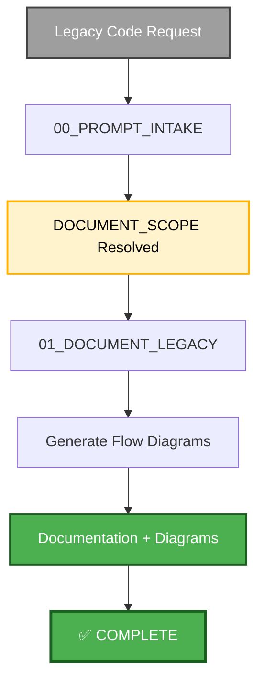
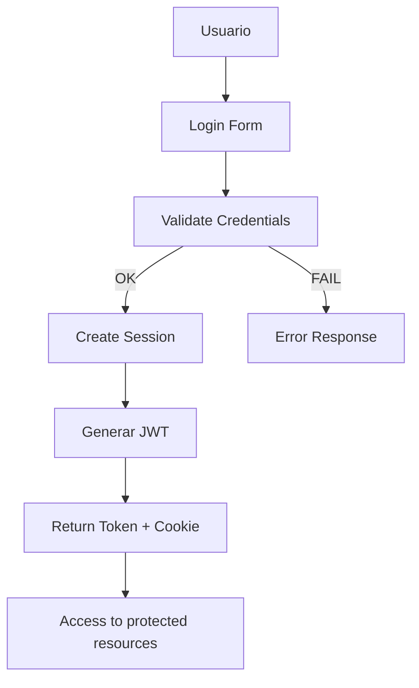

## PHASE_DEFINITION

### AECF_DOCUMENT_LEGACY
output_file: AECF_01_AECF_DOCUMENT_LEGACY.md
requires_prompt: true
gate: none
loop_to: none
requires_plan_go: false

## TAXONOMY

skill_tier: TIER2
requires_determinism: false

# AECF SKILL — DOCUMENT LEGACY (Code Documentation)

------------------------------------------------------------

## MANDATORY CONTEXT LOAD

This skill operates under the following mandatory contexts:

- aecf_prompts/AECF_SYSTEM_CONTEXT.md
- aecf_prompts/SKILL_DISPATCHER.md (execution protocol)
- <workspace_root>/AECF_PROJECT_CONTEXT.md (if present anywhere in the active workspace)

Governance:
- aecf_prompts/_governance/AECF_EXECUTIVE_SUMMARY_GOVERNANCE.md

If any of these contexts exist, they MUST be considered active constraints.

Execution is INVALID if these contexts are not acknowledged.

------------------------------------------------------------

## EXECUTION MANDATE (IMPERATIVE)

When this skill is invoked, the AI MUST:

1. **AUTO-RESOLVE** all parameters (TOPIC, scope, numbering) per SKILL_DISPATCHER
2. **EXECUTE** the deterministic sequence `INTAKE -> AECF_DOCUMENT_LEGACY` by default, or `INTAKE -> PLAN -> AUDIT_PLAN -> IMPLEMENT -> AUDIT_CODE -> VERSION -> AECF_DOCUMENT_LEGACY` when `document_code=True`
3. **RESOLVE** the prompt into a compact `DOCUMENT_SCOPE` handoff before writing the final documentation artifact, or before handing off into `PLAN` when `document_code=True`
4. **ANALYZE** all code in scope exhaustively using the resolved scope and repository evidence gathered during `AECF_DOCUMENT_LEGACY`
5. **CREATE FILE** at `<DOCS_ROOT>/<user_id>/{{TOPIC}}/AECF_<NN>_DOCUMENT_LEGACY.md`
6. **EMBED** the verified high-level Mermaid flow directly inside `## 3. High-Level Flow`, graphically mirroring the same ordered steps described in text; if no verified diagram is possible, write `NOT_APPLICABLE` there with the supporting reason

**MANDATORY POST-EXECUTION GOVERNANCE (per SKILL_DISPATCHER)**:
- **UPDATE** `<DOCS_ROOT>/<user_id>/AECF_TOPICS_INVENTORY.json` for TOPIC lifecycle and **REGENERATE** `<DOCS_ROOT>/<user_id>/AECF_TOPICS_INVENTORY.md` (Step 4.1)
- **APPEND** one execution entry to `<DOCS_ROOT>/<user_id>/AECF_CHANGELOG.md` (Step 4.2)

**FORBIDDEN**:
- ❌ Responding only in chat without creating files
- ❌ Asking the user for execution mode, output path, or AECF conventions
- ❌ Requiring verbose prompts — a simple `skill: document_legacy <target>` MUST be sufficient
- ❌ Modifying business logic, control flow, data structures, schemas, dependencies, feature flags, or runtime behavior

## DOCUMENT_CODE MODE (MANDATORY)

Default behavior remains read-only.

If `document_code=True` is explicitly provided:

- The skill MAY update existing documentation surfaces in code and docs, but only when the change is documentation-only.
- Allowed modifications are limited to docstrings, inline comments, README or API docs, usage notes, examples, and descriptive text that mirrors already-verified behavior.
- The skill MUST route through `PLAN` governance before emitting implementation-style changes.
- The skill MUST NOT introduce, remove, or alter executable logic.
- If the request requires behavioral change, the skill MUST stop documenting-only changes and recommend `aecf_refactor` or `aecf_new_feature`.

## FILE EVIDENCE POLICY (MANDATORY)

If the runtime provides `Target resolution status` for explicit requested files:

- You MUST treat `MISSING` targets as not accessible.
- You MUST NOT infer, reconstruct, or fabricate code details for `MISSING` targets.
- You MUST include an explicit `MISSING/NOT ACCESSIBLE` note for each missing target.
- Deep documentation is allowed only for targets marked `FOUND`.

Allowed operation scope for this skill is strictly one of:
- Existing files explicitly requested by the user
- Existing folders explicitly requested by the user
- Entire destination workspace (when no explicit file/folder target is provided)

If explicit file/folder targets are provided and any target does not exist,
execution is INVALID and must not continue as normal documentation.

Any invented code-level detail for `MISSING` targets is an INVALID execution.

## TARGET PRIORITY CONTRACT (MANDATORY, DEFAULT)

This default contract applies even when the user prompt is minimal.

If the user specifies target scope in destination workspace, prioritize in this order:
1. explicit file target
2. explicit function/method/class target (must map to its real file/symbol)
3. explicit folder target
4. explicit project/workspace target

Rules:
- Never ignore a user-specified target type.
- If a function/method/class is requested, document the containing file + symbol evidence.
- If symbol cannot be resolved with available runtime evidence, mark as `MISSING/NOT ACCESSIBLE` and use `## BLOCKED_EVIDENCE`.
- If no explicit target is provided, default scope is existing destination workspace assets only.

## DOCUMENTATION QUALITY GATE (MANDATORY)

The generated documentation MUST be evidence-based, technical, and auditable.

Mandatory evidence contract:
- Every technical claim MUST include at least one concrete code evidence reference.
- Evidence reference format in the document body: `path :: symbol_or_block :: lines_or_reason`.
- If exact lines are unavailable in runtime, use `lines_or_reason = exact lines unavailable in runtime`.
- No section may be purely narrative; each section MUST include code-grounded evidence.

Minimum quality thresholds:
- `## 2. Entry Points`: include ALL confirmed entry points in scope (or explicitly state `NONE FOUND`).
- `## 3. High-Level Flow`: each flow step must reference the function/module that executes it, and the section must include a Mermaid flowchart that mirrors those verified steps whenever the diagram decision is `DIAGRAMMABLE`.
- `## 4. Technical Flow (Detailed)`: include call sequence with at least one evidence reference per step.
- `## 5. Dependency Map`: every dependency listed MUST include where it is imported or invoked.
- `## 7. I/O and Side Effects`: each side effect must identify trigger location in code.
- `## 9. Known Unknowns`: each unknown must explain what evidence is missing and why certainty is blocked.

Automatic rejection criteria (INVALID execution):
- Generic prose without code evidence.
- Marketing/UX style narrative not tied to source code.
- Inferred behavior presented as fact without explicit evidence.
- Section headings present but content empty, repetitive, or non-technical.

## SOURCE ACQUISITION CONTRACT (MANDATORY)

If a target is marked `FOUND`, the AI MUST acquire direct source evidence before documenting:

- Use your file-reading tools to read each `FOUND` target directly from the repository; the orchestrator does NOT pre-load file content into the prompt.
- Extract verifiable symbols and blocks from the actual file, using grep/search tools as needed.
- `FOUND` + no direct code evidence is INVALID.
- The fallback sentence "content not included in visible context" is ONLY allowed when a tool read is technically blocked (e.g., tool unavailable, permission denied).

If technical blocking occurs, include a dedicated section `## BLOCKED_EVIDENCE` with:
- blocked target path
- blocking reason (tool/runtime limitation)
- exact evidence missing
- exact next retrieval step to unblock (without fabricating behavior)

Without `BLOCKED_EVIDENCE`, no deep section may be delivered for that blocked target.

## EXTENSIVE OUTPUT CONTRACT (MANDATORY)

The generated document MUST be extensive and implementation-grounded for each `FOUND` target.

Mandatory structure (all sections required):
1. Purpose and Scope
2. Entry Points
3. High-Level Flow
4. Technical Flow (Detailed)
5. Dependency Map
6. Configuration & Environment
7. I/O and Side Effects
8. Error Handling and Resilience
9. Operational Safety / Idempotence
10. Observability and Diagnostics
11. Legacy Code Quality Findings
12. Tests to Add
13. Prioritized Risks
14. Recommended Next Skills (AECF chain)

Mermaid generation contract:
- Generate Mermaid only when the verified evidence supports a real diagram candidate: concept map, lifecycle, control flow, state transition, dependency path, or end-to-end execution path.
- If the high-level flow is diagrammable, `## 3. High-Level Flow` MUST embed one evidence-based ```mermaid block that graphically restates the same verified steps already listed in text.
- Do NOT generate separate `.mmd` files; all Mermaid content MUST live inside the `AECF_<NN>_DOCUMENT_LEGACY.md` artifact.
- Supplemental Mermaid blocks are optional and may appear later in the document only when they add verified detail beyond the high-level flow.
- If no verified diagram candidate exists, the markdown MUST include an explicit `NOT_APPLICABLE` decision with the reason and supporting evidence; do not fabricate a decorative diagram.
- Every Mermaid node, edge, and label MUST map to verified evidence already cited in the document.

Depth requirements:
- Each section MUST include `Evidence` and `Concrete Example` subsections.
- Each section MUST include at least one code-grounded example tied to a real symbol/block.
- Include at least one call path or control-flow path rendered as ordered steps.
- Include at least one table with `Evidence`, `Impact`, `Recommendation` columns.
- If scope is a single file, include a function-by-function map.

## CLICKABLE CODE REFERENCES (MANDATORY FORMAT)

All evidence references MUST be clickable in IDE contexts (especially VS Code).

Mandatory dual format when line locations are known:
- Markdown link for rendered docs
- VS Code-friendly `path:line` (or `path:start-end`) in plain text on the same bullet/line

Required link formats:
- File only: `[path/to/file.py](path/to/file.py)`
- Single line: `[path/to/file.py#L42](path/to/file.py#L42)`
- Range: `[path/to/file.py#L42-L58](path/to/file.py#L42-L58)`

Required VS Code plain-text formats:
- Single line: `path/to/file.py:42`
- Range: `path/to/file.py:42-58`

Example (required style):
- `Evidence: [path/to/file.py#L42-L58](path/to/file.py#L42-L58) (path/to/file.py:42-58)`

Rules:
- Prefer workspace-relative paths.
- Use POSIX separators (`/`) in paths.
- Avoid absolute drive paths (`C:\...`) in evidence links.
- Never fabricate line numbers.
- If exact lines are unavailable, use file-level link + explicit reason.
- Every critical claim (entry point, side effect, dependency, risk) MUST include one clickable evidence link.

## NEXT-SKILL RECOMMENDATION MATRIX (MANDATORY)

Section `## 14. Recommended Next Skills (AECF chain)` MUST include:
- At least 3 recommended skills (or fewer only if justified by scope)
- Why each skill applies now (trigger/evidence-based)
- Expected artifact/output from that skill
- Suggested invocation command ready to run
- Only existing AECF skills are allowed; inventing skill IDs is INVALID execution.

Preferred chain after `document_legacy` (adapt per evidence):
- `aecf_code_standards_audit`
- `aecf_tech_debt_assessment`
- `aecf_security_review`
- `aecf_refactor`
- `aecf_system_replayability_adaptive`

## TRACEABILITY METADATA ENFORCEMENT (MANDATORY)

Every document generated by this skill MUST include `## METADATA` following
`aecf_prompts/templates/TEMPLATE_HEADERS.md`.

The metadata block is INVALID unless it includes, at minimum:
- `Timestamp (UTC)`
- `Executed By`
- `Executed By ID`
- `Execution Identity Source`
- `Repository`
- `Branch`
- `Root Prompt`
- `Skill Executed`
- `Sequence Position`
- `Total Prompts Executed`

Missing metadata or missing traceability fields => INVALID SKILL EXECUTION.

------------------------------------------------------------

## Skill ID
`aecf_document_legacy`

## Description
Document existing legacy functionality before modifying it or as a code understanding exercise.

## When to Use
- You need to modify legacy code without documentation
- Audit existing functionality before changes
- Understand legacy system
- Onboarding of new equipment
- Prepare refactoring of old code

## When NOT to Use
- New code (should already be documented)
- Well documented code
- Emergencies (P1/P2) → use `aecf_hotfix`

---

## Phases Executed



---

## Input Required

### Mandatory:
- **Functionality description**: Description of what the code to be documented does
- **Entry point**: Main file/function (optional, searchable)
- **TOPIC**: Identificador (ej: "user_auth", "payment_proc")

### Optional:
- **Scope**: Limits of what to document (specific modules)
- **Purpose**: Why it is documented (modify, audit, etc.)

---

## Execution Steps

### Step 1: INTAKE (00_PROMPT_INTAKE.md)
**Input**: Legacy code request + functionality description
**Output**: `aecf_prompts/<DOCS_ROOT>/<user_id>/<RUN_DATE>/{{TOPIC}}/AECF_00_PROMPT_INTAKE.md`
**Expected time**: 5-10 min
**Actions**:
1. Resolve the real documentation scope inside the workspace
2. Identify likely entry points, relevant modules, and explicit targets from the prompt and topic
3. Capture a compact evidence snapshot and outstanding unknowns before governed execution starts
4. Ask for clarification if the target or scope is still ambiguous
5. Recommend `EXECUTE` only when the prompt is sufficiently resolved

**Mandatory output contract**:
- `## Request Understanding`
- `## Already Resolved`
- `## Evidence Snapshot`
- `## Outstanding Questions`
- `## Recommended Entry Phase`
- `## Next Step`

### Step 2: EXECUTE (01_DOCUMENT_LEGACY.md)
**Input**: Resolved `DOCUMENT_SCOPE` from INTAKE + legacy code in scope
**Output**:
- `<DOCS_ROOT>/<user_id>/{{TOPIC}}/AECF_01_DOCUMENT_LEGACY.md`
**Expected time**: 20-40 min
**Actions**:
1. Use the persisted intake resolution as the primary scope contract
2. Perform the repository exploration needed to verify entry points and functional flow
3. Map dependencies, side effects, risks, and unknowns
4. Write the final technical documentation artifact
5. Embed the high-level Mermaid flow inside section 3 and add any supplemental diagram only if verified evidence warrants it

**Output structure**:
- Scope and Purpose
- Entry Points
- High-Level Flow
- Technical Flow (detailed)
- Dependency Map (internal + external)
- Configuration & Environment
- I/O and Side Effects
- Observed Risks & Constraints (factual only)
- Known Unknowns

### Step 3: Optional follow-on change flow
If the documented module will later be modified, the resulting documentation and frozen discovery context can feed the next governed skill such as `aecf_new_feature` or `aecf_refactor`.

---

## Total Estimated Time

| Scenario | Time |
|----------|------|
| **Prompt Resolution + Documentation** (Step 1-2) | 25 - 50 min |
| **Prompt Resolution + Documentation + follow-on change** | 40 - 80 min |
| **Documentation + Full modification chain** | 2 - 6 horas |

---

## Success Criteria

✅ Entry points claramente identificados  
✅ Documented flows (high-level + technical)
✅ Mapped dependencies
✅ I/O and side effects documentados  
✅ Known unknowns listados  
✅ Diagrams generated and validated

---

## Example Usage

### Scenario 1: Discover and document a legacy authentication module before modifying it

```
User: "I need to document the user authentication module
which is in app/auth/. I'm going to modify it to add MFA.
TOPIC: user_auth_mfa"

AI (Step 1 - INTAKE):
[Execute 00_PROMPT_INTAKE.md]
→ Resuelve scope y target principal en app/auth/
→ Detecta como contexto inicial:
  - app/auth/login.py (login_user function)
  - app/auth/session.py (create_session)
  - app/auth/middleware.py (auth_required decorator)
→ Genera: <DOCS_ROOT>/<user_id>/user_auth_mfa/AECF_00_PROMPT_INTAKE.md
→ Recomienda `EXECUTE` con el target y las dudas pendientes ya visibles

AI (Step 2 - EXECUTE):
[Execute 01_DOCUMENT_LEGACY.md using resolved DOCUMENT_SCOPE]
→ Genera: <DOCS_ROOT>/<user_id>/user_auth_mfa/AECF_01_DOCUMENT_LEGACY.md

Excerpt inside `AECF_01_DOCUMENT_LEGACY.md`:


User (Step 3 - Review): "Correct documentation ✅. You have to investigate
session cleanup, but I can continue."

User (Step 4 - Decision): "I am going to modify this code to add MFA."

AI (Step 5 - DISCOVERY_LEGACY):
[Run 00_DISCOVERY_LEGACY.md]
→ Delimits scope:
- Files to modify: app/auth/login.py, app/auth/mfa.py (new)
- Affected functionality: Login flow
- Limits: DO NOT touch session.py or middleware.py
→ Genera: documentation/user_auth_mfa/AECF_02_DISCOVERY.md

DISCOVERY Content:
## Files involved
- app/auth/login.py: Main login, add MFA check after validation
- app/auth/mfa.py: New module for MFA logic
- app/models/user.py: Agregar campo mfa_enabled, mfa_secret

## Identified functional flow
[Current flow diagram]

## Scope limits
- IN SCOPE: Login flow, MFA generation/verification
- OUT OF SCOPE: Session management, middleware, logout

DELIMITED FUNCTIONALITY FOR AECF ✅

User: "Perfect, now run PLAN to add MFA"

AI (Step 6 - Continue to PLAN):
[Run 00_PLAN.md using DISCOVERY as frozen context]
[Continues with normal aecf_new_feature flow...]
```

---

### Scenario 2: Only document without modification (Knowledge Transfer)

```
User: "I need to document the payment module for onboarding
of the new team. I'm not going to modify it. TOPIC: payment_docs"

AI (Step 1 - DOCUMENT_EXISTING):
[Execute 00_DOCUMENT_EXISTING_FUNCTIONALITY.md]
→ Generates complete documentation
→ Embeds the verified Mermaid flow in `## 3. High-Level Flow`
→ Genera: <DOCS_ROOT>/<user_id>/payment_docs/AECF_01_DOCUMENT_LEGACY.md

User (Step 3 - Review): "Complete and clear documentation ✅"

User (Step 4 - Decision): "I only needed documentation, I will not modify."

✅ DOCUMENTATION COMPLETE - Ready for team onboarding
```

---

## Common Issues & Solutions

### Issue: Unable to identify entry point
**Solution**: 
- Search for routes/endpoints if it is a web app
- Search for main() or __init__ if it is a module
- Grep by public function names
- Ask the user for hints

### Issue: Too many dependencies, difficult to map everything
**Solution**:
- Focus on direct dependencies
- List indirect dependencies as "chain"
- Don't try to map the ENTIRE project, just the relevant module

### Issue: Very complex code, very numerous unknowns
**Solution**:
- Document the unknowns honestly
- Suggest the user investigate before modifying
- May require live debugging (00_DEBUG.md)

### Issue: Incorrect generated documentation (user feedback)
**Solution**:
- Re-execute Step 1 with more context
- User can provide corrections
- Iterate until documentation is accurate

---

## Best Practices

### Do:
- ✅ Be factual, do not infer behavior
- ✅ List unknowns honestly
- ✅ Incluir side effects (DB writes, external calls, etc.)
- ✅ Document configurations and environment variables
- ✅ Generate visual diagrams

### Don't:
- ❌ Propose improvements or refactors (not the objective)
- ❌ Assume unverified behavior in code
- ❌ Modify code while documenting
- ❌ Document the ENTIRE project if you only need one module

---

## Outputs Generated

```
<DOCS_ROOT>/<user_id>/{{TOPIC}}/
├── AECF_01_DOCUMENT_LEGACY.md # Complete documentation with embedded Mermaid
[If continuing to modification]
├── AECF_02_DISCOVERY.md # Modification scope
└── [Then continues with normal AECF flow...]
```

---

## Integration with Other Skills

### After documentation, can lead to:
- `aecf_new_feature` - If you are adding functionality
- `aecf_refactor` - If you are refactoring legacy code
- `aecf_security_review` - If you want to audit security of the documented code

---

## Completion Checklist

**For documentation only**:
- [ ] Entry points identificados
- [ ] Documented flows (high-level + technical)
- [ ] Mapped dependencies
- [ ] I/O y side effects documentados
- [ ] Known unknowns listados
- [ ] Generated diagrams
- [ ] User validated documentation

**For documentation + modification**:
- [ ] All of the above ✅
- [ ] INTAKE executed
- [ ] Delimited modification scope
- [ ] Ready para PLAN phase

---

## CONTEXT VALIDATION

Confirm:

[ ] AECF_SYSTEM_CONTEXT.md loaded
[ ] Governance rules applied
[ ] Executive summary is optional on-demand via `skill_executive_summary`
[ ] Document includes `Executed By`


If not confirmed → STOP execution.

---

**SKILL READY FOR USE**

## AI_USAGE_DECLARATION

AI_USED = FALSE

## GOVERNANCE VALIDATION BLOCK

- Data lineage impact
- Model impact (YES/NO)
- Risk impact
- Compliance check


