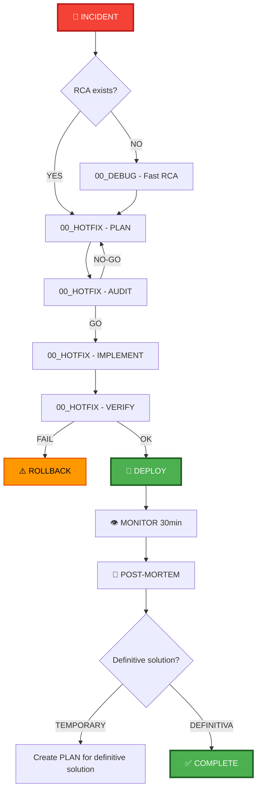

## PHASE_DEFINITION

### PLAN
output_file: 01_PLAN.md
requires_prompt: true
gate: none

### AUDIT_PLAN
output_file: 02_AUDIT_PLAN.md
gate: GO_REQUIRED

### FIX_PLAN
output_file: 03_FIX_PLAN.md
loop_to: AUDIT_PLAN

### IMPLEMENT
output_file: 04_IMPLEMENT.md
requires_plan_go: true

### AUDIT_STATIC_ANALYSIS
output_file: 05A_AUDIT_STATIC_ANALYSIS.md
gate: GO_REQUIRED

### AUDIT_IMPLEMENT
output_file: 05_AUDIT_CODE.md
gate: GO_REQUIRED

### FIX_CODE
output_file: 06_FIX_CODE.md
loop_to: AUDIT_STATIC_ANALYSIS

## TAXONOMY

skill_tier: TIER3
requires_determinism: false

# AECF SKILL — HOTFIX (Emergency Response)

------------------------------------------------------------

## MANDATORY CONTEXT LOAD

This skill operates under the following mandatory contexts:

- aecf_prompts/AECF_SYSTEM_CONTEXT.md
- aecf_prompts/SKILL_DISPATCHER.md (execution protocol)
- <workspace_root>/AECF_PROJECT_CONTEXT.md (if present anywhere in the active workspace)

Governance:
- aecf_prompts/_governance/AECF_EXECUTIVE_SUMMARY_GOVERNANCE.md

If any of these contexts exist, they MUST be considered active constraints.

Execution is INVALID if these contexts are not acknowledged.

------------------------------------------------------------

## EXECUTION MANDATE (IMPERATIVE)

When this skill is invoked, the AI MUST:

1. **AUTO-RESOLVE** all parameters (TOPIC, severity, numbering) per SKILL_DISPATCHER
2. **EXECUTE** the DEBUG → HOTFIX → VERIFY cycle with urgency priority
3. **CREATE FILES** at each phase in `aecf_prompts/<DOCS_ROOT>/<user_id>/<RUN_DATE>/{{TOPIC}}/AECF_<NN>_<PHASE>.md`
4. **IMPLEMENT** the fix directly — speed is critical

**MANDATORY POST-EXECUTION GOVERNANCE (per SKILL_DISPATCHER)**:
- **UPDATE** `aecf_prompts/<DOCS_ROOT>/<user_id>/AECF_TOPICS_INVENTORY.json` for TOPIC lifecycle and **REGENERATE** `aecf_prompts/<DOCS_ROOT>/<user_id>/AECF_TOPICS_INVENTORY.md` (Step 4.1)
- **APPEND** one execution entry to `aecf_prompts/<DOCS_ROOT>/<user_id>/AECF_CHANGELOG.md` (Step 4.2)

**FORBIDDEN**:
- ❌ Responding only in chat without creating files
- ❌ Asking the user for execution mode, output path, or AECF conventions
- ❌ Requiring verbose prompts — a simple `skill: hotfix <incident>` MUST be sufficient
- ❌ Delaying execution with unnecessary analysis when production is down

## TRACEABILITY METADATA ENFORCEMENT (MANDATORY)

Every document generated by this skill MUST include `## METADATA` following
`aecf_prompts/templates/TEMPLATE_HEADERS.md`.

The metadata block is INVALID unless it includes, at minimum:
- `Timestamp (UTC)`
- `Executed By`
- `Executed By ID`
- `Execution Identity Source`
- `Repository`
- `Branch`
- `Root Prompt`
- `Skill Executed`
- `Sequence Position`
- `Total Prompts Executed`

Missing metadata or missing traceability fields => INVALID SKILL EXECUTION.

## CODE TRACEABILITY AND COMMENT ENFORCEMENT (MANDATORY)

When this skill reaches `HOTFIX_IMPLEMENT`, it MUST also load and enforce
`aecf_prompts/code/CODE_FUNCTION_METADATA_STANDARD.md`.

Rules:
- Every generated or modified function, method, class, module, or test artifact MUST include a full `AECF_META` line.
- The `AECF_META` block MUST include `skill`, `topic`, `run_time`, `generated_at`, `generated_by`, `last_modified_skill`, `last_modified_at`, `last_modified_by`, and `touch_count`.
- On creation, `touch_count=1`; on each later AECF write, preserve `generated_*`, refresh `run_time`, update `last_modified_*`, and increment `touch_count` by exactly `1`.
- Human-maintenance comments/docstrings MUST be sufficient for a future engineer and MUST use the resolved `OUTPUT_LANGUAGE` / `aecf.documentationOutputLanguage`.
- Missing `AECF_META`, stale `touch_count`, or insufficient maintenance comments INVALIDATE the hotfix implementation.

------------------------------------------------------------

## Skill ID
`aecf_hotfix`

## Description
Accelerated flow to resolve critical production incidents while maintaining AECF traceability.

## When to Use
- Production completely down (P1)
- Critical vulnerability being exploited (P1)
- Active data loss (P1)
- Degraded core functionality with high impact (P2)

## When NOT to Use
- Bug with viable workaround → use normal flow
- Performance improvements → use `aecf_new_feature`
- Refactors → use `aecf_refactor`
- Minor bug → use normal flow from PLAN

---

## Phases Executed



---

## Input Required

### Mandatory:
- **Incident description**: Clear description of the problem
- **Severity**: P1 (critical) or P2 (high)
- **Impact**: Users affected, functionality down
- **TOPIC**: Identificador del incidente (ej: "prod_outage_api", "sql_injection_fix")

### Optional:
- **RCA document**: If root cause analysis already exists
- **Reproduction steps**: How to reproduce the problem
- **Logs/traces**: Evidence of the problem

---

## Execution Steps (Acelerado)

### Step 0: Triage (Inmediato - 5 min)
**Who**: Incident Commander o Engineer on-call
**Actions**:
1. Confirm severity: Is it really P1/P2?
2. Notify on-call team
3. Activate incident response
4. Create TOPIC for the incident

### Step 1: Root Cause Analysis [if needed] (Max 20 min)
**Prompt**: 00_DEBUG.md (RUNTIME o STATIC mode)
**Output**: `aecf_prompts/<DOCS_ROOT>/<user_id>/<RUN_DATE>/{{TOPIC}}/AECF_01_RCA.md`
**Action**: Identify root cause quickly
**Skip if**: The cause is already known

### Step 2: HOTFIX_PLAN (Max 30 min)
**Prompt**: 00_HOTFIX.md (Fase 1)
**Output**: `aecf_prompts/<DOCS_ROOT>/<user_id>/<RUN_DATE>/{{TOPIC}}/AECF_01_HOTFIX.md` (PLAN section)
**Actions**:
- Propose minimum viable fix
- Identify fix risks
- Definir rollback plan
- Specify minimum critical tests

**Critical decision**: Is the proposed fix safe?

### Step 3: HOTFIX_AUDIT (Max 15 min)
**Prompt**: 00_HOTFIX.md (Fase 2)
**Output**: `aecf_prompts/<DOCS_ROOT>/<user_id>/<RUN_DATE>/{{TOPIC}}/AECF_01_HOTFIX.md` (AUDIT section)
**Focus**:
- ✅ Fix solves the problem
- ✅ Does not introduce vulnerabilities
- ✅ Does not break critical functionality
- ✅ Rollback es viable

**Possible outcomes**:
- **GO** → Continuar a Step 4
- **NO-GO** → Return to Step 2 and reconsider fix

### Step 4: HOTFIX_IMPLEMENT (Max 30 min)
**Prompt**: 00_HOTFIX.md (Fase 3)
**Output**: 
- Fix code
- Critical tests
- `aecf_prompts/<DOCS_ROOT>/<user_id>/<RUN_DATE>/{{TOPIC}}/AECF_01_HOTFIX.md` (IMPLEMENTATION section)
**Actions**:
- Implement minimum fix
- Add explanatory inline comments
- Implement minimal critical tests

**Prohibition**: DO NOT refactor, DO NOT optimize, FIX only.

### Step 5: HOTFIX_VERIFY (Max 20 min)
**Prompt**: 00_HOTFIX.md (Fase 4)
**Output**: `aecf_prompts/<DOCS_ROOT>/<user_id>/<RUN_DATE>/{{TOPIC}}/AECF_01_HOTFIX.md` (VERIFICATION section)
**Actions**:
1. Run critical tests → Do they pass? ✅/❌
2. Reproduce original bug → Solved? ✅/❌
3. Smoke test a staging → OK? ✅/❌
4. Verify rollback plan → Viable? ✅/❌

**If it fails**: Return to Step 2 or execute ROLLBACK.

### Step 6: DEPLOY (Max 15 min)
**Prompt**: 00_HOTFIX.md (Fase 5)
**Actions**:
1. Create tag: `hotfix-YYYYMMDD-HHmm-<description>`
2. Deploy to production
3. Activate intensive monitoring
4. Equipment on standby for rollback

### Step 7: MONITORING (30 min)
**Actions**:
- Active log monitoring
- Check metrics
- Validate with users that the problem is resolved
- Prepare rollback if problems appear

**If problems appear**: immediate ROLLBACK.

### Step 8: POST-MORTEM (Next business day)
**Prompt**: 00_HOTFIX.md (POST-MORTEM section)
**Output**: `aecf_prompts/<DOCS_ROOT>/<user_id>/<RUN_DATE>/{{TOPIC}}/AECF_01_HOTFIX.md` (POST-MORTEM section)
**Actions**:
1. Timeline completo del incidente
2. Complete RCA (if it was abbreviated before)
3. Evaluate whether hotfix is ​​a permanent or temporary solution
4. Lessons learned
5. Action items

### Step 9: Definitive Solution [if temporal] (Schedule)
**If hotfix is temporary**:
- Create new TOPIC for definitive solution
- Run `aecf_new_feature` or full normal flow
- Reference to the original hotfix

---

## Timeline Targets

| Severity | Detection → Fix Ready | Fix Ready → Deployed | Total |
|----------|----------------------|---------------------|-------|
| **P1** | < 1 hour | < 30 min | < 1.5 hours |
| **P2** | < 2 horas | < 1 hora | < 3 horas |

---

## Success Criteria

✅ Incident resolved (verified by users)
✅ No new vulnerabilities were introduced
✅ Critical functionality not affected
✅ Documented and tested rollback plan
✅ Monitoring without new alerts
✅ POST-MORTEM completado  

---

## Example Usage

### Scenario: Authentication API down in production (P1)

```
[10:15] User (Ops): "🚨 INCIDENT P1: API /auth/login devuelve 500, 
All users cannot log in.
                     TOPIC: prod_auth_500"

[10:16] AI (Triage):
Confirmed severity: P1
Team notified ✅
Incident response activated ✅

[10:17] AI (Step 1 - DEBUG):
[Run 00_DEBUG.md in RUNTIME mode]
→ Analyze production logs
→ Identifica: Database connection pool exhausted
→ Genera: documentation/prod_auth_500/AECF_01_RCA.md
ROOT CAUSE: Connection pool size=10, traffic spike exhausted pool

[10:25] AI (Step 2 - HOTFIX_PLAN):
[Run 00_HOTFIX.md - Phase 1]
→ Genera: documentation/prod_auth_500/AECF_01_HOTFIX.md (PLAN)

PROPOSED FIX:
- Archivo: config/database.py
- Cambio: pool_size=10 → pool_size=50
- Discarded alternative: Restart service (does not resolve root cause)
- Rollback: Revertir pool_size a 10
- Critical tests:
  1. test_database_connection_pool_size
  2. test_concurrent_logins_100_users  
  3. test_auth_endpoint_responds_200

[10:35] AI (Step 3 - HOTFIX_AUDIT):
[Run 00_HOTFIX.md - Phase 2]
→ Genera: documentation/prod_auth_500/AECF_01_HOTFIX.md (AUDIT)

AUDIT:
✅ Fix solves the problem (pool size increased)
✅ Does not introduce vulnerabilities
✅ Does not break functionality
✅ Rollback viable
⚠️ WARNING: pool_size=50 may impact DB, monitor

VERDICT: GO ✅

[10:40] AI (Step 4 - HOTFIX_IMPLEMENT):
[Run 00_HOTFIX.md - Phase 3]
→ Modifica: config/database.py
→ Crea: tests/test_hotfix_auth_pool.py
→ Genera: documentation/prod_auth_500/AECF_01_HOTFIX.md (IMPLEMENTATION)

CODE:
# HOTFIX: PROD-AUTH-500 2026-02-10 - Auth API 500 error
# ROOT CAUSE: DB connection pool exhausted
# SOLUTION: Increase pool size from 10 to 50
# ROLLBACK: Revert pool_size to 10
pool_size = 50  # was: 10
...

TESTS:
✅ test_database_connection_pool_size PASSED
✅ test_concurrent_logins_100_users PASSED
✅ test_auth_endpoint_responds_200 PASSED

[10:55] AI (Step 5 - HOTFIX_VERIFY):
[Run 00_HOTFIX.md - Phase 4]
→ Genera: documentation/prod_auth_500/AECF_01_HOTFIX.md (VERIFICATION)

VERIFICATION:
✅ Critical tests pass
✅ Smoke test en staging OK
✅ Rollback plan verificado
✅ Original bug reproduced → SOLVED

[11:00] AI (Step 6 - DEPLOY):
[Run 00_HOTFIX.md - Phase 5]

DEPLOY CHECKLIST:
✅ Tag creado: hotfix-20260210-1100-auth-pool-fix
✅ Deploy to production started
✅ Active monitoring ON
✅ Equipment on standby

[11:05] Deploy completed ✅

[11:05-11:35] AI (Step 7 - MONITORING):
[Active monitoring 30 min]

METRICS:
✅ API /auth/login responde 200
✅ Latency: 150ms (normal)
✅ Error rate: 0%
✅ DB connections: 15/50 (healthy)
✅ Users log in correctly

[11:35] INCIDENT RESOLVED ✅

[11:36] User: "I confirm, users can log in. Incident resolved."

[Next day - 10:00] AI (Step 8 - POST-MORTEM):
[Ejecuta 00_HOTFIX.md - POST-MORTEM]
→ Genera: documentation/prod_auth_500/AECF_01_HOTFIX.md (POST-MORTEM)

POST-MORTEM:
Timeline: 10:15 detection → 11:35 resolved (1h 20min)
Definitive solution?: NO (temporary)
Reason: Fixed pool size does not scale, we need auto-scaling

ACTION ITEMS:
- [ ] Crear PLAN definitivo: Dynamic DB pool scaling
- [ ] Add pool exhaustion alerts
- [ ] Load testing regular
- [ ] TOPIC nuevo: "db_pool_autoscale"

[Next week] AI (Step 9 - Definitive Solution):
User: "Implement definitive auto-scaling solution for DB pool"
[Ejecuta skill: aecf_new_feature con TOPIC: db_pool_autoscale]

✅ COMPLETE HOTFIX - Stable production - Definitive solution scheduled
```

---

## Common Issues & Solutions

### Issue: Fix does not solve the problem in production
**Solution**: 
1. ROLLBACK inmediato
2. Go back to Step 1 (DEBUG) - maybe the RCA was incorrect
3. Consider alternative solution

### Issue: Fix introduce nuevo bug
**Solution**:
1. ROLLBACK inmediato
2. If the original problem is P1, consider temporary workaround
3. Return to Step 2 (HOTFIX_PLAN) with more analysis

### Issue: Tests pass but production fails
**Solution**:
1. Unidentified staging vs prod difference
2. POST-MORTEM should include: improve staging-prod parity

---

## Rollback Procedure

If at any point the fix fails:

1. **Execute rollback plan** (documented in HOTFIX_PLAN)
2. **Verify that production returns to previous state**
3. **Re-evaluate strategy**:
- Temporary workaround possible?
- Alternative fix?
- How to join the senior team?

---

## Related Skills

- `aecf_new_feature` - To implement final solution later
- `aecf_security_review` - If the hotfix is ​​for vulnerability

---

## Outputs Generated

```
aecf_prompts/<DOCS_ROOT>/<user_id>/<RUN_DATE>/{{TOPIC}}/
└── AECF_01_HOTFIX.md # Single document with all phases
    ├── HOTFIX SUMMARY
    ├── HOTFIX_PLAN
    ├── HOTFIX_AUDIT
    ├── HOTFIX_IMPLEMENTATION
    ├── HOTFIX_VERIFICATION
    ├── DEPLOYMENT
    └── POST-MORTEM

(Optional, if separate RCA was created)
└── AECF_01_RCA.md
```

---

## Completion Checklist

- [ ] Incident resolved (confirmed by users/ops)
- [ ] Fix committed code with hotfix-* tag
- [ ] Passing critical tests
- [ ] Monitoring without alerts (30 min post-deploy)
- [ ] Documented and tested rollback plan
- [ ] POST-MORTEM completado
- [ ] Action items created (if applicable)
- [ ] Final fix planned (if hotfix is ​​temporary)

---

## CONTEXT VALIDATION

Confirm:

[ ] AECF_SYSTEM_CONTEXT.md loaded
[ ] Governance rules applied
[ ] Executive summary is optional on-demand via `skill_executive_summary`
[ ] Document includes `Executed By`


If not confirmed → STOP execution.

---

**SKILL READY FOR EMERGENCY USE** 🚨

## AI_USAGE_DECLARATION

AI_USED = TRUE

## AI_EXPLAINABILITY_VALIDATION

- Explainability level defined? YES/NO
- User-facing explanation provided? YES/NO
- Model version logged? YES/NO
- Decision trace stored? YES/NO

## GOVERNANCE VALIDATION BLOCK

- Data lineage impact
- Model impact (YES/NO)
- Risk impact
- Compliance check


