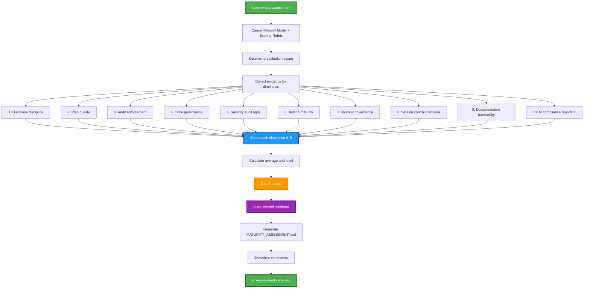

## PHASE_DEFINITION

### AECF_MATURITY_ASSESSMENT
output_file: AECF_01_AECF_MATURITY_ASSESSMENT.md
gate: none
loop_to: none
requires_plan_go: false

## TAXONOMY

skill_tier: TIER1
requires_determinism: true

# AECF SKILL — MATURITY ASSESSMENT

------------------------------------------------------------

## MANDATORY CONTEXT LOAD

This skill operates under the following mandatory contexts:

- aecf_prompts/AECF_SYSTEM_CONTEXT.md
- aecf_prompts/SKILL_DISPATCHER.md (execution protocol)
- <workspace_root>/AECF_PROJECT_CONTEXT.md (if present anywhere in the active workspace)

Governance:
- aecf_prompts/_governance/AECF_EXECUTIVE_SUMMARY_GOVERNANCE.md

Maturity Model (MANDATORY for this skill):
- aecf_prompts/maturity/AECF_MATURITY_MODEL.md
- aecf_prompts/maturity/AECF_MATURITY_SCORING.md
- aecf_prompts/maturity/AECF_MATURITY_ASSESSMENT_TEMPLATE.md

If any of these contexts exist, they MUST be considered active constraints.

Execution is INVALID if these contexts are not acknowledged.

------------------------------------------------------------

## EXECUTION MANDATE (IMPERATIVE)

When this skill is invoked, the AI MUST:

1. **AUTO-RESOLVE** all parameters (TOPIC, scope, numbering) per SKILL_DISPATCHER
2. **LOAD** the maturity model, scoring rubric, and assessment template
3. **SCAN** documentation/ and workspace for evidence per dimension
4. **SCORE** each of the 10 governance dimensions (0–5) with evidence justification
5. **CALCULATE** maturity level and identify gaps
6. **CREATE FILE** at `<DOCS_ROOT>/<user_id>/{{TOPIC}}/AECF_<NN>_MATURITY_ASSESSMENT.md`

**MANDATORY POST-EXECUTION GOVERNANCE (per SKILL_DISPATCHER)**:
- **UPDATE** `<DOCS_ROOT>/<user_id>/AECF_TOPICS_INVENTORY.json` for TOPIC lifecycle and **REGENERATE** `<DOCS_ROOT>/<user_id>/AECF_TOPICS_INVENTORY.md` (Step 4.1)
- **APPEND** one execution entry to `<DOCS_ROOT>/<user_id>/AECF_CHANGELOG.md` (Step 4.2)

**FORBIDDEN**:
- ❌ Responding only in chat without creating a file
- ❌ Asking the user for execution mode, output path, or AECF conventions
- ❌ Requiring verbose prompts — a simple `skill: maturity_assessment` MUST be sufficient
- ❌ Scoring without evidence — every score MUST be justified with artifacts or observations
- ❌ Skipping gap analysis or improvement roadmap

## MANDATORY REPOSITORY DISCOVERY (SEARCH-FIRST)

This skill requires explicit repository discovery before executing its first audit/analysis step.

Execution rules:
1. Execute an initial repository search pass within scope using IDE capabilities.
2. Build an execution-scoped `WORKING_CONTEXT` before starting the first skill step.
3. If discovery evidence is incomplete, set discovery status to NO-GO and STOP.

Minimum `WORKING_CONTEXT` for search-first execution:
- `TARGET_SCOPE`
- `ENTRY_POINTS_OR_ARTIFACTS`
- `DISCOVERED_PATHS`
- `CONFIG_AND_DEPENDENCIES`
- `UNCERTAINTIES_AND_ASSUMPTIONS`
- `SOURCE_REFERENCES` (concrete file paths and line-level references)

Forbidden:
- Skipping discovery and jumping directly to analysis.
- Assuming repository structure without verification.
- Reusing shared static discovery files across executions.

## TRACEABILITY METADATA ENFORCEMENT (MANDATORY)

Every document generated by this skill MUST include `## METADATA` following
`aecf_prompts/templates/TEMPLATE_HEADERS.md`.

The metadata block is INVALID unless it includes, at minimum:
- `Timestamp (UTC)`
- `Executed By`
- `Executed By ID`
- `Execution Identity Source`
- `Repository`
- `Branch`
- `Root Prompt`
- `Skill Executed`
- `Sequence Position`
- `Total Prompts Executed`

Missing metadata or missing traceability fields => INVALID SKILL EXECUTION.

------------------------------------------------------------

## Skill ID
`aecf_maturity_assessment`

## Description
Run a formal AECF maturity assessment on a project, team or organization. It evaluates 10 governance dimensions, calculates the maturity level (L1–L5), identifies gaps and generates an improvement roadmap.

## When to Use
- Initial adoption of AECF → establish maturity baseline
- Quarterly governance review → track trend
- After completing a full AECF cycle (Discovery → Version) → validate coverage
- Post-incident → evaluate exposed governance gaps
- Pre-certification or compliance audit → produce report with evidence
- Onboarding of new team to AECF → determine initial level

## When NOT to Use
- Audit code standards → use `aecf_code_standards_audit`
- Security audit → use `aecf_security_review`
- Technical debt assessment → use `aecf_tech_debt_assessment`
- There are no previous AECF artifacts and no baseline is searched → first execute at least one AECF cycle

---

## Phases Executed



---

## Input Required

### Mandatory:
- **Assessment scope**: Project, team or organization to be evaluated
- **TOPIC** (optional): Evaluation identifier (will be inferred if not provided)

### Optional:
- **Assessment type**: ☐ Initial Baseline  ☐ Quarterly  ☐ Post-Incident  ☐ Pre-Certification
- **Previous assessment**: Previous assessment to compare trend
- **Target level**: Target maturity level (for focused gap analysis)
- **Focused dimensions**: Specific dimensions to be evaluated in depth

---

## Execution Steps

### Step 1: LOAD MATURITY FRAMEWORK
**Input**: Assessment scope
**Action**: Upload the 3 maturity documents/
**Context loaded**:
- `AECF_MATURITY_MODEL.md` → 5 levels, characteristics, advancement criteria
- `AECF_MATURITY_SCORING.md` → 10 dimensions, rubric 0–5
- `AECF_MATURITY_ASSESSMENT_TEMPLATE.md` → Report template
**Expected time**: 2 min

### Step 2: DETERMINE ASSESSMENT SCOPE
**Action**: Define what is evaluated
**Scope options**:
- Individual project
- Team and its practices
- Organizational unit
**Output**: Scope statement para el reporte

### Step 3: COLLECT EVIDENCE PER DIMENSION
**Action**: Scan workspace and documentation/ for each dimension

| # | Dimension | Where to look for evidence |
|---|-----------|----------------------|
| 1 | Discovery discipline | `00_DISCOVERY_LEGACY`, `00_DOCUMENT_EXISTING_FUNCTIONALITY` outputs |
| 2 | Plan quality | `00_PLAN`, `02_AUDIT_PLAN`, `03_FIX_PLAN` outputs |
| 3 | Audit enforcement | `02_AUDIT_PLAN`, `05_AUDIT_CODE`, `10_AUDIT_TESTS` outputs |
| 4 | Code governance | `04_IMPLEMENT`, `05_AUDIT_CODE`, `06_FIX_CODE` outputs, PROJECT_CONTEXT |
| 5 | Security audit rigor | `17_SECURITY_AUDIT` outputs, `skill_security_review` reports |
| 6 | Testing maturity | `08_TEST_STRATEGY`, `09_TEST_IMPLEMENTATION`, `10_AUDIT_TESTS` outputs |
| 7 | Incident governance | `00_HOTFIX`, `00_DEBUG` outputs, `skill_hotfix` reports |
| 8 | Version control | `07_VERSION_MANAGEMENT` outputs, CHANGELOG.md, git tags |
| 9 | Documentation traceability | All documentation/ artifacts, cross-references |
| 10 | AI compliance reporting | Audit artifacts, executive summaries, maturity reports |

**Expected time**: 10–20 min

### Step 4: SCORE EACH DIMENSION
**Action**: Apply rubric from `AECF_MATURITY_SCORING.md`

**Scoring rubric**:
| Score | Classification | Criterion |
|-------|---------------|----------|
| 0 | No evidence | There is no observable practice, documentation or tooling |
| 1 | Casual | Ad-hoc activity; no standardization; dependent on individuals |
| 2 | Partial enforcement | Guides documented but inconsistently applied |
| 3 | Structured | Defined processes followed with documented outputs |
| 4 | Enforced | Automatic gates or mandatory reviews; tracked exceptions |
| 5 | Governed and measurable | Continuous monitoring, improvement based on metrics, enterprise reporting |

**Rules**:
- Every score MUST include evidence reference
- Use lowest-qualifying principle (partial compliance → lower score)
- Independent assessment when possible

**Expected time**: 15–30 min

### Step 5: CALCULATE MATURITY LEVEL
**Formula**:
$$
\text{Maturity Score} = \frac{\sum_{i=1}^{10} S_i}{10}
$$

**Level mapping**:
| Average Score | Maturity Level | Classification |
|--------------|---------------|----------------|
| 0.0 – 1.4 | Level 1 | Ad-hoc AI Usage |
| 1.5 – 2.4 | Level 2 | Structured Prompt Usage |
| 2.5 – 3.4 | Level 3 | Governed Development Flow |
| 3.5 – 4.4 | Level 4 | Auditable AI SDLC |
| 4.5 – 5.0 | Level 5 | Enterprise AI Governance |

**Expected time**: 5 min

### Step 6: GAP ANALYSIS
**Action**: Identify dimensions below the target

**Gap identification**:
- Any dimension scoring < 3 → **Critical gap** (below governed threshold)
- Any dimension scoring < target level → **Improvement target**
- Largest gap between current and target → **Priority 1 action**

**Output**: Gap table with prioritization

### Step 7: IMPROVEMENT ROADMAP
**Action**: Generate improvement plan with concrete actions

**Roadmap structure**:
1. **Quick wins** (0–30 days): Actions that raise dimensions from score N to N+1 with low effort
2. **Short-term** (1–3 months): Implement structured processes
3. **Medium-term** (3–6 months): Automate gates and enforcement
4. **Long-term** (6–12 meses): Enterprise governance y reporting continuo

**Each action must specify**:
- Target dimension
- Current score → Target score
- Specific action
- AECF skills/phases to use
- Estimated effort

### Step 8: GENERATE ASSESSMENT REPORT
**Output**: `<DOCS_ROOT>/<user_id>/{{TOPIC}}/AECF_<NN>_MATURITY_ASSESSMENT.md`
**Template**: Based on `AECF_MATURITY_ASSESSMENT_TEMPLATE.md`
**Content**:
1. Organization / Project Information
2. Assessment Metadata
3. Dimension Scoring Table (with evidence)
4. Final Score and Maturity Level
5. Risk Exposure Level
6. Gap Analysis
7. Improvement Roadmap
8. Comparison with Previous Assessment (if available)
9. Recommendations

**Expected time**: 10–15 min

### Step 9: EXECUTIVE SUMMARY (ON-DEMAND)
Use `skill: executive_summary TOPIC: <topic_name>` when needed.

---

## Total Estimated Time

| Scenario | Time |
|----------|------|
| **Baseline assessment** (new project, few artifacts) | 30 – 60 min |
| **Quarterly assessment** (established project) | 45 min – 1.5 horas |
| **Full assessment** (enterprise scope) | 1.5 – 3 horas |
| **Post-incident focused** (subset of dimensions) | 20 – 45 min |

---

## Success Criteria

✅ All 10 dimensions scored with evidence  
✅ Maturity level calculated and classified  
✅ Gap analysis identifying dimensions below target  
✅ Improvement roadmap with concrete actions  
✅ Risk exposure level determined  
✅ Assessment report file created  
✅ Executive summaries generated  

---

## Example Usage

### Scenario 1: Initial Baseline
```
User: "skill: maturity_assessment. TOPIC: maturity_baseline"

AI:
✅ Skill recognized: aecf_maturity_assessment
📌 TOPIC: maturity_baseline
📂 Scope: [workspace / project]
🔢 Next number: 01
📄 Output: documentation/maturity_baseline/AECF_01_MATURITY_ASSESSMENT.md

[Executes full assessment...]
[Creates file...]

✅ Skill execution complete
📄 File created: documentation/maturity_baseline/AECF_01_MATURITY_ASSESSMENT.md
📊 Executive summaries generated
```

### Scenario 2: Quarterly Review
```
User: "Quarterly maturity assessment. Compare with previous assessment in
documentation/maturity_q4_2025/. TOPIC: maturity_q1_2026"
```

### Scenario 3: Post-Incident Focused
```
User: "Maturity assessment enfocado en incident governance, security y testing. 
Contexto: incidente P1 del 15-01-2026. TOPIC: maturity_post_incident"
```

---

## Scoring Does NOT Apply (Self-Referential)

This skill produces the maturity score itself. Applying AECF_SCORING to a maturity assessment would be meta-circular.

**Alternative Evaluation**: Assessment Completeness

| Aspect | Status |
|--------|--------|
| All 10 dimensions scored | ✓/✗ |
| Evidence provided per dimension | ✓/✗ |
| Gap analysis complete | ✓/✗ |
| Improvement roadmap generated | ✓/✗ |
| Risk exposure determined | ✓/✗ |
| Report follows template | ✓/✗ |

**Completeness: X/6**

---

## Outputs Generated

```
<DOCS_ROOT>/<user_id>/{{TOPIC}}/
├── AECF_01_MATURITY_ASSESSMENT.md
```

---

## Related Skills

- `aecf_code_standards_audit` — Feeds dimension 4 (Code governance)
- `aecf_security_review` — Feeds dimension 5 (Security audit rigor)
- `aecf_tech_debt_assessment` — Feeds dimensions 4, 9, 10
- `aecf_release_readiness` — Feeds dimensions 8, 10
- All skills — Each execution feeds dimensions 3, 9

---

## CONTEXT VALIDATION

Confirm:

[ ] AECF_SYSTEM_CONTEXT.md loaded
[ ] Maturity Model loaded (AECF_MATURITY_MODEL.md)
[ ] Scoring Rubric loaded (AECF_MATURITY_SCORING.md)
[ ] Assessment Template loaded (AECF_MATURITY_ASSESSMENT_TEMPLATE.md)
[ ] Governance rules applied
[ ] Executive summary is optional on-demand via `skill_executive_summary`
[ ] Document includes `Executed By`


If not confirmed → STOP execution.

---

**SKILL READY FOR USE**

## AI_USAGE_DECLARATION

AI_USED = TRUE

## AI_EXPLAINABILITY_VALIDATION

- Explainability level defined? YES/NO
- User-facing explanation provided? YES/NO
- Model version logged? YES/NO
- Decision trace stored? YES/NO

## GOVERNANCE VALIDATION BLOCK

- Data lineage impact
- Model impact (YES/NO)
- Risk impact
- Compliance check

