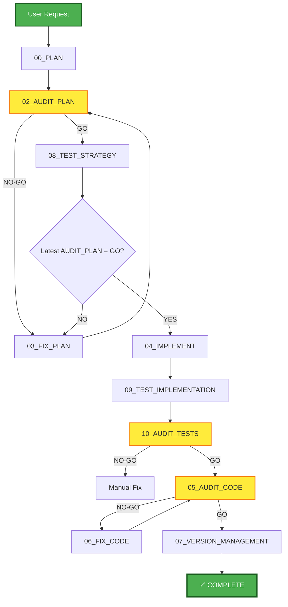

# AECF SKILL — NEW FEATURE (Complete Flow)

------------------------------------------------------------

## MANDATORY CONTEXT LOAD

This skill operates under the following mandatory contexts:

- aecf_prompts/AECF_SYSTEM_CONTEXT.md
- aecf_prompts/SKILL_DISPATCHER.md (execution protocol)
- <workspace_root>/AECF_PROJECT_CONTEXT.md (if present anywhere in the active workspace)

Governance:
- aecf_prompts/_governance/AECF_EXECUTIVE_SUMMARY_GOVERNANCE.md

If any of these contexts exist, they MUST be considered active constraints.

Execution is INVALID if these contexts are not acknowledged.

------------------------------------------------------------

## EXECUTION MANDATE (IMPERATIVE)

When this skill is invoked, the AI MUST:

1. **AUTO-RESOLVE** all parameters (TOPIC, scope, numbering) per SKILL_DISPATCHER
2. **EXECUTE** the strict sequence PLAN → AUDIT_PLAN → [FIX_PLAN if NO-GO] → TEST_STRATEGY → IMPLEMENT → AUDIT_IMPLEMENT (AUDIT_CODE) → [FIX_CODE if NO-GO]
3. **CREATE FILES** at each phase in `aecf_prompts/<DOCS_ROOT>/<user_id>/<RUN_DATE>/{{TOPIC}}/AECF_<NN>_<PHASE>.md`
4. **IMPLEMENT** production-ready code with tests included
5. **ENFORCE HARD GATES**:
    - `IMPLEMENT` is blocked until the latest `AUDIT_PLAN` verdict is **GO**
    - Code is NOT `OK`/complete until `AUDIT_CODE` verdict is **GO**

**MANDATORY PHASE GATES (NO SKIP)**:
- **NO CODE BEFORE PLAN GO**: implementation is forbidden until `PLAN` is generated and `AUDIT_PLAN` returns `GO`.
- **NO-GO LOOP REQUIRED**: if `AUDIT_PLAN` returns `NO-GO`, run `FIX_PLAN` and re-audit until `GO`.
- **POST-IMPLEMENT AUDIT REQUIRED**: after implementation, run `AUDIT_IMPLEMENT` (using `AUDIT_CODE` phase).
- **NO-GO FIX LOOP REQUIRED**: if `AUDIT_IMPLEMENT` returns `NO-GO`, run `FIX_CODE` and re-audit until `GO`.
- **INVALID EXECUTION PATTERN**: creating code first and backfilling AECF docs later is invalid.

**MANDATORY POST-EXECUTION GOVERNANCE (per SKILL_DISPATCHER)**:
- **UPDATE** `aecf_prompts/<DOCS_ROOT>/<user_id>/AECF_TOPICS_INVENTORY.json` for TOPIC lifecycle and **REGENERATE** `aecf_prompts/<DOCS_ROOT>/<user_id>/AECF_TOPICS_INVENTORY.md` (Step 4.1)
- **APPEND** one execution entry to `aecf_prompts/<DOCS_ROOT>/<user_id>/AECF_CHANGELOG.md` (Step 4.2)

**FORBIDDEN**:
- ❌ Responding only in chat without creating files
- ❌ Asking the user for execution mode, output path, or AECF conventions
- ❌ Requiring verbose prompts — a simple `skill: new_feature <description>` MUST be sufficient
- ❌ Skipping any phase of the flow without explicit user authorization

## TRACEABILITY METADATA ENFORCEMENT (MANDATORY)

Every document generated by this skill MUST include `## METADATA` following
`aecf_prompts/templates/TEMPLATE_HEADERS.md`.

The metadata block is INVALID unless it includes, at minimum:
- `Timestamp (UTC)`
- `Executed By`
- `Executed By ID`
- `Execution Identity Source`
- `Repository`
- `Branch`
- `Root Prompt`
- `Skill Executed`
- `Sequence Position`
- `Total Prompts Executed`

Missing metadata or missing traceability fields => INVALID SKILL EXECUTION.

### PHASE-LEVEL METADATA GATE (MANDATORY)

For **every phase output document** generated by this skill (`PLAN`, `AUDIT_PLAN`, `FIX_PLAN`, `TEST_STRATEGY`, `IMPLEMENTATION`, `TEST_IMPLEMENTATION`, `AUDIT_TESTS`, `AUDIT_CODE`, `VERSION`):

1. `## METADATA` MUST be the **first section** after the H1 title.
2. Metadata MUST follow `aecf_prompts/templates/TEMPLATE_HEADERS.md` (standard table format).
3. Before continuing to the next phase, AI MUST validate that metadata exists and includes all mandatory fields.
4. If validation fails, AI MUST **regenerate/fix the same phase document first** and MUST NOT continue to the next phase.

Any phase document without valid metadata = phase incomplete (NO-GO for progression).

## CODE-LEVEL FUNCTION METADATA ENFORCEMENT (MANDATORY)

In addition to document-level metadata, every **function or method** created or modified during
`IMPLEMENT` or `FIX_CODE` phases MUST carry an `AECF_META` block in its docstring.

**Standard**: `aecf_prompts/code/CODE_FUNCTION_METADATA_STANDARD.md`

**Mandatory fields per function**: `skill`, `topic`, `run_time`, `generated_at`,
`generated_by`, `last_modified_skill`, `last_modified_at`, `last_modified_by`, `touch_count`.

**Update rule**: on modification, ONLY the latest-touch fields change:
`last_modified_*`, `run_time`, and `touch_count`. Origin fields (`generated_*`) are immutable after creation.

Human-readable comments/docstrings must be sufficient for future maintenance and use the resolved
`OUTPUT_LANGUAGE` / `aecf.documentationOutputLanguage`; machine-facing `AECF_META` keys remain English.

Missing `AECF_META` on any produced/modified function = **automatic NO-GO** at `AUDIT_CODE`.

------------------------------------------------------------

## Skill ID
`aecf_new_feature`

## Description
Run the complete AECF flow to implement new functionality from scratch with testing included.

## When to Use
- Implement a new feature
- Add new endpoint/module/component
- Greenfield development within the project

## When NOT to Use
- Modify existing functionality → use `aecf_change_feature`
- Document legacy code → use `aecf_document_legacy`
- Urgent fix → use `aecf_hotfix`
- Non-critical bug → use normal flow from PLAN

---

## PHASE_DEFINITION

The following section defines the deterministic execution model for AECF Engine.
This block is the only source of truth for phase sequencing and gate behavior.

### PLAN
file: 00_PLAN.md
requires_prompt: true
gate: none

### AUDIT_PLAN
file: 02_AUDIT_PLAN.md
gate: GO_REQUIRED

### FIX_PLAN
file: 03_FIX_PLAN.md
loop_to: AUDIT_PLAN

### TEST_STRATEGY
file: 08_TEST_STRATEGY.md

### IMPLEMENT
file: 04_IMPLEMENT.md
requires_plan_go: true

### AUDIT_STATIC_ANALYSIS
file: 05A_AUDIT_STATIC_ANALYSIS.md
gate: GO_REQUIRED

### AUDIT_IMPLEMENT
file: 05_AUDIT_CODE.md
gate: GO_REQUIRED

### FIX_CODE
file: 06_FIX_CODE.md
loop_to: AUDIT_STATIC_ANALYSIS

---

## TAXONOMY

skill_tier: TIER3
requires_determinism: false
supports_external_skills: true

## Phases Executed



---

## Input Required

### Mandatory:
- **Feature description**: Clear description of the functionality to be implemented
- **TOPIC** (optional): Feature identifier (will be inferred if not provided)

### Optional:
- **Acceptance criteria**: Specific acceptance criteria
- **Constraints**: Technical restrictions
- **Dependencies**: Known dependencies
- **External skills guidance**: Optional `skills.sh`-compatible skill names passed through `external_skills=` to enrich AECF planning/implementation with stack-specific guidance

---

## Execution Steps

### Step 1: PLAN (00_PLAN.md)
**Input**: Feature description
**Output**: `aecf_prompts/<DOCS_ROOT>/<user_id>/<RUN_DATE>/{{TOPIC}}/AECF_01_PLAN.md`
**Expected time**: 10-20 min
**Action**: AI generates the implementation plan
**Metadata gate**: Output document MUST include valid `## METADATA` before Step 2.

### Step 2: AUDIT_PLAN (02_AUDIT_PLAN.md)
**Input**: AECF_01_PLAN.md
**Output**: `aecf_prompts/<DOCS_ROOT>/<user_id>/<RUN_DATE>/{{TOPIC}}/AECF_02_AUDIT_PLAN.md`
**Expected time**: 5-10 min
**Metadata gate**: Output document MUST include valid `## METADATA` before deciding GO/NO-GO.
**Possible outcomes**:
- **GO** → Continue to Step 3
- **NO-GO** → Ir a Step 2b (FIX_PLAN)

### Step 2b: FIX_PLAN (03_FIX_PLAN.md) [if NO-GO]
**Input**: AECF_01_PLAN.md + AECF_02_AUDIT_PLAN.md
**Output**: `aecf_prompts/<DOCS_ROOT>/<user_id>/<RUN_DATE>/{{TOPIC}}/AECF_03_PLAN.md` (corregido)
**Action**: Correct only what was audited
**Metadata gate**: Output document MUST include valid `## METADATA` before returning to Step 2.
**Loop**: Return to Step 2 until you obtain GO (AECF_04_AUDIT_PLAN.md, etc.)

### Step 3: TEST_STRATEGY (08_TEST_STRATEGY.md)
**Input**: PLAN approved with explicit **GO** in latest AUDIT_PLAN
**Output**: `aecf_prompts/<DOCS_ROOT>/<user_id>/<RUN_DATE>/{{TOPIC}}/AECF_0X_TEST_STRATEGY.md` (where X is the next number)
**Expected time**: 10-15 min
**Action**: Define testing strategy
**Metadata gate**: Output document MUST include valid `## METADATA` before Step 4.

### Step 4: IMPLEMENT (04_IMPLEMENT.md)
**Input**: PLAN approved with **AUDIT_PLAN=GO** + TEST_STRATEGY
**Output**: 
- Code implemented
- `aecf_prompts/<DOCS_ROOT>/<user_id>/<RUN_DATE>/{{TOPIC}}/AECF_0X_IMPLEMENTATION.md` (where X is the next number)
**Expected time**: Variable (30 min - 2 horas)
**Action**: Implement code according to PLAN (**FORBIDDEN** if latest AUDIT_PLAN is not GO)
**Metadata gate**: Implementation document MUST include valid `## METADATA` before Step 5.

### Step 5: TEST_IMPLEMENTATION (09_TEST_IMPLEMENTATION.md)
**Input**: TEST_STRATEGY + Implemented code
**Output**: 
- Tests implementados
- `aecf_prompts/<DOCS_ROOT>/<user_id>/<RUN_DATE>/{{TOPIC}}/AECF_01_TEST_IMPLEMENTATION.md`
**Expected time**: 20-40 min
**Action**: Implement tests according to strategy
**Metadata gate**: Output document MUST include valid `## METADATA` before Step 6.

### Step 6: AUDIT_TESTS (10_AUDIT_TESTS.md)
**Input**: Tests implementados + TEST_STRATEGY
**Output**: `aecf_prompts/<DOCS_ROOT>/<user_id>/<RUN_DATE>/{{TOPIC}}/AECF_0X_AUDIT_TESTS.md` (where X is the next number)
**Expected time**: 5-10 min
**Metadata gate**: Output document MUST include valid `## METADATA` before deciding GO/NO-GO.
**Possible outcomes**:
- **GO** → Continuar a Step 7
- **GO CONDITIONAL** → Decide whether to continue or correct
- **NO-GO** → Correct tests manually and repeat

### Step 7: AUDIT_CODE (05_AUDIT_CODE.md)
**Input**: Implemented code + PLAN + Tests
**Output**: `aecf_prompts/<DOCS_ROOT>/<user_id>/<RUN_DATE>/{{TOPIC}}/AECF_0X_AUDIT_CODE.md` (where X is the next number)
**Expected time**: 10-15 min
**Metadata gate**: Output document MUST include valid `## METADATA` before deciding GO/NO-GO.
**Possible outcomes**:
- **GO** → Continuar a Step 8
- **NO-GO** → Ir a Step 7b (FIX_CODE)

### Step 4b: FIX_IMPLEMENT (06_FIX_CODE.md) [if NO-GO]
**Input**: Code + AUDIT_CODE report
**Output**: Corrected code
**Action**: Correct only what was audited
**Loop**: Return to Step 4 until you get GO

### Step 5: VERSION_MANAGEMENT (07_VERSION_MANAGEMENT.md)
**Input**: All context (PLAN, code, GO audits)
**Output**: 
- Updated version
- CHANGELOG.md updated
- `aecf_prompts/<DOCS_ROOT>/<user_id>/<RUN_DATE>/{{TOPIC}}/AECF_0X_VERSION.md` (where X is the next number)
**Expected time**: 5 min
**Action**: Update version according to SemVer
**Metadata gate**: Version document MUST include valid `## METADATA` before marking skill COMPLETE.

---

## Total Estimated Time

| Scenario | Time |
|----------|------|
| **Best case** (sin NO-GOs) | 1.5 - 3 horas |
| **Average case** (1-2 FIX iterations) | 2 - 4 hours |
| **Complex case** (multiple iterations) | 4 - 8 hours |

---

## Success Criteria

✅ PLAN approved with GO
✅ No implementation before PLAN + AUDIT_PLAN(GO)
✅ AUDIT_IMPLEMENT (AUDIT_CODE) with GO
✅ Updated version
✅ Complete generated documentation

---

## Example Usage

### Scenario: Implement new report export endpoint

```
User: "I need to implement an endpoint /api/reports/export that allows
Export reports in PDF and CSV format with filters by date and user.
TOPIC: report_export"

AI (Step 1 - PLAN): 
[Execute 00_PLAN.md]
→ Genera: documentation/report_export/AECF_01_PLAN.md

AI (Step 2 - AUDIT_PLAN):
[Execute 02_AUDIT_PLAN.md]
→ Genera: documentation/report_export/AECF_02_AUDIT_PLAN.md
→ Verdict: NO-GO
→ Finding: "Export permit validation not specified"

AI (Step 2b - FIX_PLAN):
[Execute 03_FIX_PLAN.md]
→ Genera: documentation/report_export/AECF_03_PLAN.md (plan corregido)

AI (Step 2 retry - AUDIT_PLAN):
[Execute 02_AUDIT_PLAN.md over AECF_03_PLAN.md]
→ Genera: documentation/report_export/AECF_04_AUDIT_PLAN.md
→ Verdict: GO ✅

AI (Step 3 - TEST_STRATEGY):
[Run 08_TEST_STRATEGY.md]
→ Genera: documentation/report_export/AECF_05_TEST_STRATEGY.md

AI (Step 4 - IMPLEMENT):
[Run 04_IMPLEMENT.md]
→ Crea: app/routes/reports.py, app/services/export_service.py
→ Genera: documentation/report_export/AECF_06_IMPLEMENTATION.md

AI (Step 5 - TEST_IMPLEMENTATION):
[Run 09_TEST_IMPLEMENTATION.md]
→ Crea: tests/test_reports_export.py, tests/fixtures/report_fixtures.py
→ Genera: documentation/report_export/AECF_07_TEST_IMPLEMENTATION.md
→ Cobertura: 87%

AI (Step 6 - AUDIT_TESTS):
[Run 10_AUDIT_TESTS.md]
→ Genera: documentation/report_export/AECF_08_AUDIT_TESTS.md
→ Verdict: GO ✅

AI (Step 7 - AUDIT_CODE):
[Run 05_AUDIT_CODE.md]
→ Genera: documentation/report_export/AECF_09_AUDIT_CODE.md
→ Verdict: GO ✅

AI (Step 8 - VERSION_MANAGEMENT):
[Execute 07_VERSION_MANAGEMENT.md]
→ Update version: 1.4.0 → 1.5.0 (MINOR)
→ Update CHANGELOG.md
→ Genera: documentation/report_export/AECF_10_VERSION.md

✅ FEATURE COMPLETE AND READY FOR DEPLOY
```

---

## Common Issues & Solutions

### Issue: AUDIT_PLAN with multiple NO-GOs
**Solution**: Review the initial description of the feature, it may be incomplete or ambiguous.

### Issue: AUDIT_CODE detects critical security issues
**Solution**: Run additional 17_SECURITY_AUDIT.md for deep analysis.

### Issue: Cobertura de tests < 80%
**Solution**: In TEST_IMPLEMENTATION, explicitly specify missing cases.

### Issue: Very long execution time
**Solution**: Consider splitting the feature into multiple smaller TOPICs.

---

## Variations

### Fast Track (sin testing exhaustivo)
If the feature is very simple or low risk:
- Skip Step 3 (TEST_STRATEGY)
- In Step 5 (TEST_IMPLEMENTATION): Implement only minimal critical tests

### Security-First
If the feature handles sensitive data:
- Add extra Step: 17_SECURITY_AUDIT.md after Step 7

---

## Related Skills

- `aecf_change_feature` - To modify existing functionality
- `aecf_document_legacy` - To document before modifying
- `aecf_security_review` - For additional security analysis

---

## Outputs Generated (Minimum Required Sequence)

```
aecf_prompts/<DOCS_ROOT>/<user_id>/<RUN_DATE>/{{TOPIC}}/
├── AECF_01_PLAN.md
├── AECF_02_AUDIT_PLAN.md
├── AECF_03_IMPLEMENTATION.md
├── AECF_04_AUDIT_CODE.md
├── AECF_05_VERSION.md
└── (optional iterative FIX/AUDIT artifacts)
```

**Note**: If there are iterations (ex: AUDIT_PLAN → NO-GO → FIX_PLAN → AUDIT_PLAN),
each run increments the sequential number:

```
aecf_prompts/<DOCS_ROOT>/<user_id>/<RUN_DATE>/{{TOPIC}}/
├── AECF_01_PLAN.md
├── AECF_02_AUDIT_PLAN.md      (NO-GO)
├── AECF_03_FIX_PLAN.md
├── AECF_04_AUDIT_PLAN.md      (GO)
├── AECF_05_TEST_STRATEGY.md
└── ...
```

---

## Completion Checklist

- [ ] All documentation files generated
- [ ] Code implemented and committed
- [ ] Tests implemented and passing
- [ ] Audits with GO
- [ ] Updated version
- [ ] CHANGELOG.md updated
- [ ] Created git tag (if applicable)

---

## CONTEXT VALIDATION

Confirm:

[ ] AECF_SYSTEM_CONTEXT.md loaded
[ ] Governance rules applied
[ ] Executive summary is optional on-demand via `skill_executive_summary`
[ ] Every generated AECF document includes `## METADATA` as first section
[ ] Metadata includes: Timestamp (UTC), Executed By, Executed By ID, Execution Identity Source
[ ] Metadata includes: Repository, Branch, Root Prompt, Skill Executed, Sequence Position, Total Prompts Executed


If not confirmed → STOP execution.

---

**SKILL READY FOR USE**

## AI_USAGE_DECLARATION

AI_USED = TRUE

## AI_EXPLAINABILITY_VALIDATION

- Explainability level defined? YES/NO
- User-facing explanation provided? YES/NO
- Model version logged? YES/NO
- Decision trace stored? YES/NO

## GOVERNANCE VALIDATION BLOCK

- Data lineage impact
- Model impact (YES/NO)
- Risk impact
- Compliance check

