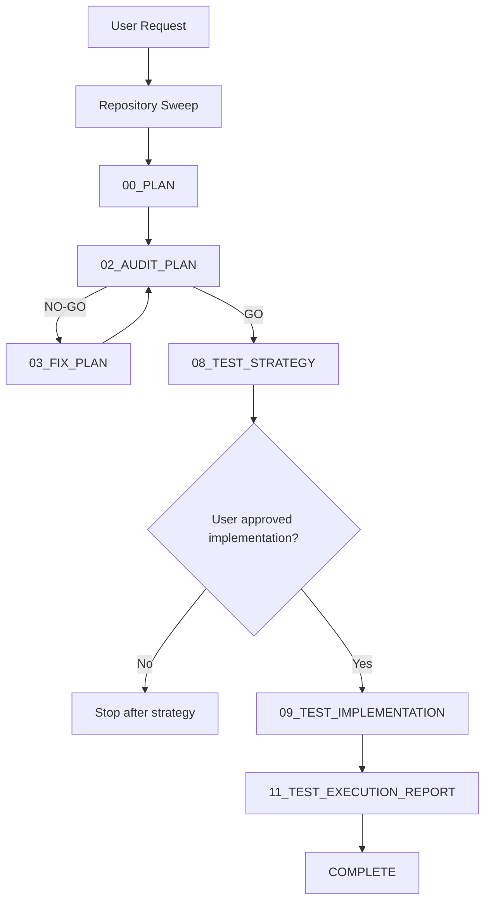

# AECF SKILL - NEW TEST SET (Test Gap Sweep + Optional Implementation)

------------------------------------------------------------

## MANDATORY CONTEXT LOAD

This skill operates under the following mandatory contexts:

- aecf_prompts/AECF_SYSTEM_CONTEXT.md
- aecf_prompts/SKILL_DISPATCHER.md (execution protocol)
- <workspace_root>/AECF_PROJECT_CONTEXT.md (if present anywhere in the active workspace)

Governance:
- aecf_prompts/_governance/AECF_EXECUTIVE_SUMMARY_GOVERNANCE.md

If any of these contexts exist, they MUST be considered active constraints.

Execution is INVALID if these contexts are not acknowledged.

------------------------------------------------------------

## EXECUTION MANDATE (IMPERATIVE)

When this skill is invoked, the AI MUST:

1. AUTO-RESOLVE all parameters (TOPIC, scope, numbering) per SKILL_DISPATCHER.
2. DISCOVER the modules, routines, commands, and current test surface before planning.
3. EXECUTE the strict sequence DISCOVERY SWEEP -> PLAN -> AUDIT_PLAN -> [FIX_PLAN if NO-GO] -> TEST_STRATEGY.
4. ASK EXACTLY ONE USER QUESTION after TEST_STRATEGY if implementation approval is not already explicit and `execute=True` was not provided at invocation time:
   - `Do I implement and execute the proposed tests?`
5. ONLY IF APPROVED, continue with TEST_IMPLEMENTATION -> TEST_EXECUTION_REPORT.
6. CREATE FILES at each phase in `aecf_prompts/<DOCS_ROOT>/<user_id>/<RUN_DATE>/{{TOPIC}}/AECF_<NN>_<PHASE>.md`.
7. GENERATE an extensive final test execution report with commands run, coverage, failures, warnings, and recommendations.

MANDATORY PHASE GATES:
- NO TEST DESIGN WITHOUT DISCOVERY.
- NO TEST IMPLEMENTATION BEFORE PLAN GO.
- NO-GO LOOP REQUIRED on AUDIT_PLAN.
- NO TEST IMPLEMENTATION WITHOUT EXPLICIT USER APPROVAL.
- NO RECURSIVE TEST-ON-TEST FLOW: this skill MUST NOT invoke `10_AUDIT_TESTS.md`.

MANDATORY POST-EXECUTION GOVERNANCE (per SKILL_DISPATCHER):
- UPDATE `aecf_prompts/<DOCS_ROOT>/<user_id>/AECF_TOPICS_INVENTORY.json` and REGENERATE `aecf_prompts/<DOCS_ROOT>/<user_id>/AECF_TOPICS_INVENTORY.md`.
- APPEND one execution entry to `aecf_prompts/<DOCS_ROOT>/<user_id>/AECF_CHANGELOG.md`.

FORBIDDEN:
- Responding only in chat without creating files.
- Asking the user for execution mode, output path, or AECF conventions.
- Implementing tests before explicit user approval or before an explicit `execute=True` pre-approval.
- Modifying production code during this skill unless the user explicitly redirects to another skill.
- Creating tests for the generated tests.
- Using `AUDIT_TESTS` as a recursive quality gate for this skill.

## MANDATORY REPOSITORY DISCOVERY (SEARCH-FIRST)

This skill requires explicit repository discovery before executing its first planning step.

Execution rules:
1. Execute an initial repository search pass within scope using IDE or shell capabilities.
2. Identify target modules or routines, existing test files, coverage tooling, and runnable test commands.
3. Build an execution-scoped `WORKING_CONTEXT` before starting PLAN.
4. If discovery evidence is incomplete, document the gap and continue conservatively in the PLAN with explicit uncertainty markers.

Minimum `WORKING_CONTEXT` for search-first execution:
- `TARGET_SCOPE`
- `DISCOVERED_MODULES_AND_ROUTINES`
- `EXISTING_TEST_SURFACE`
- `TEST_COMMANDS_AND_TOOLING`
- `RISK_AREAS`
- `SOURCE_REFERENCES`

## TRACEABILITY METADATA ENFORCEMENT (MANDATORY)

Every document generated by this skill MUST include `## METADATA` following
`aecf_prompts/templates/TEMPLATE_HEADERS.md`.

The metadata block is INVALID unless it includes, at minimum:
- `Timestamp (UTC)`
- `Executed By`
- `Executed By ID`
- `Execution Identity Source`
- `Repository`
- `Branch`
- `Root Prompt`
- `Skill Executed`
- `Sequence Position`
- `Total Prompts Executed`

## CODE TRACEABILITY AND COMMENT ENFORCEMENT (MANDATORY)

When this skill reaches `TEST_IMPLEMENTATION`, it MUST also load and enforce
`aecf_prompts/code/CODE_FUNCTION_METADATA_STANDARD.md`.

Rules:
- Every generated or modified test file/function MUST include a full `AECF_META` line with at least:
    `skill`, `topic`, `run_time`, `generated_at`, `generated_by`, `last_modified_skill`,
    `last_modified_at`, `last_modified_by`, `touch_count`.
- On creation, `touch_count=1`; on each later AECF write, increment `touch_count` by exactly `1`.
- `generated_*` origin fields MUST remain immutable after creation; later writes update only the
    latest-touch fields plus `run_time` / `touch_count`.
- Human-maintenance comments/docstrings MUST be sufficient for a future engineer to understand
    non-obvious intent, fixtures, mocks, cleanup, and risk-driven assertions.
- Human-readable comments/docstrings MUST use the resolved `OUTPUT_LANGUAGE` /
    `aecf.documentationOutputLanguage`; machine-facing `AECF_META` keys remain English.
- Missing `AECF_META`, stale `touch_count`, or insufficient maintenance comments INVALIDATE
    `TEST_IMPLEMENTATION`.

------------------------------------------------------------

## Skill ID
`aecf_new_test_set`

## Description
Discover existing modules or routines, sweep current test coverage and risk areas, design the missing test set, optionally implement the approved tests, execute them, and generate an extensive evidence report.

## When to Use
- Existing code has weak or missing tests.
- You want a governed test gap analysis before refactoring or release.
- You need tests for security, SQL injection, forced failures, permissions, coverage, performance, or resource handling.
- You want the AI to propose tests first and only implement them after confirmation, or you want to pre-approve execution with `execute=True`.

## When NOT to Use
- Implementing a brand-new feature from scratch with production code changes -> use `aecf_new_feature`.
- Pure read-only quality audit without adding tests -> use `aecf_code_standards_audit` or `aecf_security_review`.
- Recursive audit or fix loops for test code quality itself.

---

## PHASE_DEFINITION

### PLAN
file: 00_PLAN.md
requires_prompt: true
gate: none

### AUDIT_PLAN
file: 02_AUDIT_PLAN.md
gate: GO_REQUIRED

### FIX_PLAN
file: 03_FIX_PLAN.md
loop_to: AUDIT_PLAN

### TEST_STRATEGY
file: 08_TEST_STRATEGY.md

### TEST_IMPLEMENTATION
file: 09_TEST_IMPLEMENTATION.md
requires_plan_go: true
requires_user_approval: true

### TEST_EXECUTION_REPORT
file: 11_TEST_EXECUTION_REPORT.md
requires_user_approval: true

---

## TAXONOMY

skill_tier: TIER3
requires_determinism: false

## Phases Executed



---

## Input Required

### Mandatory:
- Module or routine scope.
- Goal or confidence target.
- TOPIC (optional, inferred if not provided).

### Optional:
- Priority risks: security, sql injection, performance, forced errors, permissions, observability.
- Coverage goal.
- Explicit execution approval, including `execute=True` on `@aecf run`.

---

## Execution Steps

### Step 0: Repository Sweep
- Locate modules and routines in scope.
- Locate existing tests and coverage tooling.
- Identify runnable test commands.
- Flag risk areas and blind spots.

### Step 1: PLAN (00_PLAN.md)
Output: `aecf_prompts/<DOCS_ROOT>/<user_id>/<RUN_DATE>/{{TOPIC}}/AECF_<NN>_PLAN.md`
Action: generate a test hardening plan with scope, modules or routines, risk areas, coverage goal, and implementation boundaries.

### Step 2: AUDIT_PLAN (02_AUDIT_PLAN.md)
Output: `aecf_prompts/<DOCS_ROOT>/<user_id>/<RUN_DATE>/{{TOPIC}}/AECF_<NN>_AUDIT_PLAN.md`
Possible outcomes:
- GO -> continue.
- NO-GO -> run FIX_PLAN and loop.

### Step 3: TEST_STRATEGY (08_TEST_STRATEGY.md)
Output: `aecf_prompts/<DOCS_ROOT>/<user_id>/<RUN_DATE>/{{TOPIC}}/AECF_<NN>_TEST_STRATEGY.md`
Action:
- Define missing tests by module or routine.
- Include happy path, edge cases, error forcing, security, SQL injection, access control, resource handling, and performance when applicable.
- Separate mandatory tests from optional tests.
- Include recommended execution commands.

### Step 4: User Approval Gate
If approval is not already explicit, ask exactly one question:
`Do I implement and execute the proposed tests?`
If the user declines, stop after TEST_STRATEGY and report design-only completion.
If the run was invoked with `execute=True`, treat implementation and execution as already approved and continue without asking again.

### Step 5: TEST_IMPLEMENTATION (09_TEST_IMPLEMENTATION.md)
Output: `aecf_prompts/<DOCS_ROOT>/<user_id>/<RUN_DATE>/{{TOPIC}}/AECF_<NN>_TEST_IMPLEMENTATION.md`
Action:
- Implement only the approved tests.
- Follow project test structure and commands.
- Do not modify production code unless blocked and explicitly escalated.
- Do not create tests for the generated tests.
- Add/maintain `AECF_META` with `run_time` and `touch_count` on every generated or modified test artifact.
- Add enough human-readable comments/docstrings for long-term maintenance in the resolved output language.

### Step 6: TEST_EXECUTION_REPORT (11_TEST_EXECUTION_REPORT.md)
Output: `aecf_prompts/<DOCS_ROOT>/<user_id>/<RUN_DATE>/{{TOPIC}}/AECF_<NN>_TEST_EXECUTION_REPORT.md`
Action:
- Execute the approved tests.
- Record commands, environment assumptions, pass or fail counts, durations, and coverage.
- Summarize evidence by category: security, SQL injection, forced errors, performance, permissions, observability, resource handling.
- Produce an extensive report with blockers, flaky behavior, residual gaps, and next recommendations.

---

## Success Criteria

- Repository sweep completed before planning.
- PLAN approved with GO.
- TEST_STRATEGY lists missing tests by module or routine and risk category.
- User approval captured before implementation.
- Approved tests implemented without recursive test-on-test flow.
- Executed tests with documented commands and evidence.
- Extensive execution report generated.

---

## Related Skills

- `aecf_new_feature`
- `aecf_refactor`
- `aecf_security_review`
- `aecf_release_readiness`

---

## Outputs Generated

### Strategy-only mode
```
aecf_prompts/<DOCS_ROOT>/<user_id>/<RUN_DATE>/{{TOPIC}}/
|- AECF_01_PLAN.md
|- AECF_02_AUDIT_PLAN.md
`- AECF_03_TEST_STRATEGY.md
```

### Full mode
```
aecf_prompts/<DOCS_ROOT>/<user_id>/<RUN_DATE>/{{TOPIC}}/
|- AECF_01_PLAN.md
|- AECF_02_AUDIT_PLAN.md
|- AECF_03_TEST_STRATEGY.md
|- AECF_04_TEST_IMPLEMENTATION.md
`- AECF_05_TEST_EXECUTION_REPORT.md
```

---

## CONTEXT VALIDATION

Confirm:

[ ] AECF_SYSTEM_CONTEXT.md loaded
[ ] Governance rules applied
[ ] SKILL_DISPATCHER rules applied
[ ] Repository sweep completed before PLAN
[ ] Every generated AECF document includes `## METADATA` as first section

If not confirmed -> STOP execution.

---

## AI_USAGE_DECLARATION

AI_USED = TRUE

## AI_EXPLAINABILITY_VALIDATION

- Explainability level defined? YES/NO
- User-facing explanation provided? YES/NO
- Model version logged? YES/NO
- Decision trace stored? YES/NO

## GOVERNANCE VALIDATION BLOCK

- Data lineage impact
- Model impact (YES/NO)
- Risk impact
- Compliance check
