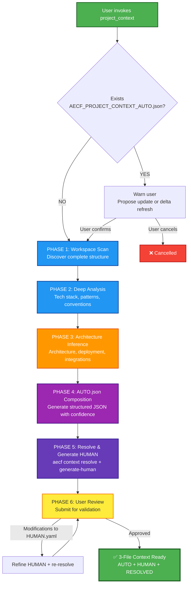

## PHASE_DEFINITION

### AECF_PROJECT_CONTEXT_GENERATOR
output_file: .aecf/runtime/context/AECF_PROJECT_CONTEXT_AUTO.json
gate: none
loop_to: none
requires_plan_go: false

## TAXONOMY

skill_tier: TIER2
requires_determinism: false

# AECF SKILL — PROJECT CONTEXT GENERATOR (Workspace Analysis & Context Bootstrapping)

------------------------------------------------------------

## MANDATORY CONTEXT LOAD

This skill operates under the following mandatory contexts:

- aecf_prompts/AECF_SYSTEM_CONTEXT.md
- aecf_prompts/SKILL_DISPATCHER.md (execution protocol)

Governance:
- aecf_prompts/_governance/AECF_EXECUTIVE_SUMMARY_GOVERNANCE.md

**NOTE**: This skill does NOT require `AECF_PROJECT_CONTEXT.md` as input — its purpose is to **generate** it.

Execution is INVALID if the above contexts are not acknowledged.

------------------------------------------------------------

## EXECUTION MANDATE (IMPERATIVE)

When this skill is invoked, the AI MUST:

1. **SCAN** the entire workspace to discover project structure, technologies, patterns and conventions
2. **ANALYZE** all relevant configuration, source code, documentation and infrastructure files
3. **INFER** architecture, tech stack, deployment model, coding conventions and critical patterns
4. **ASSIGN CONFIDENCE** to each section (0.0–1.0) based on evidence quality
5. **GENERATE** a structured `AECF_PROJECT_CONTEXT_AUTO.json` at `.aecf/runtime/context/`
6. **CREATE OR REFRESH** `.aecf/runtime/context/AECF_PROJECT_CONTEXT_HUMAN.yaml` when it is missing so the human layer exists explicitly in prompt-only bootstrap mode
7. **TRIGGER RESOLVE** by producing AUTO + HUMAN and leaving `.aecf/runtime/context/AECF_PROJECT_CONTEXT_RESOLVED.json` materialized as the merged source of truth
8. **CREATE OR REFRESH** the human-readable prompt-only file `<DOCS_ROOT>/AECF_PROJECT_CONTEXT.md`
9. **CREATE OR REFRESH** `.github/copilot-instructions.md`, `copilot-instructions.md`, `CLAUDE.md`, `AGENTS.md`, and `.codex/instructions.md` when execution happens from the root of the `aecf_prompts` bundle
10. **PRESENT** the generated context summary to the user for review and refinement
11. **ITERATE** if the user requests modifications or additions

Execution is INCOMPLETE if any of these files is missing after the skill finishes:

1. `.aecf/runtime/context/AECF_PROJECT_CONTEXT_AUTO.json`
2. `.aecf/runtime/context/AECF_PROJECT_CONTEXT_HUMAN.yaml`
3. `.aecf/runtime/context/AECF_PROJECT_CONTEXT_RESOLVED.json`
4. `<DOCS_ROOT>/AECF_PROJECT_CONTEXT.md`

**MANDATORY POST-EXECUTION GOVERNANCE (per SKILL_DISPATCHER)**:
- **UPDATE** `<DOCS_ROOT>/<user_id>/AECF_TOPICS_INVENTORY.json` for TOPIC lifecycle and **REGENERATE** `<DOCS_ROOT>/<user_id>/AECF_TOPICS_INVENTORY.md` (Step 4.1)
- **APPEND** one execution entry to `<DOCS_ROOT>/<user_id>/AECF_CHANGELOG.md` (Step 4.2)

**FORBIDDEN**:
- ❌ Responding only in chat without creating the file
- ❌ Asking the user for execution mode, output path, or AECF conventions
- ❌ Requiring verbose prompts — a simple `skill: project_context` MUST be sufficient
- ❌ Generating a generic/template context without actual project analysis
- ❌ Skipping any analysis phase
- ❌ Modifying any existing code (this skill is READ-ONLY, analysis-only)
- ❌ Overwriting an existing `AECF_PROJECT_CONTEXT_AUTO.json` without explicit user confirmation
- ❌ Outputting Markdown format — output MUST be valid JSON
- ❌ Omitting confidence scores from any section
- ❌ Recommending non-existent AECF skills in findings/remediations

## RECOMMENDED SKILL ALLOW-LIST (MANDATORY)

When the output includes findings with `Recommended Skill`, those IDs MUST be selected from `aecf_prompts/skills/SKILL_CATALOG.md` only.

Rules:
- `Recommended Skill` MUST use existing `aecf_*` skill IDs from the closed catalog.
- NEVER invent skill IDs from env vars, flags, policies, or gate names.
- Forbidden example: `aecf_beta_enforce_release_gates`.
- For release-gate strictness findings, map recommendation to `aecf_release_readiness`.

## MANDATORY REPOSITORY DISCOVERY (SEARCH-FIRST)

This skill requires explicit repository discovery before executing its first audit/analysis step.

Execution rules:
1. Execute an initial repository search pass within scope using IDE capabilities.
2. Build an execution-scoped `WORKING_CONTEXT` before starting the first skill step.
3. If discovery evidence is incomplete, set discovery status to NO-GO and STOP.

Minimum `WORKING_CONTEXT` for search-first execution:
- `TARGET_SCOPE`
- `ENTRY_POINTS_OR_ARTIFACTS`
- `DISCOVERED_PATHS`
- `CONFIG_AND_DEPENDENCIES`
- `UNCERTAINTIES_AND_ASSUMPTIONS`
- `SOURCE_REFERENCES` (concrete file paths and line-level references)

Forbidden:
- Skipping discovery and jumping directly to analysis.
- Assuming repository structure without verification.
- Reusing shared static discovery files across executions.

## TRACEABILITY METADATA ENFORCEMENT (MANDATORY)

Every document generated by this skill MUST include `## METADATA` following
`aecf_prompts/templates/TEMPLATE_HEADERS.md`.

The metadata block is INVALID unless it includes, at minimum:
- `Timestamp (UTC)`
- `Executed By`
- `Executed By ID`
- `Execution Identity Source`
- `Repository`
- `Branch`
- `Root Prompt`
- `Skill Executed`
- `Sequence Position`
- `Total Prompts Executed`

Missing metadata or missing traceability fields => INVALID SKILL EXECUTION.

------------------------------------------------------------

## Skill ID
`aecf_project_context_generator`

## Description
Scans and analyzes all files in a workspace to automatically generate `AECF_PROJECT_CONTEXT_AUTO.json` — the machine-inferred architectural contract that feeds the 3-file project context system. After generation, the engine merges AUTO + HUMAN → RESOLVED using `aecf context resolve`. The RESOLVED file is what all other AECF skills consume. When execution happens from the root of the `aecf_prompts` bundle, the generator also refreshes the prompt-only instruction files for supported LLM tools.

Mandatory materialized outputs for prompt-only bootstrap:

1. `.aecf/runtime/context/AECF_PROJECT_CONTEXT_AUTO.json`
2. `.aecf/runtime/context/AECF_PROJECT_CONTEXT_HUMAN.yaml`
3. `.aecf/runtime/context/AECF_PROJECT_CONTEXT_RESOLVED.json`
4. `<DOCS_ROOT>/AECF_PROJECT_CONTEXT.md`

Prompt-only downstream usage:

1. prompts of phase load `<DOCS_ROOT>/AECF_PROJECT_CONTEXT.md` as the direct readable project context;
2. `AECF_PROJECT_CONTEXT_AUTO.json` preserves machine-inferred evidence for later refreshes;
3. `AECF_PROJECT_CONTEXT_HUMAN.yaml` is the editable override layer;
4. `AECF_PROJECT_CONTEXT_RESOLVED.json` is the combined source of truth used to regenerate or validate the readable project context.

## When to Use
- When starting to use AECF in a new or existing project
- When `AECF_PROJECT_CONTEXT_AUTO.json` does not exist in `.aecf/runtime/context/`
- When incorporating a legacy project into the AECF ecosystem
- When the existing context is outdated (structural hash mismatch)
- New team onboarding: generate project context automatically
- Before running any other AECF skill for the first time in a workspace
- When `aecf context status` reports STALE or MISSING

## When NOT to Use
- The context system is up to date (VALID hash) → only edit HUMAN.yaml manually
- You only want to document a specific module → use `aecf_document_legacy`
- You want to audit standards → use `aecf_code_standards_audit`
- The workspace is empty or it is a greenfield project without code → create context files manually

---

## Phases Executed



---

## Input Required

### Mandatory:
- **Workspace**: The active workspace in VS Code (it is automatically scanned)

### Optional:
- **Focus areas**: Areas of the project in which to delve further
- **Known context**: Information that the user already knows and wants to include
- **Override instructions**: Specific conventions that the user wants to force

---

## Execution Steps

### PHASE 1: WORKSPACE SCAN (Discovery)

**Objective**: Discover the complete structure of the project.

**Actions**:
1. **Directory tree analysis**
- Map directory structure (maximum 4 levels deep for overview)
- Identify key directories: `src/`, `app/`, `tests/`, `config/`, `docs/`, etc.
   - Detectar directorios de output/build: `dist/`, `build/`, `node_modules/`, `__pycache__/`, etc.

2. **Configuration file discovery**
   - Package manifests: `package.json`, `requirements.txt`, `pyproject.toml`, `Pipfile`, `Cargo.toml`, `pom.xml`, `build.gradle`, `*.csproj`, `go.mod`
   - Config files: `tsconfig.json`, `.eslintrc`, `.prettierrc`, `setup.cfg`, `tox.ini`, `.flake8`
   - CI/CD: `.github/workflows/`, `Jenkinsfile`, `.gitlab-ci.yml`, `azure-pipelines.yml`
   - Containerization: `Dockerfile`, `docker-compose.yml`, `.dockerignore`
   - Environment: `.env*`, `*.env`, `production_env_overrides.json`
   - Infrastructure: `terraform/`, `k8s/`, `helm/`, `ansible/`

3. **Source file inventory**
- Count files by extension/language
- Identify primary language(s) by volume and presence
- Detect monolithic files (>1000 lines) as attention points

4. **Documentation scan**
   - README files, CHANGELOG, CONTRIBUTING, LICENSE
- Existing documentation in `docs/`, `documentation/`
- Copyright comments/headers in source files

**Phase Output**: Structured inventory of the workspace.

---

### PHASE 2: DEEP ANALYSIS (Technology & Patterns)

**Objective**: Identify technological stack, frameworks and project patterns.

**Actions**:
1. **Tech stack identification**
- Programming languages ​​+ versions (of configs)
   - Frameworks: Flask, Django, Express, React, Angular, Vue, Spring, .NET, etc.
   - ORMs: SQLAlchemy, Prisma, TypeORM, Hibernate, Entity Framework
   - Bases de datos: PostgreSQL, MySQL, MongoDB, Redis, SQLite
   - Message brokers: RabbitMQ, Kafka, Redis Pub/Sub
   - Cloud services: Azure, AWS, GCP (detectar SDKs/configs)

2. **Architecture pattern detection**
- Monolith vs Microservices
   - MVC, Clean Architecture, Hexagonal, Event-Driven
   - API style: REST, GraphQL, gRPC, WebSocket
   - Multi-tenant patterns
   - Authentication/Authorization patterns (SSO, OAuth, JWT)

3. **Coding conventions extraction**
- Naming conventions (detect from existing code)
- Import patterns and internal dependencies
   - Error handling patterns
   - Logging patterns
   - Test organization y coverage patterns

4. **Dependency analysis**
- Main dependencies and their roles
- Internal/own dependencies (monorepos, internal libs)
   - Versiones de runtime (Python 3.x, Node 18+, etc.)

**Phase output**: Complete technological profile of the project.

---

### PHASE 3: ARCHITECTURE INFERENCE (Intelligence Layer)

**Objective**: Infer the architecture, deployment model and critical patterns.

**Actions**:
1. **Entry points identification**
- Boot files (`main.py`, `app.py`, `index.ts`, `server.js`, etc.)
   - Scripts de CLI, workers, cron jobs
- Multiple entry points if multi-service

2. **Deployment model inference**
- Development vs production environment
- Containerization, orchestration (Docker, K8s, ECS)
   - Load balancing (HAProxy, Nginx, ALB)
   - Process model: single vs multi-process, workers

3. **Integration mapping**
   - APIs externas consumidas
- Third party services
   - Bridges/adaptadores entre componentes
- Messaging queues and event buses

4. **Critical patterns identification**
   - Concurrency/threading model
   - Caching strategy
   - State management (sessions, distributed state)
   - Data flow patterns (ETL/ELT, pipelines)
   - Monitoring/observability (OpenTelemetry, Prometheus, logging)

5. **Environment & Configuration intelligence**
- Variable naming conventions (prefixes like `CM_`, etc.)
   - Configuration loading chain (dotenv, overrides, etc.)
   - Secrets management approach
   - Feature flags o configuration toggles

**Phase output**: Inferred architectural map.

---

### PHASE 4: AUTO.JSON COMPOSITION (Structured Generation)

**Objective**: Compose `AECF_PROJECT_CONTEXT_AUTO.json` with all information collected, using the mandatory JSON schema.

**Output format**: Valid JSON file at `.aecf/runtime/context/AECF_PROJECT_CONTEXT_AUTO.json`

**Mandatory JSON schema**:

```json
{
  "context_metadata": {
    "project_name": "{{project_name}}",
    "generated_at": "{{ISO-8601 UTC timestamp}}",
    "context_version": "1.0.0",
    "structural_hash": "{{16-char hex hash from aecf context hash}}",
    "confidence_overall": 0.0,
    "generator_skill": "aecf_project_context_generator",
    "output_language": "ENGLISH"
  },
  "technical_stack": {
    "confidence": 0.0,
    "source": "auto",
    "primary_languages": ["language1 vX.Y"],
    "frameworks": ["framework1"],
    "orms": [],
    "databases": [],
    "cache_backends": [],
    "message_brokers": [],
    "cloud_services": [],
    "tooling": {
      "linting": [],
      "formatting": [],
      "testing": [],
      "build": []
    },
    "runtime_versions": {}
  },
  "architecture_pattern": {
    "confidence": 0.0,
    "source": "auto",
    "style": "monolith|microservices|modular_monolith|serverless",
    "layers": [],
    "api_style": "REST|GraphQL|gRPC|WebSocket|none",
    "auth_patterns": [],
    "multi_tenant": false,
    "entry_points": [],
    "deployment_model": "container|serverless|bare_metal|paas",
    "process_model": "single|multi_process|workers"
  },
  "persistence_model": {
    "confidence": 0.0,
    "source": "auto",
    "primary_db": "",
    "orm_or_driver": "",
    "migration_system": "",
    "secondary_stores": []
  },
  "concurrency_model": {
    "confidence": 0.0,
    "source": "auto",
    "threading_model": "sync|async|mixed",
    "task_queues": [],
    "lock_patterns": [],
    "worker_processes": false
  },
  "caching_strategy": {
    "confidence": 0.0,
    "source": "auto",
    "backends": [],
    "patterns": [],
    "ttl_defaults": {}
  },
  "external_integrations": {
    "confidence": 0.0,
    "source": "auto",
    "apis_consumed": [],
    "auth_providers": [],
    "webhooks": [],
    "event_buses": [],
    "third_party_services": []
  },
  "domain_model_snapshot": {
    "confidence": 0.0,
    "source": "auto",
    "core_entities": [],
    "bounded_contexts": [],
    "aggregate_roots": [],
    "relationships": []
  },
  "governance_signals": {
    "confidence": 0.0,
    "source": "auto",
    "test_framework": "",
    "test_organization": "",
    "coverage_tool": "",
    "linting_rules": [],
    "security_mechanisms": [],
    "ci_cd_pipeline": "",
    "monitoring_observability": []
  },
  "structural_metrics": {
    "confidence": 0.0,
    "source": "auto",
    "total_files": 0,
    "total_lines_estimated": 0,
    "module_count": 0,
    "monolithic_files": [],
    "complexity_hotspots": [],
    "files_by_language": {}
  },
  "context_integrity": {
    "structural_hash": "{{same as context_metadata.structural_hash}}",
    "structural_hash_match": true,
    "requires_refresh": false
  }
}
```

**Confidence scoring rules**:
- **1.0**: Direct evidence in config files (package.json, pyproject.toml, tsconfig.json, etc.)
- **0.9**: Evidence in source code imports/usage patterns
- **0.8**: Detected from file structure and naming conventions
- **0.7**: Inferred from indirect signals (CI configs, Dockerfiles)
- **0.5**: Weak inference from partial signals
- **0.3**: Guess based on project type
- **0.0**: No evidence found, section populated with defaults

**`confidence_overall`**: Arithmetic mean of all section-level confidence scores.

**Composition rules**:
- Only populate sections for which there is real evidence in the workspace
- Use `[]` or `""` for empty fields — never invent data
- Every section MUST have `confidence` and `source` fields
- Sections with confidence < 0.75 will be flagged for HUMAN review automatically
- Include concrete file paths as evidence in arrays where applicable
- JSON MUST be valid and parseable

---

### PHASE 5: RESOLVE & GENERATE HUMAN TEMPLATE

**Objective**: Trigger the 3-file merge and generate the HUMAN template for admin curation.

**Actions**:
1. **Write** `AECF_PROJECT_CONTEXT_AUTO.json` to `.aecf/runtime/context/`
2. The deterministic engine will call `aecf context resolve` to merge AUTO + HUMAN → RESOLVED
3. The deterministic engine will call `aecf context generate-human` to create the HUMAN.yaml template
4. The HUMAN.yaml template will contain:
   - 8 mandatory human-only fields (business_criticality, risk_tolerance, etc.)
   - All sections with confidence < 0.75 flagged for admin review
   - Each field explains the risk if not provided

---

### PHASE 6: USER REVIEW (Interactive Refinement)

### PHASE 6: USER REVIEW (Interactive Refinement)

**Objective**: Present the generated context for user validation.

**Actions**:
1. **Create the file** `AECF_PROJECT_CONTEXT_AUTO.json` in `.aecf/runtime/context/`
2. **Create or refresh** `<DOCS_ROOT>/AECF_PROJECT_CONTEXT.md` as the human-readable project context consumed by prompt-only executions
3. **Present summary** to the user with:
- Scan statistics (files analyzed, languages ​​detected, etc.)
- Confidence level by section (High ≥0.75 / Medium 0.5–0.74 / Low <0.5)
- Sections requiring HUMAN input (confidence < 0.75)
- HUMAN.yaml fields that need admin curation
4. **Request review** from user
5. **Apply refinements** if the user proposes changes (update AUTO.json, refresh `<DOCS_ROOT>/AECF_PROJECT_CONTEXT.md`, and re-resolve)
6. **Confirm** when user approves

**Post-completion message**:
```
✅ 3-file project context system generated in .aecf/runtime/context/
   - AECF_PROJECT_CONTEXT_AUTO.json  (machine-inferred)
   - AECF_PROJECT_CONTEXT_HUMAN.yaml (admin template — needs curation)
   - AECF_PROJECT_CONTEXT_RESOLVED.json (merged source of truth)
📝 Human-readable context refreshed at <DOCS_ROOT>/AECF_PROJECT_CONTEXT.md
📊 Statistics: X files analyzed, Y languages detected
🎯 Overall confidence: Z%
🔧 Sections needing HUMAN review: N (confidence < 75%)
📋 HUMAN.yaml has 8 mandatory fields pending admin input

The RESOLVED file is ready to be used by all AECF skills.
Any skill you run in this workspace will load it automatically.

💡 Edit AECF_PROJECT_CONTEXT_HUMAN.yaml then run: aecf context resolve
```

---

## Output

### Primary Output
- **File**: `<workspace_root>/.aecf/runtime/context/AECF_PROJECT_CONTEXT_AUTO.json`
- **Format**: JSON following the structured schema defined in Phase 4
- **Location**: `.aecf/runtime/context/` (hidden from workspace root, managed by engine)

### Secondary Outputs (generated by engine post-execution)
- **File**: `<workspace_root>/.aecf/runtime/context/AECF_PROJECT_CONTEXT_HUMAN.yaml` (admin template)
- **File**: `<workspace_root>/.aecf/runtime/context/AECF_PROJECT_CONTEXT_RESOLVED.json` (merged source of truth)

### Prompt-Only Human-Readable Outputs
- **File**: `<DOCS_ROOT>/AECF_PROJECT_CONTEXT.md`
- **Governance files**:
  - `<DOCS_ROOT>/<user_id>/AECF_TOPICS_INVENTORY.json`
  - `<DOCS_ROOT>/<user_id>/AECF_TOPICS_INVENTORY.md`
  - `<DOCS_ROOT>/<user_id>/AECF_CHANGELOG.md`

The prompt-only human-readable file is the durable context that later prompt-only skills should load.
Do NOT create a duplicate `AECF_PROJECT_CONTEXT` artifact under `<user_id>/<TOPIC>/`.

### Why in .aecf/runtime/context/?
The context files are **engine-managed runtime artifacts**, not user-facing workspace files.
1. `.aecf/runtime/` is gitignored by default — context is workspace-local
2. The engine reads RESOLVED.json at every execution via `handle_next()`
3. AUTO.json is regenerated by this skill; HUMAN.yaml is admin-curated; RESOLVED.json is the merge
4. Keeps workspace root clean — analogous to `.git/` or `.vscode/`

---

## Edge Cases

### Workspace with multiple projects (monorepo)
- Generate a root `AECF_PROJECT_CONTEXT_AUTO.json` that describes the monorepo
- Identify each sub-project and its relationships in `domain_model_snapshot`
- Recommend to the user if they need separate contexts per sub-project

### Workspace with existing `AECF_PROJECT_CONTEXT_AUTO.json`
- **DO NOT overwrite** without confirmation
- Show diff summary between what exists and what is proposed (section-by-section confidence changes)
- Offer options: update (delta mode), replace (full regeneration), or cancel

### Delta Mode (incremental update)
- When AUTO.json already exists and user requests refresh:
  1. Load existing AUTO.json
  2. Re-scan workspace for changes
  3. Update only sections affected by structural changes
  4. Preserve confidence scores for unchanged sections
  5. Re-resolve via `aecf context resolve`

### No-code project (docs only)
- Generate context based on available documentation
- Most sections will have low confidence (< 0.5)
- HUMAN.yaml will contain more fields flagged for admin review

### Project with huge files
- For files >5000 LOC, read head (first 100 lines) and tail (last 50 lines) + imports
- Report as "monolithic file" in `structural_metrics.monolithic_files`

### Legacy migration (from AECF_PROJECT_CONTEXT.md)
- If old `AECF_PROJECT_CONTEXT.md` exists at workspace root but no AUTO.json:
  - Parse the Markdown to seed initial AUTO.json sections
  - Flag all sections as confidence 0.6 (inferred from legacy format)
  - Keep the old file as reference but generate the new 3-file system

---

## Confidence Levels

The skill assigns a numeric confidence score (0.0–1.0) to each section:

| Range | Indicator | Meaning | HUMAN Action |
|-------|-----------|---------|--------------|
| 0.75–1.0 | 🟢 High | Direct evidence in configs/code | No human review needed |
| 0.50–0.74 | 🟡 Medium | Inferred from patterns | Flagged in HUMAN.yaml for review |
| 0.00–0.49 | 🔴 Low | Reasonable assumption or no evidence | Requires admin confirmation in HUMAN.yaml |

Sections below the `HUMAN_TEMPLATE_CONFIDENCE_THRESHOLD` (0.75) are automatically included in the generated `AECF_PROJECT_CONTEXT_HUMAN.yaml` for admin curation.

---

## Relationship with Other Skills

### This skill is the recommended FIRST step for any new project in AECF

```
aecf_project_context_generator (FIRST — generates AUTO.json → triggers RESOLVED.json)
→ All other skills automatically benefit via RESOLVED.json injection
→ aecf_code_standards_audit (knows which standards to apply)
→ aecf_new_feature (knows the architecture and conventions)
→ aecf_document_legacy (understands the stack and patterns)
→ aecf_security_review (knows the auth and deployment model)
→ aecf_maturity_assessment (has baseline context)
```

### The RESOLVED context is injected as the first prompt block
The engine's `_build_external_prompt()` prepends the RESOLVED context before every skill execution.
This means every skill automatically receives the architectural contract without explicit loading.

### 3-File Context Hierarchy
1. **AUTO.json**: Machine-generated (this skill) — re-generated on structural changes
2. **HUMAN.yaml**: Admin-curated — edited manually, never overwritten by engine
3. **RESOLVED.json**: Merged (AUTO + HUMAN, human wins) — consumed at runtime

### Context Lifecycle Commands
- `aecf context status` — check if context exists and is fresh
- `aecf context hash` — compare stored vs current structural hash
- `aecf context resolve` — re-merge AUTO + HUMAN → RESOLVED
- `aecf context generate-human` — regenerate HUMAN template from AUTO
- `aecf context refresh` — full regeneration (invokes this skill)

---

## CONTEXT VALIDATION

Confirm:

- [ ] AECF_SYSTEM_CONTEXT.md loaded
- [ ] SKILL_DISPATCHER.md loaded
- [ ] Workspace accessible for scanning
- [ ] `.aecf/runtime/context/` directory writable
- [ ] JSON output capability available
- [ ] User review loop available
- [ ] `aecf context resolve` available for post-generation merge

If not confirmed → STOP execution.

------------------------------------------------------------

**END OF skill_project_context_generator.md**

## AI_USAGE_DECLARATION

AI_USED = TRUE

## AI_EXPLAINABILITY_VALIDATION

- Explainability level defined? YES/NO
- User-facing explanation provided? YES/NO
- Model version logged? YES/NO
- Decision trace stored? YES/NO

## GOVERNANCE VALIDATION BLOCK

- Data lineage impact
- Model impact (YES/NO)
- Risk impact
- Compliance check


