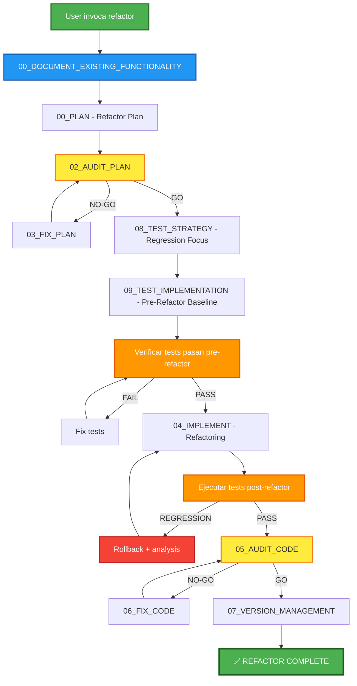

## PHASE_DEFINITION

### PLAN
output_file: 01_PLAN.md
requires_prompt: true
gate: none

### AUDIT_PLAN
output_file: 02_AUDIT_PLAN.md
gate: GO_REQUIRED

### FIX_PLAN
output_file: 03_FIX_PLAN.md
loop_to: AUDIT_PLAN

### IMPLEMENT
output_file: 04_IMPLEMENT.md
requires_plan_go: true

### AUDIT_STATIC_ANALYSIS
output_file: 05A_AUDIT_STATIC_ANALYSIS.md
gate: GO_REQUIRED

### AUDIT_IMPLEMENT
output_file: 05_AUDIT_CODE.md
gate: GO_REQUIRED

### FIX_CODE
output_file: 06_FIX_CODE.md
loop_to: AUDIT_STATIC_ANALYSIS

## TAXONOMY

skill_tier: TIER3
requires_determinism: false

# AECF SKILL — REFACTOR (Governed Code Refactoring)

------------------------------------------------------------

## MANDATORY CONTEXT LOAD

This skill operates under the following mandatory contexts:

- aecf_prompts/AECF_SYSTEM_CONTEXT.md
- aecf_prompts/SKILL_DISPATCHER.md (execution protocol)
- <workspace_root>/AECF_PROJECT_CONTEXT.md (if present anywhere in the active workspace)

Governance:
- aecf_prompts/_governance/AECF_EXECUTIVE_SUMMARY_GOVERNANCE.md

If any of these contexts exist, they MUST be considered active constraints.

Execution is INVALID if these contexts are not acknowledged.

------------------------------------------------------------

## EXECUTION MANDATE (IMPERATIVE)

When this skill is invoked, the AI MUST:

1. **AUTO-RESOLVE** all parameters (TOPIC, scope, numbering) per SKILL_DISPATCHER
2. **DOCUMENT** existing behavior before any modification (DOCUMENT_EXISTING)
3. **PLAN** refactoring with risk assessment and rollback strategy
4. **AUDIT** the plan before execution
5. **IMPLEMENT** refactoring preserving external behavior
6. **TEST** that all existing behavior is preserved
7. **AUDIT** the refactored code
8. **CREATE FILES** at each phase in `<DOCS_ROOT>/<user_id>/{{TOPIC}}/AECF_<NN>_<PHASE>.md`

**MANDATORY POST-EXECUTION GOVERNANCE (per SKILL_DISPATCHER)**:
- **UPDATE** `<DOCS_ROOT>/<user_id>/AECF_TOPICS_INVENTORY.json` for TOPIC lifecycle and **REGENERATE** `<DOCS_ROOT>/<user_id>/AECF_TOPICS_INVENTORY.md` (Step 4.1)
- **APPEND** one execution entry to `<DOCS_ROOT>/<user_id>/AECF_CHANGELOG.md` (Step 4.2)

**FORBIDDEN**:
- ❌ Responding only in chat without creating files
- ❌ Asking the user for execution mode, output path, or AECF conventions
- ❌ Requiring verbose prompts — a simple `skill: refactor <scope>` MUST be sufficient
- ❌ Refactoring without documenting existing behavior first
- ❌ Changing external behavior (this is refactor, NOT feature change)
- ❌ Skipping regression verification

## MANDATORY UPSTREAM ARTIFACT DEPENDENCY

`aecf_refactor` MUST consume the output artifact of a previous skill for the same `TOPIC` whenever such artifact exists.

Accepted upstream sources include (non-exhaustive):
- `aecf_code_standards_audit`
- `aecf_security_review`
- `aecf_tech_debt_assessment`
- any other analysis/audit skill that reports concrete problems/findings

Execution rule:
1. Resolve the latest upstream artifact for the same `TOPIC`.
2. Extract at minimum:
     - files/paths affected,
     - problems/findings to resolve.
3. If no valid upstream artifact is found for the topic, do NOT continue refactor planning.

PLAN bootstrap rule (MANDATORY):
- The PLAN output MUST start by enumerating:
    1) `Files to review`
    2) `Problems to resolve`
- This inventory MUST come from the upstream artifact before proposing refactor steps.
- The `Remediation plan` MUST reuse upstream remediation/recommendation items as-is.
- Refactor MUST NOT expand scope beyond upstream files/problems/remediation items.

IMPLEMENT reporting rule (MANDATORY):
- The implementation result MUST be explicit about:
    1) scripts touched,
    2) remediation/refactor applied per script,
    3) rationale for each remediation,
    4) script evidence with line-level references (`path:line` or `path:start-end`).
- If scripts are already OK and no refactor is applied, it MUST explicitly report `No Changes Applied` and include the concrete reason.
- For generated tests in refactor flows, avoid top-level project imports (`src.*`) and encapsulate imports inside functions/fixtures to reduce circular import risk.

## TRACEABILITY METADATA ENFORCEMENT (MANDATORY)

Every document generated by this skill MUST include `## METADATA` following
`aecf_prompts/templates/TEMPLATE_HEADERS.md`.

The metadata block is INVALID unless it includes, at minimum:
- `Timestamp (UTC)`
- `Executed By`
- `Executed By ID`
- `Execution Identity Source`
- `Repository`
- `Branch`
- `Root Prompt`
- `Skill Executed`
- `Sequence Position`
- `Total Prompts Executed`

Missing metadata or missing traceability fields => INVALID SKILL EXECUTION.

## CODE TRACEABILITY AND COMMENT ENFORCEMENT (MANDATORY)

When this skill reaches `IMPLEMENT` or `FIX_CODE`, it MUST also load and enforce
`aecf_prompts/code/CODE_FUNCTION_METADATA_STANDARD.md`.

Rules:
- Every generated or modified function, method, class, module, or regression-test artifact MUST include a full `AECF_META` line.
- The `AECF_META` block MUST include `skill`, `topic`, `run_time`, `generated_at`, `generated_by`, `last_modified_skill`, `last_modified_at`, `last_modified_by`, and `touch_count`.
- On creation, `touch_count=1`; on each later AECF write, preserve `generated_*`, refresh `run_time`, update `last_modified_*`, and increment `touch_count` by exactly `1`.
- Human-maintenance comments/docstrings MUST be sufficient for a future engineer and MUST use the resolved `OUTPUT_LANGUAGE` / `aecf.documentationOutputLanguage`.
- Missing `AECF_META`, stale `touch_count`, or insufficient maintenance comments INVALIDATE implementation and fix phases.

------------------------------------------------------------

## Skill ID
`aecf_refactor`

## Description
Perform governed refactoring with prior documentation of existing behavior, audited refactoring plan, controlled implementation, and regression checking. It ensures that external behavior is preserved while improving the internal structure of the code.

## When to Use
- Post `aecf_document_legacy` → refactor documented code
- Post `aecf_code_standards_audit` → fix standards violations
- Post `aecf_tech_debt_assessment` → address prioritized technical issues
- Code with high cyclomatic complexity
- Duplicate code that needs abstraction
- Preparation for new feature on legacy code

## When NOT to Use
- Implement new functionality → use `aecf_new_feature`
- Hot production fix → use `aecf_hotfix`
- Only document code → use `aecf_document_legacy`
- Change external behavior → use `aecf_new_feature` with migration plan

---

## Phases Executed



---

## Input Required

### Mandatory:
- **Scope**: Code to refactor (files, modules, directories)
- **TOPIC** (optional): Identifier of the refactoring (it will be inferred from the scope)

### Optional:
- **Refactoring type**: Tipo de refactoring (extract, restructure, simplify, DRY, SOLID)
- **Previous documentation**: `aecf_document_legacy` output (if available)
- **Standards audit**: `aecf_code_standards_audit` output (if available)
- **Tech debt assessment**: `aecf_tech_debt_assessment` output (if available)
- **Constraints**: Restrictions (do not change public API, maintain compatibility, etc.)

---

## Execution Steps

### Step 1: DOCUMENT EXISTING BEHAVIOR (00_DOCUMENT_EXISTING_FUNCTIONALITY)
**Input**: Code to be refactored
**Output**: `<DOCS_ROOT>/<user_id>/{{TOPIC}}/AECF_<NN>_DOCUMENT_EXISTING.md`
**Expected time**: 15–45 min
**Action**: Document complete current behavior
**Skip condition**: If recent documentation from `aecf_document_legacy` already exists (reference it)

**Must capture**:
- Entry points and public API
- Input/output contracts
- Side effects
- Dependencies (internal and external)
- Current behavior specifications (for regression test baseline)

### Step 2: REFACTOR PLAN (00_PLAN)
**Input**: Existing documentation + refactoring scope
**Output**: `<DOCS_ROOT>/<user_id>/{{TOPIC}}/AECF_<NN>_REFACTOR_PLAN.md`
**Expected time**: 10–20 min
**Action**: Plan refactoring with a focus on preserving behavior

**Plan MUST include**:
1. **Changes inventory**: What is going to change and why
2. **Behavior preservation guarantees**: What should NOT change
3. **Risk assessment**: Riesgos del refactoring (regressions, performance, etc.)
4. **Rollback strategy**: How to roll back if it fails
5. **Incremental steps**: Refactoring divided into verifiable atomic steps
6. **Metrics before/after**: Cyclomatic complexity, LOC, duplication, etc.

### Step 3: AUDIT PLAN (02_AUDIT_PLAN)
**Input**: REFACTOR_PLAN
**Output**: `<DOCS_ROOT>/<user_id>/{{TOPIC}}/AECF_<NN>_AUDIT_PLAN.md`
**Expected time**: 5–10 min
**Focus areas for refactor audit**:
- Does the plan preserve all public contracts?
- Is there a rollback strategy?
- Are the steps truly atomic?
- Are risks identified and mitigated?
**Possible outcomes**: GO / NO-GO → loop con FIX_PLAN

### Step 4: TEST STRATEGY — Regression Focus (08_TEST_STRATEGY)
**Input**: Documentation of existing behavior + REFACTOR_PLAN
**Output**: `<DOCS_ROOT>/<user_id>/{{TOPIC}}/AECF_<NN>_TEST_STRATEGY.md`
**Expected time**: 10–15 min
**Special focus**:
- Regression tests for ALL documented behaviors
- Performance baselines (if applicable)
- Integration point verification
- Edge cases from existing behavior documentation

### Step 5: TEST IMPLEMENTATION — Pre-Refactor Baseline (09_TEST_IMPLEMENTATION)
**Input**: TEST_STRATEGY + existing code (pre-refactor)
**Output**: Tests + `<DOCS_ROOT>/<user_id>/{{TOPIC}}/AECF_<NN>_TEST_IMPLEMENTATION.md`
**Expected time**: 20–45 min
**CRITICAL**: Tests MUST pass against current code BEFORE refactoring
**Action**: Implement regression tests that verify existing behavior

### Step 6: VERIFY PRE-REFACTOR BASELINE
**Action**: Run all tests against current (pre-refactor) code
**Expected**: 100% pass rate
**If FAIL**: Fix tests (they should match current behavior, not desired behavior)

### Step 7: IMPLEMENT REFACTORING (04_IMPLEMENT)
**Input**: REFACTOR_PLAN (audited) + existing code
**Output**: Refactored code + `<DOCS_ROOT>/<user_id>/{{TOPIC}}/AECF_<NN>_REFACTORING.md`
**Expected time**: 30 min – 2 horas
**Rules**:
- Follow the incremental steps from the plan
- After EACH step, verify tests still pass
- If a step causes regression → rollback that step and reassess
- Document what was changed and why

### Step 8: VERIFY POST-REFACTOR REGRESSION
**Action**: Run all regression tests against refactored code
**Expected**: 100% pass rate (same as pre-refactor baseline)
**If REGRESSION**:
1. Identify which test(s) failed
2. Determine if the failure is a genuine regression or a test issue
3. If genuine regression → rollback to last known good state
4. Reassess the refactoring step that caused the regression
**MANDATORY**: All tests must pass before proceeding

### Step 9: AUDIT CODE (05_AUDIT_CODE)
**Input**: Refactored code + documentation
**Output**: `<DOCS_ROOT>/<user_id>/{{TOPIC}}/AECF_<NN>_AUDIT_CODE.md`
**Expected time**: 10–15 min
**Additional audit criteria for refactoring**:
- External behavior preserved (compared to documentation)
- Code quality improved (metrics comparison)
- No new technical debt introduced
- Standards compliance improved (if from standards audit)

**Possible outcomes**: GO / NO-GO → loop con FIX_CODE

### Step 10: VERSION MANAGEMENT (07_VERSION_MANAGEMENT)
**Input**: All context
**Output**: Version update + `<DOCS_ROOT>/<user_id>/{{TOPIC}}/AECF_<NN>_VERSION.md`
**Expected time**: 5 min
**Versioning rule for refactoring**: 
- PATCH if internal-only changes with no API impact
- MINOR if refactoring changes internal module boundaries

---

## Total Estimated Time

| Scenario | Time |
|----------|------|
| **Simple refactor** (extract, rename, DRY) | 1.5 – 2.5 horas |
| **Medium refactor** (restructure module) | 2.5 – 4 horas |
| **Complex refactor** (architecture change) | 4 – 8 horas |
| **With pre-existing documentation** (skip Step 1) | -30 min |

---

## Success Criteria

✅ Existing behavior documented BEFORE refactoring  
✅ Refactor plan audited with GO  
✅ Regression tests passing pre-refactor  
✅ Refactoring implemented incrementally  
✅ ALL regression tests passing post-refactor  
✅ Code audit with GO  
✅ Metrics improved (complexity, duplication, readability)  
✅ Version updated  
✅ Full documentation trail  

---

## Metrics Tracked

| Metric | Before | After | Target |
|--------|--------|-------|--------|
| Cyclomatic complexity | measured | measured | Lower |
| Lines of code | measured | measured | Comparable or lower |
| Code duplication % | measured | measured | Lower |
| Standards violations | measured | measured | Fewer |
| Test coverage % | measured | measured | Same or higher |
| Public API surface | measured | measured | Same (preservation) |

---

## Example Usage

### Scenario: Refactoring after standards audit
```
User: "Refactor the authentication module following the findings of the
code standards audit. skill: refactor. TOPIC: refactor_auth"

AI:
✅ Skill recognized: aecf_refactor
📌 TOPIC: refactor_auth
📂 Scope: [auth module inferred]
🔢 Starting at: 01
📄 First output: <DOCS_ROOT>/<user_id>/refactor_auth/AECF_01_DOCUMENT_EXISTING.md

[Executes full refactoring flow...]
```

---

## Outputs Generated

```
<DOCS_ROOT>/<user_id>/{{TOPIC}}/
├── AECF_01_DOCUMENT_EXISTING.md
├── AECF_02_REFACTOR_PLAN.md
├── AECF_03_AUDIT_PLAN.md
├── AECF_04_TEST_STRATEGY.md
├── AECF_05_TEST_IMPLEMENTATION.md
├── AECF_06_REFACTORING.md
├── AECF_07_AUDIT_CODE.md
├── AECF_08_VERSION.md
```

---

## Related Skills

- `aecf_document_legacy` — Input previo ideal (Step 1 puede reusar su output)
- `aecf_code_standards_audit` — Identify WHAT to refactor
- `aecf_tech_debt_assessment` — Prioritize WHAT to refactor first
- `aecf_new_feature` — If refactoring requires behavior change

---

## CONTEXT VALIDATION

Confirm:

[ ] AECF_SYSTEM_CONTEXT.md loaded
[ ] Governance rules applied
[ ] Existing behavior documented BEFORE refactoring
[ ] Regression tests pass pre-refactor
[ ] Regression tests pass post-refactor
[ ] Executive summary is optional on-demand via `skill_executive_summary`
[ ] Document includes `Executed By`


If not confirmed → STOP execution.

---

**SKILL READY FOR USE**

## AI_USAGE_DECLARATION

AI_USED = FALSE

## GOVERNANCE VALIDATION BLOCK

- Data lineage impact
- Model impact (YES/NO)
- Risk impact
- Compliance check


