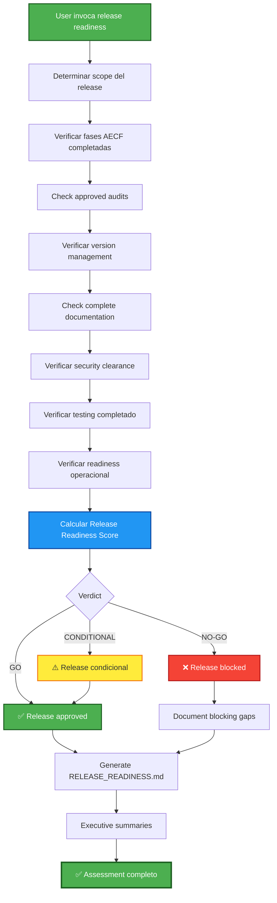

## PHASE_DEFINITION

### AECF_RELEASE_READINESS
output_file: AECF_01_AECF_RELEASE_READINESS.md
gate: none
loop_to: none
requires_plan_go: false

## TAXONOMY

skill_tier: TIER1
requires_determinism: true

# AECF SKILL — RELEASE READINESS (Pre-Release Governance Validation)

------------------------------------------------------------

## MANDATORY CONTEXT LOAD

This skill operates under the following mandatory contexts:

- aecf_prompts/AECF_SYSTEM_CONTEXT.md
- aecf_prompts/SKILL_DISPATCHER.md (execution protocol)
- <workspace_root>/AECF_PROJECT_CONTEXT.md (if present anywhere in the active workspace)

Governance:
- aecf_prompts/_governance/AECF_EXECUTIVE_SUMMARY_GOVERNANCE.md

If any of these contexts exist, they MUST be considered active constraints.

Execution is INVALID if these contexts are not acknowledged.

------------------------------------------------------------

## EXECUTION MANDATE (IMPERATIVE)

When this skill is invoked, the AI MUST:

1. **AUTO-RESOLVE** all parameters (TOPIC, scope, numbering) per SKILL_DISPATCHER
2. **VERIFY** all AECF phases completed for the release scope
3. **VALIDATE** all audits passed (GO / GO CONDICIONAL with approval)
4. **CHECK** version management, changelog, documentation completeness
5. **ASSESS** production readiness across all governance dimensions
6. **CREATE FILE** at `aecf_prompts/<DOCS_ROOT>/<user_id>/<RUN_DATE>/{{TOPIC}}/AECF_<NN>_RELEASE_READINESS.md`

**MANDATORY POST-EXECUTION GOVERNANCE (per SKILL_DISPATCHER)**:
- **UPDATE** `aecf_prompts/<DOCS_ROOT>/<user_id>/AECF_TOPICS_INVENTORY.json` for TOPIC lifecycle and **REGENERATE** `aecf_prompts/<DOCS_ROOT>/<user_id>/AECF_TOPICS_INVENTORY.md` (Step 4.1)
- **APPEND** one execution entry to `aecf_prompts/<DOCS_ROOT>/<user_id>/AECF_CHANGELOG.md` (Step 4.2)

**FORBIDDEN**:
- ❌ Responding only in chat without creating a file
- ❌ Asking the user for execution mode, output path, or AECF conventions
- ❌ Requiring verbose prompts — a simple `skill: release_readiness` MUST be sufficient
- ❌ Approving release without verifying phase completion evidence
- ❌ Modifying any code (this skill is READ-ONLY, validation-only)

## TRACEABILITY METADATA ENFORCEMENT (MANDATORY)

Every document generated by this skill MUST include `## METADATA` following
`aecf_prompts/templates/TEMPLATE_HEADERS.md`.

The metadata block is INVALID unless it includes, at minimum:
- `Timestamp (UTC)`
- `Executed By`
- `Executed By ID`
- `Execution Identity Source`
- `Repository`
- `Branch`
- `Root Prompt`
- `Skill Executed`
- `Sequence Position`
- `Total Prompts Executed`

Missing metadata or missing traceability fields => INVALID SKILL EXECUTION.

------------------------------------------------------------

## Skill ID
`aecf_release_readiness`

## Description
Comprehensive pre-release validation that verifies the completeness of all AECF phases, approved audits, correct versioning, complete documentation and operational readiness. Produces a GO/NO-GO verdict for release.

## When to Use
- Before each release to production
- After completing `aecf_new_feature` → check release readiness
- Pre-merge from feature branch to main → validate full governance
- Sprint end → validate that everything included in the sprint complies with AECF
- Compliance checkpoint → produce governance evidence for audit
- Before version tag → validate that the tag is deserved

## When NOT to Use
- Emergency hotfix → use `aecf_hotfix` (has its own accelerated stream)
- General maturity assessment → use `aecf_maturity_assessment`
- Specific code audit → use `aecf_code_standards_audit`

---

## Phases Executed



---

## Input Required

### Mandatory:
- **Release scope**: What is included in the release (features, fixes, modules)
- **TOPIC** (optional): Release identifier (e.g. "release_v1_5_0")

### Optional:
- **Version target**: Semantic target version
- **AECF artifacts path**: Ruta a los artefactos AECF del scope
- **Previous release**: Previous release to compare
- **Deployment target**: Environment de despliegue (staging, production)

---

## Release Readiness Checklist

### 1. AECF Phase Completion (Weight: 3)
| Check | Required | Status |
|-------|----------|--------|
| PLAN executed and documented | ✅ | ☐ |
| AUDIT_PLAN completed with GO | ✅ | ☐ |
| IMPLEMENT documented | ✅ | ☐ |
| AUDIT_CODE completed with GO | ✅ | ☐ |
| FIX_CODE applied (if AUDIT was NO-GO) | conditional | ☐ |
| All NO-GO loops resolved | ✅ | ☐ |

### 2. Testing Completeness (Weight: 3)
| Check | Required | Status |
|-------|----------|--------|
| TEST_STRATEGY documented | ✅ | ☐ |
| TEST_IMPLEMENTATION completed | ✅ | ☐ |
| AUDIT_TESTS completed with GO | ✅ | ☐ |
| Test coverage meets target (≥ 80%) | ✅ | ☐ |
| All tests passing | ✅ | ☐ |
| Regression tests included | ✅ | ☐ |

### 3. Security Clearance (Weight: 3)
| Check | Required | Status |
|-------|----------|--------|
| SECURITY_AUDIT executed (if applicable) | conditional | ☐ |
| No CRITICAL vulnerabilities open | ✅ | ☐ |
| No HIGH vulnerabilities unmitigated | ✅ | ☐ |
| Residual risks documented and approved | conditional | ☐ |
| Dependencies scanned for CVEs | recommended | ☐ |

### 4. Version Management (Weight: 2)
| Check | Required | Status |
|-------|----------|--------|
| SemVer correctly applied | ✅ | ☐ |
| CHANGELOG.md updated | ✅ | ☐ |
| Git tag prepared or created | ✅ | ☐ |
| Version bumped in relevant files | ✅ | ☐ |
| VERSION_MANAGEMENT document exists | ✅ | ☐ |

### 5. Documentation Completeness (Weight: 2)
| Check | Required | Status |
|-------|----------|--------|
| All AECF phase documents exist | ✅ | ☐ |
| Executive summaries generated | ✅ | ☐ |
| README updated (if applicable) | conditional | ☐ |
| API documentation updated | conditional | ☐ |
| Migration guide (if breaking changes) | conditional | ☐ |

### 6. Operational Readiness (Weight: 2)
| Check | Required | Status |
|-------|----------|--------|
| Rollback plan documented | ✅ | ☐ |
| Monitoring/alerting configured | recommended | ☐ |
| Feature flags configured (if applicable) | conditional | ☐ |
| Database migrations tested | conditional | ☐ |
| Configuration changes documented | conditional | ☐ |

---

## Execution Steps

### Step 1: DETERMINE RELEASE SCOPE
**Input**: User description or TOPIC context
**Output**: Release scope definition
**Expected time**: 5 min
**Action**: Identify all changes, features, and fixes included in this release

### Step 2: VERIFY AECF PHASE COMPLETION
**Input**: documentation/ artifacts for the scope
**Action**: Check that all required AECF phases were completed
**Expected time**: 10–15 min
**Evidence sources**:
- `aecf_prompts/<DOCS_ROOT>/<user_id>/<RUN_DATE>/{{TOPIC}}/AECF_*` files
- GO/NO-GO verdicts in audit documents
- Loop resolution evidence

### Step 3: VALIDATE AUDIT RESULTS
**Input**: Audit documents
**Action**: Verify all audits resulted in GO or approved GO CONDICIONAL
**Expected time**: 5–10 min
**Blocking conditions**:
- Any audit with unresolved NO-GO → **Automatic NO-GO for release**
- GO CONDICIONAL without formal approval → **Requires resolution**

### Step 4: CHECK VERSION MANAGEMENT
**Input**: Version files, CHANGELOG.md, git status
**Action**: Verify versioning follows SemVer and is complete
**Expected time**: 5 min

### Step 5: CHECK DOCUMENTATION COMPLETENESS
**Input**: All documentation/ artifacts
**Action**: Verify full documentation trail
**Expected time**: 5–10 min

### Step 6: VERIFY SECURITY CLEARANCE
**Input**: Security audit documents (if applicable)
**Action**: Confirm no open critical/high vulnerabilities
**Expected time**: 5 min

### Step 7: VERIFY TESTING COMPLETENESS
**Input**: Test strategy, implementation, audit documents
**Action**: Confirm test coverage, all tests passing
**Expected time**: 5–10 min

### Step 8: ASSESS OPERATIONAL READINESS
**Input**: Release context, deployment plans
**Action**: Verify rollback plan, monitoring, configurations
**Expected time**: 5–10 min

### Step 9: CALCULATE RELEASE READINESS SCORE
**Action**: Score each section and calculate weighted total

**Scoring**:
- Each check: 0 (missing), 1 (partial), 2 (complete)
- Apply section weights
- Normalize to 0–100

**Verdict thresholds**:
| Score | Verdict | Action |
|-------|---------|--------|
| ≥ 90 | **GO** | Release approved |
| 75–89 | **GO CONDICIONAL** | Release with documented exceptions |
| 60–74 | **NO-GO — REMEDIABLE** | Address specific gaps, re-evaluate |
| < 60 | **NO-GO — CRITICAL** | Significant governance gaps |

**Override rules**:
- Any AECF audit with unresolved NO-GO → **Automatic NO-GO**
- Any open CRITICAL security vulnerability → **Automatic NO-GO**
- Missing phase documentation for implemented features → **NO-GO**

### Step 10: GENERATE RELEASE READINESS REPORT
**Output**: `aecf_prompts/<DOCS_ROOT>/<user_id>/<RUN_DATE>/{{TOPIC}}/AECF_<NN>_RELEASE_READINESS.md`
**Expected time**: 10 min
**Content**:
1. Release Overview
2. Scope Summary
3. Phase Completion Matrix
4. Audit Results Summary
5. Security Clearance Status
6. Testing Completeness
7. Version Management Status
8. Documentation Completeness
9. Operational Readiness
10. Release Readiness Score
11. **VERDICT**: GO / GO CONDICIONAL / NO-GO
12. Blocking Items (if NO-GO)
13. Conditional Items (if CONDICIONAL)
14. Approval Chain

### Step 11: EXECUTIVE SUMMARY (ON-DEMAND)

**Output (optional)**:


**Invocation**: `skill: executive_summary TOPIC: <topic_name>`

---

## Total Estimated Time

| Scenario | Time |
|----------|------|
| **Single feature release** | 30 – 45 min |
| **Multi-feature sprint release** | 45 min – 1.5 horas |
| **Major version release** | 1.5 – 3 hours |
| **Emergency validation** (reduced scope) | 15 – 30 min |

---

## Success Criteria

✅ All AECF phases verified for release scope  
✅ All audits confirmed as GO or approved CONDICIONAL  
✅ Security clearance verified  
✅ Testing completeness confirmed  
✅ Version management validated  
✅ Documentation trail complete  
✅ Operational readiness assessed  
✅ Release readiness score calculated  
✅ Clear GO/NO-GO verdict issued  
✅ Report file created  
✅ Executive summaries generated  

---

## Scoring Model

This skill uses its own **Release Readiness Score** (not AECF phase scoring, since it evaluates across phases).

**Release Readiness Score** is a meta-evaluation that aggregates governance evidence.

---

## Example Usage

### Scenario 1: Pre-release check
```
User: "skill: release_readiness. TOPIC: release_v1_5_0"

AI:
✅ Skill recognized: aecf_release_readiness
📌 TOPIC: release_v1_5_0
📂 Scope: [all features in current release]
🔢 Next number: 01
📄 Output: documentation/release_v1_5_0/AECF_01_RELEASE_READINESS.md

[Executes full validation...]
```

### Scenario 2: Sprint release
```
User: "Verificar readiness del sprint 12 para release. TOPIC: sprint_12_release"
```

### Scenario 3: Post-feature validation
```
User: "I have already completed the new_feature skill for pdf_export.
Is it ready for release? TOPIC: release_pdf_export"
```

---

## Outputs Generated

```
aecf_prompts/<DOCS_ROOT>/<user_id>/<RUN_DATE>/{{TOPIC}}/
├── AECF_01_RELEASE_READINESS.md
```

---

## Related Skills

- `aecf_new_feature` — Produces the artifacts this skill validates
- `aecf_security_review` — Provides security clearance evidence
- `aecf_maturity_assessment` — Organizational governance evaluation
- `aecf_dependency_audit` — Supply chain validation for release

---

## CONTEXT VALIDATION

Confirm:

[ ] AECF_SYSTEM_CONTEXT.md loaded
[ ] Governance rules applied
[ ] All AECF phases verified
[ ] Audit results validated
[ ] Release Readiness Score calculated
[ ] GO/NO-GO verdict issued
[ ] Executive summary is optional on-demand via `skill_executive_summary`
[ ] Document includes `Executed By`


If not confirmed → STOP execution.

---

**SKILL READY FOR USE**

## AI_USAGE_DECLARATION

AI_USED = TRUE

## AI_EXPLAINABILITY_VALIDATION

- Explainability level defined? YES/NO
- User-facing explanation provided? YES/NO
- Model version logged? YES/NO
- Decision trace stored? YES/NO

## GOVERNANCE VALIDATION BLOCK

- Data lineage impact
- Model impact (YES/NO)
- Risk impact
- Compliance check

