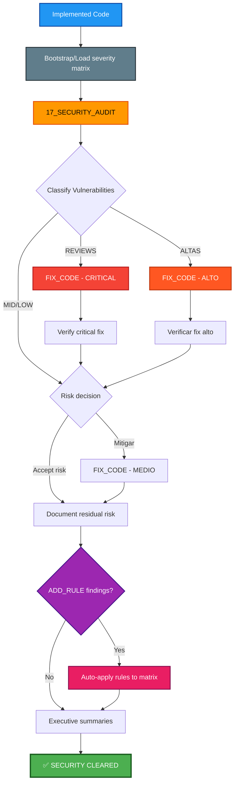

## PHASE_DEFINITION

### AECF_SECURITY_REVIEW
output_file: AECF_01_AECF_SECURITY_REVIEW.md
gate: none
loop_to: none
requires_plan_go: false

## TAXONOMY

skill_tier: TIER1
requires_determinism: true

# AECF SKILL — SECURITY REVIEW (Specialized Security Audit)

------------------------------------------------------------

## MANDATORY CONTEXT LOAD

This skill operates under the following mandatory contexts:

- aecf_prompts/AECF_SYSTEM_CONTEXT.md
- aecf_prompts/SKILL_DISPATCHER.md (execution protocol)
- <DOCS_ROOT>/AECF_PROJECT_CONTEXT.md (preferred project context when the effective documentation root is available)
- <workspace_root>/AECF_PROJECT_CONTEXT.md (legacy fallback only when the DOCS_ROOT artifact does not exist)

Governance:
- aecf_prompts/_governance/AECF_EXECUTIVE_SUMMARY_GOVERNANCE.md

If any of these contexts exist, they MUST be considered active constraints.

Execution is INVALID if these contexts are not acknowledged.

------------------------------------------------------------

## EXECUTION MANDATE (IMPERATIVE)

When this skill is invoked, the AI MUST:

1. **AUTO-RESOLVE** all parameters (TOPIC, scope, numbering) per SKILL_DISPATCHER
2. **BOOTSTRAP/LOAD PROJECT SEVERITY MATRIX** at `<DOCS_ROOT>/AECF_SECURITY_REVIEW_SEVERITY_MATRIX.md`
3. **SCAN** all files in scope for security vulnerabilities exhaustively
4. **CLASSIFY** findings by CVSS severity using project matrix calibration (Critical, High, Medium, Low)
5. **CREATE FILE** at `<DOCS_ROOT>/<user_id>/{{TOPIC}}/AECF_<NN>_SECURITY_AUDIT.md`

**MANDATORY POST-EXECUTION GOVERNANCE (per SKILL_DISPATCHER)**:
- **UPDATE** `<DOCS_ROOT>/<user_id>/AECF_TOPICS_INVENTORY.json` for TOPIC lifecycle and **REGENERATE** `<DOCS_ROOT>/<user_id>/AECF_TOPICS_INVENTORY.md` (Step 4.1)
- **APPEND** one execution entry to `<DOCS_ROOT>/<user_id>/AECF_CHANGELOG.md` (Step 4.2)

**FORBIDDEN**:
- ❌ Responding only in chat without creating files
- ❌ Asking the user for execution mode, output path, or AECF conventions
- ❌ Requiring verbose prompts — a simple `skill: security_review <scope>` MUST be sufficient
- ❌ Modifying any code (this skill is READ-ONLY, report-only)

**DETECTION BOUNDARY (MANDATORY)**:
- The audit framework is deterministic (contexts, severity matrix, discovery protocol, and output contract), but concrete finding detection depends on LLM reasoning and is not a static line-by-line rule engine.

## MANDATORY REPOSITORY DISCOVERY (SEARCH-FIRST)

This skill requires explicit repository discovery before executing its first audit/analysis step.

Execution rules:
1. Execute an initial repository search pass within scope using IDE capabilities.
2. Build an execution-scoped `WORKING_CONTEXT` before starting the first skill step.
3. If discovery evidence is incomplete, set discovery status to NO-GO and STOP.

Minimum `WORKING_CONTEXT` for search-first execution:
- `TARGET_SCOPE`
- `ENTRY_POINTS_OR_ARTIFACTS`
- `DISCOVERED_PATHS`
- `CONFIG_AND_DEPENDENCIES`
- `UNCERTAINTIES_AND_ASSUMPTIONS`
- `SOURCE_REFERENCES` (concrete file paths and line-level references)

Forbidden:
- Skipping discovery and jumping directly to analysis.
- Assuming repository structure without verification.
- Reusing shared static discovery files across executions.

## TRACEABILITY METADATA ENFORCEMENT (MANDATORY)

Every document generated by this skill MUST include `## METADATA` following
`aecf_prompts/templates/TEMPLATE_HEADERS.md`.

The metadata block is INVALID unless it includes, at minimum:
- `Timestamp (UTC)`
- `Executed By`
- `Executed By ID`
- `Execution Identity Source`
- `Repository`
- `Branch`
- `Root Prompt`
- `Skill Executed`
- `Sequence Position`
- `Total Prompts Executed`

Missing metadata or missing traceability fields => INVALID SKILL EXECUTION.

------------------------------------------------------------

## Skill ID
`aecf_security_review`

## Description
Specialized and exhaustive security audit on existing or newly implemented code.

## When to Use
- Pre-deployment security check
- After AUDIT_CODE if it handles sensitive data
- Legacy code audit
- Post security commitment (learn and prevent)
- Compliance requirement (PCI-DSS, HIPAA, GDPR, etc.)
- Mandatory after `aecf_new_feature`, `aecf_new_test_set`, and `aecf_hotfix`

## When NOT to Use
- Code in PLAN phase (very early)
- `AUDIT_CODE` basic checks are a prefilter only
- P1 emergencies → use `aecf_hotfix` first, security review later

---

## Project Severity Matrix Bootstrap (MANDATORY)

To avoid cross-run severity drift, this skill MUST use a **project-local severity matrix**:

- **Path**: `<DOCS_ROOT>/AECF_SECURITY_REVIEW_SEVERITY_MATRIX.md`
- **Scope**: Applies only to the current project/workspace

### Bootstrap rule

On the first execution in a project:
1. If the matrix file does NOT exist, CREATE it from template:
   - `aecf_prompts/templates/SECURITY_REVIEW_SEVERITY_MATRIX_TEMPLATE.md`
2. Missing the project-local matrix is NOT the same as missing the template. If the template exists, bootstrap from it and report that the project matrix was created from the canonical template; do NOT claim the template is missing unless that template path itself cannot be read.
3. Mark it as baseline (`v1`) for the project.
4. Use that matrix to classify severities.

On subsequent executions:
1. LOAD the existing project matrix.
2. Reuse its severities to keep reports consistent.
3. If a new, uncataloged finding appears, classify as `MATRIX-PENDING` (provisional severity based on CVSS or tie-breaker rules), and append a proposed new rule section in the audit report.

### Classification Decision Protocol (ADD vs NO-ADD)

When a finding is `MATRIX-PENDING`, the AI MUST decide if a new matrix rule should be added.

Decision criteria:
1. **Repetibility**: Is the vulnerability pattern likely to reappear in this project?
2. **Impact class**: CVSS score range / exploitability / data exposure risk.
3. **Distinctiveness**: Is this truly new, or already covered by an existing Rule ID?
4. **Actionability**: Can the rule be written with objective evidence and deterministic threshold?

Decision outcomes:
- `ADD_RULE`: Create a proposed Rule ID and recommendation to update matrix version.
- `NO_ADD_RULE`: Keep mapped to nearest existing rule and document rationale.

Mandatory evidence for decision:
- Finding location (`path/file.py:line`)
- Proposed or mapped Rule ID
- Rationale (1-3 lines, objective)
- Provisional severity used during this run

### Matrix Auto-Apply Protocol (MANDATORY)

When the Classification Decision Protocol produces `ADD_RULE` decisions, the AI MUST **automatically apply them** to the project severity matrix as part of the skill execution — no separate skill, no user confirmation needed.

**Auto-apply steps (executed AFTER report generation, BEFORE executive summaries)**:

1. **Filter**: Collect all findings with decision `ADD_RULE` from the Classification Decision Log.
2. **Validate**: Confirm each proposed rule has:
   - Unique Rule ID (not colliding with existing rules)
   - Clear Condition text (objective, deterministic)
   - Justified Severity (backed by CVSS, tie-breaker rules, or evidence)
3. **Apply**: For each validated `ADD_RULE`:
    - INSERT the new row into the `## Canonical Rules` table of `<DOCS_ROOT>/AECF_SECURITY_REVIEW_SEVERITY_MATRIX.md`
   - Place it in the correct category group (alphabetical by Rule ID within category)
4. **Version bump**: Increment the matrix version:
   - Minor bump for additions: `v1` → `v1.1`, `v1.1` → `v1.2`
   - Update `Last Updated` date
   - Change `Status` from `baseline` to `active` (if first update)
5. **Changelog**: Append entry with format:
   ```
   - vX.Y: Added RULE-ID (description) from TOPIC review. Source: documentation/TOPIC/AECF_NN_DOCUMENT.md (YYYY-MM-DD).
   ```
6. **Report cross-reference**: In the audit report's Classification Decision Log, mark applied rules as `✅ AUTO-APPLIED` instead of just `ADD_RULE`.

**Rules for `NO_ADD_RULE`**: Document in report only. Do NOT touch matrix file.

**Conflict resolution**: If Rule ID collision, append numeric suffix. If matrix missing/corrupted, bootstrap from template first.

---

## Executive Summary Requirements for Matrix Decisions (MANDATORY)

For `aecf_security_review`, both executive summaries MUST explicitly report matrix governance:

1. **Classification Decision Log**
   - Total `MATRIX-PENDING`
   - `ADD_RULE` count (with `✅ AUTO-APPLIED` status)
   - `NO_ADD_RULE` count

2. **Pending Findings Review List**
   - List each pending finding with:
- `path/file.py:line`
     - provisional severity
     - proposed/mapped Rule ID
     - decision (`ADD_RULE` / `NO_ADD_RULE`)
     - short rationale

3. **Matrix update recommendation**
   - Auto-applied rules listed with new matrix version
   - If any `ADD_RULE`, confirm matrix version bump was applied

### Non-goal

This matrix is **NOT global AECF policy** and MUST NOT be centralized for all projects.
Each project owns and evolves its own matrix at `<DOCS_ROOT>/AECF_SECURITY_REVIEW_SEVERITY_MATRIX.md`.

---

## Phases Executed



---

## Input Required

### Mandatory:
- **Code to audit**: Functionality implemented
- **TOPIC**: Identificador (ej: "api_security", "auth_review")

### Optional:
- **PLAN document**: Plan original (if available)
- **AUDIT_CODE report**: Previous audit (to avoid duplication)
- **Compliance requirements**: Specific standards (OWASP, PCI-DSS, etc.)
- **Threat model**: Known threat model

---

## Execution Steps

### Step 1: SECURITY_AUDIT (17_SECURITY_AUDIT.md)
**Input**: Implemented code
**Output**: `<DOCS_ROOT>/<user_id>/{{TOPIC}}/AECF_01_SECURITY_AUDIT.md`
**Expected time**: 30-60 min (depending on code size)
**Focus areas**:
- OWASP Top 10 (2021)
- Broken Access Control
- Cryptographic Failures
- Injection (SQL, NoSQL, Command, etc.)
- Insecure Design
- Security Misconfiguration
- Vulnerable Dependencies
- Authentication Failures
- Data Integrity Failures
- Logging/Monitoring Failures
- SSRF

**Output sections**:
1. Executive summary (vulnerabilities by severity)
2. Sections Analyzed — Navigation Index (with links to findings)
3. Detailed vulnerabilities (each with CVSS score)
4. Analysis by OWASP category
5. Attack vectors identified
6. Dependency analysis (CVEs)
7. Security settings
8. Secrets and credentials
9. Prioritized mitigation plan (with recommended AECF skills)
10. **VERDICT**: GO / CONDITIONAL GO / NO-GO

---

### 🎨 Visual Format Specification (MANDATORY)

All generated security audit reports MUST use the following visual formatting to ensure findings are immediately scannable.

#### Severity Badges (HTML in Markdown)

Replace plain-text severity labels with colored HTML badges. Use EXACTLY these snippets:

- **CRITICAL**: `<span style="background:#dc3545;color:#fff;padding:2px 8px;border-radius:4px;font-weight:bold;font-size:0.85em">CRITICAL</span>`
- **HIGH**: `<span style="background:#fd7e14;color:#fff;padding:2px 8px;border-radius:4px;font-weight:bold;font-size:0.85em">HIGH</span>`
- **WARNING**: `<span style="background:#ffc107;color:#000;padding:2px 8px;border-radius:4px;font-weight:bold;font-size:0.85em">WARNING</span>`
- **MEDIUM**: `<span style="background:#0d6efd;color:#fff;padding:2px 8px;border-radius:4px;font-weight:bold;font-size:0.85em">MEDIUM</span>`
- **LOW**: `<span style="background:#198754;color:#fff;padding:2px 8px;border-radius:4px;font-weight:bold;font-size:0.85em">LOW</span>`
- **INFO**: `<span style="background:#adb5bd;color:#000;padding:2px 8px;border-radius:4px;font-size:0.85em">INFO</span>`

Use these badges in:
- Findings tables (Severity column)
- Executive Summary counts
- Prioritized mitigation plan headings
- Navigation Index findings counts
- Detailed vulnerability classification

#### Clickable File Locations (Markdown links)

Every file reference MUST be a clickable Markdown link that navigates to the exact line:

- **Single line**: `[path/to/file.js:45](path/to/file.js#L45)`
- **Line range**: `[path/to/file.js:45-60](path/to/file.js#L45)`
- **File only**: `[path/to/file.js](path/to/file.js)`

**NEVER** use plain text like `path/to/file.js:45` without wrapping it in a Markdown link.

#### Copyable `@aecf` Remediation Commands

For each **CRITICAL** or **HIGH** vulnerability, include a ready-to-copy `@aecf` command in a fenced code block:

```text
@aecf run skill=<skill_name> topic={{TOPIC}} prompt="<specific description of the remediation with file:line>"
```

**Rules**:
- `skill=` MUST be a valid skill ID (e.g., `aecf_refactor`, `aecf_new_feature`, `aecf_dependency_audit`)
- `skill=` MUST be selected from this closed allow-list (from `SKILL_CATALOG.md`): `aecf_new_feature`, `aecf_hotfix`, `aecf_refactor`, `aecf_data_strategy`, `aecf_system_replayability_adaptive`, `aecf_code_standards_audit`, `aecf_security_review`, `aecf_dependency_audit`, `aecf_tech_debt_assessment`, `aecf_document_legacy`, `aecf_explain_behavior`, `aecf_maturity_assessment`, `aecf_release_readiness`, `aecf_executive_summary`, `aecf_data_governance_audit`, `aecf_model_governance_audit`, `aecf_ai_risk_assessment`, `aecf_define_impact_metrics`, `aecf_project_context_generator`, `aecf_document_context_ingestion`, `aecf_data_classification`
- NEVER invent new skill IDs in remediations (forbidden examples: `aecf_security_hardening`, `aecf_code_standards_remediate`, `aecf_test_generation`)
- If the first candidate is not in the allow-list, replace it with the nearest valid skill:
    - Security/auth/crypto findings → `aecf_security_review`
    - CVE/license/dependency findings → `aecf_dependency_audit`
    - Missing tests/coverage findings → `aecf_new_feature`
    - Documentation gaps → `aecf_document_legacy`
    - Complex architecture debt → `aecf_tech_debt_assessment` (optionally followed by `aecf_refactor`)
    - Default fallback → `aecf_refactor`
- `topic=` MUST carry the current `{{TOPIC}}` so outputs land in the correct documentation folder
- `prompt=` MUST describe the specific remediation action, referencing the finding location
- The command MUST be inside a fenced code block so the user can copy-paste directly
- For findings of severity MEDIUM or LOW, the command is OPTIONAL but recommended

**Example**:
```text
@aecf run skill=aecf_refactor topic=api_security prompt="Replace SQL injection in app/api/payments.py:145 with prepared statements"
```

---

> **MANDATORY**: Prior to detailed findings, the report MUST include:
>
> ## 🗂️ Sections Analyzed — Navigation Index
>
> | # | Section Analyzed | Findings | Link |
> |---|-------------------|----------|------|
> | 1 | OWASP A01: Broken Access Control | N CRITICAL, M HIGH | [→ Findings and Remediation](#owasp-a01-broken-access-control) |
> | 2 | OWASP A02: Cryptographic Failures | ... | [→ Findings and Remediation](#owasp-a02-cryptographic-failures) |
> | 3 | OWASP A03: Injection | ... | [→ Findings and Remediation](#owasp-a03-injection) |
> | ... | (all categories evaluated) | ... | ... |
> | N | Secrets & Credentials | ... | [→ Findings and Remediation](#secrets-and-credentials) |
> | N+1 | Dependency CVEs | ... | [→ Findings and Remediation](#dependency-analysis) |
>
> Replace with real counts and sections. Skip sections without findings.

### 🔧 Remediation Skill Mapping (MANDATORY)

**For EACH CRITICAL or HIGH vulnerability, the report MUST recommend the appropriate AECF skill as a copyable `@aecf` command**:

| Type of Vulnerability | Recommended Skill | Copyable Command Template |
|------------------------|-------------------|---------------------------|
| Injection (SQL, NoSQL, Command) | `aecf_refactor` | `@aecf run skill=aecf_refactor topic={{TOPIC}} prompt="Refactor queries to prepared statements in <file:line>"` |
| Broken Access Control | `aecf_refactor` | `@aecf run skill=aecf_refactor topic={{TOPIC}} prompt="Implement/fix access control in <file:line>"` |
| Cryptographic Failures | `aecf_refactor` | `@aecf run skill=aecf_refactor topic={{TOPIC}} prompt="Implement proper encryption in <file:line>"` |
| Hardcoded Secrets | `aecf_refactor` | `@aecf run skill=aecf_refactor topic={{TOPIC}} prompt="Move hardcoded secret to environment variable in <file:line>"` |
| Vulnerable Dependencies | `aecf_dependency_audit` → `aecf_refactor` | `@aecf run skill=aecf_dependency_audit topic={{TOPIC}} prompt="Audit and update vulnerable dependencies"` |
| Missing Input Validation | `aecf_refactor` | `@aecf run skill=aecf_refactor topic={{TOPIC}} prompt="Add input validation in <file:line>"` |
| Missing Rate Limiting | `aecf_new_feature` | `@aecf run skill=aecf_new_feature topic={{TOPIC}} prompt="Implement rate limiting for <endpoint> in <file:line>"` |
| Logging/Monitoring gaps | `aecf_refactor` | `@aecf run skill=aecf_refactor topic={{TOPIC}} prompt="Add security logging in <file:line>"` |
| Architecture issues | `aecf_tech_debt_assessment` → `aecf_refactor` | `@aecf run skill=aecf_tech_debt_assessment topic={{TOPIC}} prompt="Evaluate architecture issue in <file:line>"` |

❌ **NEVER recommend internal prompts/phases directly** (e.g. `06_FIX_CODE`, `17_SECURITY_AUDIT`)
✅ **ALWAYS recommend the skill** that will internally dispatch the correct phases

### Step 2: Classification & Prioritization
**Based on CVSS scores**:
- **CRITICAL** (9.0-10.0): Immediate fix, blocks deploy
- **HIGH** (7.0-8.9): Urgent, blocking or compensation fix
- **MEDIUM** (4.0-6.9): Fix in current or next sprint
- **LOW** (0.1-3.9): Backlog, continuous improvement

### Step 3a: Fix CRITICAL Vulnerabilities [if found]
**Internal skill**: FIX_CODE phase (automatically dispatched)
**Input**: SECURITY_AUDIT with CRITICAL vulnerabilities
**Output**: 
- Fixed code
- `<DOCS_ROOT>/<user_id>/{{TOPIC}}/AECF_02_FIX_SECURITY_CRITICAL.md`
**Action**: Fix ALL CRITICAL vulnerabilities
**Verification**: Re-run SECURITY_AUDIT on corrected code

**Loop**: Repeat until there are no CRITICISM

### Step 3b: Fix HIGH Vulnerabilities [if found]
**Internal skill**: FIX_CODE phase (automatically dispatched)
**Input**: SECURITY_AUDIT with HIGH vulnerabilities
**Output**: 
- Fixed code
- `<DOCS_ROOT>/<user_id>/{{TOPIC}}/AECF_03_FIX_SECURITY_HIGH.md`
**Decision point**: 
- **Fix**: Correct HIGH vulnerabilities
- **Compensate**: Compensatory measures (e.g. rate limiting, WAF, monitoring)
- **Accept**: Document residual risk with justification

### Step 4: Risk Decision for MEDIUM/LOW
**Stakeholder decision**:
- **Mitigar**: Ir a Step 5 (FIX_CODE)
- **Accept**: Go to Step 6 (Document residual risk)

### Step 5: Fix MEDIUM Vulnerabilities [if decided]
**Internal skill**: FIX_CODE phase (automatically dispatched)
**Input**: SECURITY_AUDIT with MEDIUM vulnerabilities selected
**Output**: Corrected code
**Note**: LOW vulnerabilities typically go to backlog

### Step 6: Document Residual Risks
**Output**: `<DOCS_ROOT>/<user_id>/{{TOPIC}}/AECF_0X_RESIDUAL_RISKS.md`
**Content**:
- Accepted vulnerabilities (MEDIUM/LOW)
- Justification of acceptance
- Compensatory measures (if they exist)
- Future mitigation plan (if applicable)
- Formal approval (who, when)

### Step 7: Final Security Clearance
**Verification**:
- ✅ There are no CRITICAL vulnerabilities
- ✅ HIGH vulnerabilities corrected or compensated
- ✅ MEDIUM/LOW vulnerabilities documented
- ✅ Formally approved residual risks

**Output**: Security clearance para deploy

---

## Total Estimated Time

| Scenario | Time |
|----------|------|
| **Clean code** (only LOW) | 45 min - 1 hora |
| **MEDIUM vulnerabilities** | 1.5 - 3 horas |
| **HIGH vulnerabilities** | 2 - 5 horas |
| **CRITICAL vulnerabilities** | 3 - 8 horas |

---

## Success Criteria

✅ OWASP Top 10 Audit Completed
✅ Local matrix available in `<DOCS_ROOT>/AECF_SECURITY_REVIEW_SEVERITY_MATRIX.md` (created or uploaded)
✅ Documented `ADD_RULE` / `NO_ADD_RULE` decisions for `MATRIX-PENDING`
✅ There are no unfixed CRITICAL vulnerabilities
✅ HIGH vulnerabilities corrected or compensated
✅ MEDIUM/LOW vulnerabilities documented and approved
✅ Dependencies without critical CVEs
✅ Security headers configured
✅ Secrets not exposed
✅ Security event logging implemented

---

## Example Usage

### Scenario: Security review of new payment endpoint API

```
User: "I just implemented the /api/payments/ endpoint. I need
security review before deploying to production. TOPIC: payment_api_security"

AI (Step 1 - SECURITY_AUDIT):
[Run 17_SECURITY_AUDIT.md]
→ Analyze code in app/api/payments.py
→ Check dependencies (stripe==4.2.0, pyjwt==2.6.0, etc.)
→ Check configuration
→ Identify vulnerabilities

→ Genera: documentation/payment_api_security/AECF_01_SECURITY_AUDIT.md

EXECUTIVE SUMMARY:
Total vulnerabilities: 5
- <span style="background:#dc3545;color:#fff;padding:2px 8px;border-radius:4px;font-weight:bold;font-size:0.85em">CRITICAL</span>: 1
- <span style="background:#fd7e14;color:#fff;padding:2px 8px;border-radius:4px;font-weight:bold;font-size:0.85em">HIGH</span>: 2
- <span style="background:#0d6efd;color:#fff;padding:2px 8px;border-radius:4px;font-weight:bold;font-size:0.85em">MEDIUM</span>: 1
- <span style="background:#198754;color:#fff;padding:2px 8px;border-radius:4px;font-weight:bold;font-size:0.85em">LOW</span>: 1

DETAILED VULNERABILITIES:

[CRIT-001] SQL Injection en payment history query
Severity: <span style="background:#dc3545;color:#fff;padding:2px 8px;border-radius:4px;font-weight:bold;font-size:0.85em">CRITICAL</span> (CVSS 9.8)
Location: [app/api/payments.py:145](app/api/payments.py#L145)
Vulnerable code:
```python
query = f"SELECT * FROM payments WHERE user_id = {user_id}"
```
Impact: Full DB access, payment data exfiltration
Mitigation: Use prepared statements
```python
query = "SELECT * FROM payments WHERE user_id = ?"
cursor.execute(query, (user_id,))
```
🔧 **Execute**:
```
@aecf run skill=aecf_refactor topic=payment_api_security prompt="Replace SQL injection with prepared statements in app/api/payments.py:145"
```

[HIGH-001] Missing authentication en GET /api/payments/stats
Severity: <span style="background:#fd7e14;color:#fff;padding:2px 8px;border-radius:4px;font-weight:bold;font-size:0.85em">HIGH</span> (CVSS 7.5)
Location: [app/api/payments.py:220](app/api/payments.py#L220)
Problem: Endpoint without @auth_required decorator
Impact: Any user can view global payment statistics
Mitigation: Add @admin_required
🔧 **Execute**:
```
@aecf run skill=aecf_refactor topic=payment_api_security prompt="Add @admin_required decorator to GET /api/payments/stats in app/api/payments.py:220"
```

[HIGH-002] Payment amount without server-side validation
Severity: <span style="background:#fd7e14;color:#fff;padding:2px 8px;border-radius:4px;font-weight:bold;font-size:0.85em">HIGH</span> (CVSS 7.2)
Location: [app/api/payments.py:95](app/api/payments.py#L95)
Problem: Amount comes from request without validation
Impact: User could modify amount in request
Mitigation: Validate amount server-side against database
🔧 **Execute**:
```
@aecf run skill=aecf_refactor topic=payment_api_security prompt="Add server-side amount validation against DB in app/api/payments.py:95"
```

[MED-001] Falta rate limiting en /api/payments/create
Severity: <span style="background:#0d6efd;color:#fff;padding:2px 8px;border-radius:4px;font-weight:bold;font-size:0.85em">MEDIUM</span> (CVSS 5.3)
Location: [app/api/payments.py:75](app/api/payments.py#L75)
Problem: No limit on payment attempts
Impact: Possible abuse, card testing
Mitigation: Implement rate limiting (e.g. 5 attempts/min)
🔧 **Execute**:
```
@aecf run skill=aecf_new_feature topic=payment_api_security prompt="Implement rate limiting (5 attempts/min) for /api/payments/create in app/api/payments.py:75"
```

[LOW-001] API version exposed in response header
Severity: <span style="background:#198754;color:#fff;padding:2px 8px;border-radius:4px;font-weight:bold;font-size:0.85em">LOW</span> (CVSS 2.1)
Location: [app/__init__.py:50](app/__init__.py#L50)
Problem: Header "X-API-Version" reveals version
Impact: Minor information disclosure
Mitigation: Remove header or use generic version

VERDICT: NO-GO (CRITICAL vulnerability)

User (Step 2 - Review): "Understood. You have to correct the CRITICISM and REVIEWS."

AI (Step 3a - FIX_CRITICAL):
[Execute FIX_CODE phase internally for CRIT-001]
→ Modifica app/api/payments.py:145
→ Implementa prepared statement
→ Genera: documentation/payment_api_security/AECF_02_FIX_SECURITY_CRITICAL.md

CORRECTED CODE:
```python
# BEFORE (VULNERABLE):
query = f"SELECT * FROM payments WHERE user_id = {user_id}"
cursor.execute(query)

# AFTER (SAFE):
query = "SELECT * FROM payments WHERE user_id = ?"
cursor.execute(query, (user_id,))
```

ADDED TESTS:
```python
def test_payment_history_sql_injection_blocked():
    malicious_user_id = "1 OR 1=1--"
    response = client.get(f'/api/payments/history?user_id={malicious_user_id}')
    assert response.status_code == 400  # Bad request
    assert "Invalid user ID" in response.json['error']
```

✅ CRIT-001 CORREGIDA

AI (CRITICAL Verification):
[Re-run partial SECURITY_AUDIT on fix]
✅ SQL Injection corrected, no longer detected

AI (Step 3b - FIX_HIGH):
[Execute FIX_CODE phase internally for HIGH-001 and HIGH-002]
→ Modifica app/api/payments.py

FIX HIGH-001:
```python
@app.route('/api/payments/stats')
@admin_required # ← ADDED
def get_payment_stats():
    ...
```

FIX HIGH-002:
```python
@app.route('/api/payments/create', methods=['POST'])
def create_payment():
    # ANTES: amount = request.json.get('amount')
    
# AFTER: Validate amount server-side
    cart_id = request.json.get('cart_id')
    expected_amount = Cart.query.get(cart_id).calculate_total()
    provided_amount = request.json.get('amount')
    
    if provided_amount != expected_amount:
        return jsonify({'error': 'Amount mismatch'}), 400
    
amount = expected_amount  # Use server-calculated value
    ...
```

→ Genera: documentation/payment_api_security/AECF_03_FIX_SECURITY_HIGH.md

✅ HIGH-001 CORREGIDA
✅ HIGH-002 CORREGIDA

User (Step 4 - Risk Decision): 
"For MED-001 (rate limiting), we can implement next sprint.
For LOW-001, I accept the risk."

AI (Step 5 - FIX_MEDIUM):
User decided to postpone MED-001 → Go to backlog
User decided to accept LOW-001 → Document

AI (Step 6 - RESIDUAL_RISKS):
[Generates residual risks document]
→ Genera: documentation/payment_api_security/AECF_04_RESIDUAL_RISKS.md

RESIDUAL RISKS DOCUMENT:

## Accepted Vulnerabilities

### [MED-001] Falta rate limiting en /api/payments/create
**Severity**: MEDIUM (CVSS 5.3)
**Justification of acceptance**:
- Urgent deployment necessary for client
- Compensatory measure: Active monitoring of payment attempts
- Mitigation plan: Implement in sprint 2026-Q1-S3
**Compensatory measures**:
- Alerts set for > 10 attempts/user/hour
- Monitoring dashboard de payment attempts
**Approved by**: John Doe (Lead Engineer), 2026-02-10
**Revision date**: 2026-03-01

### [LOW-001] API version exposed in response header
**Severity**: LOW (CVSS 2.1)
**Justification of acceptance**:
- Information disclosure menor, no explotable
- Benefit: Simplified debugging
**No future mitigation required**
**Approved by**: Jane Smith (Security Lead), 2026-02-10

AI (Step 7 - CLEARANCE):
✅ No CRITICAL vulnerabilities
✅ HIGH vulnerabilities fixed
✅ MEDIUM/LOW vulnerabilities documented and approved

SECURITY CLEARANCE GRANTED ✅
APPROVED CODE FOR DEPLOY TO PRODUCTION
```

---

## Common Issues & Solutions

### Issue: Too many vulnerabilities, overwhelming
**Solution**:
- Prioritize CRITICISM first
- Correct CRITICISM in batch
- Evaluate if the code needs complete rewriting

### Issue: False positives in the analysis
**Solution**:
- Manually review each finding
- Document why it is false positive
- Refine analysis criteria for future reviews

### Issue: Dependencies with non-updatable CVEs
**Solution**:
- Evaluate if the vulnerability is exploitable in your context
- Implement compensatory measures (WAF, network segmentation)
- Consider alternative dependency

### Issue: Security review reveals architectural problems
**Solution**:
- If they are critical: Stop development, redesign
- If medium/low: Document technical debt, plan refactor

---

## Integration with Other Skills

### Before SECURITY_REVIEW:
- `aecf_new_feature` - Implementar feature primero
- `aecf_document_legacy` - If it is legacy code

### After SECURITY_REVIEW:
- `aecf_hotfix` - If vulnerability is discovered in production
- `aecf_new_feature` - To implement additional security measures
- `aecf_refactor` - For structural security fixes
- `aecf_dependency_audit` - To drill down into third party vulnerabilities

---

## Tools & Automation

### Recommended SAST tools:
- **Python**: Bandit, Semgrep, Snyk
- **JavaScript**: ESLint-security, Snyk
- **Java**: SpotBugs, FindSecBugs
- **General**: SonarQube, Checkmarx

### Dependency scanning:
- **Python**: pip-audit, safety
- **JavaScript**: npm audit, Snyk
- **General**: OWASP Dependency-Check

### Secret scanning:
- git-secrets, TruffleHog, GitGuardian

**Note**: These tools complement but DO NOT replace manual auditing.

---

## Outputs Generated

```
<DOCS_ROOT>/<user_id>/{{TOPIC}}/
├── AECF_01_SECURITY_AUDIT.md # Initial audit
├── AECF_02_FIX_SECURITY_CRITICAL.md # Critical fixes (if applicable)
├── AECF_03_FIX_SECURITY_HIGH.md # High fixes (if applicable)
├── AECF_04_FIX_SECURITY_MEDIUM.md # Medium fixes (if applicable)
└── AECF_0X_RESIDUAL_RISKS.md # Accepted risks
```

---

## Completion Checklist

- [ ] SECURITY_AUDIT completely executed
- [ ] All vulnerabilities classified (CRITICAL/HIGH/MEDIUM/LOW)
- [ ] CRITICAL Vulnerabilities: 0
- [ ] HIGH vulnerabilities: corrected or compensated
- [ ] MEDIUM vulnerabilities: fixed or documented
- [ ] LOW vulnerabilities: documented
- [ ] Dependencies without critical CVEs
- [ ] Configured security headers
- [ ] Unexposed Secrets
- [ ] Security event logging OK
- [ ] Formally approved residual risks
- [ ] Security clearance otorgada

---

## CONTEXT VALIDATION

Confirm:

[ ] AECF_SYSTEM_CONTEXT.md loaded
[ ] Governance rules applied
[ ] Executive summary is optional on-demand via `skill_executive_summary`
[ ] Document includes `Executed By`


If not confirmed → STOP execution.

---

**SKILL READY FOR USE** 🔒

## AI_USAGE_DECLARATION

AI_USED = TRUE

## AI_EXPLAINABILITY_VALIDATION

- Explainability level defined? YES/NO
- User-facing explanation provided? YES/NO
- Model version logged? YES/NO
- Decision trace stored? YES/NO

## GOVERNANCE VALIDATION BLOCK

- Data lineage impact
- Model impact (YES/NO)
- Risk impact
- Compliance check


