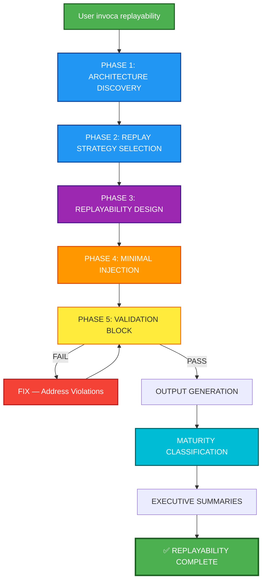

## PHASE_DEFINITION

### PLAN
output_file: 01_PLAN.md
requires_prompt: true
gate: none

### AUDIT_PLAN
output_file: 02_AUDIT_PLAN.md
gate: GO_REQUIRED

### FIX_PLAN
output_file: 03_FIX_PLAN.md
loop_to: AUDIT_PLAN

### IMPLEMENT
output_file: 04_IMPLEMENT.md
requires_plan_go: true

### AUDIT_STATIC_ANALYSIS
output_file: 05A_AUDIT_STATIC_ANALYSIS.md
gate: GO_REQUIRED

### AUDIT_IMPLEMENT
output_file: 05_AUDIT_CODE.md
gate: GO_REQUIRED

### FIX_CODE
output_file: 06_FIX_CODE.md
loop_to: AUDIT_STATIC_ANALYSIS

## TAXONOMY

skill_tier: TIER3
requires_determinism: false

# AECF SKILL — SYSTEM REPLAYABILITY ADAPTIVE (Architecture-Adaptive Replayability)

------------------------------------------------------------

## MANDATORY CONTEXT LOAD

This skill operates under the following mandatory contexts:

- aecf_prompts/AECF_SYSTEM_CONTEXT.md
- aecf_prompts/SKILL_DISPATCHER.md (execution protocol)
- <workspace_root>/AECF_PROJECT_CONTEXT.md (if present anywhere in the active workspace)

Governance:
- aecf_prompts/_governance/AECF_EXECUTIVE_SUMMARY_GOVERNANCE.md

If any of these contexts exist, they MUST be considered active constraints.

Execution is INVALID if these contexts are not acknowledged.

------------------------------------------------------------

## EXECUTION MANDATE (IMPERATIVE)

When this skill is invoked, the AI MUST:

1. **AUTO-RESOLVE** all parameters (TOPIC, scope, numbering) per SKILL_DISPATCHER
2. **DISCOVER** the project architecture (language, framework, entry points, persistence, concurrency model)
3. **SELECT** the appropriate replay strategy based on discovered architecture
4. **DESIGN** a minimally invasive replayability layer following clean architecture principles
5. **GENERATE** all replay infrastructure files (decorators, persistence, runner, docs)
6. **VALIDATE** that the injection meets all safety and governance criteria
7. **CREATE FILES** at each phase in `<DOCS_ROOT>/<user_id>/{{TOPIC}}/AECF_<NN>_<PHASE>.md`

**MANDATORY POST-EXECUTION GOVERNANCE (per SKILL_DISPATCHER)**:
- **UPDATE** `<DOCS_ROOT>/<user_id>/AECF_TOPICS_INVENTORY.json` for TOPIC lifecycle and **REGENERATE** `<DOCS_ROOT>/<user_id>/AECF_TOPICS_INVENTORY.md` (Step 4.1)
- **APPEND** one execution entry to `<DOCS_ROOT>/<user_id>/AECF_CHANGELOG.md` (Step 4.2)

**FORBIDDEN**:
- ❌ Responding only in chat without creating files
- ❌ Asking the user for execution mode, output path, or AECF conventions
- ❌ Requiring verbose prompts — a simple `skill: system_replayability_adaptive` MUST be sufficient
- ❌ Assuming any specific technology (Flask, SQLAlchemy, Redis, Celery, Django, etc.)
- ❌ Injecting replay logic that mutates existing business logic
- ❌ Forcing commits inside decorators or wrappers
- ❌ Breaking existing transaction boundaries
- ❌ Introducing circular dependencies
- ❌ Skipping the validation block

## MANDATORY REPOSITORY DISCOVERY (SEARCH-FIRST)

This skill requires explicit repository discovery before executing its first audit/analysis step.

Execution rules:
1. Execute an initial repository search pass within scope using IDE capabilities.
2. Build an execution-scoped `WORKING_CONTEXT` before starting the first skill step.
3. If discovery evidence is incomplete, set discovery status to NO-GO and STOP.

Minimum `WORKING_CONTEXT` for search-first execution:
- `TARGET_SCOPE`
- `ENTRY_POINTS_OR_ARTIFACTS`
- `DISCOVERED_PATHS`
- `CONFIG_AND_DEPENDENCIES`
- `UNCERTAINTIES_AND_ASSUMPTIONS`
- `SOURCE_REFERENCES` (concrete file paths and line-level references)

Forbidden:
- Skipping discovery and jumping directly to analysis.
- Assuming repository structure without verification.
- Reusing shared static discovery files across executions.

## TRACEABILITY METADATA ENFORCEMENT (MANDATORY)

Every document generated by this skill MUST include `## METADATA` following
`aecf_prompts/templates/TEMPLATE_HEADERS.md`.

The metadata block is INVALID unless it includes, at minimum:
- `Timestamp (UTC)`
- `Executed By`
- `Executed By ID`
- `Execution Identity Source`
- `Repository`
- `Branch`
- `Root Prompt`
- `Skill Executed`
- `Sequence Position`
- `Total Prompts Executed`

Missing metadata or missing traceability fields => INVALID SKILL EXECUTION.

------------------------------------------------------------

## Skill ID
`aecf_system_replayability_adaptive`

## Description
Introduces architecture-adaptive replayable trace capability into ANY project, regardless of framework, language, or technology stack. The skill inspects the project, infers architectural patterns in use, adapts the replayability strategy accordingly, and injects a minimally invasive reproducibility layer — all while remaining fully compliant with AECF governance principles.

## When to Use
- Adding reproducibility / replay capability to an existing project
- Enabling deterministic trace capture for debugging or auditing
- Introducing evidence-based execution trails for compliance
- Post `aecf_document_legacy` → adding traceability to documented code
- Post `aecf_security_review` → adding tamper-evident execution logs
- Post `aecf_maturity_assessment` → upgrading governance maturity with replay evidence
- Pre `aecf_release_readiness` → ensuring release includes trace capability
- Any project needing replay/reproducibility regardless of tech stack

## When NOT to Use
- Implementing a specific feature → use `aecf_new_feature`
- Hot production fix → use `aecf_hotfix`
- Only document code → use `aecf_document_legacy`
- Refactoring existing without replay → use `aecf_refactor`
- Only need logging (not replay) → standard logging is sufficient

---

## Phases Executed



---

## Input Required

### Mandatory:
- **Scope**: Target project / workspace to analyze

### Optional:
- **TOPIC**: Identifier for the replayability effort (auto-inferred if not provided)
- **Target maturity level**: Desired replay maturity (L1–L5); defaults to L2
- **Exclusions**: Modules or paths to exclude from instrumentation
- **Preferred storage**: JSON file, DB table, external service (auto-detected if not provided)
- **Previous documentation**: `aecf_document_legacy` output (if exists)

---

## Execution Steps

### PHASE 1: ARCHITECTURE DISCOVERY
**Input**: Project workspace
**Output**: `<DOCS_ROOT>/<user_id>/{{TOPIC}}/AECF_<NN>_ARCHITECTURE_DISCOVERY.md`
**Expected time**: 15–30 min
**Action**: Inspect the repository and determine the architectural profile

**Must discover**:

#### 1.1 Programming Language(s)
- Primary language
- Secondary languages (if polyglot)
- Language version / runtime

#### 1.2 Web Framework (if any)
- Framework name and version
- Routing pattern (decorator-based, config-based, convention-based)
- Middleware / pipeline model

#### 1.3 Entry Points
Identify ALL system boundaries from the following categories:
- **HTTP routes** / API endpoints
- **CLI commands** / entry scripts
- **Message consumers** (queues, topics, subscriptions)
- **Workers** (background jobs, scheduled tasks, cron)
- **Batch jobs** (ETL, data pipelines)
- **Agent loops** (AI agent decision cycles, tool execution)

#### 1.4 Persistence Layer
- **ORM** (SQLAlchemy, Django ORM, Prisma, TypeORM, ActiveRecord, etc.)
- **Raw SQL** (direct DB driver usage)
- **No DB** (stateless or external-only)
- **Filesystem** (file-based storage)
- **External API storage** (third-party services as persistence)

#### 1.5 Concurrency Model
- **Synchronous** (sequential request handling)
- **Asynchronous** (async/await, promises, futures)
- **Threaded** (thread pools, concurrent.futures, etc.)
- **Event loop** (asyncio, Node.js event loop, Vert.x)
- **Worker pool** (Celery, Bull, Sidekiq, etc.)

#### 1.6 Dependency Injection Patterns
- Constructor injection
- Service locator
- Framework-managed DI (Spring, FastAPI Depends, etc.)
- None / manual wiring

#### 1.7 Logging Framework
- Standard library logging
- Structured logging (structlog, winston, serilog, etc.)
- No logging
- Custom logging

#### 1.8 Configuration System
- Environment variables
- Config files (JSON, YAML, TOML, INI)
- Framework config (settings.py, application.yml, etc.)
- Secret manager integration
- CM_ variable pattern (AECF standard)

#### 1.9 Ambiguity Handling
If entry points cannot be clearly identified, the skill **MUST** ask the developer:

> "I cannot safely determine the system boundary. Please specify the primary execution entry points."

This is the **ONLY** question the skill is permitted to ask. All other parameters must be auto-resolved.

---

### PHASE 2: REPLAY STRATEGY SELECTION
**Input**: Architecture discovery results
**Output**: `<DOCS_ROOT>/<user_id>/{{TOPIC}}/AECF_<NN>_REPLAY_STRATEGY.md`
**Expected time**: 10–20 min
**Action**: Select the replay strategy that best fits the discovered architecture

#### Strategy Decision Matrix

| Architecture Pattern | Strategy | Instrumentation Target | Correlation |
|---------------------|----------|----------------------|-------------|
| **CASE A: Web Framework** | Boundary Handler Instrumentation | Routes / Controllers / Middleware | Request ID |
| **CASE B: CLI Application** | Command Execution Instrumentation | Main command function / entry point | Execution ID |
| **CASE C: Worker System** | Task Consumer Instrumentation | Task handler / consumer function | Task ID / Job ID |
| **CASE D: Agent Architecture** | Decision Loop Instrumentation | Decision cycle + tool execution calls | Agent Session ID |
| **CASE E: Library / Core** | Developer-Defined Boundary | Ask developer to specify boundary | Custom correlation ID |
| **CASE F: Hybrid** | Multi-boundary Instrumentation | Combination of above | Distributed Trace ID |

#### Strategy Document Must Include:
1. **Selected case(s)** with justification
2. **Instrumentation targets** — exact functions/methods/classes
3. **Correlation ID strategy** — how traces are linked across boundaries
4. **Storage decision** — where replay evidence is persisted
5. **Enable/disable mechanism** — how to toggle replay on/off
6. **Performance impact estimate** — expected overhead

---

### PHASE 3: REPLAYABILITY DESIGN
**Input**: Replay strategy selection
**Output**: `<DOCS_ROOT>/<user_id>/{{TOPIC}}/AECF_<NN>_REPLAYABILITY_DESIGN.md`
**Expected time**: 20–40 min
**Action**: Design the replayability layer following clean architecture principles

#### 3.1 Design Principles (MANDATORY)
The injected system MUST:
- ✅ Capture deterministic inputs (arguments, headers, env state)
- ✅ Capture relevant execution context (user, timestamp, correlation IDs)
- ✅ Capture decision outputs (return values, selected branches)
- ✅ Capture side effects where possible (external calls, mutations)
- ✅ Store events in **append-only** mode (immutable trace log)
- ✅ Avoid breaking existing architecture
- ✅ Avoid unsafe commits (no forced transaction commits)
- ✅ Avoid circular dependencies
- ✅ Respect existing transaction boundaries
- ✅ Be compatible with HAProxy multi-instance (concurrency-safe writes, file locks)

#### 3.2 Storage Design (Technology-Agnostic)

**IF a DB exists**:
- Use an **append-only table/model** for replay events
- Follow existing ORM patterns (do NOT introduce a different ORM)
- Respect existing migration system
- Provide migration file

**IF no DB exists**:
- Use **structured JSON storage** with concurrency-safe writes
- Implement file locking for multi-instance safety (HAProxy compatible)
- Use atomic write operations
- Support rotation / archival

**IF distributed system**:
- Add **correlation IDs** across service boundaries
- Use existing message headers / metadata for propagation
- Support trace aggregation

#### 3.3 Replay Event Schema

```
ReplayEvent:
  trace_id:        string    # Unique trace identifier
  correlation_id:  string    # Cross-boundary correlation
  timestamp:       ISO-8601  # Event timestamp (UTC)
  entry_point:     string    # Function/route/command that was invoked
  event_type:      enum      # INPUT | CONTEXT | DECISION | OUTPUT | SIDE_EFFECT | ERROR
  payload:         object    # Event-specific data (serializable)
  metadata:        object    # Environment, version, instance ID
  sequence:        integer   # Order within the trace
  replay_version:  string    # Schema version for forward compatibility
```

#### 3.4 Component Design

| Component | Purpose | Pattern |
|-----------|---------|---------|
| `ReplayBoundary` | Decorator/wrapper to capture at system boundaries | Decorator / Middleware / Wrapper |
| `ReplayStore` | Persistence abstraction for replay events | Repository Pattern |
| `ReplayRunner` | Utility to replay captured traces | Command Pattern |
| `ReplayConfig` | Configuration and enable/disable toggle | Strategy Pattern |
| `ReplaySerializer` | Serialization of inputs/outputs for storage | Adapter Pattern |

---

### PHASE 4: MINIMAL INJECTION
**Input**: Replayability design
**Output**: Code files + `<DOCS_ROOT>/<user_id>/{{TOPIC}}/AECF_<NN>_INJECTION.md`
**Expected time**: 30 min – 1.5 hours
**Action**: Generate the replay infrastructure code and modification instructions

#### 4.1 Files to Create

The skill MUST generate:

1. **Replay boundary decorator / wrapper**
   - Language-appropriate decorator, middleware, or wrapper
   - Captures inputs, context, outputs, and errors
   - Configurable (enable/disable via flag)
   - Compatible with existing decorators or middleware chain

2. **Evidence persistence layer**
   - Abstract interface / protocol for storage
   - Concrete implementation matching discovered persistence
   - Append-only semantics
   - Concurrency-safe (thread locks, file locks, or DB-level)

3. **Replay runner utility**
   - Reads stored traces
   - Re-invokes the boundary with captured inputs
   - Compares outputs (if deterministic replay)
   - Reports divergences

4. **Configuration module**
   - Enable/disable toggle (CM_REPLAY_ENABLED or equivalent)
   - Storage backend selection
   - Retention policy settings
   - Sampling rate configuration

5. **Safety documentation**
   - What was modified and why
   - How to disable completely
   - How to remove completely (rollback)
   - Performance impact data

#### 4.2 Injection Properties (MANDATORY)

All injected code MUST be:
- **Idempotent** — applying the injection multiple times has the same effect
- **Reversible** — complete removal instructions provided
- **Configurable** — enable/disable flag, no code changes needed to toggle
- **Compatible** — works alongside existing decorators, middleware, DI
- **Non-mutating** — does NOT alter existing business logic behavior
- **HAProxy-safe** — works correctly across multiple instances behind a load balancer

#### 4.3 Files to Modify

Provide **exact diff preview** for each modification:
- Which file is modified
- What lines are changed
- Before/after comparison
- Justification for the change

---

### PHASE 5: VALIDATION BLOCK (MANDATORY)
**Input**: All generated and modified files
**Output**: `<DOCS_ROOT>/<user_id>/{{TOPIC}}/AECF_<NN>_VALIDATION.md`
**Expected time**: 10–15 min
**Action**: Validate that the replay injection meets all safety and governance criteria

#### Validation Checklist

| # | Criterion | Status | Evidence |
|---|-----------|--------|----------|
| 1 | No transactional corruption risk | [PASS/FAIL] | _explanation_ |
| 2 | No forced commit inside decorator/wrapper | [PASS/FAIL] | _explanation_ |
| 3 | No mutation of existing business logic | [PASS/FAIL] | _explanation_ |
| 4 | No change in execution order | [PASS/FAIL] | _explanation_ |
| 5 | No performance degradation beyond acceptable threshold | [PASS/FAIL] | _explanation_ |
| 6 | Clean architecture compliance | [PASS/FAIL] | _explanation_ |
| 7 | AECF governance compliance | [PASS/FAIL] | _explanation_ |
| 8 | HAProxy / multi-instance safety | [PASS/FAIL] | _explanation_ |
| 9 | Concurrency safety (race conditions) | [PASS/FAIL] | _explanation_ |
| 10 | Reversibility verified (rollback plan valid) | [PASS/FAIL] | _explanation_ |
| 11 | Idempotency verified | [PASS/FAIL] | _explanation_ |
| 12 | No circular dependencies introduced | [PASS/FAIL] | _explanation_ |

**Outcome**:
- **ALL PASS** → Proceed to output generation
- **ANY FAIL** → Enter FIX loop, address violations, re-validate

---

## Output Requirements

The skill must produce the following deliverables:

### Documentation Outputs
```
<DOCS_ROOT>/<user_id>/{{TOPIC}}/
├── AECF_<NN>_ARCHITECTURE_DISCOVERY.md     # Phase 1 results
├── AECF_<NN>_REPLAY_STRATEGY.md            # Phase 2 strategy selection
├── AECF_<NN>_REPLAYABILITY_DESIGN.md       # Phase 3 design document
├── AECF_<NN>_INJECTION.md                  # Phase 4 injection plan & diffs
├── AECF_<NN>_VALIDATION.md                 # Phase 5 validation results
├── AECF_<NN>_RISK_ANALYSIS.md              # Risk analysis document
├── AECF_<NN>_ROLLBACK_PLAN.md              # Complete rollback instructions
```

### Each Output Document Must Contain:

1. **Architecture assessment summary** — discovered patterns and characteristics
2. **Selected replay strategy explanation** — why this strategy fits
3. **Files to create** — complete listing with purpose
4. **Files to modify** — complete listing with diff preview
5. **Diff preview** — exact before/after for every modification
6. **Risk analysis** — potential issues and mitigations
7. **Rollback plan** — step-by-step removal instructions
8. **EXECUTIVE_SUMMARY** — per AECF governance template
9. **Maturity level classification** — current and target

---

## Replayability Maturity Model

| Level | Name | Capability | Description |
|-------|------|------------|-------------|
| **L1** | Input/Output Capture | Capture what goes in and comes out | Boundary inputs and outputs are recorded. Basic reproducibility of "what happened". |
| **L2** | Decision Trace Capture | Capture why decisions were made | Internal branching decisions, selected strategies, and intermediate state captured. Enables reasoning about behavior. |
| **L3** | Side Effect Capture | Capture what changed outside | External calls, DB writes, file mutations, API calls recorded. Enables understanding of full impact. |
| **L4** | Deterministic Replay Engine | Re-run from captured state | Traces can be replayed to reproduce exact behavior. Mocked side effects enable isolated replay. |
| **L5** | Continuous Safety Simulation | Automated replay-based validation | Continuous replay of production traces against new code. Automated divergence detection and alerting. |

### Maturity Assessment Requirements

The skill MUST:
1. **Determine current project maturity level** — based on what already exists
2. **Recommend target maturity level** — based on project needs and complexity
3. **Suggest upgrade path** — concrete steps to advance from current to target level
4. **Estimate effort per level** — time and complexity for each upgrade step

### Maturity Upgrade Path Template

```
Current Level: L[X] — [Name]
Target Level:  L[Y] — [Name]

Upgrade Steps:
  L[X] → L[X+1]: [Description] — Est. [time]
  L[X+1] → L[X+2]: [Description] — Est. [time]
  ...
  L[Y-1] → L[Y]: [Description] — Est. [time]

Total Estimated Effort: [time]
Prerequisites: [list]
```

---

## AECF Governance Alignment

This skill MUST:
- ✅ Integrate with existing GLOBAL_CONTEXT (AECF_SYSTEM_CONTEXT.md)
- ✅ Respect SYSTEM_CONTEXT and PROJECT_CONTEXT (if present)
- ✅ Include governance validation block (Phase 5)
- ✅ Be compatible with FIX/AUDIT flows (validation loop)
- ✅ Produce traceable artifact output (all phases create files)
- ✅ Follow AECF naming conventions (`AECF_<NN>_<NAME>.md`)
- ✅ Executive summary can be generated on-demand via `skill_executive_summary`
- ✅ Respect CM_ variable conventions for configuration
- ✅ Support HAProxy multi-instance deployment
- ✅ Protect shared files with concurrency-safe mechanisms
- ✅ Support thread/queue dual mode (T_ / Q_ naming) where applicable

---

## Total Estimated Time

| Scenario | Time |
|----------|------|
| **Simple project** (single entry point, no DB) | 1.5 – 2.5 hours |
| **Standard web app** (framework + DB) | 2.5 – 4 hours |
| **Complex system** (multiple entry types, distributed) | 4 – 6 hours |
| **Agent architecture** (AI loops, tool execution) | 3 – 5 hours |
| **With pre-existing documentation** (skip discovery) | -30 min |

---

## Success Criteria

✅ Architecture fully profiled (language, framework, entry points, persistence, concurrency)
✅ Replay strategy selected and justified
✅ Replayability design follows clean architecture principles
✅ All replay infrastructure files generated
✅ All modifications include diff preview
✅ Validation block executed with ALL PASS
✅ Risk analysis completed
✅ Rollback plan documented
✅ Maturity level classified with upgrade path
✅ Executive summaries generated per governance
✅ No technology assumptions hardcoded
✅ HAProxy / multi-instance safe
✅ Concurrency-safe storage
✅ Enable/disable toggle functional

---

## Example Usage

### Scenario 1: Standard web application
```
User: "skill: system_replayability_adaptive. TOPIC: replay_backend"

AI:
✅ Skill recognized: aecf_system_replayability_adaptive
📌 TOPIC: replay_backend
📂 Scope: [workspace root]
🔢 Starting at: 01
📄 First output: documentation/replay_backend/AECF_01_ARCHITECTURE_DISCOVERY.md

[Phase 1: Discovers Flask + SQLAlchemy + sync model]
[Phase 2: Selects CASE A — Web Framework boundary instrumentation]
[Phase 3: Designs decorator + append-only DB table]
[Phase 4: Generates replay_boundary.py, replay_store.py, replay_runner.py]
[Phase 5: Validation — ALL PASS]
[Maturity: L0 → L2 recommended, upgrade path to L4]
```

### Scenario 2: Agent architecture
```
User: "Add replay capability to the AI agent system.
       skill: system_replayability_adaptive TOPIC: agent_replay"

AI:
✅ Skill recognized: aecf_system_replayability_adaptive
📌 TOPIC: agent_replay
📂 Scope: [agent module inferred]
🔢 Starting at: 01
📄 First output: documentation/agent_replay/AECF_01_ARCHITECTURE_DISCOVERY.md

[Phase 1: Discovers Python + agent loop + tool execution + async]
[Phase 2: Selects CASE D — Agent Architecture instrumentation]
[Phase 3: Designs decision loop wrapper + tool call interceptor]
[Phase 4: Generates agent_replay.py, tool_trace.py, replay_store.py]
[Phase 5: Validation — ALL PASS]
[Maturity: L0 → L3 recommended (side effects critical for agents)]
```

### Scenario 3: CLI application
```
User: "Make this CLI tool replayable. skill: system_replayability_adaptive"

AI:
✅ Skill recognized: aecf_system_replayability_adaptive
📌 TOPIC: cli_replay (inferred)
📂 Scope: [workspace root]
🔢 Starting at: 01

[Phase 1: Discovers Python + Click CLI + filesystem storage + sync]
[Phase 2: Selects CASE B — CLI Command instrumentation]
[Phase 3: Designs command wrapper + JSON file storage]
[Phase 4: Generates replay_wrapper.py, json_store.py, replay_cli.py]
[Phase 5: Validation — ALL PASS]
[Maturity: L0 → L1 recommended]
```

---

## Related Skills

- `aecf_document_legacy` — Input previo ideal (Phase 1 puede reusar su output)
- `aecf_security_review` — Validates replay storage for tampering resistance
- `aecf_maturity_assessment` — Replay capability feeds maturity scoring
- `aecf_code_standards_audit` — Ensures replay code follows project standards
- `aecf_refactor` — If existing code needs restructuring before replay injection
- `aecf_new_feature` — If replay triggers new functionality requirements
- `aecf_tech_debt_assessment` — Replay may expose or address tech debt
- `aecf_release_readiness` — Replay capability as release quality gate

---

## CONTEXT VALIDATION

Confirm:

[ ] AECF_SYSTEM_CONTEXT.md loaded
[ ] Governance rules applied
[ ] Architecture discovery completed (Phase 1)
[ ] Replay strategy selected and justified (Phase 2)
[ ] Replayability design is technology-agnostic (Phase 3)
[ ] Injection is idempotent, reversible, configurable (Phase 4)
[ ] Validation block executed with ALL PASS (Phase 5)
[ ] No technology assumptions hardcoded
[ ] Risk analysis completed
[ ] Rollback plan documented
[ ] Maturity level classified with upgrade path
[ ] Executive summary is optional on-demand via `skill_executive_summary`
[ ] Document includes `Executed By`


If not confirmed → STOP execution.

---

**SKILL READY FOR USE**

## AI_USAGE_DECLARATION

AI_USED = TRUE

## AI_EXPLAINABILITY_VALIDATION

- Explainability level defined? YES/NO
- User-facing explanation provided? YES/NO
- Model version logged? YES/NO
- Decision trace stored? YES/NO

## GOVERNANCE VALIDATION BLOCK

- Data lineage impact
- Model impact (YES/NO)
- Risk impact
- Compliance check


