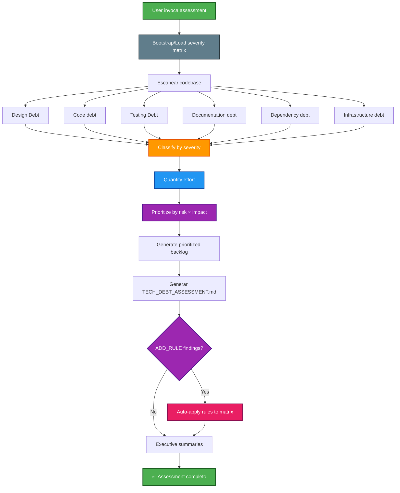

## PHASE_DEFINITION

### AECF_TECH_DEBT_ASSESSMENT
output_file: AECF_01_AECF_TECH_DEBT_ASSESSMENT.md
gate: none
loop_to: none
requires_plan_go: false

## TAXONOMY

skill_tier: TIER1
requires_determinism: true

# AECF SKILL — TECH DEBT ASSESSMENT

------------------------------------------------------------

## MANDATORY CONTEXT LOAD

This skill operates under the following mandatory contexts:

- aecf_prompts/AECF_SYSTEM_CONTEXT.md
- aecf_prompts/SKILL_DISPATCHER.md (execution protocol)
- <workspace_root>/AECF_PROJECT_CONTEXT.md (if present anywhere in the active workspace)

Governance:
- aecf_prompts/_governance/AECF_EXECUTIVE_SUMMARY_GOVERNANCE.md

If any of these contexts exist, they MUST be considered active constraints.

Execution is INVALID if these contexts are not acknowledged.

------------------------------------------------------------

## EXECUTION MANDATE (IMPERATIVE)

When this skill is invoked, the AI MUST:

1. **AUTO-RESOLVE** all parameters (TOPIC, scope, numbering) per SKILL_DISPATCHER
2. **BOOTSTRAP/LOAD PROJECT SEVERITY MATRIX** at `<DOCS_ROOT>/AECF_TECH_DEBT_ASSESSMENT_SEVERITY_MATRIX.md`
3. **SCAN** codebase exhaustively for technical debt indicators
4. **CLASSIFY** debt by type, severity using project matrix calibration, and business impact
5. **QUANTIFY** debt with estimated remediation effort using matrix effort calibration
6. **PRIORITIZE** using risk × effort × business impact matrix
7. **CREATE FILE** at `<DOCS_ROOT>/<user_id>/{{TOPIC}}/AECF_<NN>_TECH_DEBT_ASSESSMENT.md`

**MANDATORY POST-EXECUTION GOVERNANCE (per SKILL_DISPATCHER)**:
- **UPDATE** `<DOCS_ROOT>/<user_id>/AECF_TOPICS_INVENTORY.json` for TOPIC lifecycle and **REGENERATE** `<DOCS_ROOT>/<user_id>/AECF_TOPICS_INVENTORY.md` (Step 4.1)
- **APPEND** one execution entry to `<DOCS_ROOT>/<user_id>/AECF_CHANGELOG.md` (Step 4.2)

**FORBIDDEN**:
- ❌ Responding only in chat without creating a file
- ❌ Asking the user for execution mode, output path, or AECF conventions
- ❌ Requiring verbose prompts — a simple `skill: tech_debt_assessment` MUST be sufficient
- ❌ Listing debt without quantification or prioritization
- ❌ Modifying any code (this skill is READ-ONLY, assessment-only)

## MANDATORY REPOSITORY DISCOVERY (SEARCH-FIRST)

This skill requires explicit repository discovery before executing its first audit/analysis step.

Execution rules:
1. Execute an initial repository search pass within scope using IDE capabilities.
2. Build an execution-scoped `WORKING_CONTEXT` before starting the first skill step.
3. If discovery evidence is incomplete, set discovery status to NO-GO and STOP.

Minimum `WORKING_CONTEXT` for search-first execution:
- `TARGET_SCOPE`
- `ENTRY_POINTS_OR_ARTIFACTS`
- `DISCOVERED_PATHS`
- `CONFIG_AND_DEPENDENCIES`
- `UNCERTAINTIES_AND_ASSUMPTIONS`
- `SOURCE_REFERENCES` (concrete file paths and line-level references)

Forbidden:
- Skipping discovery and jumping directly to analysis.
- Assuming repository structure without verification.
- Reusing shared static discovery files across executions.

## TRACEABILITY METADATA ENFORCEMENT (MANDATORY)

Every document generated by this skill MUST include `## METADATA` following
`aecf_prompts/templates/TEMPLATE_HEADERS.md`.

The metadata block is INVALID unless it includes, at minimum:
- `Timestamp (UTC)`
- `Executed By`
- `Executed By ID`
- `Execution Identity Source`
- `Repository`
- `Branch`
- `Root Prompt`
- `Skill Executed`
- `Sequence Position`
- `Total Prompts Executed`

Missing metadata or missing traceability fields => INVALID SKILL EXECUTION.

------------------------------------------------------------

## Skill ID
`aecf_tech_debt_assessment`

## Description
Comprehensive evaluation of technical debt of a project or module. Identify, classify, quantify, and prioritize all technical debt with remediation effort estimates and a prioritized backlog to feed improvement sprints.

## When to Use
- Before a major refactoring → know WHERE to start
- Sprint planning → prioritize which debt to address
- Post `aecf_code_standards_audit` → complement with broader analysis
- Project acquisition evaluation → technical due diligence
- Pre-migration → evaluate code status before migrating
- Input for `aecf_maturity_assessment` → food dimension 10 (AI compliance reporting)
- Investment justification → produce metrics for stakeholders

## When NOT to Use
- Only audit code standards → use `aecf_code_standards_audit`
- Security audit → use `aecf_security_review`
- Urgent fix → use `aecf_hotfix`
- You already know what to refactor → use `aecf_refactor` directly

---

## Project Severity Matrix Bootstrap (MANDATORY)

To avoid cross-run severity drift, this skill MUST use a **project-local severity matrix**:

- **Path**: `<DOCS_ROOT>/AECF_TECH_DEBT_ASSESSMENT_SEVERITY_MATRIX.md`
- **Scope**: Applies only to the current project/workspace

### Bootstrap rule

On the first execution in a project:
1. If the matrix file does NOT exist, CREATE it from template:
   - `aecf_prompts/templates/TECH_DEBT_ASSESSMENT_SEVERITY_MATRIX_TEMPLATE.md`
2. Mark it as baseline (`v1`) for the project.
3. Use that matrix to classify severities and calibrate effort estimates.

On subsequent executions:
1. LOAD the existing project matrix.
2. Reuse its severities and effort calibrations to keep assessments consistent.
3. If a new, uncataloged finding appears, classify as `MATRIX-PENDING` (provisional severity based on tie-breaker rules), and append a proposed new rule section in the assessment report.

### Classification Decision Protocol (ADD vs NO-ADD)

When a finding is `MATRIX-PENDING`, the AI MUST decide if a new matrix rule should be added.

Decision criteria:
1. **Repetibility**: Is this debt pattern likely to reappear or grow in this project?
2. **Impact class**: Blocks development / causes incidents / slows velocity / cosmetic.
3. **Distinctiveness**: Is this truly new, or already covered by an existing Rule ID?
4. **Actionability**: Can the rule be written with objective evidence and deterministic threshold?

Decision outcomes:
- `ADD_RULE`: Create a proposed Rule ID and recommendation to update matrix version.
- `NO_ADD_RULE`: Keep mapped to nearest existing rule and document rationale.

Mandatory evidence for decision:
- Finding location (`path/file.py:line` or module/component)
- Proposed or mapped Rule ID
- Rationale (1-3 lines, objective)
- Provisional severity used during this run

### Matrix Auto-Apply Protocol (MANDATORY)

When the Classification Decision Protocol produces `ADD_RULE` decisions, the AI MUST **automatically apply them** to the project severity matrix as part of the skill execution — no separate skill, no user confirmation needed.

**Auto-apply steps (executed AFTER report generation, BEFORE executive summaries)**:

1. **Filter**: Collect all findings with decision `ADD_RULE` from the Classification Decision Log.
2. **Validate**: Confirm each proposed rule has:
   - Unique Rule ID (not colliding with existing rules)
   - Clear Condition text (objective, deterministic)
   - Justified Severity (backed by impact class, effort calibration, or tie-breaker rules)
3. **Apply**: For each validated `ADD_RULE`:
   - INSERT the new row into the `## Canonical Rules` table of `<DOCS_ROOT>/AECF_TECH_DEBT_ASSESSMENT_SEVERITY_MATRIX.md`
   - Place it in the correct category group (alphabetical by Rule ID within category)
4. **Version bump**: Increment the matrix version:
   - Minor bump for additions: `v1` → `v1.1`, `v1.1` → `v1.2`
   - Update `Last Updated` date
   - Change `Status` from `baseline` to `active` (if first update)
5. **Changelog**: Append entry with format:
   ```
   - vX.Y: Added RULE-ID (description) from TOPIC assessment. Source: documentation/TOPIC/AECF_NN_DOCUMENT.md (YYYY-MM-DD).
   ```
6. **Report cross-reference**: In the assessment report's Classification Decision Log, mark applied rules as `✅ AUTO-APPLIED` instead of just `ADD_RULE`.

**Rules for `NO_ADD_RULE`**: Document in report only. Do NOT touch matrix file.

**Conflict resolution**: If Rule ID collision, append numeric suffix. If matrix missing/corrupted, bootstrap from template first.

---

## Executive Summary Requirements for Matrix Decisions (MANDATORY)

For `aecf_tech_debt_assessment`, both executive summaries MUST explicitly report matrix governance:

1. **Classification Decision Log**
   - Total `MATRIX-PENDING`
   - `ADD_RULE` count (with `✅ AUTO-APPLIED` status)
   - `NO_ADD_RULE` count

2. **Pending Findings Review List**
   - List each pending finding with:
- `path/file.py:line` or component
     - provisional severity
     - proposed/mapped Rule ID
     - decision (`ADD_RULE` / `NO_ADD_RULE`)
     - short rationale

3. **Matrix update recommendation**
   - Auto-applied rules listed with new matrix version
   - If any `ADD_RULE`, confirm matrix version bump was applied

### Non-goal

This matrix is **NOT global AECF policy** and MUST NOT be centralized for all projects.
Each project owns and evolves its own matrix at `<DOCS_ROOT>/AECF_TECH_DEBT_ASSESSMENT_SEVERITY_MATRIX.md`.

---

## Phases Executed



---

## Input Required

### Mandatory:
- **Scope**: Code or project to evaluate (directory, module or complete workspace)
- **TOPIC** (optional): Evaluation identifier (will be inferred from the scope)

### Optional:
- **Previous assessments**: Previous assessments to compare trends
- **Standards audit**: `aecf_code_standards_audit` output (complementario)
- **Business context**: Business priorities (which modules are most critical)
- **Sprint capacity**: Team capacity to estimate how many remediation sprints

---

## Technical Debt Categories

### 1. Design Debt
- SOLID principles violations
- God classes / God functions
- Tight coupling between modules
- Missing or incorrect abstractions
- Poorly applied design patterns
- Monolithic architecture where modularity is needed

### 2. Code Debt
- Duplicate code (DRY violations)
- High cyclomatic complexity
- Magic numbers / magic strings
- Dead code / unreachable code
- Poor naming variable
- Functions too long (>50 LOC)
- Excessive nesting (>3 levels)
- Global state without justification

### 3. Testing Debt (Testing Debt)
- Absence of tests
- Cobertura < 80%
- Fragile tests (depend on external state)
- Lack of integration tests
- Tests that do not verify edge cases
- Excessive mocking that hides real bugs

### 4. Documentation Debt
- Public functions without docstrings
- Absence of type hints
- outdated README
- Absence of architectural decision records
- Outdated or misleading comments
- Undocumented API

### 5. Dependency Debt
- Outdated dependencies (>6 months without update)
- Dependencies with known CVEs
- Abandoned dependencies (no maintenance)
- Over-dependency (imported trivial functionality)
- Dependencies with incompatible licenses
- Version pinning ausente

### 6. Infrastructure Debt
- CI/CD ausente o incompleto
- No automated linting
- No automatic formatting
- Logging insuficiente o inconsistente
- Hardcoded configuration
- Absence of health checks

---

## Execution Steps

### Step 1: SCAN CODEBASE
**Input**: Code scope
**Action**: Thorough scan of all files in scope
**Expected time**: 15–40 min
**Outputs collected**:
- File inventory (count, types, sizes)
- Complexity metrics per file/function
- Dependency graph
- Test coverage (if measurable)
- Documentation coverage

### Step 2: IDENTIFY AND CLASSIFY DEBT
**Input**: Scan results
**Action**: Classify each finding by category and severity
**Expected time**: 20–40 min

**Severity levels**:
| Severity | Description | Impact |
|----------|-------------|--------|
| **CRITICAL** | Blocks evolution or causes failures in production | Immediate remediation |
| **HIGH** | Significant impact on maintainability or reliability | Remediation in next sprint |
| **MEDIUM** | Slows development or increases risk | Plan remediation |
| **LOW** | Desirable improvement, low immediate impact | Backlog |
| **INFO** | Observation without direct impact | Informative record |

### Step 3: QUANTIFY REMEDIATION EFFORT
**Input**: Classified findings
**Action**: Estimate remediation effort per finding
**Expected time**: 10–20 min

**Estimation scale**:
| Effort | Description | Typical Time |
|--------|-------------|-------------|
| **XS** | Trivial fix (rename, remove dead code) | < 30 min |
| **S** | Simple fix (add docstring, fix magic number) | 30 min – 2h |
| **M** | Moderate change (extract function, add tests) | 2h – 1 day |
| **L** | Significant work (restructure module, add test suite) | 1 – 3 days |
| **XL** | Major effort (architecture change, rewrite module) | 3 – 10 days |

### Step 4: PRIORITIZE WITH RISK × IMPACT MATRIX
**Input**: Classified and quantified findings
**Action**: Prioritize using decision matrix
**Expected time**: 10–15 min

**Priority formula**:
$$
\text{Priority Score} = \text{Severity Weight} \times \text{Business Impact} \times \frac{1}{\text{Effort}}
$$

| Severity | Weight |
|----------|--------|
| CRITICAL | 5 |
| HIGH | 4 |
| MEDIUM | 3 |
| LOW | 2 |
| INFO | 1 |

| Business Impact | Multiplier |
|----------------|------------|
| Revenue-critical path | 3 |
| Customer-facing | 2 |
| Internal tooling | 1 |

**Result**: Prioritized backlog sorted by Priority Score descending

### Step 5: GENERATE REMEDIATION BACKLOG
**Input**: Prioritized findings
**Action**: Create structured backlog for sprint planning
**Expected time**: 10–15 min

**Backlog format per item**:
```markdown
### [PRIORITY] TD-NNN: [Title]
- **Category**: [Design/Code/Testing/Documentation/Dependencies/Infrastructure]
- **Severity**: [CRITICAL/HIGH/MEDIUM/LOW/INFO]
- **Location**: `path/file.py:line`
- **Description**: What the debt is
- **Impact**: What happens if not addressed
- **Remediation**: How to fix
- **Effort**: [XS/S/M/L/XL]
- **Recommended skill**: `aecf_refactor` / `aecf_security_review` / `aecf_new_feature` / `aecf_document_legacy` / `aecf_dependency_audit`
- **Sprint target**: [Immediate/Next/Backlog]
```

> ❌ **NUNCA recomendar prompts/fases internas** (ej: `06_FIX_CODE`, `08_TEST_STRATEGY`)
> ✅ **ALWAYS recommend the skill** that will internally dispatch the correct phases

### Step 6: GENERATE ASSESSMENT REPORT
**Output**: `<DOCS_ROOT>/<user_id>/{{TOPIC}}/AECF_<NN>_TECH_DEBT_ASSESSMENT.md`
**Expected time**: 10–15 min
**Content**:
1. Assessment Overview (scope, date, summary)
2. **Sections Analyzed — Navigation Index** (with links to findings)
3. Debt Summary Dashboard
4. Debt by Category (detailed findings)
5. Severity Distribution
6. Effort Distribution
7. Prioritized Remediation Backlog (con skills AECF recomendados)
8. Metrics Summary (before/target)
9. Trend Comparison (if previous assessment exists)
10. Recommendations

> **MANDATORY**: Prior to detailed findings, the report MUST include:
>
> ## 🗂️ Sections Analyzed — Navigation Index
>
> | # | Section Analyzed | Findings | Link |
> |---|-------------------|----------|------|
> | 1 | Design Debt | N CRITICAL, M HIGH | [→ Findings and Remediation](#design-debt) |
> | 2 | Code Debt | N CRITICAL, M HIGH | [→ Findings and Remediation](#code-debt) |
> | 3 | Testing Debt | N CRITICAL, M HIGH | [→ Findings and Remediation](#testing-debt) |
> | 4 | Documentation Debt | N WARNING | [→ Findings and Remediation](#documentation-debt) |
> | 5 | Dependency Debt | N HIGH | [→ Findings and Remediation](#dependency-debt) |
> | 6 | Infrastructure Debt | N WARNING | [→ Findings and Remediation](#infrastructure-debt) |
>
> Replace with actual counts. Skip sections without findings if all are PASS.

### 🔧 Remediation Skill Mapping (MANDATORY)

**For EACH CRITICAL or HIGH finding, the backlog MUST recommend the appropriate AECF skill**:

| Debt Category | Recommended Skill | Description |
|--------------------|-------------------|-------------|
| Design Debt (SOLID, god classes, coupling) | `aecf_refactor` | Restructure design |
| Code Debt (duplication, complexity, naming) | `aecf_refactor` | Refactor code |
| Testing debt (coverage, fragile tests) | `aecf_new_feature` | Generate strategy + tests |
| Documentation Debt (docstrings, README, type hints) | `aecf_document_legacy` | Document code |
| Dependency Debt (CVEs, outdated, abandoned) | `aecf_dependency_audit` → `aecf_refactor` | Audit and update |
| Infrastructure Debt (CI/CD, linting, logging) | `aecf_refactor` | Implement missing infra |
| Security problems detected | `aecf_security_review` | Security audit |

❌ **NEVER recommend internal prompts/phases directly**
✅ **ALWAYS recommend the skill** that will internally dispatch the correct phases

### Step 7: EXECUTIVE SUMMARY (ON-DEMAND)
Use `skill: executive_summary TOPIC: <topic_name>` when needed.

---

## Total Estimated Time

| Scenario | Time |
|----------|------|
| **Small module** (< 20 files) | 30 – 60 min |
| **Medium project** (20–100 files) | 1 – 2 horas |
| **Large project** (100+ files) | 2 – 4 horas |
| **With previous standards audit** (reuse findings) | -30% time |

---

## Success Criteria

✅ All 6 debt categories evaluated  
✅ Local matrix available in `<DOCS_ROOT>/AECF_TECH_DEBT_ASSESSMENT_SEVERITY_MATRIX.md` (created or uploaded)
✅ Documented `ADD_RULE` / `NO_ADD_RULE` decisions for `MATRIX-PENDING`
✅ Every finding classified by severity  
✅ Every finding quantified with effort estimate  
✅ Prioritized backlog generated  
✅ Remediation recommendations include AECF skill references  
✅ Assessment report file created  
✅ Executive summaries generated  

---

## Scoring Does NOT Apply (Assessment Skill)

This skill evaluates technical debt — it does NOT produce code.

**Alternative Evaluation**: Assessment Completeness

| Aspect | Status |
|--------|--------|
| All 6 categories evaluated | ✓/✗ |
| Findings classified by severity | ✓/✗ |
| Findings quantified with effort | ✓/✗ |
| Prioritized backlog generated | ✓/✗ |
| Remediation recommendations provided | ✓/✗ |
| Trend comparison (if previous exists) | ✓/✗ |

**Completeness: X/6**

---

## Example Usage

### Scenario 1: Full project assessment
```
User: "skill: tech_debt_assessment. TOPIC: tech_debt_q1"

AI:
✅ Skill recognized: aecf_tech_debt_assessment
📌 TOPIC: tech_debt_q1
📂 Scope: [workspace root]
🔢 Next number: 01
📄 Output: documentation/tech_debt_q1/AECF_01_TECH_DEBT_ASSESSMENT.md

[Executes full assessment...]
```

### Scenario 2: Module focused
```
User: "Assess the technical debt of the authentication module. TOPIC: tech_debt_auth"
```

### Scenario 3: Post standards audit
```
User: "Complement the previous audit standards with a complete technical debt evaluation.
Use findings from documentation/STANDARDS/. TOPIC: tech_debt_full"
```

---

## Outputs Generated

```
<DOCS_ROOT>/<user_id>/{{TOPIC}}/
├── AECF_01_TECH_DEBT_ASSESSMENT.md
```

---

## Related Skills

- `aecf_code_standards_audit` — Input complementario (violations = code debt)
- `aecf_refactor` — Consumidor principal del backlog priorizado
- `aecf_dependency_audit` — Go deeper into dependency debt
- `aecf_maturity_assessment` — Alimenta dimensiones 4, 9, 10
- `aecf_security_review` — Complements with security perspective

---

## CONTEXT VALIDATION

Confirm:

[ ] AECF_SYSTEM_CONTEXT.md loaded
[ ] Governance rules applied
[ ] All 6 debt categories evaluated
[ ] Findings classified and quantified
[ ] Prioritized backlog generated
[ ] Executive summary is optional on-demand via `skill_executive_summary`
[ ] Document includes `Executed By`

If not confirmed → STOP execution.

---

**SKILL READY FOR USE**

## AI_USAGE_DECLARATION

AI_USED = TRUE

## AI_EXPLAINABILITY_VALIDATION

- Explainability level defined? YES/NO
- User-facing explanation provided? YES/NO
- Model version logged? YES/NO
- Decision trace stored? YES/NO

## GOVERNANCE VALIDATION BLOCK

- Data lineage impact
- Model impact (YES/NO)
- Risk impact
- Compliance check


