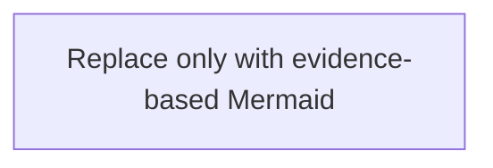

# Functionality Documentation — <TOPIC>

> **@METADATA** — Apply standard AECF metadata header from `templates/TEMPLATE_HEADERS.md`
> | Field | Value |
> |-------|-------|
> | Document Type | AECF Discovery Legacy Documentation |
> | Phase | 00_DISCOVERY_LEGACY |

---

## 1. Scope and Purpose
### 1.1 Functional Boundary
### 1.2 In-Scope Files and Out-of-Scope Files
### 1.3 Scope Evidence

| Item | Evidence (`path :: symbol_or_block :: lines_or_reason`) |
|------|-----------------------------------------------------------|
| In-scope confirmation | |
| Out-of-scope confirmation | |

## 2. Entry Points
### 2.1 Confirmed Entry Points

| Path | Symbol/Block | Type (CLI/API/Event/Cron/Other) | Evidence |
|------|--------------|----------------------------------|----------|
| | | | |

### 2.2 Rejected Candidates (if any)

| Candidate | Why Rejected | Evidence |
|-----------|--------------|----------|
| | | |

## 3. High-Level Flow
### 3.1 Ordered Functional Steps

| Step | Description | Responsible Module/Function | Evidence |
|------|-------------|-----------------------------|----------|
| 1 | | | |

### 3.2 Preconditions and Postconditions

| Condition | Type (Pre/Post) | Evidence |
|-----------|------------------|----------|
| | | |

### 3.3 Diagram Decision

| Candidate | Decision (DIAGRAMMABLE/NOT_APPLICABLE) | Why | Evidence |
|-----------|----------------------------------------|-----|----------|
| | | | |

### 3.4 Embedded Mermaid Summary (only when DIAGRAMMABLE)

If `NOT_APPLICABLE`, write the reason explicitly and do not invent Mermaid.

## 4. Technical Flow (Detailed)
### 4.1 Call/Execution Sequence

| Seq | Caller | Callee | Data/Control Passed | Evidence |
|-----|--------|--------|---------------------|----------|
| 1 | | | | |

### 4.2 Branches and Error Paths

| Branch/Error Path | Trigger | Outcome | Evidence |
|-------------------|---------|---------|----------|
| | | | |

## 5. Dependency Map
### 5.1 Internal Modules

| Module | Why Used | Imported/Invoked From | Evidence |
|--------|----------|------------------------|----------|
| | | | |

### 5.2 External Libraries

| Library | Purpose | Imported/Invoked From | Evidence |
|---------|---------|------------------------|----------|
| | | | |

## 6. Configuration & Environment

| Config/Env/Input | Required? (Y/N) | Source (file/env/arg) | Evidence |
|------------------|------------------|------------------------|----------|
| | | | |

## 7. I/O and Side Effects

| Effect Type (Read/Write/Network/Process/Other) | Description | Trigger Location | Evidence |
|-----------------------------------------------|-------------|------------------|----------|
| | | | |

## 8. Observed Risks & Constraints (FACTUAL ONLY)

| Risk/Constraint | Why It Matters | Evidence |
|-----------------|----------------|----------|
| | | |

## 9. Known Unknowns

| Unknown | Why certainty is blocked | Missing evidence/artifact |
|---------|--------------------------|---------------------------|
| | | |

## 10. Traceability Decisions

### 10.1 Entry Point Decisions (ordered)
### 10.2 Scope Delimitation Decisions (ordered)
### 10.3 Unknowns That Block Certainty (ordered)
