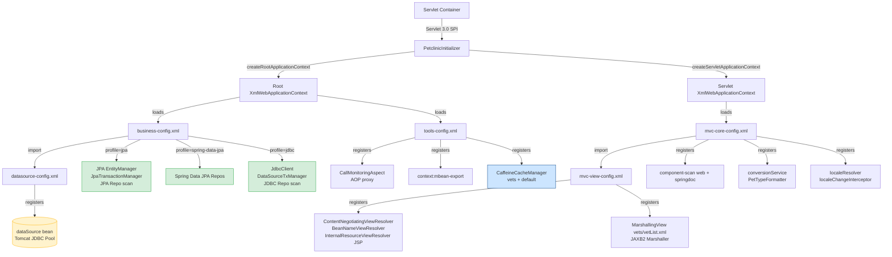

# AECF_01 — DOCUMENT LEGACY: Configuración XML Spring (`spring/`)

> **Scope**: `src/main/resources/spring/` — cinco archivos de configuración XML  
> **Skill**: `aecf_document_legacy` | **Phase**: DOCUMENT_EXISTING  
> **Topic**: `spring_xml_config` (dispatch id: `aecf_skillaecf_docum`)

---

## METADATA

| Field | Value |
|-------|-------|
| Timestamp (UTC) | 2026-04-20T18:00:00Z |
| Executed By | lvillara |
| Executed By ID | luis.garcia-villaraco@seachad.com |
| Execution Identity Source | git config user |
| Repository | spring-framework-petclinic |
| Branch | appmod/java-upgrade-20260417115818 |
| Root Prompt | `@aecf run skill=aecf_document_legacy topic=spring_xml_config` |
| Skill Executed | aecf_document_legacy |
| Sequence Position | 1 |
| Total Prompts Executed | 1 |
| AI_USED | FALSE |

---

## 1. Propósito y Alcance

Este documento describe exhaustivamente los cinco archivos XML que constituyen la capa de configuración de la aplicación `spring-framework-petclinic` (Spring Framework 7.0.6, Java 21, WAR). Cada archivo cubre una preocupación técnica distinta: datasource y pool de conexiones, capa de servicio y repositorio con soporte multi-perfil, infraestructura transversal (AOP + JMX + Cache), configuración central del DispatcherServlet, y resolución de vistas.

La aplicación no utiliza Spring Boot ni `@Configuration` Java-based. El punto de arranque es `PetclinicInitializer.java`, que carga los contextos de forma programática usando `XmlWebApplicationContext`.

**Archivos en scope** (todos `FOUND`):

| Archivo | Contexto Spring | Cargado por |
|---------|----------------|------------|
| `datasource-config.xml` | Root (transitivo) | importado desde `business-config.xml` |
| `business-config.xml` | Root | `PetclinicInitializer.createRootApplicationContext()` |
| `tools-config.xml` | Root | `PetclinicInitializer.createRootApplicationContext()` |
| `mvc-core-config.xml` | DispatcherServlet | `PetclinicInitializer.createServletApplicationContext()` |
| `mvc-view-config.xml` | DispatcherServlet (transitivo) | importado desde `mvc-core-config.xml` |

---

## 2. Entry Points

### Entry Point principal: `PetclinicInitializer.java`

- Evidence: [`src/main/java/org/springframework/samples/petclinic/PetclinicInitializer.java`](../../../src/main/java/org/springframework/samples/petclinic/PetclinicInitializer.java) (`PetclinicInitializer.java:55-66`)

```
createRootApplicationContext()  →  carga business-config.xml + tools-config.xml
                                   perfil por defecto: "jpa"
createServletApplicationContext() → carga mvc-core-config.xml
```

**Entry point de negocio (Root context):**
- `business-config.xml` → importa `datasource-config.xml` en línea 16  
  Evidence: [`src/main/resources/spring/business-config.xml#L16`](../../../src/main/resources/spring/business-config.xml#L16)

**Entry point web (Servlet context):**
- `mvc-core-config.xml` → importa `mvc-view-config.xml` en línea 17  
  Evidence: [`src/main/resources/spring/mvc-core-config.xml#L17`](../../../src/main/resources/spring/mvc-core-config.xml#L17)

---

## 3. High-Level Flow

### Secuencia de carga al arrancar la aplicación

1. **Servlet container** invoca `PetclinicInitializer` (Servlet 3.0+ SPI).
2. Se crean dos contextos Spring jerárquicamente separados:
   - **Root ApplicationContext** ← carga `business-config.xml` + `tools-config.xml`.
   - **Servlet ApplicationContext** ← carga `mvc-core-config.xml`.
3. `business-config.xml` **importa** `datasource-config.xml` → registra `dataSource`.
4. `business-config.xml` activa los beans de repositorio/servicio según el perfil activo.
5. `mvc-core-config.xml` **importa** `mvc-view-config.xml` → registra resolvers de vista.
6. El `DispatcherServlet` está operativo; las peticiones HTTP se enrutan a los `@Controller`.



---

## 4. Technical Flow — Descripción detallada por archivo

---

### 4.1 `datasource-config.xml`

**Archivo**: [`src/main/resources/spring/datasource-config.xml`](../../../src/main/resources/spring/datasource-config.xml)

#### Propósito
Registra el bean `dataSource` (pool de conexiones Tomcat JDBC) y el inicializador de schema/datos. Es el único punto de la aplicación donde se define la conexión a la base de datos.

#### Beans registrados

| Bean ID | Clase | Descripción |
|---------|-------|-------------|
| `dataSource` | `org.apache.tomcat.jdbc.pool.DataSource` | Pool de conexiones (default, no-JEE) |
| *(sin id)* | `jdbc:initialize-database` | Ejecuta schema.sql + data.sql al arrancar |
| `dataSource` (override) | JNDI lookup `java:comp/env/jdbc/petclinic` | Solo activo bajo perfil `javaee` |

#### Configuración detallada

```xml
<!-- datasource-config.xml:28-30 -->
<bean id="dataSource" class="org.apache.tomcat.jdbc.pool.DataSource"
      p:driverClassName="${jdbc.driverClassName}" p:url="${jdbc.url}"
      p:username="${jdbc.username}" p:password="${jdbc.password}"/>
```
Evidence: [`src/main/resources/spring/datasource-config.xml#L28-L30`](../../../src/main/resources/spring/datasource-config.xml#L28-L30) (`datasource-config.xml:28-30`)

```xml
<!-- datasource-config.xml:34-37 — Inicializador de base de datos -->
<jdbc:initialize-database data-source="dataSource">
    <jdbc:script location="${jdbc.initLocation}"/>
    <jdbc:script location="${jdbc.dataLocation}"/>
</jdbc:initialize-database>
```
Evidence: [`src/main/resources/spring/datasource-config.xml#L34-L37`](../../../src/main/resources/spring/datasource-config.xml#L34-L37) (`datasource-config.xml:34-37`)

Las propiedades `${jdbc.initLocation}` y `${jdbc.dataLocation}` se resuelven vía `data-access.properties`:

```properties
# data-access.properties:8-9
jdbc.initLocation=classpath:db/${db.script}/schema.sql
jdbc.dataLocation=classpath:db/${db.script}/data.sql
```
Evidence: [`src/main/resources/spring/data-access.properties#L8-L9`](../../../src/main/resources/spring/data-access.properties#L8-L9) (`data-access.properties:8-9`)

#### Perfil Spring activo

| Perfil | Efecto |
|--------|--------|
| *(ninguno/default)* | `dataSource` = Tomcat JDBC Pool |
| `javaee` | Override: `dataSource` = JNDI lookup (para despliegue en servidor JEE con JNDI configurado) |

Evidence: [`src/main/resources/spring/datasource-config.xml#L39-L42`](../../../src/main/resources/spring/datasource-config.xml#L39-L42) (`datasource-config.xml:39-42`)

#### Relaciones con otros archivos
- **Es importado por** `business-config.xml` (línea 16) → garantiza que `dataSource` esté disponible antes de que el `entityManagerFactory` o `transactionManager` sean creados.
- **No importa** ningún otro archivo de configuración.

#### Equivalente Spring Boot
```yaml
# application.properties
spring.datasource.driver-class-name=org.h2.Driver
spring.datasource.url=jdbc:h2:mem:petclinic
spring.datasource.username=sa
spring.datasource.password=
spring.sql.init.schema-locations=classpath:db/h2/schema.sql
spring.sql.init.data-locations=classpath:db/h2/data.sql
```
Spring Boot auto-configura HikariCP como pool y `DataSourceInitializer` como inicializador. El perfil `javaee` equivaldría a configurar `spring.datasource.jndi-name`.

---

### 4.2 `business-config.xml`

**Archivo**: [`src/main/resources/spring/business-config.xml`](../../../src/main/resources/spring/business-config.xml)

#### Propósito
Configura la capa de servicio y la capa de repositorio. Es el corazón del Root ApplicationContext. Gestiona la transaccionalidad y selecciona la implementación del repositorio mediante perfiles Spring.

#### Beans registrados (siempre activos)

| Bean/Mecanismo | Descripción |
|----------------|-------------|
| `import datasource-config.xml` | Importa el DataSource |
| `context:component-scan` (`petclinic.service`) | Registra `ClinicServiceImpl` vía `@Service` |
| `context:property-placeholder` | Carga `spring/data-access.properties` |
| `tx:annotation-driven` | Activa `@Transactional` en todos los beans del contexto |

#### Beans registrados por perfil

**Perfil `jpa` + `spring-data-jpa`** (activos cuando cualquiera de los dos perfiles está presente):

| Bean ID | Clase | Descripción |
|---------|-------|-------------|
| `entityManagerFactory` | `LocalContainerEntityManagerFactoryBean` | Configura Hibernate como JPA provider |
| `transactionManager` | `JpaTransactionManager` | Gestiona transacciones JPA |
| *(sin id)* | `PersistenceExceptionTranslationPostProcessor` | Traduce excepciones JPA → DataAccessException |

```xml
<!-- business-config.xml:35-64 -->
<beans profile="jpa,spring-data-jpa">
    <bean id="entityManagerFactory" class="...LocalContainerEntityManagerFactoryBean"
          p:dataSource-ref="dataSource">
        <property name="jpaVendorAdapter">
            <bean class="...HibernateJpaVendorAdapter"
                  p:database="${jpa.database}" p:showSql="${jpa.showSql}"/>
        </property>
        <property name="persistenceUnitName" value="petclinic"/>
        <property name="packagesToScan" value="org.springframework.samples.petclinic"/>
    </bean>
    <bean id="transactionManager" class="...JpaTransactionManager"
          p:entityManagerFactory-ref="entityManagerFactory"/>
    <bean class="...PersistenceExceptionTranslationPostProcessor"/>
</beans>
```
Evidence: [`src/main/resources/spring/business-config.xml#L35-L64`](../../../src/main/resources/spring/business-config.xml#L35-L64) (`business-config.xml:35-64`)

**Perfil `jdbc`**:

| Bean ID | Clase | Descripción |
|---------|-------|-------------|
| `transactionManager` | `DataSourceTransactionManager` | Gestión transaccional JDBC |
| `jdbcClient` | `JdbcClient` | Spring 6+ fluent JDBC client |
| `namedParameterJdbcTemplate` | `NamedParameterJdbcTemplate` | Named-param queries |
| *(component-scan)* | `petclinic.repository.jdbc` | `JdbcOwnerRepositoryImpl`, etc. |

Evidence: [`src/main/resources/spring/business-config.xml#L66-L83`](../../../src/main/resources/spring/business-config.xml#L66-L83) (`business-config.xml:66-83`)

**Perfil `jpa`** (solo implementaciones JPA):

```xml
<!-- business-config.xml:84-92 -->
<beans profile="jpa">
    <context:component-scan base-package="...repository.jpa"/>
</beans>
```
Evidence: [`src/main/resources/spring/business-config.xml#L84-L92`](../../../src/main/resources/spring/business-config.xml#L84-L92) (`business-config.xml:84-92`)

**Perfil `spring-data-jpa`**:

```xml
<!-- business-config.xml:94-96 -->
<beans profile="spring-data-jpa">
    <jpa:repositories base-package="...repository.springdatajpa"/>
</beans>
```
Evidence: [`src/main/resources/spring/business-config.xml#L94-L96`](../../../src/main/resources/spring/business-config.xml#L94-L96) (`business-config.xml:94-96`)

#### Resumen de perfiles

| Perfil activo | `transactionManager` | Repositorios cargados |
|--------------|---------------------|-----------------------|
| `jpa` (default) | `JpaTransactionManager` | `repository.jpa.*` + EntityManagerFactory |
| `spring-data-jpa` | `JpaTransactionManager` | Spring Data repos (`springdatajpa.*`) |
| `jdbc` | `DataSourceTransactionManager` | `repository.jdbc.*` + JdbcClient |

#### Relaciones con otros archivos
- **Importa** `datasource-config.xml` (línea 16).
- **Es cargado por** `PetclinicInitializer.createRootApplicationContext()` junto con `tools-config.xml`.
- Los beans del Root ApplicationContext (especialmente `transactionManager`) son visibles desde el Servlet ApplicationContext por herencia de jerarquía de contextos.

#### Equivalente Spring Boot
```java
@Configuration
@EnableTransactionManagement
@ComponentScan("org.springframework.samples.petclinic.service")
@PropertySource("classpath:spring/data-access.properties")
public class BusinessConfig { ... }

// Perfil jpa:
@Configuration @Profile("jpa")
@EnableJpaRepositories(basePackages = "...repository.jpa")
public class JpaConfig { /* @Bean entityManagerFactory, transactionManager */ }

// Perfil jdbc:
@Configuration @Profile("jdbc")
public class JdbcConfig { /* @Bean jdbcClient, transactionManager */ }

// Perfil spring-data-jpa:
@Configuration @Profile("spring-data-jpa")
@EnableJpaRepositories(basePackages = "...repository.springdatajpa")
public class SpringDataJpaConfig { }
```

---

### 4.3 `tools-config.xml`

**Archivo**: [`src/main/resources/spring/tools-config.xml`](../../../src/main/resources/spring/tools-config.xml)

#### Propósito
Configura la infraestructura transversal del Root ApplicationContext: monitorización de llamadas con AspectJ/AOP, exposición JMX y caché declarativa con Caffeine. No tiene dependencias de perfil.

#### Beans registrados

| Bean ID | Clase | Descripción |
|---------|-------|-------------|
| `callMonitor` | `CallMonitoringAspect` | Aspecto que intercepta `@Repository` beans |
| *(sin id)* | `context:mbean-export` | Exporta beans `@ManagedResource` por JMX |
| *(sin id)* | `cache:annotation-driven` | Activa `@Cacheable`, `@CacheEvict`, etc. |
| `cacheManager` | `CaffeineCacheManager` | Gestiona cachés `vets` y `default` |

#### Configuración AOP

```xml
<!-- tools-config.xml:24-29 -->
<aop:aspectj-autoproxy>
    <aop:include name="callMonitor"/>
</aop:aspectj-autoproxy>
<bean id="callMonitor" class="...util.CallMonitoringAspect"/>
```
Evidence: [`src/main/resources/spring/tools-config.xml#L24-L29`](../../../src/main/resources/spring/tools-config.xml#L24-L29) (`tools-config.xml:24-29`)

El aspecto intercepta **todos los métodos de beans `@Repository`**:

```java
// CallMonitoringAspect.java:77-78
@Around("within(@org.springframework.stereotype.Repository *)")
public Object invoke(ProceedingJoinPoint joinPoint) throws Throwable { ... }
```
Evidence: [`src/main/java/org/springframework/samples/petclinic/util/CallMonitoringAspect.java#L77-L78`](../../../src/main/java/org/springframework/samples/petclinic/util/CallMonitoringAspect.java#L77-L78) (`CallMonitoringAspect.java:77-78`)

Atributos JMX expuestos vía `@ManagedResource("petclinic:type=CallMonitor")`:

| Atributo | Tipo | Descripción |
|----------|------|-------------|
| `enabled` | boolean | Activa/desactiva la monitorización |
| `callCount` | int | Número total de llamadas interceptadas |
| `callTime` | long | Tiempo medio de invocación en ms |

Evidence: [`src/main/java/org/springframework/samples/petclinic/util/CallMonitoringAspect.java#L37-L95`](../../../src/main/java/org/springframework/samples/petclinic/util/CallMonitoringAspect.java#L37-L95) (`CallMonitoringAspect.java:37-95`)

#### Configuración Cache

```xml
<!-- tools-config.xml:38-47 -->
<cache:annotation-driven/>
<bean id="cacheManager" class="org.springframework.cache.caffeine.CaffeineCacheManager">
    <property name="cacheNames">
        <set>
            <value>default</value>
            <value>vets</value>
        </set>
    </property>
</bean>
```
Evidence: [`src/main/resources/spring/tools-config.xml#L38-L47`](../../../src/main/resources/spring/tools-config.xml#L38-L47) (`tools-config.xml:38-47`)

La caché `vets` es utilizada por `VetController` (método `showVetList`) mediante `@Cacheable("vets")`.

#### Relaciones con otros archivos
- **No importa** ningún otro archivo XML.
- **Es cargado por** `PetclinicInitializer.createRootApplicationContext()` junto con `business-config.xml`.
- El aspecto AOP actúa sobre los repositorios registrados en `business-config.xml` (mismo contexto Root).
- Sin profiles específicos — activo en todos los modos de ejecución.

#### Equivalente Spring Boot
```java
@Configuration
@EnableCaching
@EnableAspectJAutoProxy
public class ToolsConfig {

    @Bean
    public CallMonitoringAspect callMonitor() {
        return new CallMonitoringAspect();
    }

    @Bean
    public CacheManager cacheManager() {
        CaffeineCacheManager manager = new CaffeineCacheManager();
        manager.setCacheNames(List.of("default", "vets"));
        return manager;
    }
}
// JMX: spring.jmx.enabled=true en application.properties
// Caffeine spec: spring.cache.caffeine.spec=maximumSize=500,expireAfterAccess=600s
```

---

### 4.4 `mvc-core-config.xml`

**Archivo**: [`src/main/resources/spring/mvc-core-config.xml`](../../../src/main/resources/spring/mvc-core-config.xml)

#### Propósito
Configura el Servlet ApplicationContext del `DispatcherServlet`. Registra la infraestructura de enrutamiento MVC: component-scan de controllers, `mvc:annotation-driven`, formatters, interceptores de idioma, recursos estáticos, mensaje de error y `messageSource`.

#### Beans registrados

| Bean ID / Mecanismo | Clase | Descripción |
|--------------------|-------|-------------|
| `import mvc-view-config.xml` | — | Importa los view resolvers |
| `context:component-scan` | — | Escanea `petclinic.web` + `org.springdoc` |
| `mvc:annotation-driven` | — | Activa `@RequestMapping`, `@PathVariable`, etc. |
| `localeResolver` | `CookieLocaleResolver` | Cookie `PETCLINIC_LOCALE`; default=`en` |
| `localeChangeInterceptor` | `LocaleChangeInterceptor` | Parámetro `?lang=XX` cambia el locale |
| `mvc:interceptors` | — | Registra `localeChangeInterceptor` |
| `mvc:resources` `/resources/**` | — | Sirve recursos desde `webapp/resources/` |
| `mvc:resources` `/webjars/**` | — | Sirve WebJars del classpath |
| `mvc:view-controller` `/` | — | Mapea raíz a vista `welcome` |
| `mvc:default-servlet-handler` | — | Fallback para recursos estáticos no mapeados |
| `conversionService` | `FormattingConversionServiceFactoryBean` | Incluye `PetTypeFormatter` |
| `messageSource` | `ResourceBundleMessageSource` | Carga `messages/messages_XX.properties` |
| *(sin id)* | `SimpleMappingExceptionResolver` | Mapea excepciones → vista `exception` |

#### Detalle de beans clave

```xml
<!-- mvc-core-config.xml:35-40 — localeResolver (AECF_META: i18n_locale_selector) -->
<bean id="localeResolver"
      class="org.springframework.web.servlet.i18n.CookieLocaleResolver">
    <property name="defaultLocale" value="en"/>
    <property name="cookieName" value="PETCLINIC_LOCALE"/>
    <property name="cookieMaxAge" value="-1"/>
</bean>
```
Evidence: [`src/main/resources/spring/mvc-core-config.xml#L35-L40`](../../../src/main/resources/spring/mvc-core-config.xml#L35-L40) (`mvc-core-config.xml:35-40`)

```xml
<!-- mvc-core-config.xml:71-77 — conversionService con PetTypeFormatter -->
<bean id="conversionService" class="...FormattingConversionServiceFactoryBean">
    <property name="formatters">
        <set>
            <bean class="...web.PetTypeFormatter"/>
        </set>
    </property>
</bean>
```
Evidence: [`src/main/resources/spring/mvc-core-config.xml#L71-L77`](../../../src/main/resources/spring/mvc-core-config.xml#L71-L77) (`mvc-core-config.xml:71-77`)

```xml
<!-- mvc-core-config.xml:83-85 — messageSource -->
<bean id="messageSource" class="...ResourceBundleMessageSource"
      p:basename="messages/messages"/>
```
Evidence: [`src/main/resources/spring/mvc-core-config.xml#L83-L85`](../../../src/main/resources/spring/mvc-core-config.xml#L83-L85) (`mvc-core-config.xml:83-85`)

#### Perfiles activos
Ningún bloque `<beans profile="...">` — todos los beans se registran siempre.

#### Relaciones con otros archivos
- **Importa** `mvc-view-config.xml` (línea 17) → obtiene los view resolvers.
- **Es cargado por** `PetclinicInitializer.createServletApplicationContext()`.
- **Hereda** beans del Root ApplicationContext (visibilidad unidireccional): `ClinicServiceImpl`, `transactionManager`, `cacheManager`, `callMonitor` son accesibles desde los controllers aunque estén en contextos distintos.
- La referencia `mvc:annotation-driven conversion-service="conversionService"` conecta el formatter `PetTypeFormatter` al pipeline MVC.

#### Equivalente Spring Boot
```java
@Configuration
@EnableWebMvc
public class MvcCoreConfig implements WebMvcConfigurer {

    @Override
    public void addFormatters(FormatterRegistry registry) {
        registry.addFormatter(new PetTypeFormatter(...));
    }

    @Override
    public void addInterceptors(InterceptorRegistry registry) {
        registry.addInterceptor(localeChangeInterceptor());
    }

    @Override
    public void addResourceHandlers(ResourceHandlerRegistry registry) {
        registry.addResourceHandler("/resources/**").addResourceLocations("/resources/");
        registry.addResourceHandler("/webjars/**").addResourceLocations("classpath:/META-INF/resources/webjars/");
    }

    @Bean public LocaleResolver localeResolver() { ... }
    @Bean public LocaleChangeInterceptor localeChangeInterceptor() { ... }
    @Bean public MessageSource messageSource() { ... }
}
```
En Spring Boot la excepción por defecto se mapea con `@ControllerAdvice` / `BasicErrorController`.

---

### 4.5 `mvc-view-config.xml`

**Archivo**: [`src/main/resources/spring/mvc-view-config.xml`](../../../src/main/resources/spring/mvc-view-config.xml)

#### Propósito
Define exclusivamente la estrategia de **resolución de vistas**. Registra un `ContentNegotiatingViewResolver` que delega en `BeanNameViewResolver` (para XML/JSON) e `InternalResourceViewResolver` (para JSP). También registra la vista de marshalling JAXB para el endpoint `/vets.xml`.

#### Beans registrados

| Bean ID | Clase | Descripción |
|---------|-------|-------------|
| *(mvc:view-resolvers)* | `ContentNegotiatingViewResolver` | Delega según Accept / extensión |
| *(mvc:bean-name)* | `BeanNameViewResolver` | Resuelve vistas declaradas como beans |
| *(mvc:jsp)* | `InternalResourceViewResolver` | JSP en `/WEB-INF/jsp/*.jsp` |
| `vets/vetList.xml` | `MarshallingView` | Vista XML para `/vets.xml` |
| `marshaller` | `Jaxb2Marshaller` | Serializa `Vets` → XML vía JAXB |

#### Configuración detallada

```xml
<!-- mvc-view-config.xml:16-28 — ContentNegotiatingViewResolver -->
<mvc:view-resolvers>
    <mvc:content-negotiation use-not-acceptable="true">
        <mvc:default-views>
            <bean class="org.springframework.web.servlet.view.JstlView">
                <property name="url" value=""/>
            </bean>
        </mvc:default-views>
    </mvc:content-negotiation>
    <mvc:bean-name/>
    <mvc:jsp prefix="/WEB-INF/jsp/" suffix=".jsp"/>
</mvc:view-resolvers>
```
Evidence: [`src/main/resources/spring/mvc-view-config.xml#L16-L28`](../../../src/main/resources/spring/mvc-view-config.xml#L16-L28) (`mvc-view-config.xml:16-28`)

```xml
<!-- mvc-view-config.xml:31-38 — MarshallingView + JAXB marshaller -->
<bean id="vets/vetList.xml" class="...view.xml.MarshallingView">
    <property name="marshaller" ref="marshaller"/>
</bean>
<oxm:jaxb2-marshaller id="marshaller">
    <oxm:class-to-be-bound name="...model.Vets"/>
</oxm:jaxb2-marshaller>
```
Evidence: [`src/main/resources/spring/mvc-view-config.xml#L31-L38`](../../../src/main/resources/spring/mvc-view-config.xml#L31-L38) (`mvc-view-config.xml:31-38`)

#### Cadena de resolución de vistas (orden de precedencia)

```
Petición HTTP GET /vets
  ├── Accept: application/xml  → BeanNameViewResolver resuelve "vets/vetList.xml"
  │                               → MarshallingView (JAXB) serializa Vets
  ├── Accept: application/json → Jackson HttpMessageConverter (vía @ResponseBody)
  └── Accept: text/html        → InternalResourceViewResolver → /WEB-INF/jsp/vets/vetList.jsp
```

#### Perfiles activos
Ningún bloque `<beans profile="...">` — siempre activo.

#### Relaciones con otros archivos
- **Es importado por** `mvc-core-config.xml` (línea 17).
- Utiliza el namespace `oxm` para la definición del marshaller JAXB (único archivo que lo requiere).
- El bean `marshaller` es referenciado directamente por `MarshallingView`.

#### Equivalente Spring Boot
```java
@Configuration
public class MvcViewConfig implements WebMvcConfigurer {

    @Override
    public void configureViewResolvers(ViewResolverRegistry registry) {
        registry.jsp("/WEB-INF/jsp/", ".jsp");
        registry.beanName();
    }

    @Bean
    public Jaxb2Marshaller marshaller() {
        Jaxb2Marshaller m = new Jaxb2Marshaller();
        m.setClassesToBeBound(Vets.class);
        return m;
    }

    @Bean("vets/vetList.xml")
    public MarshallingView vetsXmlView(Jaxb2Marshaller marshaller) {
        return new MarshallingView(marshaller);
    }
}
```
En Spring Boot, la negociación de contenido se configura en `WebMvcConfigurer.configureContentNegotiation()`.

---

## 5. Dependency Map

### Árbol de imports XML

```
PetclinicInitializer.java
├── [Root Context]
│   ├── business-config.xml
│   │   └── [import] datasource-config.xml
│   └── tools-config.xml
└── [Servlet Context]
    └── mvc-core-config.xml
        └── [import] mvc-view-config.xml
```

### Dependencias de beans entre archivos

| Bean consumidor (archivo) | Depende de | Bean proveedor (archivo) |
|--------------------------|-----------|--------------------------|
| `entityManagerFactory` (`business-config.xml:37`) | `dataSource` | `datasource-config.xml:28` |
| `transactionManager` JPA (`business-config.xml:54`) | `entityManagerFactory` | `business-config.xml:37` |
| `transactionManager` JDBC (`business-config.xml:68`) | `dataSource` | `datasource-config.xml:28` |
| `jdbcClient` (`business-config.xml:71`) | `dataSource` | `datasource-config.xml:28` |
| `namedParameterJdbcTemplate` (`business-config.xml:76`) | `dataSource` | `datasource-config.xml:28` |
| `callMonitor` AOP (`tools-config.xml:24`) | `@Repository` beans | `business-config.xml` component-scans |
| `vets/vetList.xml` view (`mvc-view-config.xml:31`) | `marshaller` | `mvc-view-config.xml:35` |
| `mvc:annotation-driven` (`mvc-core-config.xml:25`) | `conversionService` | `mvc-core-config.xml:71` |

### Dependencias externas

| Archivo | Librería externa | Uso |
|---------|-----------------|-----|
| `datasource-config.xml` | `tomcat-jdbc` | Connection pool |
| `business-config.xml` | `hibernate-core`, `spring-orm` | JPA provider |
| `business-config.xml` | `spring-data-jpa` | Repositorios Spring Data |
| `tools-config.xml` | `caffeine` | Cache backend |
| `tools-config.xml` | `aspectjweaver` | AOP proxy |
| `mvc-view-config.xml` | `jaxb-runtime` | Marshalling XML |
| `mvc-core-config.xml` | `springdoc-openapi` | Escaneo OpenAPI |

---

## 6. Configuración y Entorno

### Propiedades externalizadas

| Placeholder | Archivo fuente | Descripción |
|-------------|---------------|-------------|
| `${jdbc.driverClassName}` | Maven profile → `data-access.properties` | Driver JDBC por DB |
| `${jdbc.url}` | Maven profile | URL de conexión |
| `${jdbc.username}` / `${jdbc.password}` | Maven profile | Credenciales DB |
| `${jdbc.initLocation}` | `data-access.properties:8` | Ruta schema.sql |
| `${jdbc.dataLocation}` | `data-access.properties:9` | Ruta data.sql |
| `${jpa.database}` | Maven profile | Dialecto Hibernate |
| `${jpa.showSql}` | `data-access.properties:11` | Log SQL (`true`) |
| `${db.script}` | Maven profile | Subdirectorio scripts DB (`h2`, `mysql`, etc.) |

### Perfiles Spring por archivo (resumen)

| Archivo | Perfiles definidos |
|---------|--------------------|
| `datasource-config.xml` | `javaee` |
| `business-config.xml` | `jpa,spring-data-jpa` / `jdbc` / `jpa` / `spring-data-jpa` |
| `tools-config.xml` | ninguno |
| `mvc-core-config.xml` | ninguno |
| `mvc-view-config.xml` | ninguno |

Perfil por defecto: `jpa` (establecido en `PetclinicInitializer.java:52`).  
Evidence: [`src/main/java/org/springframework/samples/petclinic/PetclinicInitializer.java#L52`](../../../src/main/java/org/springframework/samples/petclinic/PetclinicInitializer.java#L52) (`PetclinicInitializer.java:52`)

---

## 7. I/O y Side Effects

| Acción | Trigger | Archivo | Efecto |
|--------|---------|---------|--------|
| Conexión DB al arrancar | `dataSource` init | `datasource-config.xml:28` | Abre pool de conexiones Tomcat JDBC |
| Ejecutar schema.sql | `jdbc:initialize-database` | `datasource-config.xml:34-37` | DDL CREATE TABLE sobre DB |
| Ejecutar data.sql | `jdbc:initialize-database` | `datasource-config.xml:34-37` | DML INSERT datos iniciales |
| Registro MBean JMX | `context:mbean-export` | `tools-config.xml:35` | Expone `petclinic:type=CallMonitor` en MBeanServer |
| Interceptación AOP | `callMonitor.invoke()` | `tools-config.xml:24` + `CallMonitoringAspect.java:77` | Incrementa `callCount` y `accumulatedCallTime` en memoria |
| Cookie de locale | `CookieLocaleResolver` | `mvc-core-config.xml:35` | Escribe cookie `PETCLINIC_LOCALE` en navegador cliente |
| Cambio de locale | `LocaleChangeInterceptor` | `mvc-core-config.xml:47` | Actualiza cookie cuando `?lang=XX` está presente |

---

## 8. Error Handling y Resiliencia

| Mecanismo | Archivo / Línea | Comportamiento |
|-----------|----------------|----------------|
| `PersistenceExceptionTranslationPostProcessor` | `business-config.xml:62` | Convierte excepciones JPA en `DataAccessException` Spring |
| `SimpleMappingExceptionResolver` | `mvc-core-config.xml:90-95` | Cualquier excepción no manejada → vista `exception` (→ `exception.jsp`) |
| `jdbc:initialize-database` fail-fast | `datasource-config.xml:34` | Si cualquier script falla, el arranque se aborta |
| `use-not-acceptable="true"` | `mvc-view-config.xml:17` | Si no hay vista compatible → HTTP 406 en lugar de excepción |

---

## 9. Operational Safety / Idempotencia

- `jdbc:initialize-database` **no es idempotente** por defecto: ejecuta los scripts en cada arranque. Si la DB es persistente (MySQL/PostgreSQL), los scripts deben gestionar `IF NOT EXISTS` o usar Flyway/Liquibase.
- `CaffeineCacheManager` no persiste entre reinicios — caché completamente en memoria (correcto para entornos stateless / demo).
- `CallMonitoringAspect` acumula contadores en memoria (`synchronized`). Se pierden al reiniciar.
- El pool Tomcat JDBC se destruye limpiamente cuando el contexto Spring se cierra (lifecycle Spring estándar).

---

## 10. Observabilidad y Diagnóstico

| Mecanismo | Configurado en | Detalle |
|-----------|---------------|---------|
| JMX MBean `petclinic:type=CallMonitor` | `tools-config.xml:35` | Visible en jConsole / VisualVM |
| SQL logging | `data-access.properties:11` (`jpa.showSql=true`) | Hibernate imprime cada SQL en `stdout` |
| Exception logging | `mvc-core-config.xml:94` (`warnLogCategory=warn`) | Excepciones no manejadas se loguean como `WARN` |
| Logback | `logback.xml` (fuera de scope) | SLF4J root logger |

---

## 11. Separación mvc-core-config.xml / mvc-view-config.xml — Justificación Arquitectónica

La separación responde al **Single Responsibility Principle** aplicado a la configuración MVC:

| Responsabilidad | Archivo |
|----------------|---------|
| **Tecnología de vista** (qué renderer, qué prefijo JSP, JAXB marshaller, negociación de contenido) | `mvc-view-config.xml` |
| **Infraestructura de petición** (component-scan, formatters, interceptores, recursos estáticos, messageSource, manejo de errores) | `mvc-core-config.xml` |

**Ventajas operativas:**
1. `mvc-view-config.xml` puede sustituirse completamente (p.ej., por una configuración Thymeleaf) sin tocar el enrutamiento ni los interceptores en `mvc-core-config.xml`.
2. `mvc-view-config.xml` requiere el namespace `oxm` (para JAXB) que no es relevante en el resto de la configuración MVC — el aislamiento evita contaminar el namespace del archivo principal.
3. Facilita tests de configuración parcial: se puede cargar `mvc-core-config.xml` con un `mvc-view-config.xml` stub en tests de integración.

**Ejemplo concreto:** si el equipo decide migrar de JSP a Thymeleaf, solo se reemplaza `mvc-view-config.xml`. Los interceptores de locale, el `conversionService` con `PetTypeFormatter`, el `messageSource` y el manejo de excepciones en `mvc-core-config.xml` permanecen intactos.

Evidence: [`src/main/resources/spring/mvc-core-config.xml#L17`](../../../src/main/resources/spring/mvc-core-config.xml#L17) (import explícito) + [`src/main/resources/spring/mvc-view-config.xml#L5-L9`](../../../src/main/resources/spring/mvc-view-config.xml#L5-L9) (namespace `oxm` exclusivo de mvc-view-config.xml)

---

## 12. Legacy Code Quality Findings

| Finding | Archivo / Evidencia | Impacto | Recomendación |
|---------|--------------------|---------|-----------| 
| Doble declaración de `property-placeholder` | `business-config.xml:23` + `datasource-config.xml:23` | Bajo — Spring tolera duplicados con `system-properties-mode=OVERRIDE` | Centralizar en un único bean o migrar a `@PropertySource` |
| `persistenceUnitName` + `packagesToScan` mutuamente excluyentes | `business-config.xml:49-50` (comentario inline) | Medio — `persistenceUnitName` gana; `packagesToScan` silenciosamente ignorado | Eliminar la propiedad no activa |
| `jpa.showSql=true` hardcoded en properties | `data-access.properties:11` | Bajo — verbosidad en producción si se despliega sin override | Parametrizar por perfil Maven o variable de entorno |
| Sin TTL ni tamaño máximo en CaffeineCacheManager | `tools-config.xml:40-47` | Medio — caché puede crecer sin límite en sesiones largas | Añadir `CaffeineSpec` con `maximumSize` y `expireAfterAccess` |
| `CallMonitoringAspect` no funciona con `spring-data-jpa` | `CallMonitoringAspect.java:77` (pointcut `@Repository`) + javadoc L29 | Medio — monitorización silenciosamente inactiva en el perfil `spring-data-jpa` | Documentarlo claramente o ampliar el pointcut |
| `jdbc:initialize-database` ejecuta DDL en cada arranque | `datasource-config.xml:34` | Alto en producción | Migrar a Flyway o Liquibase para entornos no efímeros |

---

## 13. Tests a Añadir

| Test | Propósito | Archivo a testear |
|------|-----------|------------------|
| Test de contexto con perfil `jdbc` | Verificar que `jdbcClient` y `DataSourceTransactionManager` se registran | `business-config.xml` perfil `jdbc` |
| Test de contexto con perfil `spring-data-jpa` | Verificar que los repos Spring Data se cargan | `business-config.xml` perfil `spring-data-jpa` |
| Test de resolución de vista XML (`/vets.xml`) | Verificar `BeanNameViewResolver` → `MarshallingView` | `mvc-view-config.xml` |
| Test de cambio de locale vía `?lang=es` | Verificar cookie `PETCLINIC_LOCALE` | `mvc-core-config.xml` (localeChangeInterceptor) |
| Test de `CallMonitoringAspect` desactivado | Verificar que `enabled=false` no incrementa contadores | `tools-config.xml` + `CallMonitoringAspect.java` |
| Test `jdbc:initialize-database` con DB vacía | Verificar que schema y datos se crean correctamente | `datasource-config.xml` |

---

## 14. Prioritized Risks

| Riesgo | Archivo | Severidad | Recomendación |
|--------|---------|-----------|---------------|
| `jdbc:initialize-database` destruye datos en cada arranque con DB persistente | `datasource-config.xml:34` | **ALTA** | Migrar a Flyway/Liquibase antes de cualquier despliegue productivo |
| `CallMonitoringAspect` sin thread-safety completa (`callCount`/`accumulatedCallTime` son `int`/`long` no atómicos antes del `synchronized`) | `CallMonitoringAspect.java:87-89` | **MEDIA** | Usar `AtomicInteger`/`AtomicLong` o revisar el `synchronized` existente |
| Doble carga del `property-placeholder` puede ocultar conflictos de propiedades | `business-config.xml:23` + `datasource-config.xml:23` | **MEDIA** | Consolidar en un solo bean `<context:property-placeholder>` |
| Sin límite en caché `vets` — posible memory pressure en producción | `tools-config.xml:40` | **MEDIA** | Añadir `CaffeineSpec` con límites explícitos |
| Configuración XML verbose, difícil de testear unitariamente | todos los archivos | **BAJA** | Migrar progresivamente a `@Configuration` Java-based |

---

## 15. Recommended Next Skills (AECF chain)

### 15.1 `aecf_tech_debt_assessment` — **Recomendado prioritario**
**Por qué aplica ahora:** Los findings de `jdbc:initialize-database`, la caché sin límites y la configuración XML verbose representan deuda técnica cuantificable.  
**Artefacto esperado:** `AECF_NN_TECH_DEBT_ASSESSMENT.md` con scoring por área.  
**Invocación sugerida:**
```
@aecf run skill=aecf_tech_debt_assessment topic=spring_xml_config_debt
prompt="Evaluar deuda técnica en la capa de configuración XML (spring/) identificada en AECF_01_DOCUMENT_LEGACY.md"
```

### 15.2 `aecf_refactor` — **Recomendado medio plazo**
**Por qué aplica ahora:** La migración de XML a `@Configuration` Java-based es la modernización más impactante para este codebase, alineada con la rama `appmod/java-upgrade-*`.  
**Artefacto esperado:** Plan de refactor + implementación por fases (datasource → business → tools → mvc).  
**Invocación sugerida:**
```
@aecf run skill=aecf_refactor topic=xml_to_java_config
prompt="Migrar business-config.xml y datasource-config.xml a @Configuration Java preservando soporte multi-perfil"
```

### 15.3 `aecf_security_review` — **Recomendado antes de cualquier despliegue**
**Por qué aplica ahora:** `datasource-config.xml` maneja credenciales de DB via properties; `tools-config.xml` expone MBeans JMX sin autenticación por defecto.  
**Artefacto esperado:** `AECF_NN_SECURITY_REVIEW.md` con CVEs y vectores de ataque.  
**Invocación sugerida:**
```
@aecf run skill=aecf_security_review topic=spring_xml_security
prompt="Revisar seguridad de la configuración XML en src/main/resources/spring/, focalizando en exposición JMX, credenciales DB y inicialización de schema"
```

### 15.4 `aecf_code_standards_audit` — **Recomendado como baseline**
**Por qué aplica ahora:** No hay estándares documentados para la estructura XML de configuración, lo que dificulta el onboarding.  
**Artefacto esperado:** Checklist de estándares + puntuación de conformidad actual.  
**Invocación sugerida:**
```
@aecf run skill=aecf_code_standards_audit topic=spring_config_standards
prompt="Auditar convenciones y estándares en los archivos de configuración XML de Spring"
```

---

## GOVERNANCE VALIDATION BLOCK

- **Data lineage impact**: NO — documentación read-only, sin modificación de código
- **Model impact**: NO
- **Risk impact**: BAJO — lectura de configuración existente
- **Compliance check**: N/A — aplicación demo sin requisitos de compliance documentados

## AI_USAGE_DECLARATION

`AI_USED = FALSE`

---

*Generado por `aecf_document_legacy` — prompt-only mode | TOPIC: spring_xml_config | 2026-04-20T18:00:00Z*
